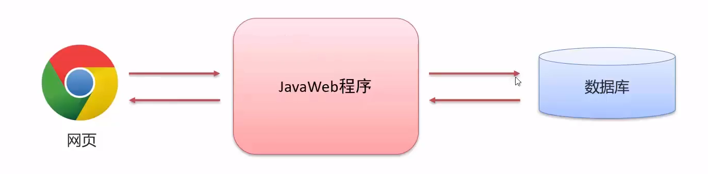

#  初识JavaWbe

## 什么是Javaweb

### web

web称全球广域网，也称万维网（www），能够通过浏览器访问的网站

### javaWeb  
用java技术解决相关web互联网领域的技术栈（开发互联网的应用程序）

*JavaWeb基本了解*
- 网页：负责展现数据
- 数据库：存储和管理数据
- JavaWeb程序：逻辑处理

## 学习内容
<table>
	<tr>
	    <th>大方向</th>
	    <th>知识点</th>
	    <th>描述</th>  
	</tr >
	<tr >
	    <td rowspan="4">数据库</td>
	    <td>MySQL</td>
	    <td>主流的数据库产品</td>
	</tr>
	<tr >
	    <td>JDBC</td>
	    <td>java语言操作数据库的api</td>
	</tr>
	<tr >
	    <td>Maven</td>
	    <td>与数据库无关，但可以方便管理数据库与写代码的</td>
	</tr>
	<tr >
	    <td>MyBatis</td>
	    <td>对JDBC操作的简化的框架</td>
	</tr>
	<tr >
	    <td rowspan="3">前端</td>
	    <td>HTML+CSS</td>
	    <td>网页基本组成部分</td>
	</tr>
	<tr >
	    <td>javascript</td>
	    <td>操作网页元素</td>
	</tr>
	<tr >
	    <td>Ajax+Vue+ElementUI</td>
	    <td>无</td>
	<tr >
	    <td rowspan="5">web核心</td>
	    <td>Tomcat+HTTP+Serivet</td>
	    <td>网页基本组成部分</td>
	</tr>
	<tr >
	    <td>Request+Response</td>
	    <td>操作网页元素</td>
	</tr>
	<tr >
	    <td>JSP</td>
	    <td>无</td>
	</tr>
	<tr >
	    <td>Cookie+Session</td>
	    <td>无</td>
	</tr>
	<tr >
	    <td>filter+Listener</td>
	    <td>无</td>
	</tr>
</table>
