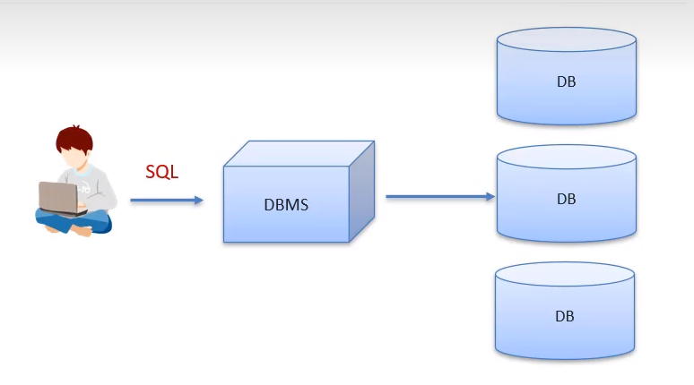
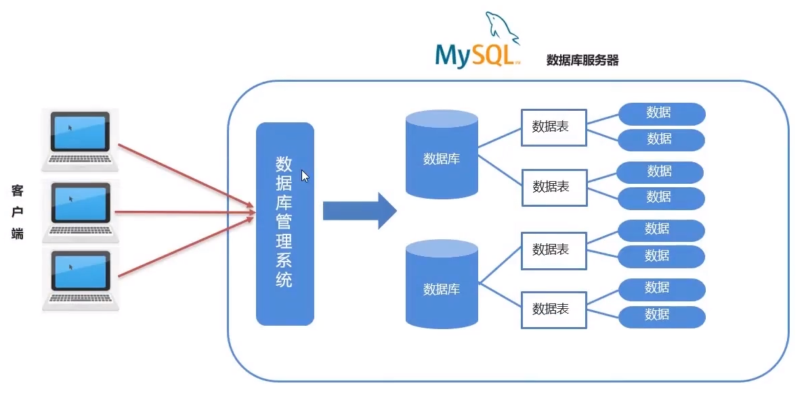
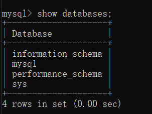

<style>
    myid{
        color:red;
    }
    myid2{
        color:blue;
    }
</style>
# 数据库基础学习

## 数据库相关概念

### 数据库

DataBase，简称DB，即存储数据的仓库，数据是有组织的进行存储

### 数据库管理系统

DataBase Management System，简称DBMS，即管理数据库的大型软件

### SQL
Structured Query Language 简称SQL，结构化查询语言，操作关系型数据库的编程语言，定义操作所有关系型数据库的统一标准


*数据库操作*
### 常见的关系型数据库管理系统
数据库|描述
-|-
Oracle|收费的大型数据库，Orale公司的产品
**MySQL**|开源免费的中小型数据库，后被Sun公司收购，而Sun又被Oracle收购
SQL Server|MicroSoft公司收费的中型数据库，C#、.net等语言常用
PostgreSQL|开源免费中小型数据库
DB2|IBM公司的大型收费数据库产品
SQLite|嵌入式的微型数据库，如Android内置数据库
MariaDB|开源免费中小型数据库
## MySQL数据库

### 安装
推荐5.7.24解压版本的MySQL[下载](https://downloads.mysql.com/archives/community/)  
详情见
其中解压完全后文件夹内容有
文件夹|内容
-|-|
**bin**|放有可执行文件,利用其中可执行文件来操作数据库
docs|相关文档
include|MySQL用c语言写的,c语言相关的.h头文件
lib|c语言相关的库
share|语言与字符集相关的信息
COPYING|版权信息
README|开源协议的信息

还要将该目录下的bin目录配置到环境变量下

---

**详细内容在附录下的MySQL安装文档**

### 卸载
如果你想卸载MySQL，也很简单。

1. cmd中敲入`net stop mysql`，回车。

```
net stop mysql
```

2. 再敲入`mysqld -remove mysql`，回车。

```
mysqld -remove mysql
```
3. 最后删除MySQL目录及相关的环境变量。
### 配置
#### 开始准备
在数据库目录下新建my.ini文件,填入
```ini
[mysql]
default-character-set=utf8
[mysqld]
character-set-server=utf8
default-storage-engine=INNODB
sql_mode=STRICT_TRANS_TABLES,NO_ZERO_IN_DATE,NO_ZERO_DATE,ERROR_FOR_DIVISION_BY_ZERO,NO_AUTO_CREATE_USER,NO_ENGINE_SUBSTITUTION
```
*上面代码意思就是配置数据库的默认编码集为utf-8和默认存储引擎为INNODB。*

在cmd(管理员)中输入`mysqld --initialize-insecure`初始化目录,会生成一个data数据目录

#### 初始化MySQL

在黑框里敲入`mysqld -install`，回车。

```
mysqld -install
```
是为了在sevrvices.msc服务里面注册mysql服务
#### 启动服务
再输入`net start mysql`就能启动mysql服务  
而关闭mysql服务是`net stop mysql`
#### 修改密码
输入`mysqladmin -u root password 123`  
-u表示指定用户,这句表示修改root用户密码为123

### 配置MYSQL执行日志(重启mysql才会生效)
在上面my.ini文件中填入
```dotnetcli
log-output=FILE
general-log=1
general_log_file="D:\mysql.log"
slow-query-log=1
slow_query_log_file="D:\mysql_slow.log"
long_query_time=2
```
### 登录、退出
#### mysql登录
```
mysql -u用户名 -p密码
```
*-u与用户名,-p与密码间不留空格*

登录相关参数
```
mysql -u用户名 -p密码 -h要连接的MySQL服务器ip -p端口号(默认3306)
```
*都不带空格*
#### mysql退出
```
exit
```
或者
```
quit
```
### 数据模型
#### 数据库类型
数据库类型|描述
-|-|
关系型数据库|建立在关系型模型基础上的数据库,是由多张能相互连接的*二维表*组成的数据库
非关系型数据库|严格上不是一种数据库,应该是一种数据结构化存储方式的集合,可以是文档或者键值对等

#### 关系型数据库优点

- 都是表结构,格式一致,易于维护
- 都是通用sql语言操作,使用方便,可用于复杂查询
- 数据存储在磁盘中,安全
#### 关系型数据库缺点
- 读写性能比较差,尤其是海量数据的高效率读写
- 固定的表结构,灵活度稍欠
- 高并发读写需求,传统关系型数据库来讲,磁盘I/O是一个瓶颈
  


## SQL

一种编程语言，可以用来操控市面上所有的关系型数据库
### sql简介
- 英文:Structured Query Language 简称SQL
- 结构化查询语言,一门操作关系型数据库的编程语言
- 定义操作所有关系型数据库的统一标准
- 对于同一个需求,每一种数据库操作方式可能会存在一些不一样的地方,我们成为*方言*
### sql通用语法
- sql可以单行或多行书写,以分号`;`结尾
- sql语句不分大小写,关键字建议大写
- 注释
  - 单行注释:`-- 注释内容`(有空格) 或者 `#注释内容`
  - 多行注释:`/* 注释内容 */`
### sql分类
简称|全称|含义
-|-|-
DDL|Data Definition Language|数据库定义语言,用来定义数据库对象:数据库,表,列等
*DML*|Data Manipulation Language|数据库操作语言,用来对数据库中表的数据进行增删改
*DQL*|Data Qurey Language|数据库查询语言,用来查询数据库中表的记录(数据)
DCL|Data Control Language|数据控制语言,用来定义数据库的访问权限和安全级别及创建用户
### DDL
对数据库对象的操作的语言

### 对数据库的操作

<table>
    <tr>
        <th>作用</th>
        <th>详细</th>
        <th>代码</th>
    </tr>
    <tr>
        <td>查询</td>
        <td>显示当前已有数据库</td>
        <td>SHOW DATABASES;</td>
    </tr>
    <tr>
        <td rowspan="2">创建</td>
        <td>创建数据库</td>
        <td>CREATE DATABASE 数据库名称;</td>
    </tr>
    <tr> 
        <th>创建新数据库(判断,如果不存在则创建)</th>
        <td>CREATE DATABASE IF NOT EXISTS 数据库名称;</td>
    </tr>
    <tr>
        <td rowspan="2">删除</td>
        <td>删除数据库</td>
        <td>DROP DATABASE 数据库名称;</td>
    </tr>
    <tr> 
        <th>删除数据库(判断,如果存在则删除)</th>
        <td>DROP DATABASE IF NOT EXISTS 数据库名称;</td>
    </tr>
    <tr>
        <td rowspan="2">使用</td>
        <td>查看当前使用数据库</td>
        <td>SELECT DATABASE();</td>
    </tr>
    <tr> 
        <th>使用数据库</th>
        <td>USE 数据库名称;</td>
    </tr>
</table>

输入`show databases;` 其中自带的库有

数据库名称|数据库作用
-|-|
information_schema |用视图存储的数据的一种表,一种逻辑表,不存在物理的文件
| mysql              |mysql核心的一些信息,比如说权限,安全等
| performance_schema |存储的是一些性能相关的信息
| sys|系统相关的一些信息
#### 对表的操作
<table>
    <tr>
        <th>作用</th>
        <th>详细</th>
        <th>代码</th>
    </tr>
    <tr><!--创建表-->
        <td>创建(<myid>C</myid>reate)</td>
        <td>创建表的方法</td>
        <td>CREATE TABLE 表名(<br>&emsp;字段1 数据类型1,<br>&emsp;字段2 数据类型2<br>&emsp;...<br>);</td>
    </tr>
    <tr><!--查询表-->
        <td rowspan="2">查询(<myid>R</myid>etrieve)</td>
        <td>查询当前数据库下的所有表名称</td>
        <td>SHOW TABLES;</td>
    </tr>
    <tr>
        <td>查询表结构</td>
        <td>DESC 表名称;</td>
    </tr>
    <tr><!--修改表-->
        <td rowspan="5">修改(<myid>U</myid>pdate)</td>
        <td>修改表名</td>
        <td>ALTER TABLE 表名 RENAME TO 新的表名;</td>
    </tr>
    <tr>
        <td>添加一列</td>
        <td>ALTER TABLE 表名 ADD 列名 数据类型;</td>
    </tr>
    <tr>
        <td>修改数据类型</td>
        <td>ALTER TABLE 表名 MODIFY 列名 新数据类型;</td>
    </tr>
    <tr>
        <td>修改列名和数据类型</td>
        <td>ALTER TABLE 表名 CHANGE 列名 新列名 新数据类型;</td>
    </tr>
    <tr>
        <td>删除列</td>
        <td>ALTER TABLE 表名 DROP 列名</td>
    </tr>
    <tr><!--删除表-->
        <td rowspan="2">删除(<myid>D</myid>elete)</td>
        <td>删除表</td>
        <td>DROP TABLE 表名;</td>
    </tr>
    <tr>
        <td>删除表的时候判断表是否存在</td>
        <td>DROP TABLE IF EXISTS 表名;</td>
    </tr>
</table>
数据库创建数据表时有数据类型有数值\日期\字符串  

#### 数据类型

数据类型|大小|描述
-|-|-|
TINYINT|1 byte|小整数值
SMALLINT|2 bytes|大整数值
MEDIUMINT|3 bytes|大整数值
***INT或INTEGER***|4 bytes|大整数值
BIGINT|8 bytes|极大整数值
***FLOAT***|4 bytes|单精度浮点数值
***DOUBLE***|8 bytes|双精度浮点数值 double(总长度,小数点后保留位数)
DECIMAL|字符串的形式来表示小数型,提高小数|小数值
***DATE***|3|日期值,有年月日 用短横杠-隔开 如1999-11-1
***TIME***|3|时间值或持续时间
***YEAR***|1|年份值
***DATETIME***|8|混合日期和时间值
TIMESTAMP|4|混合日期和时间值,时间戳
***CHAR***|0-255 bytes|定长字符串 存储性能较好 浪费空间 char(字符长度)
***VARCHAR***|0-65536 bytes|边长字符串 存储性能较差 节约空间 
TINYBLOB|0-255 bytes|不超过255个字符的二进制字符串
TINYTEXT|0-255 bytes|短文本字符串
BLOB|0-65535 bytes|二进制形式的长文本数据
TEXT|0-65535 bytes|长文本数据
MEDIUMBLOB|0-16777215 bytes|二进制形式的中等长度文本数据
MEDIUMTEXT|0-16777215 bytes|中等长度文本数据
LONGBLOB|0-4294967295 bytes|二进制形式的极大文本数据
LONGTEXT|0-4294967295 bytes|极大文本数据
### DML
对表中数据的更改
<style>
    myid1{
        color:red;
    }
</style>
<table>
    <tr>
        <th>作用</th>
        <th>详细</th>
        <th>代码</th>
    </tr>
    <tr><!--添加数据-->
        <td rowspan="3">添加(<myid1>insert</myid1>)</td>
        <td>给指定列添加数据</td>
        <td>insert into 表名(列名1,列名2,...) values(值1,值2,...);</td>
    </tr>
    <tr>
        <td>给全部列添加数据</td>
        <td>insert into 表名 values(值1,值2,...);</td>
    </tr>
    <tr>
        <td>批量添加数据</td>
        <td>INSERT INTO 表名(列名1,列名2,...) VALUES(值1,值2,..),(值1,值2,..),...;<br>或<br>INSERT INTO 表名 VALUES(值1,值2,..),(值1,值2,..),...;</td>
    </tr>
    <tr><!--修改数据-->
        <td>修改(<myid1>update</myid1>)</td>
        <td>修改表数据</td>
        <td>UPDATA 表名 SET 列名1=值1,列名2=值2,... [WHERE 条件];<br>(修改语句中如果不加条件,则所有数据都修改!)</td>
    </tr>
    <tr><!--删除数据-->
        <td>删除(<myid1>delete</myid1>)</td>
        <td>删除数据</td>
        <td>DELETE FROM 表名 [WHERE 条件];<br>(不加条件,则删除所有数据)</td>
    </tr>
</table>

### DQL 
- 数据查询查询
```SQL
-- 单表查询
SELECT
    字段列表
FROM
    表名列表
WHERE -- 条件查询
    条件列表
GROUP BY -- 分组查询
    分组字段
HAVING
    分组条件
ORDER BY -- 排序查询
    排序字段
LIMIT --分页查询
    分页限定
```

<table>
    <tr>
    <th>类别</th>
    <th>描述</th>
    <th>代码</th>
    </tr>
    <tr>
        <td rowspan="3">基础查询</td>
        <td>查询多个字段</td>
        <td>SELECT 字段列表 FROM 表名;<br>或<br>SELECT * FROM 表名;(查询所有数据)</td>
    </tr>
    <tr>
        <td>去除重复记录</td>
        <td>SELECT DISTINCT 字段列表 FROM 表名</td>
    </tr>
    <tr>
        <td>起别名</td>
        <td>AS, AS 也可以省略,主要是在输出时可以更方便的查看数据. 如:<br>SELECT 字段 AS 其他字段名 FROM 表名<br>既可以给数据起别名,也可以给表起别名</td>
    </tr>
    <tr>
        <td rowspan="9">条件查询 <myid2> WHERE</myid2></td>
        <td>>,<myid2><</myid2>,>=,<myid2><=</myid2>,<>或!=</td>
        <td>大于,<myid2>小于</myid2>,大于等于,<myid2>小于等于</myid2>,对于,不等于</td>
    </tr>
    <tr>
        <td>BETWEEN ... AND ...</td>
        <td>某个范围之内(都包含) ,在...到...之间<br>日期也可以用大小来比较</td>
    </tr>
    <tr>
        <td>IN(...)</td>
        <td>多选一</td>
    </tr>
    <tr>
        <td>LIKE 占位符</td>
        <td>模糊查询 _单个任意字符 %多个(零个及以上)字符</td>
    </tr>
    <tr>
        <td>IS NULL</td>
        <td>是NULL,NULL的比较不能使用=</td>
    </tr>
    <tr>
        <td>IS NOT NULL</td>
        <td>不是NULL,NULL的比较不能使用!=</td>
    </tr>
    <tr>
        <td>AND 或 &&</td>
        <td>并且</td>
    </tr>
    <tr>
        <td>OR 或 ||</td>
        <td>或者</td>
    </tr>
    <tr>
        <td>NOT 或 !</td>
        <td>非,不是</td>
    </tr>
    <tr>
        <td>排序查询语法<myid2>ORDER BY</myid2></td>
        <td>排序查询</td>
        <td>SELECT 字段列表 FROM 表名 ORDER BY 排序字段名1 [排序方式1],排序字段2 [排序方式2]...<br>排序方式:ASC 升序(默认值),DESC 降序</td>
    </tr>
    <tr>
        <td rowspan="3">分组查询<myid2>GROUP BY</myid2></td>
        <td>分组</td>
        <td>SELECT 字段列表 FROM 表名 [WHERE 分组前限定] GROUP BY 分组字段名 [HAVING 分组后过滤条件]<br>注:分组后,查询字段为聚合函数和分组字段,查询其他字段无任何意义</td>
    </tr>
    <tr>
        <td>聚合函数:将一列数据作为一个整体,进行纵向计算.统计操作</td>
        <td>SELECT 聚合函数名(列名) FROM 表名<br>注:NULL值不参加运算</td>
    </tr>
    <tr>
        <td>WHERE 和 HAVUNG 区别</td>
        <td>执行时机不一样:where在分组前进行限定,不满足条件则不参与分组;而HAVING是分组后对结果进行过滤<br>判断条件不一样,WHERE不能对聚合函数进行判定,HAVING可以<br>执行顺序 WHERE > 聚合函数 > HAVING</td>
    </tr>
    <tr>
        <td>分组查分页查询询<myid2>LIMIT</myid2></td>
        <td>分页查询</td>
        <td>SELECT 字段列表 FROM 表名 LIMIT 起始索引(从0开始),查询条目;<br>计算公式:起始索引=(当前页码-1)*每页显示的条数<br>注意:<br >&emsp;分页查询limit是MYSQL数据库方言<br>&emsp;Oracle分页查询是使用ROWNUMBER<br>&emsp;SQL Sever分页是使用TOP</td>
    </tr>
</table>

聚合函数名|功能
-|-|
count(列名)|统计数量(一般选用不为null的列),取值一般用主键或者*
max(列名)|最大值
min(列名)|最小值
sum(列名)|求和
avg(列名)|平均值

## 图形化工具
### Navicat
- Naviact for MySQL 是管理和开发MySQL或MariaDB的理想解决方案
- 全面的前端工具为数据库管理,开发和维护提供了一款直观而强大的图形化界面
- [官网](http://www.navicat.com.cn)