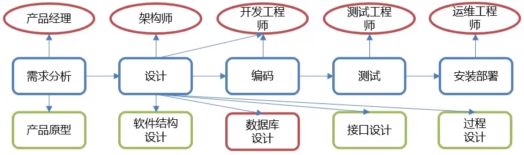

<style>
myid-red{
    color:red;
}
</style>
# 数据库进阶

## 约束
对输入的数据进行约束,限制
### 概念&分类
- 概念
  - 作用于表中列上的规则,用于限制表中的数据
  - 约束的存在保证了数据库中数据的正确性,有效性和完整性
- 分类
  约束名称|描述|关键字
  -|-|-|
  非空约束|保证列中所有数据不能有NULL值|NOT NULL
  唯一约束|保证列中所有数据各不相同|UNIQUE
  主键约束|主键是一行数据的唯一标识,要求非空且唯一|PRIMARY KEY
  检查约束|保证列中的值满足某一条件|CHECK
  默认约束|保存数据时,未指定值则采用默认值,给null,值就是空|DEFAULT 值
  外键约束|外键用来让两个表的数据之间建立链接,保证数据的一致性和完整性|FOREIGN KEY

  当列是数字类型并且唯一约束时,可见加 `auto_increment` 自动增长,当不给该数据,或给该数据是null时,将自动给数据赋值并等于上个数据+1,***当不指定值时自动增长***
- 常用用法
    ```sql
    -- 创建表添加约束
    CREATE TABLE 表名(
        数据名1 数据类型1 约束条件1 约束条件2 ...,
        数据名2 数据类型2 约束条件3 约束条件4 ...,
        ...
        数据名n 数据类型n 约束条件n 约束条件n+1 ...,
    )
    ```

  注:MySQL不支持检查约束,但一般可以在代码中实实现检查约束
### 非空约束
```sql
    -- 创建表后添加非空约束
    ALTER TABLE 表名 MODIFY 字段名 数据类型 NOT NULL;

    -- 删除约束
    ALTER TABLE 表名 MODIFY 字段名 数据类型;
```
### 唯一约束
```sql
    -- 创建表时添加约唯一约束
    CREATE TABLE 表名(
        列名  数据名,
        ...
        [CONSTRAINT] [约束名称] UNIQUE(列名)
    );
    -- 创建表后添加唯一约束
    ALTER TABLE 表名 MODIFY 字段名 数据类型 UNIQUE;
    -- 删除约束
    ALTER TABLE 表名 DROP INDEX 字段名;
```
### 主键约束
```sql
    -- 创建表时添加约主键约束
    CREATE TABLE 表名(
        列名  数据名,
        ...
        [CONSTRAINT] [约束名称(给这个约束取得名称)] PRIMARY KEY(列名)
    );
    -- 创建表后添加主键约束
    ALTER TABLE 表名 ADD PRIMARY KEY(字段名);
    -- 删除约束
    ALTER TABLE 表名 DROP PRIMARY KEY;
```
### 默认约束
```sql
    -- 创建表时添加约默认约束
    CREATE TABLE 表名(
        列名  数据名 DEFAULT 默认值,
        ...
    );
    -- 创建表后添加主键约束
    ALTER TABLE 表名 ALTER 列名 SET DEFAULT 默认值;
    -- 删除约束
    ALTER TABLE 表名 DROP DEFAULT;
```
### 检查约束
    略
### 外键约束
```sql
-- 创建表时添加外键约束,钱买你的是附表,后面的是主表
CREATE TABLE 表名(
    列名 数据类型,
    ...
    [CONSTRAINI] [外键名称(给这个外键取的名称)] FOREIGN KEY(外键列名) REFERENCES 主表(主表列名)
);

-- 创建完表后添加外键约束
ALTER TABLE 副表名 ADD CONSTRAINt 外键名称 FOREIGN KEY (外键字段名称) REFERENCES 主表名称(主表列名称);

-- 删除外键约束
ALTER TABLE 副表名 DROP FOREIGN KEY 外键名称;

-- 都应该是主表先创建,再创建副表,先添加主表的元素,再添加副表的元素
-- 不能删除主表和副表有关联的数据,先删除副表内相关的数据才能删除主表对应的数据
```
## 数据库设计
设计数据类型,表数量,表间的关系等
### 简介
- 软件的研发步骤
  - 
- 数据库设计概念
  - 就是根据业务系统的具体需求,结婚我们所选用的DBMS,为这个业务系统构造出最优的数据库存储模型.
  - 建立数据库中的<myid-red>表</myid-red>,<myid-red>表结构</myid-red>以及<myid-red>表与表之间的关联关系.</myid-red>的过程
  - 在意有哪些表?表里有哪些字段?表和表之间有什么关系
- 数据库设计的步骤
  1. 需求分析(*数据是什么?数据具有哪些属性?数据与属性的特点是什么?*)
  1. 逻辑分析(*通过ER图对数据库进行逻辑建模,不需考虑我们所选用的数据库管理系统*)
  1. 物理设计(*根据数据库自身的特点把逻辑设计转换为物理设计*)
  1. 维护设计(*1.对新的需求进行建表; 2.表优化*)
### 表之间的关系
- 一对多或多对一
  - 在多的一方建立外键,指向另一方的主键
- 多对多
  - 建立第三张<myid-red>中间表</myid-red>,中间至少包含<myid-red>两个外键</myid-red>,分别<myid-red>关联两方主键</myid-red>
- 一对一
    - 有时候会将用表的拆分,将一个实体中常用字段和不常用字段拆分成两个表,用于提升查询时的性能
    - 在任意一方加入外键,关联另一方主键,并设置外键为<myid-red>唯一(UNIQUE)</myid-red>
## 多表查询
- 连接查询 </img>
  - 内连接 查询A B交际的数据
    ```sql
        -- 隐式内连接
        SELECT 表1.字段列表 表2.字段列表 FROM 表1,表2.. WHERE 条件;
        -- 显示内连接
        SELECT 表1.字段列表 表2.字段列表 FROM 表1 [INNER] JOIN 表2 ON 条件;
        ```
  - 外连接 
    - 左外连接:相当于查询A表所有数据和交集部分
    - 右外连接:相当于查询B表所有数据和交集部分
    ```sql
        -- 左外连接
        SELECT 字段列表 FROM 表1 LEFT [OUTER] JOIN 表2 ON 条件 ;
        -- 右外连接
        SELECT 字段列表 FROM 表1 RIGHT [OUTER] JOIN 表2 ON 条件;
    ```
- 子查询:查询中嵌套查询
  -  单行单列
  -  多行单列
  -  多行多列
    ```sql
    -- 单行单列:作为条件值,使用 = != > <等进行条件判断
    SELECT 字段列表 FROM 表 WHERE 字段名 = (子查询);
    --多行单列:作为条件值,使用in等关键字进行条件判断
    SELECT 字段列表 FROM 表 WHERE 字段名 in (子查询);
    -- 多行多列:作为虚拟表
    SELECT 字段列表 FROM (子查询) WHERE 条件;
    ```

```sql
-- 直接使用 select * form 表1,表2;会产生两张表的笛卡儿积
--连接查询
select * form 表1,表2 where 表1.id = 表2.id;
```
## 事务(Transaction)
### 事务简介
- 是一种机制,一个操作序列,包含了<myid-red>一组数据库操作命令</myid-red>
- 事务把所有的命令作为一个整体一起向系统提交或撤销操作请求,即这一组数据库命令<myid-red>要么同时成功,要么同时失败</myid-red>
- 事务是一个不可分割的工作逻辑单元
### 事务操作
  ```sql
  -- 开启事务 之后做的所有事都是临时性的
    START TRANSACTION; 
  -- 或者
      BEGIN;
  -- 提交事务:将临时性的事务对数据的改变作用到数据库
      COMMIT;  
  -- 回滚事务:回到事务开始时状态
      ROLLBACK;
  ```
### 事务四大特征
- 原子性 (<myid-red>A</myid-red>tomicity):事务是不可分割的最小操作单位,要么同时成功,要么同时失败
- 一致性 (<myid-red>C</myid-red>onsistency):事务完成时,必须使所有的数据都保持一致状态
- 隔离性 (<myid-red>I</myid-red>solation):多个事务之间,操作的可见性
- 持久性 (<myid-red>D</myid-red>urability):事务一旦提交或回滚,它对数据库中的数据的改变就是永久的
  
实际上MYSQL数据库的提交方式都是事务提交
Orcale 数据库的提交方式默认是手动提交
```sql
-- 查看事务提交的默认提交方式
SELECT @@autocommit;
-- 1 自动提交 0 手动提交
--修改事务提交方式
SET @@autocommit = 0;
```