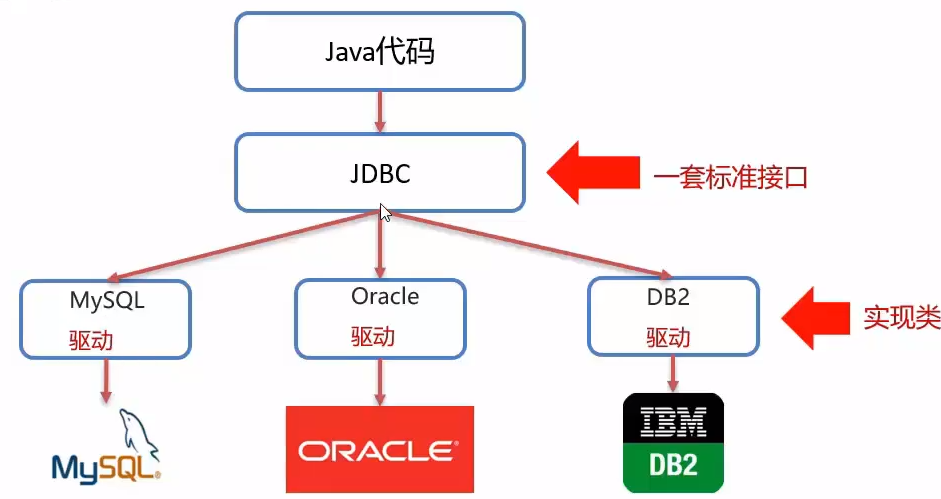

<!--
 * @Author: error: error: git config user.name & please set dead value or install git && error: git config user.email & please set dead value or install git & please set dead value or install git
 * @Date: 2023-04-01 21:47:17
 * @LastEditors: error: error: git config user.name & please set dead value or install git && error: git config user.email & please set dead value or install git & please set dead value or install git
 * @LastEditTime: 2023-04-16 12:51:34
 * @FilePath: \markdown_study\java_web_study\04-JDBC.md
 * @Description: 这是默认设置,请设置`customMade`, 打开koroFileHeader查看配置 进行设置: https://github.com/OBKoro1/koro1FileHeader/wiki/%E9%85%8D%E7%BD%AE
-->
# JDBC

```java
//1.注册驱动
Class.forName("com.mysql.jdbc.Driver");
//2.获取连接对象
String url="jdbc:mysql://127.0.0.1:3306/db1?useSSl=false";
String username="root";
String passsword="123";
Connecction conn=DriverManage.getConnection(url,username,password);
//3.定义sql语句
String sql="update account set money = 2000 where id =1";
//4.获取执行sql对象
Statement Stmt=conn.CreateStatement();
//5.执行sql语句
int count=stmt.executeUpdate(sql);
//6.处理结果
//System.out.println(count);
//7.释放资源
stmt.close();
conn.close();
```
*JDBC大概运行过程*
## JDBC简介
- 一套java语言操作关系型数据库的一套API
- 全程:(Java DataBase Connectivity) java数据库连接
- 本质:
  - 官方(sun公司)定义的一套操作系统所有关系型数据库的规则,即接口
  - 各个数据厂商去实现这套接口,提供数据库驱动jar包
  - 我们可以使用这套接口(JDBC)编程,真正执行的代码是驱动jar包中的实现类  
   
- 好处
  - 同一套java代码,操作不同的关系型数据库
  - 针对数据库厂商使用相同的接口,java代码不需要针对不同数据库分别开发
  - 可随时替换底层数据库,访问数据库的java代码基本不变
## JDBC快速入门
JDBC基本步骤
1. 创建工程,导入jar包  
1. 注册驱动   
   `Class.forName("com.mysql.jdbc.Driver");`
1. 获取连接  
   `Connecction conn=DriverManage.getConnection(url,username,password);`
1. 定义sql语句  
   `String sql="update account set money = 2000 where id =1";`
5. 获取执行sql对象  
   `Statement Stmt=conn.CreateStatement();`
6. 执行sql  
   `int count=stmt.executeUpdate(sql);`
7. 处理返回结果  
   `System.out.println(count);`
8. 释放资源  
    `stmt.close();`    
    `conn.close();`  


## JDBC API 详解
### DriverManager(驱动管理类)
1. 注册驱动
   `Class.forName("com.mysql.jdbc.Driver")`本质上就是使用DriverManger.registerDriver()进行驱动加载  
    mysql 5 之后的驱动包可以省略注册驱动的步骤  
    会自动加载jar包中META-INF/services/java.sql.Driver文件中的驱动类
2. 获取数据库连接  
   使用`getConnection(String url,String user,String password)`   
   参数  
       - url="jdbc:mysql://IP地址(域名):端口号/数据库名称?参数键值对1&参数键值对2.."
         - `jdbc:mysql://`指的是mysql数据库连接协议
         - 默认端口为3306
         - 配置参数键值对`useSSL=flase`参数,禁用安全连接方式,解决警告提示 
       - user="用户名"
       - password="密码"

### Connection (数据库连接对象)
1. 获取执行sql的对象
   - 普通执行SQL对象
       ```java
       Statement createStatement();
       ```
   - 预编译SQL的执行SQL对象:防止SQL注入
       ```java
       PreparedStatement prepareStatement(sql);
       ```
   - 执行存储过程的对象
       ```java
       CallableStatement prePareCall(sql);
       ```
2. 管理事务
   - 开启事务
       ```java
        //mysql中为BEGIN;/START TRANSACTION;
       setAutoCommit(boolean autoComit);
       ```
        true为自动提交事务  
        false为手动提交事务,即为开启事务
        mysql中默认自动提交事务
   - 提交事务
       ```java
        //mysql中为COMMIT;
       commit();
       ```
   - 回滚事务
       ```java
        //mysql中为ROLLBACK ;
      rollback();
       ```
        回滚失效的可能需要设置下数据库存储引擎为InnoDB，默认的存储引擎MylSAM不支持事物。
### Statement
1. 执行sql语句
      ```java
      //执行DML(数据的操作),DDL(数据库的操作)语句
      int executedUpdate(sql);
      ```
      返回DML语句影响的行数;可能在在DDL语句执行成功后返回0
      ```java
      //执行DQL(查询操作)语句
      ResultSet excuteQuery(sql);
      ```
      返回ResultSet结果集对象
### ResultSet 结果集对象
对查询结果进行封装   封装了DQL查询语句的结果
1. 获取查询结果
    ```java
    //将光标从当前位置向前移动 判断当前行是否为有效行
    boolean next();
    ```
    - true:有效行,当前行有数据
    - false:无效行,当前行没有数据
   ```java
    //获取数据
   xxx getXxx(参数);
   ```
    - xxx:数据类型,如: int getInt(参数); String getString(参数);  
    - 参数  
        - int:列的编号,从1开始
        - String:列的名字
### PreparedStatement
继承自Statement,Statement的增强版  
预编译sql语句并执行:预防sql注入

*SQL注入*  

    通过操作输入来修改事先定义好的SQL语句,用以来到执行代码对服务器进行攻击的方法
    
- 获取PreparedStatement对象
   - ```java
       //sql语句中的参数使用?占位符替代
       String sql="slect *from user where username =? and password = ?"
       //通过Connection对象获取,并传入对应的sql语句
       PreparedStatement pstmt = conn.prepareStatement(sql);
       ```
- 设置参数值
  - ```
       PreparedStatement对象:setXxx(参数1,参数2):给?赋值
       Xxx:数据类型;如 setInt(参数1,参数2)
       参数
           参数1:?的位置编号,从1开始
           参数2:?的值
      ```
- 执行sql
  - ```java
      //不需要再传递sql语句
      excuteUpdate();
      //或者
      excuteQuery();
      ```

  

- 原理  
   - 预编译sql,性能更高
     - 获取PreparedStatement对象时,将sql语句发给mysql服务器进行检查,编译(这些步骤很耗时)
     - 在执行的过程中就不需要再进行这些步骤,速度更快
     - 当sql模板一样,就只需要进行一次检查和编译
     - 将预编译开启应当在创建sql连接的url中添加`useServerPrepStmts=true`
   - 防止sql注入,将敏感字符进行转义
## 数据库连接池
用来管理数据库连接的一个容器
### 简介
- 数据库连接池是个容器,负责分配,管理数据库连接(Connection)
- 它允许应用程序重复使用一个现有的数据库连接,而不是再重新建立一个
- 释放空闲时间超过最大空闲时间的数据库连接来避免因为没有数据库连接而引起的数据库连接遗漏
- 好处
  - 资源重用
  - 提升系统响应速度
  - 避免数据库连接遗漏  


- 标准接口:DataSource
  - 官方(SUN)公司提供的数据库连接池标准接口,由第三方组织实现此接口
  - 功能获取连接
    - ```java
        Connection getConnection();
        ```
- 创建数据库连接池
   - DBCP
   - C3P0
   - Druid
- Druid (德鲁伊)
  - Druid连接池是阿里巴巴开源的数据库连接池项目
  - 功能强大,性能优秀,是java语言最好的数据库连接池之一
  
### Druid 数据库连接池
- 使用步骤
    1. 导入jar包 druid-1.1.12.jar
    2. 定义配置文件  
        在java运行文件目录处加入`druid.properties`文件,并写入
        ```properties
         #驱动类名
         driverClassName=com.mysql.jdbc.Driver
         #连接的数据库的url
         url=jdbc:mysql:///db1?useSSL=false&useServerPrepStmts=true
         username=root
         password=1234
         # 初始化连接数量
         initialSize=5
         # 最大连接数
         maxActive=10
         # 最大等待时间
         maxWait=3000
        ```
    3. 加载配置文件
          ```java
         //获取Properties对象
         Properties prop = new Properties();
         //加载Properties对象,参数是文件流,注意文件相对路径
         prop.load(new FileInputStream("jdbc-dome/src/druid.properties"));
          ```
    4. 获取数据库连接池对象
          ```java
         //使用prop文件对象来获取来连接池对象
         DataSource dataSource = DruidDataSourceFactor.CreateDataSource(prop);
          ```
    5. 获取连接
          ```java
         //获取数据库连接Connection
         Connection connection=dataSource.getConnection();
          ```
druid配置详解
### druid配置详解


|                   属性                   |                                  说明                                  |          建议值           |
| :--------------------------------------: | :--------------------------------------------------------------------: | :-----------------------: |
|                   url                    |        数据库的jdbc连接地址。一般为连接oracle/mysql。示例如下：        |                           |
|                                          |         mysql : jdbc:mysql://ip:port/dbname?option1&option2&…          |                           |
|                                          |             oracle : jdbc:oracle:thin:@ip:port:oracle_sid              |                           |
|                                          |                                                                        |                           |
|                 username                 |                           登录数据库的用户名                           |                           |
|                 password                 |                          登录数据库的用户密码                          |                           |
|               initialSize                |                 启动程序时，在连接池中初始化多少个连接                 |        10-50已足够        |
|                maxActive                 |                     连接池中最多支持多少个活动会话                     |                           |
|                 maxWait                  | 程序向连接池中请求连接时,超过maxWait的值后，认为本次请求失败，即连接池 |            100            |
|                                          |              没有可用连接，单位毫秒，设置-1时表示无限等待              |                           |
|        minEvictableIdleTimeMillis        |  池中某个连接的空闲时长达到 N 毫秒后, 连接池在下次检查空闲连接时，将   |        见说明部分         |
|                                          |                    回收该连接,要小于防火墙超时设置                     |                           |
|                                          |        net.netfilter.nf_conntrack_tcp_timeout_established的设置        |                           |
|      timeBetweenEvictionRunsMillis       |         检查空闲连接的频率，单位毫秒, 非正整数时表示不进行检查         |                           |
|                keepAlive                 |   程序没有close连接且空闲时长超过 minEvictableIdleTimeMillis,则会执    |           true            |
|                                          |   行validationQuery指定的SQL,以保证该程序连接不会池kill掉,其范围不超   |                           |
|                                          |                       过minIdle指定的连接个数。                        |                           |
|                 minIdle                  |               回收空闲连接时，将保证至少有minIdle个连接.               |     与initialSize相同     |
|             removeAbandoned              |   要求程序从池中get到连接后, N 秒后必须close,否则druid 会强制回收该    |   false,当发现程序有未    |
|                                          |  连接,不管该连接中是活动还是空闲, 以防止进程不会进行close而霸占连接。  | 正常close连接时设置为true |
|          removeAbandonedTimeout          |  设置druid 强制回收连接的时限，当程序从池中get到连接开始算起，超过此   |  应大于业务运行最长时间   |
|                                          |                 值后，druid将强制回收该连接，单位秒。                  |                           |
|               logAbandoned               |         当druid强制回收连接后，是否将stack trace 记录到日志中          |           true            |
|              testWhileIdle               |    当程序请求连接，池在分配连接时，是否先检查该连接是否有效。(高效)    |           true            |
|             validationQuery              | 检查池中的连接是否仍可用的 SQL 语句,drui会连接到数据库执行该SQL, 如果  |                           |
|                                          |              正常返回，则表示连接可用，否则表示连接不可用              |                           |
|               testOnBorrow               |       程序 **申请** 连接时,进行连接有效性检查（低效，影响性能）        |           false           |
|               testOnReturn               |       程序 **返还** 连接时,进行连接有效性检查（低效，影响性能）        |           false           |
|          poolPreparedStatements          |                     缓存通过以下两个方法发起的SQL:                     |           true            |
|                                          |         public PreparedStatement prepareStatement(String sql)          |                           |
|                                          |         public PreparedStatement prepareStatement(String sql,          |                           |
|                                          |              int resultSetType, int resultSetConcurrency)              |                           |
| maxPoolPrepareStatementPerConnectionSize |                       每个连接最多缓存多少个SQL                        |            20             |
|                 filters                  |                     这里配置的是插件,常用的插件有:                     |      stat,wall,slf4j      |
|                                          |                         监控统计: filter:stat                          |                           |
|                                          |                   日志监控: filter:log4j 或者 slf4j                    |                           |
|                                          |                        防御SQL注入: filter:wall                        |                           |
|            connectProperties             |              连接属性。比如设置一些连接池统计方面的配置。              |                           |
|                                          |         druid.stat.mergeSql=true;druid.stat.slowSqlMillis=5000         |                           |
|                                          |                      比如设置一些数据库连接属性:                       |                           |
|                                          |                                                                        |                           |


