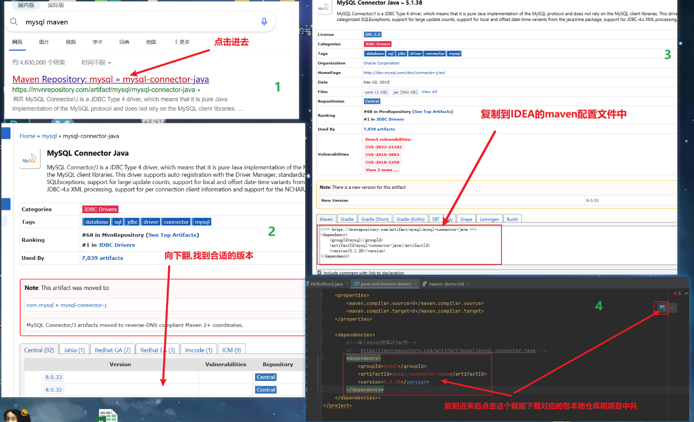
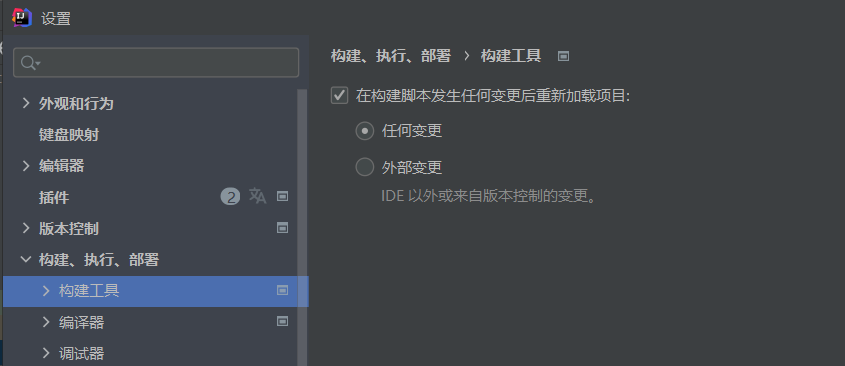

# Maven
## 介绍 
- 专门用于管理和关键java项目的工具,主要功能有:
    - 提供了一套标准化的项目结构,所有IDE使用Maven构建的项目结构完全一样,Maven项目可以通用
    - 提供了一套标准化的关键流程(编译,测试,打包,发布...),提供了一套简单的命令来完成项目构建
    - 提供了一套依赖管理机制
      - Maven使用标准的坐标配置来管理各种依赖,只需要简单配置就可以完成依赖管理
      - ```xml
        <dependencies>
          <dependency>
              <groupId>mysql</groupId>
              <artifactId>mysql-connector-java</artifactId>
              <version>5.1.46</version>
          </dependency>
        </dependencies>            
          ```
- 项目结构
  - 


## Apache Maven
Apache Maven是一个项目管理和构建工具,它基于项目对象模型(POM概念,通过一小段描述信息来管理项目的构建\报告和文档)
[官网](http://maven.apache.org/)

### Maven模型
- 项目对象模型(Project Object Model)
- 依赖管理模型(Dependency)
- 插件(Plugin)


仓库分类
- 本地仓库(Local Repository):自己计算机上的一个目录
- 中央仓库(Central Repository):由Maven团队维护的全球的唯一的仓库(大部分免费开源的jar包)
  - 地址(https://repo1.maven.org/maven2)
- 远程仓库(私服)(Remote Repository):一般由公司团队搭建的私有仓库

仓库寻找顺序:***本地>远程(如果有)>中央***  
会将找到的jar包下载到本地仓库里面

## Maven安装配置
1. 解压apache-maven-3.6.1.rar即安装完成
2. 配置环境变量MAVEN_HOME为安装路径的bin目录
3. 配置本地仓库:修改conf/settings.xml中的\<localRepository\>为一个指定目录
4. 配置阿里云私服:修改conf/settiings.xml中的\<mirrors\>,为其添加如下子标签
   ```xml
   <mirror>
        <id>alimaven</id>
        <name>aliyun maven</name>
        <url>http://maven.aliyun.com/nexus/content/groups/public/</url>
        <mirrorOf>centeral</mirrorOf>
   </mirror>
   ```
## Maven基本使用
### Maven常用命令  
<br>
mvn [可选参数]  
- compile:编译
- clean:清理
- test:测试
- package:打包(打包成jar包)
- install:安装(将当前项目安装到本地仓库里面)
  
### Maven生命周期
- Maven构建项目生命周期描述的是一次构建过经历了多少个事件
- Maven对项目构建的生命周期划分为3套
  - clean:清理工作
  - default:核心工作,例如编译,测试,打包,安装等
  - site:产生报告,发布站点等
  
在同一生命周期中,执行后面的命令,前面的命令会自动执行


## IDEA配置Maven
### IDEA配置Maven环境


### Maven坐标详解
- 什么是坐标
  - Maven中的坐标是资源的唯一标识
  - 使用坐标来定义项目或引用项目中需要的依赖
- Maven坐标的主要组成
  - groupId:定义当前Maven项目隶属组织名称(通常是域名反写,例如: com.itheima)
  - artifactId:定义当前Maven项目名称(通常是模块名称,例如order-service , good-service)
  - version:定义当前版本号

### IDEA创建Maven项目
不再是直接创建java项目,选择创建maven项目


### IDEA导入Maven项目


如果看不到maven面板点击视图(view)->外观(Appearance)->工具窗口(Tool Window Bars)

### Maven插件使用

***配置Maven-Helper插件***
- 选择IDE中文件(File)->设置(Settings)
- 选择插件(Plugins)
- 搜索Maven,选择第一个Maven-Helper,点击安装(Install),弹出面板中选择Accept
- 重启IDEA(新版IDEA可以不用重启?)

  可以很方便的运行Maven项目,还能debug
  

## 依赖管理

### 使用坐标导入jar包
1. 在pom.xml中编写`<dependencies>`标签
2. 在`<dependencies>`标签中使用`<dependency>`引入坐标
3. 定义坐标的`groupId`,`artifactId`,`version`
4. 点击刷新按钮,使其坐标生效

如果找不到,大概率是写错了也可以如下处理
1. 首先在搜索引擎搜索 maven 包类型 例如搜索 maven mysql
1. 选择合适的版本,点进去
1. 复制对应的导入配置,复制到IDAE中
1. 刷新Maven



4步骤在IDEA在设置里面设置让其自动保存  


可以使用IDEA的模板直接导入jar包
1. 按住alt+insert,或者右键->生成
2. 选择依赖项(Dependency)
3. 直接搜索自己想要的包(本地仓库里面有的)

### 依赖范围
通过设置坐标的依赖范围(scope),可以设置对应jar把的作用范围:编译环境,测试环境,运行环境  
`<scope>`与`<groupID>`等同级

依赖范围|编译classpath|测试classpath|运行classpath|例子
-|-|-|-|-|
compile|Y|Y|Y|logback
test|-|Y|-|junit
provided|Y|Y|-|servlet-apt
runtime|-|Y|Y|jdbc驱动
system|Y|Y|-|存储在本地的jar包
import|引入DependencyManagement

`<scope>`默认值:compile,基本上都用默认值就行