# Web核心
## 架构
### B/S架构
Browser/Server,浏览器/服务器 架构模式,特点是客户端只需要浏览器,应用程序的逻辑和数据都存储在服务器端.浏览器只需要请求服务器,获取Web资源,服务器把web资源发送给浏览器即可
- 好处
  - 易于维护升级  
  - 服务器端升级后,客户端无需任何部署就可以使用到新的版本
 

### C/S架构


- 静态资源:HTML、CSS、JavaScript、图片等。负责页面展现  
- 动态资源：Servlet、JSP等。复制逻辑处理  
- 数据库：负责存储数据  
- HTTP协议:定义通信规则
- Web服务器:负责解析HTTP协议,解析请求数据,并发送相应数据(使用 Apache Tomcat )

## HTTP
### HTTP简介
HyperText Transfer Protocol,超文本传输协议,规定了浏览器和服务器之间数据传输的规则

特点
1. 基于TCP协议:面向连接,安全
2. 基于请求-相应模型的:一次请求对应一次相应
3. HTTP协议是无状态的协议:对于事务处理没有记忆能力.每次请求-响应都是独立的
    - 缺点:多次请求间不能共享数据,Java中使用会话技术(Cookie,Session)来解决这个问题
    - 优点:速度快

### HTTP-请求数据格式
请求数据大致分为3部分
1. 请求行:请求数据的第一行,
   1. 其中GET表示请求方式,
   2. / 表示请求资源路径,
   3. HTTP/1.1表示协议版本
2. 请求头:第二行开始,格式为key:value形式,常见的请求头有
   1. Host:表示请求的主机名
   2. User-Agent:浏览器版本,例如Chrome浏览器的标识类似于Mozilla/5.0...  Chrome/79,IE浏览器的表示类似于Mozilla/5.0 (Windows NT...) like Gecko
   3. Accept:表示浏览器能接收的资源类型,如text/*,image/*或者*/*表示所有
   4. Accept-Language:表示浏览器偏好语言,服务器可以据此返回不同语言的网页
   5. Accept-Encoding:表示浏览器可以支持的压缩类型,例如gzip,deflate等
3. 请求体:POST请求的最后一部分,存放请求参数

GET请求
```http
GET /HTTP/1.1
Host:www.itcast.cn
Connection:keep-alive
Cache-Control:max-age=0 Upgrade-Insecure-Requests:1
User-Agent:Mozilla/5.0 Chrome/91.0.4472.106
...  

```

POST请求
```http
POST /HTTP/1.1
Host:www.itcast.cn
Connection:keep-alive
Cache-Control:max-age=0 Upgrade-Insecure-Requests:1
User-Agent:Mozilla/5.0 Chrome/91.0.4472.106
...  
username=superbaby&password=123456
```

GET请求和POST请求的区别
1. GET请求 请求参数在请求行中,没有请求体,POSTt请求 请求参数在请求体中
2. GET请求 请求参数大小有限制,POST没有

### HTTP响应数据格式
响应数据格式大致分为3部分
1. 响应行:请求数据的第一行,
   1. HTTP/1.1表示协议版本
   2. 200表示响应状态码
   3. OK表示状态码描述
2. 响应头:第二行开始,格式为key:value形式
   1. Content-Type:表示该响应内容的类型,例如text/html,image/jpeg
   2. Content-Length:表示该响应内容的长度(字节数)
   3. Content-Encodeing:表示该响应压缩算法,例如gzip
   4. Cache-Control:指示客户端应如何缓存,例如max-age=300,表示最多缓存300秒 
3. 响应体:POST请求的最后一部分,存放请求参数

```http
HTTP/1.1 200 OK
Sever:Tengine
Content-Type:text/html
Transfer-Emcoding:chunked...

<html>
<head>
    <title></title>
</head>
    <body></body>
</html>

```

状态码大类
| 响应状态码分类 | 说明             | 详细                                                                                |
| -------------- | ---------------- | ----------------------------------------------------------------------------------- |
| 1xx            | **响应中**       | 临时状态码,表示请求已经接受,告诉客户端应该继续请求或者它已经完成则忽略它            |
| 2xx            | **成功**         | 表示请求已经被成功接收,处理已完成                                                   |
| 3xx            | **重定向**       | 重定向到其他地方;它让客户端再发起一个请求以完成整个处理                             |
| 4xx            | **客户端错误**   | 处理发生错误,责任在客户端,如:客户端的请求一个不存在的资源,客户端未被授权,禁止访问等 |
| 5xx            | **服务器端错误** | 处理发生错误,责任在服务端,如:服务端抛出异常,路由出错,HTTP版本不支持等               |
[状态码大全](https://cloud.tencent.com/developer/chapter/13553)

常见的响应状态码
| 状态码 | 英文描述                               | 解释                                                                                                 |
| ------ | -------------------------------------- | ---------------------------------------------------------------------------------------------------- |
| 200    | **`OK`**                               | 客户端请求成功，即**处理成功**，这是我们最想看到的状态码                                             |
| 302    | **`Found`**                            | 指示所请求的资源已移动到由`Location`响应头给定的 URL，浏览器会自动重新访问到这个页面                 |
| 304    | **`Not Modified`**                     | 告诉客户端，你请求的资源至上次取得后，服务端并未更改，你直接用你本地缓存吧。隐式重定向               |
| 400    | **`Bad Request`**                      | 客户端请求有**语法错误**，不能被服务器所理解                                                         |
| 403    | **`Forbidden`**                        | 服务器收到请求，但是**拒绝提供服务**，比如：没有权限访问相关资源                                     |
| 404    | **`Not Found`**                        | **请求资源不存在**，一般是URL输入有误，或者网站资源被删除了                                          |
| 428    | **`Precondition Required`**            | **服务器要求有条件的请求**，告诉客户端要想访问该资源，必须携带特定的请求头                           |
| 429    | **`Too Many Requests`**                | **太多请求**，可以限制客户端请求某个资源的数量，配合 Retry-After(多长时间后可以请求)响应头一起使用   |
| 431    | **` Request Header Fields Too Large`** | **请求头太大**，服务器不愿意处理请求，因为它的头部字段太大。请求可以在减少请求头域的大小后重新提交。 |
| 405    | **`Method Not Allowed`**               | 请求方式有误，比如应该用GET请求方式的资源，用了POST                                                  |
| 500    | **`Internal Server Error`**            | **服务器发生不可预期的错误**。服务器出异常了，赶紧看日志去吧                                         |
| 503    | **`Service Unavailable`**              | **服务器尚未准备好处理请求**，服务器刚刚启动，还未初始化好                                           |
| 511    | **`Network Authentication Required`**  | **客户端需要进行身份验证才能获得网络访问权限**                                                       |

## Apache Tomcat

Web服务器是一个应用程序(软件),对HTTP协议的操作进行封装,使得程序员不必直接对协议进行操纵,让Web开发更便捷.主要功能是"提供网上信息浏览服务"

### 简介

Tomcat是Apache软件基金会下的一个核心项目,是一个开源免费的轻量级Web服务器,支持Servlet/JSP少量KaveEE规范

JavaEE:Java Enterprise Edition,Java企业版.指Java企业级开发的技术规范总和.包括13项技术规范:
- JDBC
- JNDI
- EJB
- RMI
- JSP
- Servlet
- XML
- JMS
- Java IDL
- JTS
- JTA
- JavaMail
- JAF

Tomcat也称为Web容器、Servlet容器。Servlet想要依赖Tomcat才能运行

Web服务器作用
- 封装HTTP协议操作,简化开发
- 可以加工web项目部署到服务器中,对外提供网上浏览服务

### 基本使用
#### 下载
[官网](https://tomcat.apache.org/download-80.cgi)直接下载

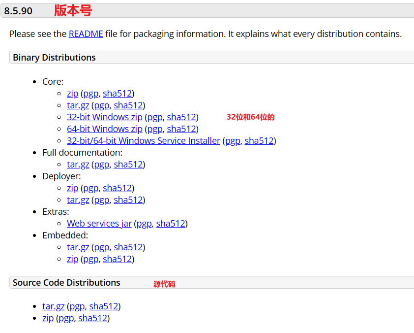

#### 安装
绿色版,直接解压即可

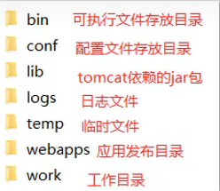

#### 卸载
直接删除目录即可
#### 启动
双击`Bin\startup.bat`

控制台中文乱码解决
```properties
java.util.logging.ConsoleHandler.encoding = UTF-8
#改成
java.util.logging.ConsoleHandler.encoding = GBK
```

解决闪退问题
1. 可能是没有配置`JAVA_HOME`环境变量,必须在系统环境中有一个名字叫`JAVA_HOME`的java环境变量
2. 打开直接修改`bin\setclasspath.bat`文件,在前面添加一句
   ```bat
    #直接设置你的环境变量为java环境
    set JAVA_HOME=D:\java\java8
    ```
3. 也可能是端口冲突
#### 关闭
1. 直接x掉运行窗口:强制关闭
2. bin\shutdown.bat:正常关闭
3. ctrl+C正常关闭
#### 配置

1. 修改端口号 在`conf/server.xml`中的`Connector`标签下的port
```xml
<Connector port="8080" protocol="HTTP/1.1"
            connectionTimeout="20000"
            redirectPort="8443"
            maxParameterCount="1000"
               />
```


注:  
HTTP协议端口号默认为80,当Tomcat改为80后,未来访问Tomcat时,将不再输入端口号
#### 部署项目

将项目文件放置到webapps目录下,即部署完成

一般JavaWeb项目会打成`war`包,然后将`war`包放到`webapps`目录下,Tomcat会自动解压`war`包

### IDAE中创建Maven Web项目
- Maven Web项目结构:开发中的项目
    
    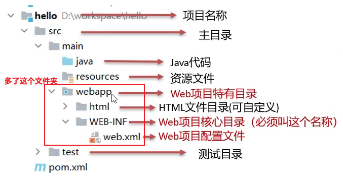
    
    *编译后的Java字节码文件和resources的资源文件,放到WEB-INF下的calsses目录下*
    
- 部署的JavaWeb项目结构:开发完成,可以部署的项目

    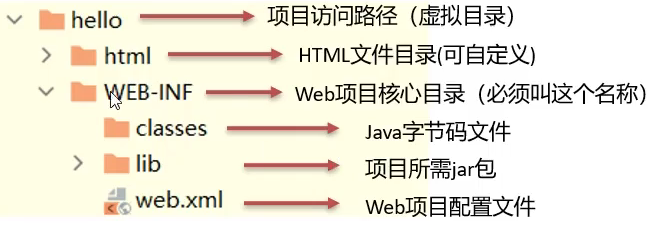

    *pom.xml中依赖坐标对应的jar包,放入WEB-INF下的lib目录下*
    
    部署的JavaWeb项目是Maven Web项目打包而成的

#### 使用骨架(maven web项目模板)
1. 选择web项目骨架,创建项目
    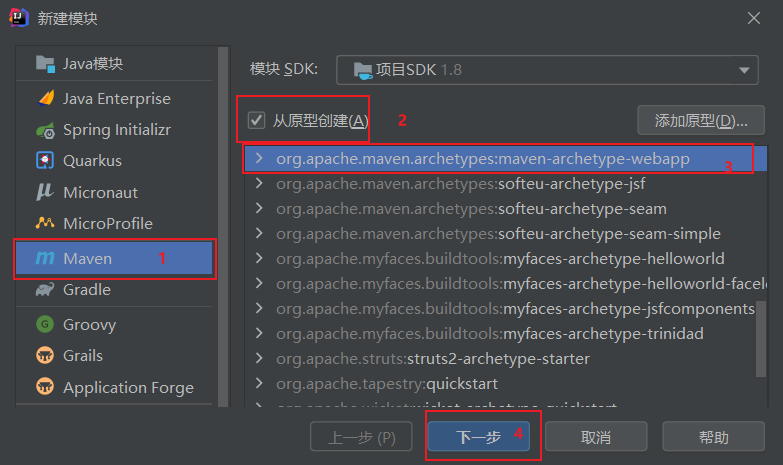
2. 删除pom.xml里面多余的坐标  
    删除name标签、url标签、properties标签、dependencies标签、build标签 *(大概11行往下全删掉)*
3. 补齐缺失的目录结构  
    补齐`src/main/Java`和`src/main/resources`
#### 不使用骨架(maven项目模板)
1. 选择web项目骨架,创建项目
    其实就是不勾选从原型创建(reate from archetype)
2. 设置pom.xml中添加打包方式为war
    ```xml
    <packaging>war</packaging>
    ```
3. 补齐缺失的目录结构:webapp和main下的文件
    1. 右键项目/模块名字,选择打开模块设置
    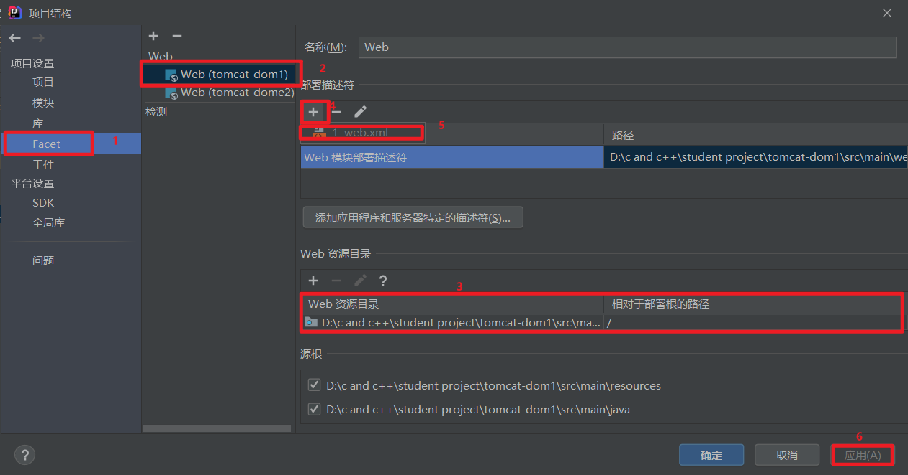  
    *注:完成后需要`WEB-INF`文件夹在`wenapp`下面<br>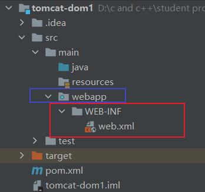*
    2. 补齐`src/main/Java`和`src/main/resources`

*注:  
maven打包方式由两个,jar和war*

### IDEA使用Tomcat

#### 集成本地的Tomcat
1. 首先选择本地服务器
    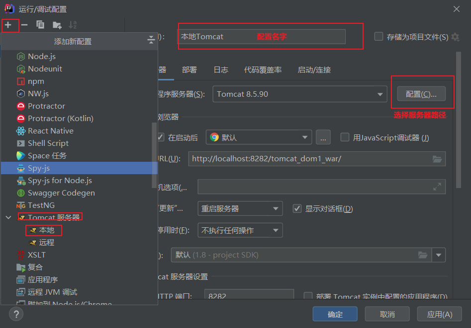
2. 配置环境(运行的哪个项目)  
    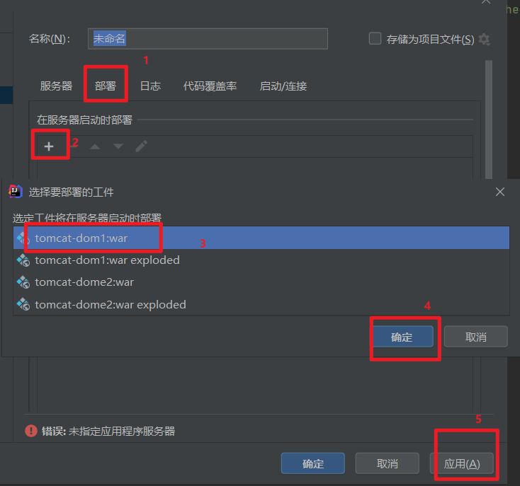
2. 直接选择运行
    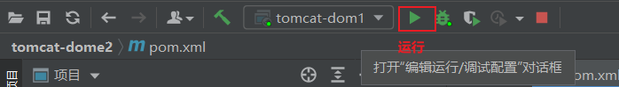


#### 使用Tomcat插件


在maven项目`pom.xml`中添加插件

```xml
<build>
    <plugins>
        <plugin>
            <groupId>org.apache.tomcat.maven</groupId>
            <artifactId>tomcat7-maven-plugin</artifactId>
            <version>2.2</version>
            <!-- 可以不加
                    port:配置端口号
                    path: 访问该项目的路径 -->
            <configuration>
                <port>80</port>
                 <path>/</path>
            </configuration>
        </plugin></plugins>
</build>
```
直接运行(还能使用断点调试)  
    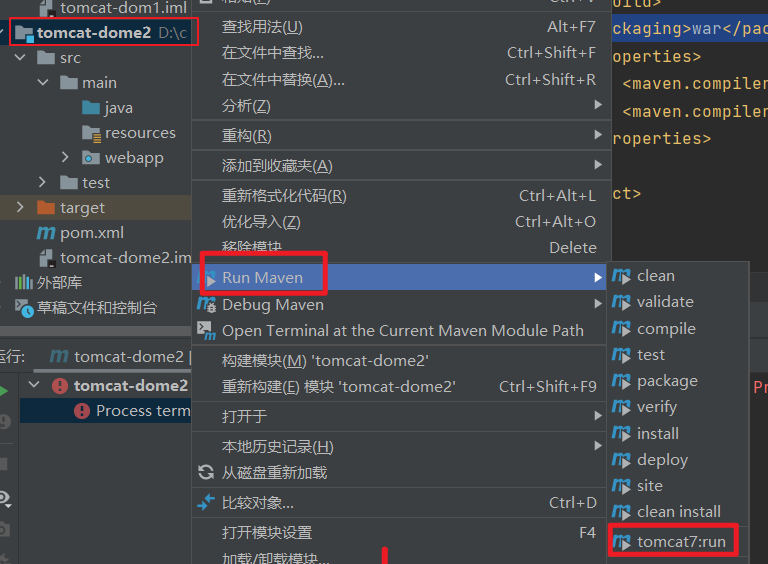

也能在idea控制台使用`mvn tomcat7:run`来启动

## Servlet

是Java提供的一门动态web资源开发技术

是JavaEE规范之一,实际上就是一个**接口**,将来我们需要定义Servlrt类实现Servlet接口,并由web服务器运行Servlet

### 快速入门

1. 创建web项目,导入Servlet依赖坐标
   ```xml
    <dependencies>
        <dependency>
            <groupId>javax.servlet</groupId>
            <artifactId>javax.servlet-api</artifactId>
            <version>3.1.0</version>
    <!--表示作用于运行环境,打包默认有这个包-->
            <scope>provided</scope>
        </dependency>
    </dependencies>
   ```
2. 创建:定义一个类,在`java`路径下,实现Servlrt接口,并重写接口中所有方法,并放在Servlet方法中输入一句话
   ```java
    public class ServletDome1 implements Servlet{
        public void service(){}
    }
   ```
3. 配置:在类上使用@WebServlet注解,配置该Servlet的访问路径
   ```java
    @WebServlet("/demo1")
    public class ServletDome1 implements Servlet{
        public void service(){}
    }
   ```
4. 访问:启动Tomcat,浏览器输入URL访问该Servlet
    ```dotnetcli
    http://localhost:8080/web-demo/demo1
    ```

### Servlet执行流程

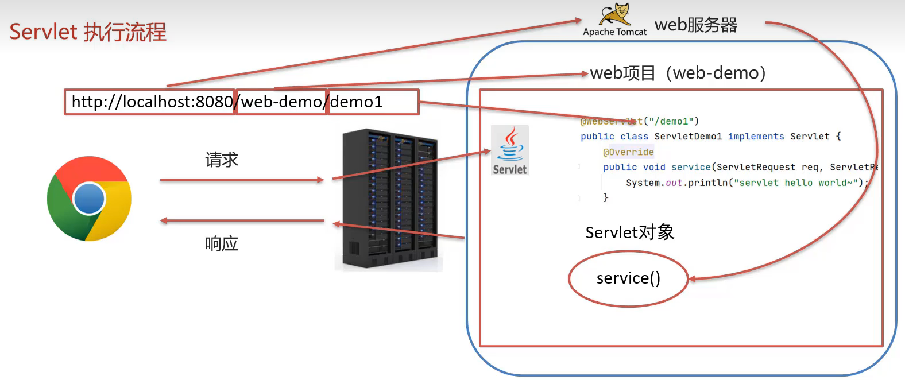    

1. Servlet 由谁创建?Servlet方法由谁调用
    Servlet由web服务器创建,Servlet方法由web服务器调用
2. 服务器为什么知道Servlet中一定由Servlet方法?
    因为我们自定义的Servlet,必须实现Servlet接口并复写其方法


### Servlet生命周期


对象的生命周期是指的是一个对象从创建到被销毁的整个过程

servlet运行在servlet容器 (web 服务器)中,其生命周期由容器来管理分为 4 个阶段 
1. 加载和实例化  
    默认情况下,当 servlet 第一次被访问时,由容器创建 servlet 对象
2. 初始化  
    在 servlet 实例化之后,容器将调用servlet的`init( )`方法初始化这个对象,完成一些如加载配置文件,创建连接等初始化的工作.该方法只调用一次
1. 请求处理  
    每次请求 servlet 时, servlet 容器都会调用servlet 的 `service()` 方法对请求进行处理 。
2. 服务终止  
    当需要释放内存或者容器关闭时,容器就会调用 servlet 实例的 `destroy()` 方法完成资源的释放 。 在 `destroy()` 方法调用之后,容器会释放这个 servlet 实例, 该实例随后会被 Java 的垃圾收集器所回收


```java
@webServlet(erlPatterns="/demo",loadOnStartup=1)
```
1. 负整数:第一次被访问的时候创建Servlet对象
2. 0或正整数:服务器启动时创建Servlet对象,数值越小,优先级越高

常见的三个函数

```java

@WebServlet("/demo1")
public class ServletDome2 implements Servlet {
    /**
     * 初始化方法,默认情况下,Servlet第一次被访问的时候调用
     *只会调用1次
     * 可以用loadOnStartup更改调用次数
     * */
    @Override
    public void init(ServletConfig servletConfig) throws ServletException {
    }
    /**
     * 调用时机:每一次Servlet被访问/调用的时候
     * 调用次数:每一次
     * */
    @Override
    public void service(ServletRequest servletRequest, ServletResponse servletResponse) throws ServletException, IOException {
        System.out.println("Servlet hello world!~");
    }
    /**
     * 销毁方法
     * 在Servlet被销毁的时候调用
     * 内存释放或服务器关闭时被调用 ,调用1次
     * */
    @Override
    public void destroy() {
    }
}
```
还有其他方法
获取ServletConfig对象
```java
ServletConfig getServletConfig()
```

获取Servlet对象
```java
String getServletInfo()
```

### Servlet体系结构

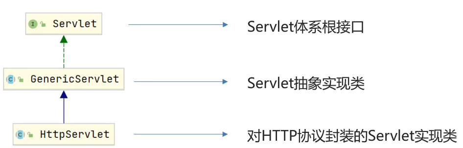

我们将来开发B/S架构的web项目,都是针对HTTP协议,所以我们自定义Servlet,会继承HttpServlet

```java
@WebServlet("/demo3")
public class ServletDome3 extends HttpServlet {
// 一般都是重写doGet和doPost方法
    @Override
    protected void doGet(HttpServletRequest req, HttpServletResponse resp) throws ServletException, IOException {
        System.out.println("网页get请求会调用该接口");
    }

    @Override
    protected void doPost(HttpServletRequest req, HttpServletResponse resp) throws ServletException, IOException {
        System.out.println("网页post请求会调用该接口");
    }
}
```

为什么`HttpServlet`类会根据请求方式的不同会调用不同的方法?
get和post的请求消息不太一样,我们应该分开处理

### Servlet urlPattern配置

1. 一个Servlet,可以配置多个urlPattern
    ```java
    @webServlet(erlPatterns={"/demo1,/demo2"})
    ```
2. urlPattern配置规则
   - 精准匹配
        ```java
        @webServlet("/deme1")
        //匹配路径http://localhost:8282/tomcat-dom1/demo1
        ```
   - 目录匹配
        ```java
        @webServlet("/user/*")
        //匹配路径http://localhost:8282/tomcat-dom1/user/aaa
        //匹配路径http://localhost:8282/tomcat-dom1/user/bbb
        ```
   - 扩展名匹配
        ```java
         //不能用/开头
        @webServlet("*.do")
        //匹配路径http://localhost:8282/tomcat-dom1/aaa.do
        //匹配路径http://localhost:8282/tomcat-dom1/bbb.do
        ```
   - 任意匹配
        ```java
        @webServlet("/*")
        //匹配路径http://localhost:8282/tomcat-dom1/demo1
        //匹配路径http://localhost:8282/tomcat-dom1/demo2
        ```
当一个路径满足多个匹配时,多个匹配都能正常响应,  
但具有优先级:精准匹配 > 目录匹配 > 扩展名匹配 > `"/*"` > `"/"`

`"/"`和`"/*"`的区别  
   - 当我们项目中的Servlet配置了`"/"`,会覆盖掉tomcat中DefaultServlet,当其他的erlPatterns都匹配不上的时候会走这个Servlet
   - 当我们项目中的Servlet配置了`"/*"`,意味着匹配任意的访问路径  
   - 
所以说,在以后,`"/"`和`"/*"`路径匹配我们都尽量不要去配置

### XML配置方式编写Servlet

Servlet从3.0版本后开始支持注解配置,3.0版本以前只支持XML配置文件的配置方式

步骤
1. 编写Servlet类
2. 在`webapp/WEB-INF/web.xml`中配置该Servlet,写在`web-app`标签内
    ```xml
    <!--Servlet全类名-->
    <servlet>
    <!--声明匹配规则的名字-->
        <servlet-name>Dome3</servlet-name>
    <!--类名来源,不加.java-->
        <servlet-class>com.dujiang.web.ServletDome3</servlet-class>
    </servlet>
    <!--Servlet访问路径-->
    <servlet-mapping>
    <!--匹配上面servlet标签里面的名字-->
        <servlet-name>Dome3</servlet-name>
    <!--Servlet访问路径-->
        <url-pattern>/demo3</url-pattern>
    </servlet-mapping>
    ```