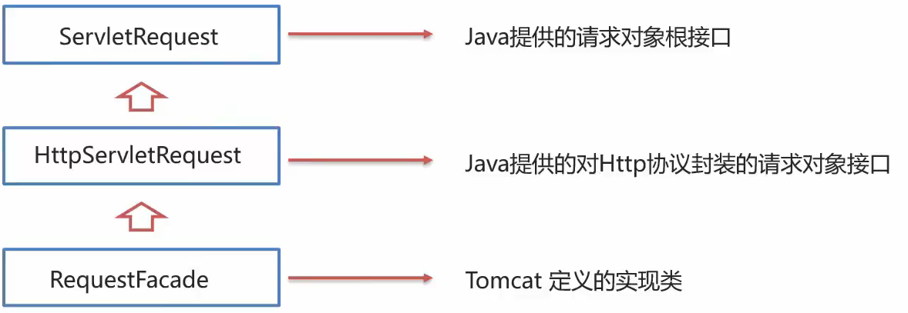

# Request和Response

是sercive的参数  
Request 获取请求数据  
Response 设置响应数据

## Request

### Request继承体系



1. Tomcat需要解析请求数据,封装为request对象,并且常见request对象传递到service方法中
2. 使用request对象,查阅javaEE API文档的HttpServletRequest接口 
### Request获取请求数据
#### 获取请求数据
1. 请求行 : `GET /request-demo/req1?username=zhangsan HTTP/1.1`
    ```java
    String getMethod();//获取请求方式:GET
    String getContextPath();//获取虚拟目录(项目访问路径):/request-demo
    StringBuffer getRequestURL();//获取URL(统一资源定位符): http://localhost:8080/request-demo/req1
    String getRequestURI();//获取URI(统一资源标识符):/requesr-demo/req1
    String getQueryString();//获取请求参数(get方式):username=zhangsan
    ```
2. 请求头:  `User-Agent:Mozilla/5.0 Chrome/91.0..4472.106`
    ```java
    String getHeader(String name);//根据请求头名称获取值
    /*
    * user-agent:浏览器版本
    */
    ```
3. 请求体:  `username=superbaby&password=123`
    ```java
    ServletInputStream getInputStream();//获取字节输入流
    BufferedReader getReader();//获取字符输入流
    /*
    * BufferedReader.readLine();读取一行数据
    */
    ```

#### 通用的方式请求参数

get 通过`String getQueryString();`获取请求参数  
post通过`BufferedReader getReader()`或者`ServletInputStream getInputStream()`获取请求参数  
通过一种方式,让post的请求体转移到get方式体中,利用`String getMethod()`来区分参数体的位置
```java

@WebServlet("/demo5")
public class ServletDome5 extends HttpServlet {
    @Override
    protected void doGet(HttpServletRequest req, HttpServletResponse resp) throws ServletException, IOException {
        System.out.println("网页get请求会调用该接口:demo4");
        String method= req.getMethod();
        String params="";
        if("GET".equals(method)){
            params=req.getQueryString();
        }else if("POST".equals(method)){
            BufferedReader reader=req.getReader();
            params=reader.readLine();
        }
        System.out.println(params);
    }
    @Override
    protected void doPost(HttpServletRequest req, HttpServletResponse resp) throws ServletException, IOException {
        System.out.println("网页post请求会调用该接口");
        this.doGet(req, resp);
    }
}
```
为了方便获取参数,Map自动有方法添加参数
```java
Map<Srting ,String[]> getParameterMap();//获取所有参数Map集合 Map<键名age,参数[1,2,3]>
String getParameterValues(String name);//根据名称获取参数值(数组)
String getParameter(String name);//根据名称获取参数值(单个值)
```


#### 请求参数中文乱码

### Request请求转发


## Response