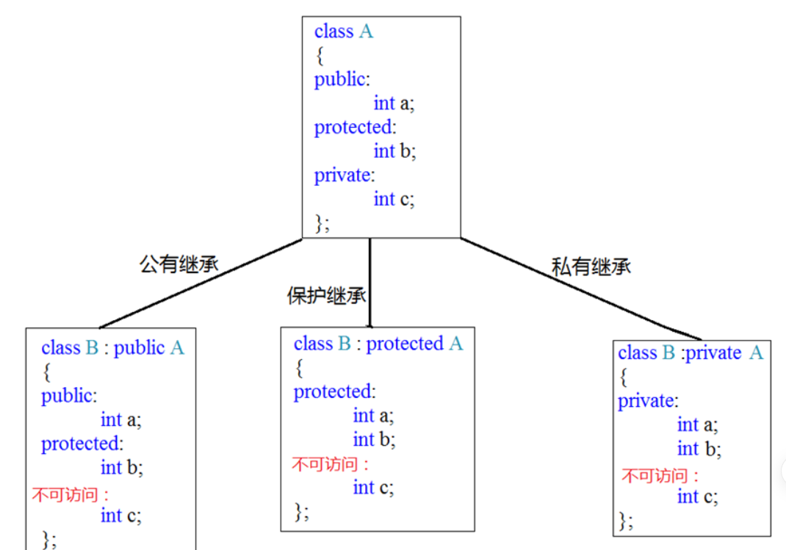
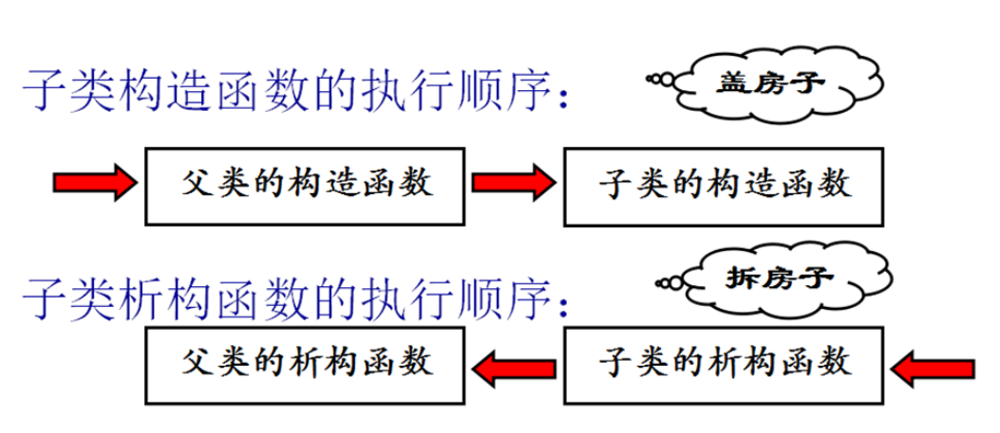
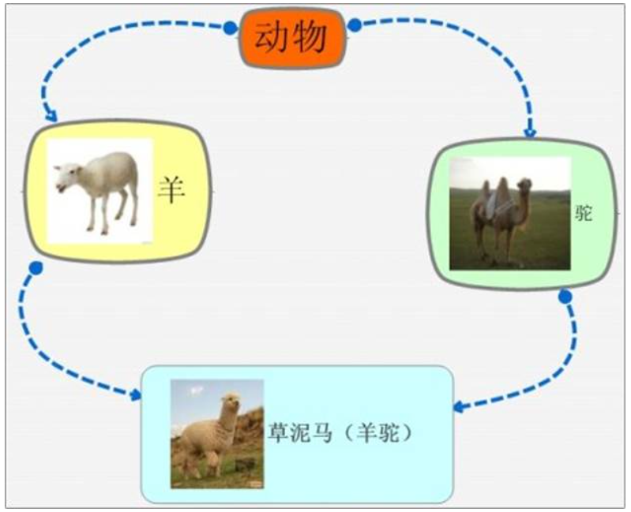

<!-- 2023年09月21-30日 -->
## 类和对象
### C和C++中struct区别
- c语言struct只有变量
- c++语言struct 既有变量，也有函数
### 类的概念
概念：是对显示生活中"对象"的一种抽象,是实际物体的一些数据表示。（钱和模板的关系）  
写代码：只需要将struct关键字改为class即可让一个结构体变为类。

- 封装（重点）
    1.  把变量（属性）和函数（操作）合成一个整体，封装在一个类中
    2.  对变量和函数进行访问控制
- 访问权限
    1. 在类的内部(作用域范围内)，没有访问权限之分，所有成员可以相互访问
    2. 在类的外部(作用域范围外)，访问权限才有意义：public，private，protected
    1. 在类的外部，只有public修饰的成员才能被访问，在没有涉及继承与派生时，private和protected是同等级的，外部不允许访问
### 访问权限
| 访问属性  | 属性     | 对象内部 | 对象外部 |
| --------- | -------- | -------- | -------- |
| public    | 公有     | 可访问   | 可访问   |
| protected | 受保护的 | 可访问   | 不可访问 |
| private   | 私有     | 可访问   | 不可访问 |

总结：
public: 能被类成员函数、子类函数、友元访问，也能被类的对象访问。
private: 只能被类成员函数及友元访问，不能被其他任何访问，本身的类对象也不行。
protected: 只能被类成员函数、子类函数及友元访问，不能被其他任何访问，本身的类对象也不行
```c++
//封装两层含义
//1. 属性和行为合成一个整体
//2. 访问控制，现实事物本身有些属性和行为是不对外开放
class Person
{
//人具有的行为(函数)
public:
    void Dese(){ cout << "我有钱，年轻，个子又高，就爱嘚瑟!" << endl;}
//人的属性(变量)
public:
    int mTall; //多高，可以让外人知道
protected:
    int mMoney; // 有多少钱,只能儿子孙子知道
private:
    int mAge; //年龄，不想让外人知道
};

int main(){

    Person p;
    p.mTall = 220;
    //p.mMoney 保护成员外部无法访问
    //p.mAge 私有成员外部无法访问
    p.Dese();

    return EXIT_SUCCESS;
}
```

struct和class的区别?  
class默认访问权限为private(私有的),struct默认访问权限为public(公有的).

#### 将成员变量设置为private的好处
1. 可赋予客户端访问数据的一致性。  
如果成员变量不是public，客户端唯一能够访问对象的方法就是通过成员函数。如果类中所有public权限的成员都是函数，客户在访问类成员时只会默认访问函数，不需要考虑访问的成员需不需要添加(),这就省下了许多时间。  
1. 可细微划分访问控制（重点）。  
    只暴露自己想要让别人访问的权限
### 多文件实现类
persion.h
```c++
#include <iostream>
#ifndef __PERSON_H__
#define __PERSON_H__
using namespace std;

class person
{
private:
    string name;
    double height;
    int age;
    char sex[5];

public:
    //相对于函数的声明
    string getName();
    int setName(string name);
    double getHeight();
    int setHeight(double height);
    int getAge();
    int setAge(int age);
    char *getSex();
    int setSex(char *sex);
    

};

#endif
```
persion.cpp
```c++
//类函数的实现
person::getName()
{
    //实现函数

}
```
### 对象的构造和析构

#### 构造函数和析构函数
构造函数主要作用在于创建对象时为对象的成员属性赋值，构造函数由编译器自动调用，无须手动调用。
析构函数主要用于对象销毁前系统自动调用，执行一些清理工作。

构造函数语法：  
构造函数函数名和类名相同，没有返回值，不能有void，但可以有参数。 
```c++
ClassName(){}
```
析构函数语法：
析构函数函数名是在类名前面加”~”组成,没有返回值，不能有void,不能有参数，不能重载。  
```c++
~ClassName(){}
```

#### 构造函数的分类及调用
-  按参数类型：分为无参构造函数和有参构造函数
-  按类型（功能）分类：普通构造函数和拷贝构造函数(复制构造函数)（推荐）

```c++
class Person
{
public:
    //无参构造函数
    Person()
    {
        cout  << "no param constructor!" << endl;
        mAge  = 0;
    }
    //有参构造函数
    Person(int age)
    {
        cout  << "1 param constructor!" << endl;
        mAge  = age;
    }
    //拷贝构造函数(复制构造函数) 使用另一个对象初始化本对象
    Person(const Person& person)
    {
        cout  << "copy constructor!" << endl;
        mAge  = person.mAge;
    }
    //打印年龄
    void PrintPerson()
    {
        cout  << "Age:" << mAge << endl;
    }
private:
    int mAge;
};
//1. 无参构造调用方式            <---------------
void test01()
{
    //调用无参构造函数
    Person  person1; 
    person1.PrintPerson();

    //无参构造函数错误调用方式
    //Person person2();            //编译器会以为这是一个写在类内的函数声明
    //person2.PrintPerson();
}
//2. 调用有参构造函数             <---------------
void test02()
{
    //第一种 括号法，最常用
    Person  person01(100);
    person01.PrintPerson();

    //调用拷贝构造函数
    Person  person02(person01);
    person02.PrintPerson();

    //第二种 匿名对象(显示调用构造函数)
    Person(200); //匿名对象，没有名字的对象

    person  person00 = person03;          // ------->猜猜此时会调用哪个构造函数？

    Person  person03 = Person(300);        // ------->猜猜此时会调用哪个构造函数？可以认为是构造函数的显式调用
    person03.PrintPerson();
    
    //注意: 使用匿名对象初始化到底调用哪一个构造函数，要看匿名对象的参数类型
    Person  person06(Person(400)); //等价于 Person person06 = Person(400);
    person06.PrintPerson();

    //第三种 =号法 隐式转换
    Person  person04 = 100; //Person person04 =  Person(100)
    person04.PrintPerson();

    //调用拷贝构造
    Person  person05 = person04; //Person person05 =  Person(person04)
    person05.PrintPerson();
}
Person p2;
Person p1 = Person(p2);Person (p2);
```


b为A的实例化对象,A a = A(b) 和 A(b)的区别？   
当A(b) 有变量来接的时候，那么编译器认为他是一个匿名对象，当没有变量来接的时候，编译器认为A(b) 等价于 A b.

注意:不能调用拷贝构造函数去初始化匿名对象,也就是说以下代码不正确:
```c++
class Teacher
{
public:
    Teacher()
    {
        cout<< "默认构造函数!" << endl;
    }
    Teacher(const Teacher& teacher)
    {
        cout<< "拷贝构造函数!" << endl;
    }
public:
    int mAge;
};
void test()
{
    Teacher t1;
    //error C2086:“Teacher t1”: 重定义
    Teacher(t1);  //此时等价于 Teacher t1;
}
```
#### 拷贝构造函数的调用时机
- 对象以值传递的方式传给函数参数
- 函数局部对象以值传递的方式从函数返回(vs debug模式下调用一次拷贝构造，qt不调用任何构造)
- 用一个对象初始化另一个对象

```c++
class Person
{
public:
    Person()
    {
        cout  << "no param contructor!" << endl;
        mAge  = 10;
    }
    Person(int age)
    {
        cout  << "param constructor!" << endl;
        mAge  = age;
    }
    Person(const Person& person)
    {
        cout  << "copy constructor!" << endl;
        mAge  = person.mAge;
    }
    ~Person()
    {
        cout  << "destructor!" << endl;
    }
public:
    int mAge;
};
//1. 旧对象初始化新对象
void test01(){

    Person  p(10);
    Person  p1(p);
    Person  p2 = Person(p);
    Person  p3 = p; // 相当于Person p2 =  Person(p);
}

//2. 传递的参数是普通对象，函数参数也是普通对象，传递将会调用拷贝构造
void doBussiness(Person p){}

void test02()
{
    Person  p(10);
    doBussiness(p);
}

//3. 函数返回局部对象
Person MyBusiness()
{
    Person  p(10);
    cout  << "局部p:" << (int*)&p << endl;
    return p;
}
void test03()
{
    //vs release、qt下没有调用拷贝构造函数
    //vs debug下调用一次拷贝构造函数
    Person  p = MyBusiness();
    cout  << "局部p:" << (int*)&p << endl;
}
```
   [Test03结果说明:]   编译器存在一种对返回值的优化技术,RVO(Return Value Optimization).在vs debug模式下并没有进行这种优化，所以函数MyBusiness中创建p对象，调用了一次构造函数，当编译器发现你要返回这个局部的对象时，编译器通过调用拷贝构造生成一个临时Person对象返回，然后调用p的析构函数。   我们从常理来分析的话，这个匿名对象和这个局部的p对象是相同的两个对象，那么如果能直接返回p对象，就会省去一个拷贝构造和一个析构函数的开销，在程序中一个对象的拷贝也是非常耗时的，如果减少这种拷贝和析构的次数，那么从另一个角度来说，也是编译器对程序执行效率上进行了优化。   所以在这里，编译器偷偷帮我们做了一层优化：   当我们这样去调用: Person p = MyBusiness();   编译器偷偷将我们的代码更改为:
```c++
void MyBussiness(Person& _result)
{
    _result.X:X(); //调用Person默认拷贝构造函数
    //.....对_result进行处理
    return;
}
int main()
{
    Person p; //这里只分配空间，不初始化
    MyBussiness(p);
}
```
#### 构造函数调用规则
- 默认情况下，c++编译器至少为我们写的类增加3个函数
1．默认构造函数(无参，函数体为空)
2．默认析构函数(无参，函数体为空)
3．默认拷贝构造函数，对类中非静态成员属性简单值拷贝
- 如果用户定义拷贝构造函数，c++不会再提供任何默认构造函数
- 如果用户定义了普通构造(非拷贝)，c++不在提供默认无参构造，但是会提供默认拷贝构造
### 深拷贝和浅拷贝
#### 浅拷贝
同一类型的对象之间可以赋值，使得两个对象的成员变量的值相同，两个对象仍然是独立的两个对象，这种情况被称为浅拷贝.
一般情况下，浅拷贝没有任何副作用，但是当类中有指针，并且指针指向动态分配的内存空间，析构函数做了动态内存释放的处理，会导致内存问题。


#### 深拷贝
当类中有指针，并且此指针有动态分配空间，析构函数做了释放处理，往往需要自定义拷贝构造函数，自行给指针动态分配空间，深拷贝。


```c++
class Person{
public:
    Person(char* name,int age){
        pName  = (char*)malloc(strlen(name) + 1);
        strcpy(pName,name);
        mAge  = age;
    }
    //增加拷贝构造函数
    Person(const Person& person){
        pName  = (char*)malloc(strlen(person.pName) + 1);
        strcpy(pName, person.pName);
        mAge  = person.mAge;
    }
    ~Person(){
        if (pName != NULL){
             free(pName);
        }
    }
private:
    char* pName;
    int mAge;
};

void test(){
    Person  p1("Edward",30);
    //用对象p1初始化对象p2,调用c++提供的默认拷贝构造函数
    Person  p2 = p1;
}
```
### 多个对象构造和析构
#### 初始化列表 
构造函数和其他函数不同，除了有名字，参数列表，函数体之外还有初始化列表。
初始化列表简单使用:
```c++
class Person{
public:
#if 0
    //传统方式初始化
    Person(int a,int b,int c){
        mA  = a;
        mB  = b;
        mC  = c;
    }
#endif
    //初始化列表方式初始化
    Person(int a, int b, int c):mA(a),mB(b),mC(c){}
    void PrintPerson(){
        cout  << "mA:" << mA << endl;
        cout  << "mB:" << mB << endl;
        cout  << "mC:" << mC << endl;
    }
private:
    int mA;
    int mB;
    int mC;
};
```
注意：初始化成员列表(参数列表)只能在构造函数使用。

### explicit关键字
c++提供了关键字explicit，禁止通过构造函数进行的隐式转换。声明为explicit的构造函数不能在隐式转换中使用。

[explicit注意]explicit用于修饰构造函数,防止隐式转化。 是针对单参数的构造函数(或者除了第一个参数外其余参数都有默认值的多参构造)而言。
```c++
class MyString{
public:
    explicit MyString(int n){
        cout  << "MyString(int n)!" << endl;
    }
    MyString(const char* str){
        cout  << "MyString(const char* str)" << endl;
    }
};

int main(){

    //给字符串赋值？还是初始化？
    //MyString str1 = 1; 
    MyString  str2(10);

    //寓意非常明确，给字符串赋值
    MyString  str3 = "abcd";
    MyString  str4("abcd");

    return EXIT_SUCCESS;
}
```
### 动态对象创建
当我们创建数组的时候，总是需要提前预定数组的长度，然后编译器分配预定长度的数组空间，在使用数组的时，会有这样的问题，数组也许空间太大了，浪费空间，也许空间不足，所以对于数组来讲，如果能根据需要来分配空间大小再好不过。
所以动态的意思意味着不确定性。
为了解决这个普遍的编程问题，在运行中可以创建和销毁对象是最基本的要求。当然c早就提供了动态内存分配（dynamic memory allocation）,函数malloc和free可以在运行时从堆中分配存储单元。
然而这些函数在c++中不能很好的运行，因为它不能帮我们完成对象的初始化工作。
4.3.6.1 对象创建
当创建一个c++对象时会发生两件事:
1.      为对象分配内存
2.      调用构造函数来初始化那块内存
第一步我们能保证实现，需要我们确保第二步一定能发生。c++强迫我们这么做是因为使用未初始化的对象是程序出错的一个重要原因。
4.3.6.2 C动态分配内存方法
为了在运行时动态分配内存，c在他的标准库中提供了一些函数,malloc以及它的变种calloc和realloc,释放内存的free,这些函数是有效的、但是原始的，需要程序员理解和小心使用。为了使用c的动态内存分配函数在堆上创建一个类的实例，我们必须这样做:
```c++
class Person{
public:
    Person(){
        mAge  = 20;
        pName  = (char*)malloc(strlen("john")+1);
        strcpy(pName, "john");
    }
    void Init(){
        mAge  = 20;
        pName  = (char*)malloc(strlen("john")+1);
        strcpy(pName, "john");
    }
    void Clean(){
        if (pName != NULL){
             free(pName);
        }
    }
public:
    int mAge;
    char* pName;
};
int main(){

    //分配内存
    Person* person = (Person*)malloc(sizeof(Person));
    if(person == NULL){
        return 0;
    }
    //调用初始化函数
    person->Init();
    //清理对象
    person->Clean();
    //释放person对象
    free(person);

    return EXIT_SUCCESS;
}
```
问题：
1)     程序员必须确定对象的长度。2)     malloc返回一个void*指针，c++不允许将void*赋值给其他任何指针，必须强转。3)     malloc可能申请内存失败，所以必须判断返回值来确保内存分配成功。4)     用户在使用对象之前必须记住对他初始化，构造函数不能显示调用初始化(构造函数是由编译器调用)，用户有可能忘记调用初始化函数。

c的动态内存分配函数太复杂，容易令人混淆，是不可接受的，c++中我们推荐使用运算符new 和delete.

### new operator 
C++中解决动态内存分配的方案是把创建一个对象所需要的操作都结合在一个称为new的运算符里。当用new创建一个对象时，它就在堆里为对象分配内存并调用构造函数完成初始化。
```c++
Person*  person = new Person;

```
相当于:

```c++
Person* person = (Person*)malloc(sizeof(Person));
    if(person == NULL){
        return 0;
    }
person->Init();

```
New操作符能确定在调用构造函数初始化之前内存分配是成功的，所有不用显式确定调用是否成功。
现在我们发现在堆里创建对象的过程变得简单了，只需要一个简单的表达式，它带有内置的长度计算、类型转换和安全检查。这样在堆创建一个对象和在栈里创建对象一样简单。

### delete operator
new表达式的反面是delete表达式。delete表达式先调用析构函数，然后释放内存。正如new表达式返回一个指向对象的指针一样，delete需要一个对象的地址。
delete只适用于由new创建的对象。
如果使用一个由malloc或者calloc或者realloc创建的对象使用delete,这个行为是未定义的。因为大多数new和delete的实现机制都使用了malloc和free,所以很可能没有调用析构函数就释放了内存。
如果正在删除的对象的指针是NULL,将不发生任何事，因此建议在删除指针后，立即把指针赋值为NULL，以免对它删除两次，对一些对象删除两次可能会产生某些问题。
```c++
class Person{
public:
    Person(){
        cout  << "无参构造函数!" << endl;
        pName  = (char*)malloc(strlen("undefined") + 1);
        strcpy(pName, "undefined");
        mAge  = 0;
    }
    Person(char* name, int age){
        cout  << "有参构造函数!" << endl;
        pName  = (char*)malloc(strlen(name) + 1);
        strcpy(pName, name);
        mAge  = age;
    }
    void ShowPerson(){
        cout  << "Name:" << pName << " Age:" << mAge << endl;
    }
    ~Person(){
        cout  << "析构函数!" << endl;
        if (pName != NULL){
             delete pName;
             pName  = NULL;
        }
    }
public:
    char* pName;
    int mAge;
};

void test(){
    Person* person1 = new Person;
    Person* person2 = new Person("John",33);

    person1->ShowPerson();
    person2->ShowPerson();

    delete person1;
    delete person2;
}
```

### 用于数组的new和delete
使用new和delete在堆上创建数组非常容易。
//创建字符数组
char* pStr = new char[100];
//创建整型数组
int* pArr1 = new int[100]; 
//创建整型数组并初始化
int* pArr2 = new int[10]{ 1, 2, 3, 4, 5, 6, 7, 8, 9, 10 };

//释放数组内存
delete[] pStr;
delete[] pArr1;
delete[] pArr2;
当创建一个对象数组的时候，必须对数组中的每一个对象调用构造函数，除了在栈上可以聚合初始化，必须提供一个默认的构造函数。
```c++
class Person{
public:
    Person(){
        pName  = (char*)malloc(strlen("undefined") + 1);
        strcpy(pName, "undefined");
        mAge  = 0;
    }
    Person(char* name, int age){
        pName  = (char*)malloc(sizeof(name));
        strcpy(pName, name);
        mAge  = age;
    }
    ~Person(){
        if (pName != NULL){
             delete pName;
        }
    }
public:
    char* pName;
    int mAge;
};

void test(){
    //栈聚合初始化
    Person  person[] = { Person("john", 20), Person("Smith", 22) };
    cout  << person[1].pName << endl;
     //创建堆上对象数组必须提供构造函数
    Person* workers = new Person[20]; //自动调用20次无参构造函数
}
```
#### delete void*可能会出错
 如果对一个void*指针执行delete操作，这将可能成为一个程序错误，除非指针指向的内容是非常简单的，因为它将不执行析构函数.以下代码未调用析构函数，导致可用内存减少。
class Person{
public:
    Person(char* name, int age){
        pName  = (char*)malloc(sizeof(name));
        strcpy(pName,name);
        mAge  = age;
    }
    ~Person(){
        if (pName != NULL){
           delete pName;
        }
    }
public:
    char* pName;
    int mAge;
};

void test(){
    void* person = new Person("john",20);
    delete person;
}

问题：malloc、free和new、delete可以混搭使用吗？也就是说malloc分配的内存，可以调用delete吗？通过new创建的对象，可以调用free来释放吗？

#### 使用new和delete采用相同形式
    Person* person = new Person[10];
    delete person;
以上代码有什么问题吗？(vs下直接中断、qt下析构函数调用一次)
使用了new也搭配使用了delete，问题在于Person有10个对象，那么其他9个对象可能没有调用析构函数，也就是说其他9个对象可能删除不完全，因为它们的析构函数没有被调用。
我们现在清楚使用new的时候发生了两件事: 一、分配内存；二、调用构造函数，那么调用delete的时候也有两件事：一、析构函数；二、释放内存。
那么刚才我们那段代码最大的问题在于：person指针指向的内存中到底有多少个对象，因为这个决定应该有多少个析构函数应该被调用。换句话说，person指针指向的是一个单一的对象还是一个数组对象，由于单一对象和数组对象的内存布局是不同的。更明确的说，数组所用的内存通常还包括“数组大小记录”，使得delete的时候知道应该调用几次析构函数。单一对象的话就没有这个记录。单一对象和数组对象的内存布局可理解为下图:

本图只是为了说明，编译器不一定如此实现，但是很多编译器是这样做的。
当我们使用一个delete的时候，我们必须让delete知道指针指向的内存空间中是否存在一个“数组大小记录”的办法就是我们告诉它。当我们使用delete[]，那么delete就知道是一个对象数组，从而清楚应该调用几次析构函数。
结论:
    如果在new表达式中使用[]，必须在相应的delete表达式中也使用[].如果在new表达式中不使用[],  一定不要在相应的delete[]表达式中使用[].
### 静态成员
在类定义中，它的成员（包括成员变量和成员函数），这些成员可以用关键字static声明为静态的，称为静态成员。
不管这个类创建了多少个对象，静态成员只有一个拷贝，这个拷贝被所有属于这个类的对象共享。
#### 静态成员变量
在一个类中，若将一个成员变量声明为static，这种成员称为静态成员变量。与一般的数据成员不同，无论建立了多少个对象，都只有一个静态数据的拷贝。静态成员变量，属于某个类，所有对象共享。
静态变量，是在编译阶段就分配空间，对象还没有创建时，就已经分配空间。
静态成员变量必须在类中声明，在类外定义。静态数据成员不属于某个对象，在为对象分配空间中不包括静态成员所占空间。静态数据成员可以通过类名或者对象名来引用。
```c++
class Person{
public:
    //类的静态成员属性
    static int sNum;
private:
    static int sOther;
};

//类外初始化，初始化时不加static
int Person::sNum = 0;
int Person::sOther = 0;
int main(){


    //1. 通过类名直接访问
    Person::sNum = 100;
    cout  << "Person::sNum:" << Person::sNum << endl;

    //2. 通过对象访问
    Person  p1, p2;
    p1.sNum = 200;

    cout  << "p1.sNum:" << p1.sNum << endl;
    cout  << "p2.sNum:" << p2.sNum << endl;

    //3. 静态成员也有访问权限，类外不能访问私有成员
    //cout <<  "Person::sOther:" << Person::sOther << endl;
    Person  p3;
    //cout <<  "p3.sOther:" << p3.sOther << endl;

    system("pause");
    return EXIT_SUCCESS;
}
```

#### 静态成员函数
在类定义中，前面有static说明的成员函数称为静态成员函数。静态成员函数使用方式和静态变量一样，同样在对象没有创建前，即可通过类名调用。静态成员函数主要为了访问静态变量，但是，不能访问普通成员变量。
静态成员函数的意义，不在于信息共享，数据沟通，而在于管理静态数据成员，完成对静态数据成员的封装。
- 静态成员函数只能访问静态变量，不能访问普通成员变量
- 静态成员函数的使用和静态成员变量一样
- 静态成员函数也有访问权限
- 普通成员函数可访问静态成员变量、也可以访问非静态成员变量
```c++
class Person{
public:
    //普通成员函数可以访问static和non-static成员属性
    void changeParam1(int param){
        mParam  = param;
        sNum  = param;
    }
    //静态成员函数只能访问static成员属性
    static void changeParam2(int param){
        //mParam = param; //无法访问
        sNum  = param;
    }
private:
    static void changeParam3(int param){
        //mParam = param; //无法访问
        sNum  = param;
    }
public:
    int mParam;
    static int sNum;
};

//静态成员属性类外初始化
int Person::sNum = 0;

int main(){

    //1. 类名直接调用
    Person::changeParam2(100);

    //2. 通过对象调用
    Person  p;
    p.changeParam2(200);

    //3. 静态成员函数也有访问权限
    //Person::changeParam3(100);  //类外无法访问私有静态成员函数
    //Person p1;
    //p1.changeParam3(200);
    return EXIT_SUCCESS;
}
```
### const静态成员属性
如果一个类的成员，既要实现共享，又要实现不可改变，那就用static const 修饰。定义静态const数据成员时，最好在类内部初始化。
```c++
class Person{
public:
    //static const int  mShare = 10;
    const static int mShare = 10; //只读区
};
int main(){

    cout  << Person::mShare << endl;
    //Person::mShare = 20;

    return EXIT_SUCCESS;
}
```
### 单例模式
单例模式是一种常用的软件设计模式。在它的核心结构中只包含一个被称为单例的特殊类。通过单例模式可以保证系统中一个类只有一个实例而且该实例易于外界访问，从而方便对实例个数的控制并节约系统资源。如果希望在系统中某个类的对象只能存在一个，单例模式是最好的解决方案。

Singleton（单例）：在单例类的内部实现只生成一个实例，同时它提供一个静态的getInstance()工厂方法，让客户可以访问它的唯一实例；为了防止在外部对其实例化，将其默认构造函数和拷贝构造函数设计为私有；在单例类内部定义了一个Singleton类型的静态对象，作为外部共享的唯一实例。
用单例模式，模拟公司员工使用打印机场景，打印机可以打印员工要输出的内容，并且可以累积打印机使用次数。
```c++
class Printer{
public:
    static Printer* getInstance(){ return pPrinter;}
    void PrintText(string text){
        cout  << "打印内容:" << text << endl;
        cout  << "已打印次数:" << mTimes << endl;
        cout  << "--------------" << endl;
        mTimes++;
    }
private:
    Printer(){ mTimes = 0; }
    Printer(const Printer&){}
private:
    static Printer* pPrinter;
    int mTimes;
};

Printer* Printer::pPrinter = new Printer;

void test(){
    Printer* printer = Printer::getInstance();
    printer->PrintText("离职报告!");
    printer->PrintText("入职合同!");
    printer->PrintText("提交代码!");
}
```
### 对象模型/大小
“数据”和“处理数据的操作(函数)”是分开存储的。  

- c++中的非静态数据成员直接内含在类对象中，就像c struct一样。  
- 成员函数(member function)虽然内含在class声明之内，却不出现在对象中。  
- 每一个非内联成员函数(non-inline member function)只会诞生一份函数实例.  

- 静态数据成员并不保存在类对象中
- 非静态成员函数不保存在类对象中
- 静态成员函数也不保存在类对象中

并且类的大小也遵循内存对齐 补齐规则  
同样受到`#pragme pack(1)` 影响 

结构体中的数据成员和类中的一样,结构体之间共享,但必须在结构体之外初始化  
```c
struct Test
{
    int num;
    static char sex;
};
char Test::sex=0;
```
静态数据成员并不保存在结构体中
### this指针
c++规定，this指针是隐含在对象成员函数内的一种指针。当一个对象被创建后，它的每一个成员函数都含有一个系统自动生成的隐含指针this，用以保存这个对象的地址，也就是说虽然我们没有写上this指针，编译器在编译的时候也是会加上的。因此this也称为“指向本对象的指针”，this指针并不是对象的一部分，不会影响sizeof(对象)的结果。  
 　　
this指针是C++实现封装的一种机制，它将对象和该对象调用的成员函数连接在一起，在外部看来，每一个对象都拥有自己的函数成员。一般情况下，并不写this，而是让系统进行默认设置。

    this指针永远指向当前对象。

成员函数通过this指针即可知道操作的是那个对象的数据。This指针是一种隐含指针，它隐含于每个类的非静态成员函数中。This指针无需定义，直接使用即可。  
注意：静态成员函数内部没有this指针，静态成员函数不能操作非静态成员变量。

- 当形参和成员变量同名时，可用this指针来区分
- 在类的非静态成员函数中返回对象本身，可使用return *this.


### const修饰成员函数
- 用const修饰的成员函数时，const修饰this指针指向的内存区域，成员函数体内不可以修改本类中的任何普通成员变量，
- 当成员变量类型符前用mutable修饰时例外。
```c++
//const修饰成员函数
class Person{
public:
    Person(){
        this->mAge = 0;
        this->mID = 0;
    }
    //在函数括号后面加上const,修饰成员变量不可修改,除了mutable变量
    void sonmeOperate() const{
        //this->mAge = 200;  //mAge不可修改
        this->mID = 10; //const Person* const  tihs;
    }
    void ShowPerson(){
        cout  << "ID:" << mID << " mAge:" << mAge << endl;
    }
private:
    int mAge;
    mutable int mID;
};
int main(){
    Person  person;
    person.sonmeOperate();
    person.ShowPerson();
    system("pause");
    return EXIT_SUCCESS;
}
```
### const修饰对象(常对象)
- 常对象只能调用const的成员函数
- 常对象可访问 const 或非 const 数据成员，不能修改，除非成员用mutable修饰。

### 友元
对于A类来说,先让函数B访问A类中的私有成员,就可以将函数B声明为A类的友元函数

友元语法
- friend关键字只出现在声明处
- 其他类、类成员函数、全局函数都可声明为友元
- 友元函数不是类的成员，不带this指针
- 友元函数可访问对象任意成员属性，包括私有属性

可以是友元全局函数 也可以友元类 也可以是友元成函数

```c++
class Building;
//友元类
class MyFriend{
public:
    //友元成员函数
    void LookAtBedRoom(Building& building);
    void PlayInBedRoom(Building& building);
};
class Building{
    //全局函数做友元函数
    friend void CleanBedRoom(Building& building);
#if 0
    //成员函数做友元函数
    friend void MyFriend::LookAtBedRoom(Building& building);
    friend void MyFriend::PlayInBedRoom(Building& building);
#else   
    //友元类
    friend class MyFriend;
#endif
public:
    Building();
public:
    string  mSittingRoom;
private:
    string  mBedroom;
};

void MyFriend::LookAtBedRoom(Building& building){
    cout  << "我的朋友参观" << building.mBedroom << endl;
}
void MyFriend::PlayInBedRoom(Building& building){
    cout  << "我的朋友玩耍在" << building.mBedroom << endl;
}

//友元全局函数
void CleanBedRoom(Building& building){
    cout  << "友元全局函数访问" << building.mBedroom << endl;
}

Building::Building(){
    this->mSittingRoom = "客厅";
    this->mBedroom = "卧室";
}

int main(){

    Building  building;
    MyFriend  myfriend;

    CleanBedRoom(building);
    myfriend.LookAtBedRoom(building);
    myfriend.PlayInBedRoom(building);

    system("pause");
    return EXIT_SUCCESS;
}
```

    [友元类注意]
    1．友元关系不能被继承。
    2．友元关系是单向的，类A是类B的朋友，但类B不一定是类A的朋友。
    3．友元关系不具有传递性。类B是类A的朋友，类C是类B的朋友，但类C不一定是类A的朋友。

思考: c++是纯面向对象的吗？  

    如果一个类被声明为friend,意味着它不是这个类的成员函数，却可以修改这个类的私有成员，而且必须列在类的定义中，因此他是一个特权函数。c++不是完全的面向对象语言，而只是一个混合产品。增加friend关键字只是用来解决一些实际问题，这也说明这种语言是不纯的。毕竟c++设计的目的是为了实用性，而不是追求理想的抽象。                                                       --- Thinking in C++


### 运算符重载
运算符重载，就是对已有的运算符重新进行定义，赋予其另一种功能，以适应不同的数据类型。(运算符重载不能改变本来寓意，不能改变基础类型寓意)  
    运算符重载(operator overloading)只是一种”语法上的方便”,也就是它只是另一种函数调用的方式。  
在c++中，可以定义一个处理类的新运算符。这种定义很像一个普通的函数定义，只是函数的名字由关键字operator及其紧跟的运算符组成。差别仅此而已。它像任何其他函数一样也是一个函数，当编译器遇到适当的模式时，就会调用这个函数。  
语法：    
定义重载的运算符就像定义函数，只是该函数的名字是operator@,  
这里的@代表了被重载的运算符。  
函数的参数中参数个数取决于两个因素。  
运算符是一元(一个参数)的还是二元(两个参数)；   
运算符被定义为全局函数(对于一元是一个参数，对于二元是两个参数)还是成员函数(对于一元没有参数，对于二元是一个参数-此时该类的对象用作左耳参数)
代码示例：    

   [两个极端]    有些人很容易滥用运算符重载。它确实是一个有趣的工具。但是应该注意，它仅仅是一种语法上的方便而已，是另外一种函数调用的方式。从这个角度来看，只有在能使涉及类的代码更易写，尤其是更易读时(请记住，读代码的机会比我们写代码多多了)才有理由重载运算符。如果不是这样，就改用其他更易用，更易读的方式。   对于运算符重载，另外一个常见的反应是恐慌：突然之间，C运算符的含义变得不同寻常了，一切都变了，所有C代码的功能都要改变！并非如此，对于内置的数据类型的表示总的所有运算符是不可能改变的。我们不能重载如下的运算符改变其行为。1 + 4;

#### 运算符重载碰上友元函数

友元函数是一个全局函数，和上例写的全局函数类似，只是友元函数可以访问某个类私有数据。
案例: 重载左移操作符(<<),使得cout可以输出对象。
```c++
class Person{
    friend ostream& operator<<(ostream& os, Person& person);
public:
    Person(int id,int age){
        mID  = id;
        mAge  = age;
    }
private:
    int mID;
    int mAge;
};

ostream& operator<<(ostream& os, Person& person){
    os  << "ID:" << person.mID << " Age:" << person.mAge;
    return os;
}

int main(){

    Person  person(1001, 30);
    //cout << person;  //cout.operator+(person)
    cout  << person << " | " << endl;
    return EXIT_SUCCESS;
}
```
#### 可重载的运算符  
几乎C中所有的运算符都可以重载，但运算符重载的使用时相当受限制的。
- 不能使用C中当前没有意义的运算符(例如用**求幂)
- 不能改变运算符优先级，
- 不能改变运算符的参数个数。

除了赋值号(=)外，基类中被重载的操作符都将被派生类继承。  
特殊运算符
- `=`, `[]`, `()` 和 `->` 操作符只能通过成员函数进行重载 
- `<<` 和 `>>` 操作符最好通过友元函数进行重载
- 不要重载 && 和 || 操作符，因为无法实现短路规则  


*(常规建议)*
| 运算符                           | 建议使用       |
| -------------------------------- | -------------- |
| 所有一元运算符                   | 成员           |
| \+ () -> *                       | 必须是成员函数 |
| \+= -= /= *= ^= &= != %= >>= <<= | 成员函数       |
| 其他二元运算符                   | 非常成员       |
#### 前置和后置(++/--)运算符重载
重载的++和--运算符有点让人不知所措，因为我们总是希望能根据它们出现在所作用对象的前面还是后面来调用不同的函数。  
声明类的成员函数的时候  
当编译器看到++a(前置++)，它就调用operator++(),  
当编译器看到a++（后置++），它就会去调用operator++(int). 

```c++
class Complex{
    friend ostream& operator<<(ostream& os,Complex& complex){
        os  << "A:" << complex.mA << " B:" << complex.mB << endl;
        return os;
    }
public:
    Complex(){
        mA  = 0;
        mB  = 0;
    }
    //重载前置++
    Complex&  operator++(){
        mA++;
        mB++;
        return *this;
    }
    //重载后置++
    Complex  operator++(int){ 
        Complex  temp;
        temp.mA = this->mA;
        temp.mB = this->mB;
        mA++;
        mB++;
        return temp;
    }
    //前置--
    Complex& operator--(){
        mA--;
        mB--;
        return *this;
    }
    //后置--
    Complex  operator--(int){
        Complex  temp;
        temp.mA = mA;
        temp.mB = mB;
        mA--;
        mB--;
        return temp;
    }
    void ShowComplex(){
        cout  << "A:" << mA << " B:" << mB << endl;
    }
private:
    int mA;
    int mB;
};

void test(){
    Complex  complex;
    complex++;
    cout  << complex;
    ++complex;
    cout  << complex;

    Complex  ret = complex++;
    cout  << ret;
    cout  << complex;

    cout  << "------" << endl;
    ret--;
    --ret;
    cout  << "ret:" << ret;
    complex--;
    --complex;
    cout  << "complex:" << complex;
}
```

优先使用++和--的标准形式，优先调用前置++。  
如果定义了++c，也要定义c++，  
递增操作符比较麻烦，因为他们都有前缀和后缀形式，而两种语义略有不同。  
重载operator++和operator--时应该模仿他们对应的内置操作符。 

对于++和--而言，  
后置形式是先返回，然后对象++或者--，返回的是对象的副本。  
前置形式，对象先++或--，返回当前对象，返回的是对象本身。  

```c++
// 前缀形式
T& T::operator--()
{
    --*this;
    return *this;
}
// 后缀形式
T T::operator--(int)
{
    T old(*this);
    --*this;
    return old;
}
```


其标准形式为:调用代码时候，要优先使用前缀形式，除非确实需要后缀形式返回的原值，前缀和后缀形式语义上是等价的，输入工作量也相当，只是效率经常会略高一些，由于前缀形式少创建了一个临时对象。  
所以说一般推荐使用前缀形式

#### 赋值(=)运算符重载

赋值符常常初学者的混淆。这是毫无疑问的，因为 `=` 在编程中是最基本的运算符，可以进行赋值操作，也能引起拷贝构造函数的调用。
```c++
class Person{
    friend ostream& operator<<(ostream& os,const Person& person){
        os  << "ID:" << person.mID << " Age:" << person.mAge << endl;
        return os;
    }
public:
    Person(int id,int age){
        this->mID = id;
        this->mAge = age;
    }
    //重载赋值运算符
    Person& operator=(const Person& person){
        this->mID = person.mID;
        this->mAge = person.mAge;
        return *this;
    }
private:
    int mID;
    int mAge;
};

//1. =号混淆的地方
void test01(){
    Person  person1(10, 20);
    Person  person2 = person1; //调用拷贝构造
    //如果一个对象还没有被创建，则必须初始化，也就是调用构造函数
    //上述例子由于person2还没有初始化，所以会调用构造函数
    //由于person2是从已有的person1来创建的，所以只有一个选择
    //就是调用拷贝构造函数
    person2  = person1; //调用operator=函数
    //由于person2已经创建，不需要再调用构造函数，这时候调用的是重载的赋值运算符
}
//2. 赋值重载案例
void test02(){
    Person  person1(20, 20);
    Person  person2(30, 30);
    cout  << "person1:" << person1;
    cout  << "person2:" << person2;
    person2  = person1;
    cout  << "person2:" << person2;
}
//常见错误，当准备给两个相同对象赋值时，应该首先检查一下这个对象是否对自身赋值了
//对于本例来讲，无论如何执行这些赋值运算都是无害的，但如果对类的实现进行修改，那么将会出现差异；
//3. 类中指针
class Person2{
    friend ostream& operator<<(ostream& os, const Person2& person){
        os  << "Name:" << person.pName << " ID:" << person.mID << " Age:" << person.mAge << endl;
        return os;
    }
public:
    Person2(char* name,int id, int age){
        this->pName = new char[strlen(name) + 1];
        strcpy(this->pName, name);
        this->mID = id;
        this->mAge = age;
    }
#if 1
    //重载赋值运算符
    Person2& operator=(const Person2& person){

        //注意:由于当前对象已经创建完毕，那么就有可能pName指向堆内存
        //这个时候如果直接赋值，会导致内存没有及时释放
        if (this->pName != NULL){
             delete[] this->pName;
        }

        this->pName = new char[strlen(person.pName) + 1];
        strcpy(this->pName,person.pName);
        this->mID = person.mID;
        this->mAge = person.mAge;
        return *this;
    }
#endif
    //析构函数
    ~Person2(){
        if (this->pName != NULL){
             delete[] this->pName;
        }
    }
private:
    char* pName;
    int mID;
    int mAge;
};

void test03(){
    Person2  person1("John",20, 20);
    Person2  person2("Edward",30, 30);
    cout  << "person1:" << person1;
    cout  << "person2:" << person2;
    person2  = person1;
    cout  << "person2:" << person2;
}
```
为什么operator=返回一个referenceto *this ?  
为了实现连续赋值，赋值操作符必须返回一个引用指向操作符的左侧实参。  
这是你为class实现赋值操作符必须遵循的协议。  
这个协议不仅适用于标准的赋值形式，也适用于+=、-=、*=等等。   注意，这只是一个协议，并无请执行。如果不遵循它，可能代码一样通过编译。  
然而这份协议被所有内置类型和标准程序库所提供的类型如string、vector等所遵守。  
因此除非你有一个标新立异的好理由，不然还是随众吧。
```c++
class Person{
    friend ostream& operator<<(ostream& os, const Person& person){
       os << "ID:" << person.mID << "  Age:" << person.mAge << endl;
       return os;
    }
public:
    Person(int id, int age){
       this->mID = id;
       this->mAge = age;
    }
    //重载赋值运算符
    Person operator=(const Person& person){
       this->mID = person.mID;
       this->mAge = person.mAge;
       return *this;
    }
    //重载赋值运算符
    Person operator=(int x){
       this->mID = x;
       this->mAge = x;
       return *this;
    }
private:
    int mID;
    int mAge;
};

void test(){
    Person person1(20, 20);
    Person person2(30, 30);
    cout << "person1:" << person1;
    cout << "person2:" << person2;
//由于person2 = person1返回的是临时对象，所以赋值为10并没有改变person2对象
    (person2 = person1) = 10;
    cout << "person2:" << person2;
}
```
如果没有重载赋值运算符，编译器会自动创建默认的赋值运算符重载函数。行为类似默认拷贝构造，进行简单值拷贝。

#### 指针运算符(*、->)重载
```c++
class Person{
public:
    Person(int param){
        this->mParam = param;
    }
    void PrintPerson(){
        cout  << "Param:" << mParam << endl;
    }
private:
    int mParam;
};

class SmartPointer{
public:
    SmartPointer(Person* person){
        this->pPerson = person;
    }
    //重载指针的->、*操作符
    Person* operator->(){
        return pPerson;
    }
    Person& operator*(){
        return *pPerson;
    }
    ~SmartPointer(){
        if (pPerson != NULL){
             delete pPerson;
        }
    }
public:
    Person* pPerson;
};

void test01(){
    
    //Person* person = new  Person(100);
    //如果忘记释放，那么就会造成内存泄漏

    SmartPointer  pointer(new Person(100));
    pointer->PrintPerson();
}
```
#### 不要重载&&、||
不能重载operator&& 和 operator|| 的原因是，无法在这两种情况下实现内置操作符的完整语义。  
内置版本版本特殊之处在于：内置版本的&&和||首先计算左边的表达式，如果这完全能够决定结果，就无需计算右边的表达式了--而且能够保证不需要。我们都已经习惯这种方便的特性了。   
我们说操作符重载其实是另一种形式的函数调用而已，对于函数调用总是在函数执行之前对所有参数进行求值。
```c++
class Complex{
public:
    Complex(int flag){
        this->flag = flag;
    }
    Complex& operator+=(Complex& complex){
        this->flag = this->flag + complex.flag;
        return *this;
    }
    bool operator&&(Complex& complex){
        return this->flag && complex.flag;
    }
public:
    int flag;
};
int main(){

    Complex  complex1(0);
    Complex  complex2(1);

    //原来情况，应该从左往右运算，左边为假，则退出运算，结果为假
    //这边却是，先运算（complex1+complex2），导致，complex1的flag变为complex1+complex2的值， complex1.a = 1
    // 1 && 1
    //complex1.operator&&(complex1.operator+=(complex2))
    if (complex1 && (complex1 += complex2)){   
        cout  << "真!" << endl;
    }
    else{
        cout  << "假!" << endl;
    }

    return EXIT_SUCCESS;
}
```
根据内置&&的执行顺序，我们发现这个案例中执行顺序并不是从左向右，而是先右往左，这就是不满足我们习惯的特性了。由于complex1 += complex2先执行，导致complex1 本身发生了变化，初始值是0，现在经过+=运算变成1,1 && 1输出了真。
### 继承和派生
#### 继承基本概念
c++最重要的特征是代码重用，通过继承机制可以利用已有的数据类型来定义新的数据类型，新的类不仅拥有旧类的成员，还拥有新定义的成员。    
一个B类继承于A类，或称从类A派生类B。这样的话，类A成为基类（父类）， 类B成为派生类（子类）。   
派生类中的成员，包含两大部分：  
- 一类是从基类继承过来的，一类是自己增加的成员。
-   从基类继承过过来的表现其共性，而新增的成员体现了其个性。


#### 派生类定义
派生类定义格式：
```c++
Class 派生类名 :  继承方式 基类名
{         
    //派生类新增的数据成员和成员函数   
}
```
三种继承方式： 
- `public` ：    公有继承
- `private` ：   私有继承 
- `protected` ： 保护继承

从继承源上分： 
- 单继承：指每个派生类只直接继承了一个基类的特征  
- 多继承：指多个基类派生出一个派生类的继承关系,多继承的派生类直接继承了不止一个基类的特征

#### 派生类访问控制
派生类继承基类，派生类拥有基类中全部成员变量和成员方法（除了构造和析构之外的成员方法），但是在派生类中，继承的成员并不一定能直接访问，不同的继承方式会导致不同的访问权限。
派生类的访问权限规则如下：


<table>
  <tbody>
    <tr>
      <th colspan="2">共有派生</th>
      <th colspan="2">私有派生</th>
      <th colspan="2">保护派生</th>
    </tr>
    <tr>
      <th>基类属性</th>
      <th>派生类权限</th>
      <th>基类属性</th>
      <th>派生类权限</th>
      <th>基类属性</th>
      <th>派生类权限</th>
    </tr>
    <tr>
      <td>私有</td>
      <td>不能访问</td>
      <td>私有</td>
      <td>不能访问</td>
      <td>私有</td>
      <td>不能访问</td>
    </tr>
    <tr>
      <td>保护</td>
      <td>保护</td>
      <td>保护</td>
      <td>私有</td>
      <td>保护</td>
      <td>保护</td>
    </tr>
    <tr>
      <td>公有</td>
      <td>公有</td>
      <td>公有</td>
      <td>私有</td>
      <td>公有</td>
      <td>保护</td>
    </tr>
  </tbody>
</table>



```c++
//基类
class A{
public:
    int mA;
protected:
    int mB;
private:
    int mC;
};

//1. 公有(public)继承
class B : public A{
public:
    void PrintB(){
        cout  << mA << endl; //可访问基类public属性
        cout  << mB << endl; //可访问基类protected属性
        //cout << mC  << endl; //不可访问基类private属性
    }
};
class SubB : public B{
    void PrintSubB(){
        cout  << mA << endl; //可访问基类public属性
        cout  << mB << endl; //可访问基类protected属性
        //cout << mC  << endl; //不可访问基类private属性
    }
};
void test01(){

    B  b;
    cout  << b.mA << endl; //可访问基类public属性
    //cout << b.mB  << endl; //不可访问基类protected属性
    //cout << b.mC  << endl; //不可访问基类private属性
}

//2. 私有(private)继承
class C : private A{
public:
    void PrintC(){
        cout  << mA << endl; //可访问基类public属性
        cout  << mB << endl; //可访问基类protected属性
        //cout << mC  << endl; //不可访问基类private属性
    }
};
class SubC : public C{
    void PrintSubC(){
        //cout << mA  << endl; //不可访问基类public属性
        //cout << mB  << endl; //不可访问基类protected属性
        //cout << mC  << endl; //不可访问基类private属性
    }
};
void test02(){
    C  c;
    //cout << c.mA  << endl; //不可访问基类public属性
    //cout << c.mB  << endl; //不可访问基类protected属性
    //cout << c.mC  << endl; //不可访问基类private属性
}
//3. 保护(protected)继承
class D : protected A{
public:
    void PrintD(){
        cout  << mA << endl; //可访问基类public属性
        cout  << mB << endl; //可访问基类protected属性
        //cout << mC  << endl; //不可访问基类private属性
    }
};
class SubD : public D{
    void PrintD(){
        cout  << mA << endl; //可访问基类public属性
        cout  << mB << endl; //可访问基类protected属性
        //cout << mC  << endl; //不可访问基类private属性
    }
};
void test03(){
    D  d;
    //cout << d.mA  << endl; //不可访问基类public属性
    //cout << d.mB  << endl; //不可访问基类protected属性
    //cout << d.mC  << endl; //不可访问基类private属性
}
```
#### 继承中的构造和析构
##### 继承中的对象模型
在C++编译器的内部可以理解为结构体，子类是由父类成员叠加子类新成员而成：
```c++
class Aclass{
public:
    int mA;
    int mB;
};
class Bclass : public Aclass{
public:
    int mC;
};
class Cclass : public Bclass{
public:
    int mD;
};
void test(){
    cout << "A  size:" << sizeof(Aclass) << endl;
    cout << "B  size:" << sizeof(Bclass) << endl;
    cout << "C  size:" << sizeof(Cclass) << endl;
}
```
查看类继承的内部模型：
找到VS2013开发人员命令提示程序(一般在：C:\Program Files(x86)\Microsoft Visual Studio 12.0\Common7\Tools\Shortcuts)，打开，然后复制你工程路径，命令：cd 路径，进入你工程文件夹中(如果工程不在C盘在E盘的话，要再E:下)，然后命令：`cl /d1 reportSingleClassLayout类名 文件名全称`
如：`cl /d1reportSingleClassLayoutSon test.cpp`
##### 对象构造和析构的调用原则
-  继承中的构造和析构
- 子类对象在创建时会首先调用父类的构造函数
- 父类构造函数执行完毕后，才会调用子类的构造函数
- 当父类构造函数有参数时，需要在子类初始化列表(参数列表)中显示调用父类构造函数
- 析构函数调用顺序和构造函数相反



```c++
class A{
public:
    A(){
        cout  << "A类构造函数!" << endl;
    }
    ~A(){
        cout  << "A类析构函数!" << endl;
    }
};

class B : public A{
public:
    B(){
        cout  << "B类构造函数!" << endl;
    }
    ~B(){
        cout  << "B类析构函数!" << endl;
    }
};

class C : public B{
public:
    C(){
        cout  << "C类构造函数!" << endl;
    }
    ~C(){
        cout  << "C类析构函数!" << endl;
    }
};

void test(){
    C  c;
}
```
- 继承与组合混搭的构造和析构

```c++
class D{
public:
    D(){
        cout  << "D类构造函数!" << endl;
    }
    ~D(){
        cout  << "D类析构函数!" << endl;
    }
};
class A{
public:
    A(){
        cout  << "A类构造函数!" << endl;
    }
    ~A(){
        cout  << "A类析构函数!" << endl;
    }
};
class B : public A{
public:
    B(){
        cout  << "B类构造函数!" << endl;
    }
    ~B(){
        cout  << "B类析构函数!" << endl;
    }
};
class C : public B{
public:
    C(){
        cout  << "C类构造函数!" << endl;
    }
    ~C(){
        cout  << "C类析构函数!" << endl;
    }
public:
    D  c;
};
void test(){
    C  c;
}
```
#### 继承中同名成员的处理方法
- 当子类成员和父类成员同名时，子类依然从父类继承同名成员
- 如果子类有成员和父类同名，子类访问其成员默认访问子类的成员(本作用域，就近原则)
- 在子类通过作用域::进行同名成员区分(在派生类中使用基类的同名成员，显示使用类名限定符)
  
```c++
class Base{
public:
    Base():mParam(0){}
    void Print(){ cout << mParam << endl; }
public:
    int mParam;
};

class Derived : public Base{
public:
    Derived():mParam(10){}
    void Print(){
        //在派生类中使用和基类的同名成员,显示使用类名限定符
        cout  << Base::mParam << endl;
        cout  << mParam << endl;
    }
    //返回基类重名成员
    int& getBaseParam(){ return  Base::mParam; }
public:
    int mParam;
};

int main(){

    Derived  derived;
    //派生类和基类成员属性重名，子类访问成员默认是子类成员
    cout  << derived.mParam << endl; //10
    derived.Print();
    //类外如何获得基类重名成员属性
    derived.getBaseParam() = 100;
    cout  << "Base:mParam:" << derived.getBaseParam() << endl;

    return EXIT_SUCCESS;
}
```
注意: 如果重新定义了基类中的重载函数，将会发生什么？
```c++
class Base{
public:
    //重载函数
    void func1(){
       cout << "Base::void  func1()" << endl;
    };
    void func1(int param){
       cout << "Base::void  func1(int param)" << endl;
    }
    //非重载函数
    void myfunc(){
       cout << "Base::void  myfunc()" << endl;
    }
};

class Derived1  : public Base{};
class Derived2  : public Base{
public:
    void myfunc(){
       //基类myfunc被隐藏，可通过类作用域运算符指定调用基类myfunc函数
       //Base::myfunc();
       cout << "Derived2::void  myfunc()" << endl;
    }
};
class Derived3  : public Base{
public:
    //改变成员函数的参数列表
    void func1(int param1, int param2){
       //Base::func1(10);   //类的内部可通过类作用域运算符访问基类重载版本的函数
       cout << "Derived3::void  func1(int param1,int param2)" << endl;
    };
};
class Derived4  : public Base{
public:
    //改变成员函数的返回值
    int func1(int param){
       Base::func1(10);
       cout << "Derived4::int  func1(int param)" << endl;
       return 0;
    }
};

//和基类非重载函数重名
void test01(){
    Derived1  derived1;
    derived1.myfunc();
    //和基类函数重名
    Derived2  derived2;
    derived2.myfunc();
}

//和基类重载函数重名
void test02(){

    Derived3  derived3;
    //derived3.func1();  //基类重载版本的函数fun1被全部隐藏，子类外部不可访问
    //derived3.func1(10);
    derived3.func1(10,20);

    Derived4  derived4;
    //derived4.func1(); //基类重载版本的函数fun1被全部隐藏，子类外部不可访问
    derived4.func1(10);
}

//结论：任何时候重新定义基类中的任何一个函数，子类中这种函数的任何版本都会被隐藏(非覆盖，可通过类作用域运算符调用)
```
任何时候重新定义基类中的一个重载函数，在新类中所有的其他版本将被自动隐藏.
#### 非自动继承的函数
不是所有的函数都能自动从基类继承到派生类中。构造函数和析构函数用来处理对象的创建和析构操作，构造和析构函数只知道对它们的特定层次的对象做什么，也就是说构造函数和析构函数不能被继承，必须为每一个特定的派生类分别创建。    
另外`operator=`也不能被继承，因为它完成类似构造函数的行为。也就是说尽管我们知道如何由=右边的对象如何初始化=左边的对象的所有成员，但是这个并不意味着对其派生类依然有效。
在继承的过程中，如果没有创建这些函数，编译器会自动生成它们。
#### 继承中的静态成员特性

静态成员函数和非静态成员函数的共同点:
1. 他们都可以被继承到派生类中。
1. 如果重新定义一个静态成员函数，所有在基类中的其他重载函数会被隐藏。
2. 如果我们改变基类中一个函数的特征，所有使用该函数名的基类版本都会被隐藏。

静态成员函数不能是虚函数（virtual function）.
```c++
class Base{
public:
    static int getNum(){ return sNum; }
    static int getNum(int param){
       return sNum + param;
    }
public:
    static int sNum;
};
int Base::sNum = 10;

class Derived : public Base{
public:
    static int sNum; //基类静态成员属性将被隐藏
#if 0
    //重定义一个函数，基类中重载的函数被隐藏
    static int getNum(int param1, int param2){
       return sNum + param1 + param2;
    }
#else
    //改变基类函数的某个特征，返回值或者参数个数，将会隐藏基类重载的函数
    static void getNum(int param1, int param2){
       cout <<  sNum + param1 + param2 << endl;
    }
#endif
};
int Derived::sNum = 20;
```
### 多继承
多继承会带来一些二义性的问题， 如果两个基类中有同名的函数或者变量，那么通过派生类对象去访问这个函数或变量时就不能明确到底调用从基类1继承的版本还是从基类2继承的版本？
解决方法就是显示指定调用那个基类的版本。
#### 菱形继承和虚继承
两个派生类继承同一个基类而又有某个类同时继承者两个派生类，这种继承被称为菱形继承，或者钻石型继承。


这种继承所带来的问题：
1. 羊继承了动物的数据和函数，鸵同样继承了动物的数据和函数，当草泥马调用函数或者数据时，就会产生二义性。
2. 草泥马继承自动物的函数和数据继承了两份，其实我们应该清楚，这份数据我们只需要一份就可以。

```c++
class BigBase{
public:
    BigBase(){ mParam = 0; }
    void func(){ cout << "BigBase::func" << endl; }
public:
    int mParam;
};

class Base1 : public BigBase{};
class Base2 : public BigBase{};
class Derived : public Base1, public Base2{};

int main(){

    Derived  derived;
    //1. 对“func”的访问不明确
    //derived.func();
    //cout <<  derived.mParam << endl;
    cout  << "derived.Base1::mParam:" << derived.Base1::mParam << endl;
    cout  << "derived.Base2::mParam:" << derived.Base2::mParam << endl;

    //2. 重复继承
    cout  << "Derived size:" << sizeof(Derived) << endl; //8

    return EXIT_SUCCESS;
}
```
上述问题如何解决？对于调用二义性，那么可通过指定调用那个基类的方式来解决，那么重复继承怎么解决？  
对于这种菱形继承所带来的两个问题，c++为我们提供了一种方式，采用虚基类。那么我们采用虚基类方式将代码修改如下：
```c++
class BigBase{
public:
    BigBase(){ mParam = 0; }
    void func(){ cout << "BigBase::func" << endl; }
public:
    int mParam;
};

class Base1 : virtual public BigBase{};
class Base2 : virtual public BigBase{};
class Derived : public Base1, public Base2{};

int main(){

    Derived  derived;
    //二义性问题解决
    derived.func();
    cout  << derived.mParam << endl;
    //输出结果:12
    cout  << "Derived size:" << sizeof(Derived) << endl;

    return EXIT_SUCCESS;
}
```
以上程序Base1 ，Base2采用虚继承方式继承BigBase,那么BigBase被称为虚基类。
通过虚继承解决了菱形继承所带来的二义性问题。  
但是虚基类是如何解决二义性的呢？并且derived大小为12字节，这是怎么回事？
#### 虚继承实现原理
```c++
class BigBase{
public:
    BigBase(){ mParam = 0; }
    void func(){ cout << "BigBase::func" << endl; }
public: int mParam;
};
#if 0 //虚继承
class Base1 : virtual public BigBase{};
class Base2 : virtual public BigBase{};
#else //普通继承
class Base1 :  public BigBase{};
class Base2 :  public BigBase{};
#endif
class Derived : public Base1, public Base2{};
```

普通继承虚继承BigBase：Base1：Base2：Derived：

通过对象布局图，我们发现普通继承和虚继承的对象内存图是不一样的。我们也可以猜测到编译器肯定对我们编写的程序做了一些手脚。
- BigBase 菱形最顶层的类，内存布局图没有发生改变。
- Base1和Base2通过虚继承的方式派生自BigBase,这两个对象的布局图中可以看出编译器为我们的对象中增加了一个vbptr (virtual base pointer),vbptr指向了一张表，这张表保存了当前的虚指针相对于虚基类的首地址的偏移量。
- Derived派生于Base1和Base2,继承了两个基类的vbptr指针，并调整了vbptr与虚基类的首地址的偏移量。

由此可知编译器帮我们做了一些幕后工作，使得这种菱形问题在继承时候能只继承一份数据，并且也解决了二义性的问题。现在模型就变成了Base1和 Base2 、Derived三个类对象共享了一份BigBase数据。

当使用虚继承时，虚基类是被共享的，也就是在继承体系中无论被继承多少次，对象内存模型中均只会出现一个虚基类的子对象（这和多继承是完全不同的）。即使共享虚基类，但是必须要有一个类来完成基类的初始化（因为所有的对象都必须被初始化，哪怕是默认的），同时还不能够重复进行初始化，那到底谁应该负责完成初始化呢？C++标准中选择在每一次继承子类中都必须书写初始化语句（因为每一次继承子类可能都会用来定义对象），但是虚基类的初始化是由最后的子类完成，其他的初始化语句都不会调用。
```c++
class BigBase{
public:
    BigBase(int x){mParam = x;}
    void func(){cout << "BigBase::func" << endl;}
public:
    int mParam;
};
class Base1 : virtual public BigBase{
public:
    Base1() :BigBase(10){} //不调用BigBase构造
};
class Base2 : virtual public BigBase{
public:
    Base2() :BigBase(10){} //不调用BigBase构造
};

class Derived : public Base1, public Base2{
public:
    Derived() :BigBase(10){} //调用BigBase构造
};
//每一次继承子类中都必须书写初始化语句
int main(){
    Derived  derived;
    return EXIT_SUCCESS;
}
```
注意：  
    虚继承只能解决具备公共祖先的多继承所带来的二义性问题，不能解决没有公共祖先的多继承的.

工程开发中真正意义上的多继承是几乎不被使用，因为多重继承带来的代码复杂性远多于其带来的便利，多重继承对代码维护性上的影响是灾难性的，在设计方法上，任何多继承都可以用单继承代替。
    
    Jerry Schwarz,输入输出流(iostream)的作者，曾在个别场合表示如何他重新设计iostream的话，很可能从iostream中去除多重继承。
    
### 多态
#### 多态基本概念
多态是面向对象程序设计语言中数据抽象和继承之外的第三个基本特征。  
多态性(polymorphism)提供接口与具体实现之间的另一层隔离，从而将”what”和”how”分离开来。多态性改善了代码的可读性和组织性，同时也使创建的程序具有可扩展性，项目不仅在最初创建时期可以扩展，而且当项目在需要有新的功能时也能扩展。  
c++支持编译时多态(静态多态)和运行时多态(动态多态)，运算符重载和函数重载就是编译时多态，而派生类和虚函数实现运行时多态。  
静态多态和动态多态的区别就是函数地址是早绑定(静态联编)还是晚绑定(动态联编)。如果函数的调用，在编译阶段就可以确定函数的调用地址，并产生代码，就是静态多态(编译时多态)，就是说地址是早绑定的。而如果函数的调用地址不能编译不能在编译期间确定，而需要在运行时才能决定，这这就属于晚绑定(动态多态,运行时多态)。  
```c++
//计算器
class Caculator{
public:
    void setA(int a){
        this->mA = a;
    }
    void setB(int b){
        this->mB = b;
    }
    void setOperator(string oper){
        this->mOperator = oper;
    }
    int getResult(){
        
        if (this->mOperator == "+"){
             return mA + mB;
        }
        else if (this->mOperator == "-"){
             return mA - mB;
        }
        else if (this->mOperator == "*"){
             return mA * mB;
        }
        else if (this->mOperator == "/"){
             return mA / mB;
        }
    }
private:
    int mA;
    int mB;
    string  mOperator;
};
//这种程序不利于扩展，维护困难，如果修改功能或者扩展功能需要在源代码基础上修改
//面向对象程序设计一个基本原则:开闭原则(对修改关闭，对扩展开放)

//抽象基类
class AbstractCaculator{
public:
    void setA(int a){
        this->mA = a;
    }
    virtual void setB(int b){
        this->mB = b;
    }
    virtual int getResult() = 0;
protected:
    int mA;
    int mB;
};

//加法计算器
class PlusCaculator : public AbstractCaculator{
public:
    virtual int getResult(){
        return mA + mB;
    }
};

//减法计算器
class MinusCaculator : public AbstractCaculator{
public:
    virtual int getResult(){
        return mA - mB;
    }
};

//乘法计算器
class MultipliesCaculator : public AbstractCaculator{
public:
    virtual int getResult(){
        return mA * mB;
    }
};

void DoBussiness(AbstractCaculator* caculator){
    int a = 10;
    int b = 20;
    caculator->setA(a);
    caculator->setB(b);
    cout  << "计算结果：" << caculator->getResult() << endl;
    delete caculator;
}
```
### 向上类型转换及问题
对象可以作为自己的类或者作为它的基类的对象来使用。还能通过基类的地址来操作它。取一个对象的地址(指针或引用)，并将其作为基类的地址来处理，这种称为向上类型转换。  
也就是说：父类引用或指针可以指向子类对象，通过父类指针或引用来操作子类对象。
```c++
class Animal{
public:
    void speak(){
        cout  << "动物在唱歌..." << endl;
    }
};

class Dog : public Animal{
public:
    void speak(){
        cout  << "小狗在唱歌..." << endl;
    }
};

void DoBussiness(Animal& animal){
    animal.speak();
}

void test(){
    Dog  dog;
    DoBussiness(dog);
}
```
运行结果: 动物在唱歌问题抛出: 我们给DoBussiness传入的对象是dog，而不是animal对象，输出的结果应该是Dog::speak。

#### 问题解决思路
解决这个问题，我们需要了解下绑定(捆绑,binding)概念。  
把函数体与函数调用相联系称为绑定(捆绑，binding)

当绑定在程序运行之前(由编译器和连接器)完成时，称为早绑定(early binding).C语言中只有一种函数调用方式，就是早绑定。  
上面的问题就是由于早绑定引起的，因为编译器在只有Animal地址时并不知道要调用的正确函数。编译是根据指向对象的指针或引用的类型来选择函数调用。这个时候由于DoBussiness的参数类型是Animal&,编译器确定了应该调用的speak是Animal::speak的，而不是真正传入的对象Dog::speak。  
解决方法就是迟绑定(迟捆绑,动态绑定,运行时绑定，latebinding),意味着绑定要根据对象的实际类型，发生在运行。  
C++语言要实现这种动态绑定，必须有某种机制来确定运行时对象的类型并调用合适的成员函数。
#### 问题解决方案(虚函数,vitual function)
C++动态多态性是通过虚函数来实现的，虚函数允许子类（派生类）重新定义父类（基类）成员函数，而子类（派生类）重新定义父类（基类）虚函数的做法称为覆盖(override)，或者称为重写。  
对于特定的函数进行动态绑定，c++要求在基类中声明这个函数的时候使用virtual关键字,动态绑定也就对virtual函数起作用.  
- 为创建一个需要动态绑定的虚成员函数，可以简单在这个函数声明前面加上virtual关键字，定义时候不需要.
- 如果一个函数在基类中被声明为virtual，那么在所有派生类中它都是virtual的.
- 在派生类中virtual函数的重定义称为重写(override).
- Virtual关键字只能修饰成员函数.
- 构造函数不能为虚函数

注意: 仅需要在基类中声明一个函数为virtual.调用所有匹配基类声明行为的派生类函数都将使用虚机制。
```c++
class Animal{
public:
    virtual void speak(){
        cout  << "动物在唱歌..." << endl;
    }
};
class Dog : public Animal{
public:
    virtual void speak(){
        cout  << "小狗在唱歌..." << endl;
    }
};
void DoBussiness(Animal& animal){
    animal.speak();
}
void test(){
    Dog  dog;
    DoBussiness(dog);
}
```
#### C++如何实现动态绑定
动态绑定什么时候发生？所有的工作都是由编译器在幕后完成。当我们告诉通过创建一个virtual函数来告诉编译器要进行动态绑定，那么编译器就会根据动态绑定机制来实现我们的要求， 不会再执行早绑定。

问题:C++的动态捆绑机制是怎么样的？  
首先，我们看看编译器如何处理虚函数。当编译器发现我们的类中有虚函数的时候，编译器会创建一张虚函数表，把虚函数的函数入口地址放到虚函数表中，并且在类中秘密增加一个指针，这个指针就是vpointer(缩写vptr)，这个指针是指向对象的虚函数表。在多态调用的时候，根据vptr指针，找到虚函数表来实现动态绑定。

验证对象中的虚指针：
class A{public:    virtual void func1(){}    virtual void func2(){}};//B类为空，那么大小应该是1字节，实际情况是这样吗？class B : public A{};void test(){    cout  << "A size:" << sizeof(A) << endl;    cout  << "B size:" << sizeof(B) << endl;}

在编译阶段，编译器秘密增加了一个vptr指针，但是此时vptr指针并没有初始化指向虚函数表(vtable),什么时候vptr才会指向虚函数表？在对象构建的时候，也就是在对象初始化调用构造函数的时候。编译器首先默认会在我们所编写的每一个构造函数中，增加一些vptr指针初始化的代码。如果没有提供构造函数，编译器会提供默认的构造函数，那么就会在默认构造函数里做此项工作，初始化vptr指针，使之指向本对象的虚函数表。
起初，子类继承基类，子类继承了基类的vptr指针，这个vptr指针是指向基类虚函数表，当子类调用构造函数，使得子类的vptr指针指向了子类的虚函数表。
- 当子类无重写基类虚函数时:


过程分析:     Animal* animal = new Dog;     animal->fun1();     当程序执行到这里，会去animal指向的空间中寻找vptr指针，通过vptr指针找到func1函数，此时由于子类并没有重写也就是覆盖基类的func1函数，所以调用func1时，仍然调用的是基类的func1.代码验证:示例代码\71 验证子类无重写基类函数执行结果: 我是基类的func1测试结论: 无重写基类的虚函数，无意义

- 当子类重写基类虚函数时:


过程分析:     Animal* animal = new Dog;     animal->fun1();     当程序执行到这里，会去animal指向的空间中寻找vptr指针，通过vptr指针找到func1函数，由于子类重写基类的func1函数，所以调用func1时，调用的是子类的func1.代码验证: 示例代码\72 验证子类重写基类函数执行结果: 我是子类的func1测试结论: 无重写基类的虚函数，无意义


多态的成立条件：l有继承l子类重写父类虚函数函数         a)  返回值，函数名字，函数参数，必须和父类完全一致(析构函数除外)         b)  子类中virtual关键字可写可不写，建议写类型兼容，父类指针，父类引用 指向 子类对象
### 抽象基类和纯虚函数
在设计时，常常希望基类仅仅作为其派生类的一个接口。这就是说，仅想对基类进行向上类型转换，使用它的接口，而不希望用户实际的创建一个基类的对象。同时创建一个纯虚函数允许接口中放置成员原函数，而不一定要提供一段可能对这个函数毫无意义的代码。

做到这点，可以在基类中加入至少一个纯虚函数(pure virtualfunction),使得基类称为抽象类(abstract class).
- 纯虚函数使用关键字virtual，并在其后面加上=0。如果试图去实例化一个抽象类，编译器则会阻止这种操作。
- 当继承一个抽象类的时候，必须实现所有的纯虚函数，否则由抽象类派生的类也是一个抽象类。
- Virtual void fun() = 0;告诉编译器在vtable中为函数保留一个位置，但在这个特定位置不放地址。
   建立公共接口目的是为了将子类公共的操作抽象出来，可以通过一个公共接口来操纵一组类，且这个公共接口不需要事先(或者不需要完全实现)。可以创建一个公共类.

案例: 模板方法模式

```c++

//抽象制作饮品
class AbstractDrinking{
public:
    //烧水
    virtual void Boil() = 0;
    //冲泡
    virtual void Brew() = 0;
    //倒入杯中
    virtual void PourInCup() = 0;
    //加入辅料
    virtual void PutSomething() = 0;
    //规定流程
    void MakeDrink(){
        Boil();
        Brew();
        PourInCup();
        PutSomething();
    }
};

//制作咖啡
class Coffee : public AbstractDrinking{
public:
    //烧水
    virtual void Boil(){
        cout  << "煮农夫山泉!" << endl;
    }
    //冲泡
    virtual void Brew(){
        cout  << "冲泡咖啡!" << endl;
    }
    //倒入杯中
    virtual void PourInCup(){
        cout  << "将咖啡倒入杯中!" << endl;
    }
    //加入辅料
    virtual void PutSomething(){
        cout  << "加入牛奶!" << endl;
    }
};

//制作茶水
class Tea : public AbstractDrinking{
public:
    //烧水
    virtual void Boil(){
        cout  << "煮自来水!" << endl;
    }
    //冲泡
    virtual void Brew(){
        cout  << "冲泡茶叶!" << endl;
    }
    //倒入杯中
    virtual void PourInCup(){
        cout  << "将茶水倒入杯中!" << endl;
    }
    //加入辅料
    virtual void PutSomething(){
        cout  << "加入食盐!" << endl;
    }
};

//业务函数
void DoBussiness(AbstractDrinking* drink){
    drink->MakeDrink();
    delete drink;
}

void test(){
    DoBussiness(new Coffee);
    cout  << "--------------" << endl;
    DoBussiness(new Tea);
}
```
### 纯虚函数和多继承
多继承带来了一些争议，但是接口继承可以说一种毫无争议的运用了。
绝大数面向对象语言都不支持多继承，但是绝大数面向对象对象语言都支持接口的概念，c++中没有接口的概念，但是可以通过纯虚函数实现接口。
    接口类中只有函数原型定义，没有任何数据定义。

多重继承接口不会带来二义性和复杂性问题。接口类只是一个功能声明，并不是功能实现，子类需要根据功能说明定义功能实现。
注意:除了析构函数外，其他声明都是纯虚函数。
        
### 虚析构函数
虚析构函数是为了解决基类的指针指向派生类对象，并用基类的指针删除派生类对象。
```c++
class People{
public:
    People(){
        cout  << "构造函数 People!" << endl;
    }
    virtual void showName() = 0;
    virtual ~People(){
        cout  << "析构函数 People!" << endl;
    }
};

class Worker : public People{
public:
    Worker(){
        cout  << "构造函数 Worker!" << endl;
        pName  = new char[10];
    }
    virtual void showName(){
        cout  << "打印子类的名字!" << endl;
    }
    ~Worker(){
        cout  << "析构函数 Worker!" << endl;
        if (pName != NULL){
             delete pName;
        }
    }
private:
    char* pName;
};

void test(){

    People* people = new Worker;
    people->~People();
}
```
### 纯虚析构函数
纯虚析构函数在c++中是合法的，但是在使用的时候有一个额外的限制：必须为纯虚析构函数提供一个函数体。  
那么问题是：如果给虚析构函数提供函数体了，那怎么还能称作纯虚析构函数呢？  
纯虚析构函数和非纯析构函数之间唯一的不同之处在于纯虚析构函数使得基类是抽象类，不能创建基类的对象。
```c++
//非纯虚析构函数
class A{
public:
    virtual ~A();
};

A::~A(){}

//纯析构函数
class B{
public:
    virtual ~B() = 0;
};

B::~B(){}

void test(){
    A  a; //A类不是抽象类，可以实例化对象
    B  b; //B类是抽象类，不可以实例化对象
}
```
如果类的目的不是为了实现多态，作为基类来使用，就不要声明虚析构函数，反之，则应该为类声明虚析构函数。
### 重写 重载 重定义
- 重载，同一作用域的同名函数
  1. 同一个作用域
  2. 参数个数，参数顺序，参数类型不同
  3. 和函数返回值，没有关系
  4. const也可以作为重载条件  //do(const Teacher&t){}  do(Teacher& t)
- 重定义（隐藏）
  1. 有继承
  2. 子类（派生类）重新定义父类（基类）的同名成员（非virtual函数）
- 重写（覆盖）
  1. 有继承
  2. 子类（派生类）重写父类（基类）的virtual函数
  3. 函数返回值，函数名字，函数参数，必须和基类中的虚函数一致

```c++
class A{
public:
    //同一作用域下，func1函数重载
    void func1(){}
    void func1(int a){}
    void func1(int a,int b){}
    void func2(){}
    virtual void func3(){}
};

class B : public A{
public:
    //重定义基类的func2,隐藏了基类的func2方法
    void func2(){}
    //重写基类的func3函数，也可以覆盖基类func3
    virtual void func3(){}
};
```
## 练习
请设计一个Maker类，Maker类具有name和age属性，提供初始化函数(Init)，并提供对name和age的读写函数(set，get)，但必须确保age的赋值在有效范围内(0-100),超出有效范围，则拒绝赋值，并提供方法输出姓名和年龄.(10分钟)
```c++
#include <iostream>

using namespace std;

class Maker
{
private:
    string name;
    int age;

public:
    int init(string name = "xxx", int age = 12)
    {
        setAge(age);
        setName(name);
        return 0;
    }
    int getAge(int age)
    {
        return age;
        return 0;
    }
    int setAge(int age)
    {
        if (age >= 0 && age <= 120)
        {
            this->age = age;
        }
        return 0;
    }
    string getName(string name)
    {
        return this->name;
    }
    int setName(string name)
    {
        this->name = name;
        return 0;
    }
    int toString(void)
    {
        cout << "我叫" << this->name << ",今年" << (this->age) << "岁了" << endl;
        return 0;
    }
};
int main(int argc, char **argv, char **envp)
{
    Maker maker;
    maker.init("小明", 12);
    mkzaker.toString();
    return 0;
}
```

请编写电视机类，电视机有开机和关机状态，有音量，有频道，提供音量操作的方法，频道操作的方法。由于电视机只能逐一调整频道，不能指定频道，增加遥控类，遥控类除了拥有电视机已有的功能，再增加根据输入调台功能。

电视机类
<details>
  <summary>Television.h</summary>

```c
#include <iostream>
#include <sstream>
#include "Remote.h"  
#ifndef __TV_H__
#define __TV_H__

using namespace std;
// class Remote;
class Television
{
private:
    //开关机状态 0关机 1开机
    int state;
    //音量 0-100
    int volume;
    //频道 1-99
    int channel;

    friend void Remote::setPower(Television &tv);
    friend void Remote::setVolume(Television &tv,int volume);
    friend void Remote::setChannel(Television &tv,int channel);
public:
    Television();
    ~Television();
    int getPower();
    void setPower(int state);
    int getVolume();
    void setAddVolume();
    void setLessVolume();
    int getChannel();
    void setAddChannel();
    void setLessChannel();
    string toString();
};

#endif


```
</details>
<details>
  <summary>Television.cpp</summary>

```c
#include "Television.h"
Television::Television()
{
    state = 0;
    volume = 50;
    channel = 1;
}

Television::~Television()
{
}

int Television::getPower()
{
    return this->state;
}

void Television::setPower(int state)
{
    this->state = state;
}
int Television::getVolume()
{
    return this->volume;
}

void Television::setAddVolume()
{
    if (this->volume <= 99)
        this->volume++;
}


void Television::setLessVolume()
{
    if (this->volume >= 1)
        this->volume--;
}

int Television::getChannel()
{
    return this->channel;
}
void Television::setAddChannel()
{
    if (channel < 100)
        this->channel++;
}

void Television::setLessChannel()
{
    if (channel > 1)
        this->channel--;
}

string Television::toString()
{
    stringstream tv;
    tv << "电视处于"
       << ((this->state) ? "开机" : "关机")
       << "状态 频道为" << getChannel()
       << " 音量大小为" << getVolume();
    return tv.str();
}

```
</details>

遥控器类

<details>
  <summary>Remote.h</summary>

```c
#include <iostream>
// #include "Television.h"
#ifndef __REMOTE_H__
#define __REMOTE_H__

using namespace std;
class Television;
class Remote
{
private:
    /* data */
public:
    Remote();
    ~Remote();
    void setPower(Television &tv);
    void setVolume(Television &tv,int volume);
    void setChannel(Television &tv,int channel);
    string getTvInfo(Television &tv);
};
#endif
```
</details>
<details>
  <summary>Remote.cpp</summary>

```c
#include "Remote.h"
#include "Television.h"

Remote::Remote(/* args */)
{
}

Remote::~Remote()
{
}
void Remote::setPower(Television &tv)
{
    tv.state=!tv.state;
}
void Remote::setVolume(Television &tv, int volume)
{
    if (volume >= 0 && volume <= 100)
        tv.volume = volume;
}
void Remote::setChannel(Television &tv, int channel)
{
    if (channel >= 1 && channel < 100)
        tv.channel = channel;
}
string Remote::getTvInfo(Television &tv)
{
    return tv.toString();
} 

```
</details>
<details>
  <summary>main.cpp</summary>

```c
#include <iostream>
#include "Remote.h" 
#include "Television.h"
using namespace std;

int main(int argc , char** argv,char** envp)
{
    Television tv;
    cout <<tv.toString()<<endl;
    cout <<"开机"<<endl;
    tv.setPower(1);
    cout <<"添加音量"<<endl;
    tv.setAddVolume();
    cout <<"加台"<<endl;
    tv.setAddChannel();
    cout <<"电视信息:\n"<<tv.toString()<<endl;
    Remote rem;
    cout <<"使用遥控器设置为10的音量"<<endl;
    rem.setVolume(tv,10);
    cout <<"设置为第20台"<<endl;
    rem.setChannel(tv,20);
    cout <<"电视信息:\n"<<rem.getTvInfo(tv)<<endl;
    

    return 0;
}
```
</details>

实现string类
<details>
<summary>mystr.h</summary>

```c++
#include <iostream>
#include <cstring>
#ifndef __MYSTR_H__
#define __MYSTR_H__
using namespace std;
class mystr
{
private:
    // 字符的初始地址
    char *character;
    // 字符的最大长度
    int max_length;
public:
    mystr();
    mystr(string str);
    mystr(int len);
    mystr(const mystr& str);
    ~mystr();
    //扩容函数
    void expansion(int index);
    //长度
    int getLength()const;
    // 重载运算符
    // << 输出
    friend ostream& operator<<(ostream& cout,mystr & str);
    // +    拼接
    mystr operator+(mystr & str);
    // []   取出指定位置的字符
    char operator[](int index);
    // =   复制运算符
    mystr& operator=(mystr & str);
    mystr& operator=(const mystr & str);
    mystr& operator=(string & str);
    mystr& operator=(const char*  p);
    //转换成string类型
    string toString();
    //返回char*类型
    char *toChar();
};

#endif
```
</details>
<details>
<summary>mystr.cpp</summary>

```c++
#include "mystr.h"

// 无参构造
mystr::mystr() : character(NULL), max_length(0)
{
    expansion(1);
}
// 传递string类构造函数
mystr::mystr(string str) : character(NULL), max_length(0)
{
    expansion(str.length());
    strcpy(this->character, str.c_str());
}
mystr::mystr(int len) : character(NULL), max_length(0)
{
    expansion(len);
}
// 传递mystr构造函数
mystr::mystr(const mystr &str) : character(NULL), max_length(0)
{
    expansion(str.max_length);
    strcpy(this->character, str.character);
}
// 虚构函数释放空间函数
mystr::~mystr()
{
    if (this->character != NULL)
    {
        delete[] (this->character);
    }
}
// 扩容函数
void mystr::expansion(int index)
{
    int i = 2;
    char *temp;
    if (index >= this->max_length)
    {
        while (i <= index)
        {
            i *= 2;
        }
        if (this->character != NULL)
        {
            temp = this->character;
            this->character = new char[this->max_length];
            memcpy(this->character, temp, this->max_length);
            delete[] temp;
        }
        else
        {
            this->character = new char[i];
        }
        this->max_length = i;
    }
}
// 长度
int mystr::getLength()const
{
    if (this->max_length >= 1)
    {
        return strlen(this->character);
    }
    else
    {
        return 0;
    }
}
// 重载运算符
// << 输出
ostream &operator<<(ostream &cout, mystr &str)
{
    cout << str.character;
    return cout;
}
// +    拼接
mystr mystr::operator+(mystr &str)
{
    mystr temp(*this);
    temp.expansion(this->getLength() + str.getLength());
    strcat(temp.character, str.character);
    return temp;
}
// []   取出指定位置的字符
char mystr::operator[](int index)
{
    if (index > 0 && index < this->max_length)
    {
        return *(this->character + index);
    }
    else
    {
        return -1;
    }
}
// =   复制运算符
mystr &mystr::operator=(mystr &str)
{
    this->expansion(str.getLength());
    strcpy(this->character, str.character);
    return *this;
}
mystr &mystr::operator=(const mystr &str)
{
    this->expansion(str.getLength());
    strcpy(this->character, str.character);
    return *this;
}
mystr &mystr::operator=(string &str)
{
    this->expansion(str.length());
    strcpy(this->character, str.c_str());
    return *this;
}
mystr &mystr::operator=(const char* p)
{
    this->expansion(strlen(p));
    strcpy(this->character, p);
    return *this;
}

string mystr::toString()
{
    string str = this->character;
    return str;
}

char *mystr::toChar()
{
    char *temp = new char[this->getLength()];
    strcpy(temp, this->character);
    return temp;
}


```
</details>
<details>
<summary>main.cpp</summary>

```c++
#include <iostream>
#include "mystr.h" 
using namespace std;

int main(int argc , char** argv,char** envp)
{
    mystr str("今天天气真好!");
    mystr str1("今天天气真好!");
    mystr str2("今天天气真好!");
    cout<<"测试直接字符串初始化"<<endl;
    cout<<str<<endl;
    cout<<"测试直接字符串直接赋值"<<endl;
    str1="你吃了吗!";
    cout<<str<<endl;
    cout<<"测试直接字符串直接+"<<endl;
    str2=str1+str;
    cout<<str2<<endl;
    cout<<"取出ABCD里面的字符,用[]"<<endl;
    str2="ABCD";
    cout<<str2[2]<<endl;
    return 0;
}
```
</details>