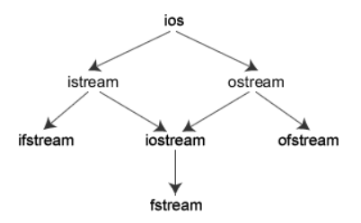

<!-- 2023年10月07日 -->
## c++输入和输出流
### 流的概念和流类库的结构
程序的输入指的是从输入文件将数据传送给程序，程序的输出指的是从程序将数据传送给输出文件。  

C++输入输出包含以下三个方面的内容：

- 对系统指定的标准设备的输入和输出。即从键盘输入数据，输出到显示器屏幕。这种输入输出称为标准的输入输出，简称标准I/O。
- 以外存磁盘文件为对象进行输入和输出，即从磁盘文件输入数据，数据输出到磁盘文件。以外存文件为对象的输入输出称为文件的输入输出，简称文件I/O。
- 对内存中指定的空间进行输入和输出。通常指定一个字符数组作为存储空间(实际上可以利用该空间存储任何信息)。  
这种输入和输出称为字符串输入输出，简称串I/O。

C++编译系统提供了用于输入输出的iostream类库。  
`iostream`这个单词是由3个部 分组成的，即`i-o-stream`，意为输入输出流。  
在iostream类库中包含许多用于 输入输出的 类。

**I/O类库中常用的流类**
| 类名       | 作用                                 | 在哪个头文件说明 |
| ---------- | ------------------------------------ | ---------------- |
| ios        | 抽象基类                             | -                |
| -          | -                                    | -                |
| istream    | 通用输入流和其他输入流的基类         | iostream         |
| ostream    | 通用输出流和其他输出流的基类         | iostream         |
| iostream   | 通用输入输出流和其他输入输出流的基类 | iostream         |
| -          | -                                    | -                |
| ifstream   | 输入文件流类                         | fstream          |
| ofstream   | 输出文件流类                         | fstream          |
| fstream    | 输入输出文件流类                     | fstream          |
| -          | -                                    | -                |
| istrstream | 输入字符串流类                       | strstream        |
| ostrstream | 输出字符串流类                       | strstream        |
| strstream  | 输入输出字符串流类                   | strstream        |

继承关系


ios是抽象基类，由它派生出istream类和ostream类，两个类名中第1个字母i和o分别代表输入(input)和输出(output)。 istream类支持输入操作，ostream类支持输出操作， iostream类支持输入输出操作。iostream类是从istream类和ostream类通过多重继承而派生的类。其继承层次见上图表示。  
C++对文件的输入输出需要用ifstrcam和ofstream类，两个类名中第1个字母i和o分别代表输入和输出，第2个字母f代表文件 (file)。ifstream支持对文件的输入操作， ofstream支持对文件的输出操作。类ifstream继承了类istream，类ofstream继承了类ostream，类fstream继承了 类iostream。


I/O类库中还有其他一些类，但是对于一般用户来说，以上这些已能满足需要了。  
与iostream类库有关的头文件   
iostream类库中不同的类的声明被放在不同的头文件中，用户在自己的程序中用#include命令包含了有关的头文件就相当于在本程序中声明了所需要用到的类。可以换一种说法：头文件是程序与类库的接口，iostream类库的接口分别由不同的头文件来实现。常用的有 
- iostream  包含了对输入输出流进行操作所需的基本信息。
- fstream  用于用户管理的文件的I/O操作。
- strstream  用于字符串流I/O。
- stdiostream  用于混合使用C和C + +的I/O机制时，例如想将C程序转变为C++程序。
- iomanip  在使用格式化I/O时应包含此头文件。  

在`iostream`头文件中定义的流对象  
在 `iostream` 头文件中定义的类有 `ios`，`istream`，`ostream`，`iostream`，`istream` 等。  
在iostream头文件中不仅定义了有关的类，还定义了4种流对象，  
| 对象 | 含义           | 对应设备对应的类   | c语言中相应的标准文件 |
| ---- | -------------- | ------------------ | --------------------- |
| cin  | 标准输入流键盘 | istream_withassign | stdin                 |
| cout | 标准输出流屏幕 | ostream_withassign | stdout                |
| cerr | 标准错误流屏幕 | ostream_withassign | stderr                |
| clog | 标准错误流屏幕 | ostream_withassign | stderr                |

在iostream头文件中定义以上4个流对象用以下的形式（以cout为例）：  
  ostream cout ( stdout);    
   在定义cout为ostream流类对象时，把标准输出设备stdout作为参数，这样它就与标准输出设备(显示器)联系起来，如果有  
      cout <<3;
就会在显示器的屏幕上输出3。
在iostream头文件中重载运算符
“<<”和“>>”本来在C++中是被定义为左位移运算符和右位移运算符的，由于在iostream头文件中对它们进行了重载， 使它们能用作标准类型数据的输入和输出运算符。  
所以，在用它们的程序中必须用#include命令把`iostream`头文件包含到程序中。
1. \>\>a表示将数据放入a对象中。
2. \<\<a表示将a对象中存储的数据拿出。

### 标准I/O流
标准I/O对象:`cin`，`cout`，`cerr`，`clog`

#### cout流对象  
cout是console output的缩写，意为在控制台（终端显示器）的输出。强调几点。  
1. cout不是C++预定义的关键字，它是ostream流类的对象，在iostream中定义。 顾名思义，流是流动的数据，cout流是流向显示器的数据。cout流中的数据是用流插入  运算符“<<”顺序加入的。cout流是容纳数据的载体，它并不是一个运算符。人们关心的是cout流中的内容，也就是向显示器输出什么。
2. 用“cout<<”输出基本类型的数据时，可以不必考虑数据是什么类型，系统会判断数       据的类型，并根据其类型选择调用与之匹配的运算符重载函数。这个过程都是自动的，       用户不必干预。  
如果在C语言中用prinf函数输出不同类型的数据，必须分别指定相应的输出格式符，十分麻烦，而且容易出错。C++的I/O机制对用户来说，显然是方便而安全的。
3. cout流在内存中对应开辟了一个缓冲区，用来存放流中的数据，当向cout流插人一个endl时，不论缓冲区是否已满，都立即输出流中所有数据，然后插入一个换行符， 并刷新流（清空缓冲区）。  
注意如果插人一个换行符”\n“（如cout<< a <<"\n"），则只输出和换行，而不刷新cout 流(但不是所有编译器都有这个特点）。
1. 在iostream中只对"<<"和">>"运算符用于标准类型数据的输入输出进行了重载，但未对用户声明的类型数据的输入输出进行重载。如果用户声明了新的类型，并希望用"<<"和">>"运算符对其进行输入输出，按照重运算符重载来做。

#### cerr流对象  
cerr流对象是标准错误流，cerr流已被指定为与显示器关联。cerr的 作用是向标准错误设备(standarderror device)输出有关出错信息。cerr与标准输出流cout的作用和用法差不多。  
但有一点不同：cout流通常是传送到显示器输出，但也可以被重定向输出到磁盘文件，而cerr流中的信息只能在显示器输出。当调试程序时，往往不希望程序运行时的出错信息被送到其他文件，而要求在显示器上及时输出，这时应该用cerr。cerr流中的信息是用户根据需要指定的。

#### clog流对象  
clog流对象也是标准错误流，它是console log的缩写。它的作用和cerr相同，都是在终端显示器上显示出错信息。区别：cerr是不经过缓冲区，直接向显示器上输出有关信息，而clog中的信息存放在缓冲区中，缓冲区满后或遇endl时向显示器输出。


### 标准输入流对象cin，重点掌握的函数
```c++
cin.get()                 //一次只能读取一个字符,从缓冲区读取一个字符
cin.get(/* 一个参数 */)     //读一个字符
cin.get(/* 两个参数 */)     //可以读字符串
cin.getline()                //读取一行(读取直到遇到\n)
cin.ignore()                //忽略缓冲区的n个字符
cin.peek()                    //读取缓冲区的一个字符串但会将字符放回缓冲区原位
cin.putback()                //将数据放回缓冲区
```
### 标准输出流
#### 字符输出
```c++
cout.flush() //刷新缓冲区 Linux下有效
cout.put() //向缓冲区写字符
cout.write() //从buffer中写num个字节到当前输出流中。
//cout.flush 刷新缓冲区，linux下有效
```
### 格式化输出
在输出数据时，为简便起见，往往不指定输出的格式，由系统根据数据的类型采取默认的格式，但有时希望数据按指定的格式输出，如要求以十六进制或八进制形式输出一个整数，对输出的小数只保留两位小数等。有两种方法可以达到此目的。  
1. 使用控制符的方法(流操作算子)；  
2. 使用流对象的有关成员函数。  
#### 使用流操作算子
C++ 中常用的输出流操纵算子如表 1 所示，它们都是在头文件 iomanip 中定义的；要使用这些流操纵算子，必须包含该头文件。  

    注意：“流操纵算子”一栏中的星号*不是算子的一部分，星号表示在没有使用任何算子的情况下，就等效于使用了该算子。例如，在默认情况下，整数是用十进制形式输出的，等效于使用了 dec 算子。
    
*表1：C++ 流操纵算子*
| 流操纵算子          | 作  用                                                                                                                                                                                                                                                                               |
| ------------------- | ------------------------------------------------------------------------------------------------------------------------------------------------------------------------------------------------------------------------------------------------------------------------------------ |
| *dec                | 以十进制形式输出整数                                                                                                                                                                                                                                                                 |
| hex                 | 以十六进制形式输出整数                                                                                                                                                                                                                                                               |
| oct                 | 以八进制形式输出整数                                                                                                                                                                                                                                                                 |
| fixed               | 以普通小数形式输出浮点数                                                                                                                                                                                                                                                             |
| scientific          | 以科学计数法形式输出浮点数                                                                                                                                                                                                                                                           |
| left                | 左对齐，即在宽度不足时将填充字符添加到右边                                                                                                                                                                                                                                           |
| *right              | 右对齐，即在宽度不足时将填充字符添加到左边                                                                                                                                                                                                                                           |
| setbase(b)          | 设置输出整数时的进制，b=8、10 或 16                                                                                                                                                                                                                                                  |
| setw(w)             | 指定输出宽度为 w 个字符，或输人字符串时读入 w 个字符                                                                                                                                                                                                                                 |
| setfill(c)          | 在指定输出宽度的情况下，输出的宽度不足时用字符 c 填充（默认情况是用空格填充）                                                                                                                                                                                                        |
| setprecision(n)     | 设置输出浮点数的精度为 n。  在使用非 fixed 且非 scientific 方式输出的情况下，n 即为有效数字最多的位数，如果有效数字位数超过 n，则小数部分四舍五人，或自动变为科学计 数法输出并保留一共 n 位有效数字。  在使用 fixed 方式和 scientific 方式输出的情况下，n 是小数点后面应保留的位数。 |
| setiosflags(flag)   | 将某个输出格式标志置为 1                                                                                                                                                                                                                                                             |
| resetiosflags(flag) | 将某个输出格式标志置为 0                                                                                                                                                                                                                                                             |
| boolapha            | 把 true 和 false 输出为字符串	不常用                                                                                                                                                                                                                                                 |
| *noboolalpha        | 把 true 和 false 输出为 0、1                                                                                                                                                                                                                                                         |
| showbase            | 输出表示数值的进制的前缀                                                                                                                                                                                                                                                             |
| *noshowbase         | 不输出表示数值的进制.的前缀                                                                                                                                                                                                                                                          |
| showpoint           | 总是输出小数点                                                                                                                                                                                                                                                                       |
| *noshowpoint        | 只有当小数部分存在时才显示小数点                                                                                                                                                                                                                                                     |
| showpos             | 在非负数值中显示 +                                                                                                                                                                                                                                                                   |
| *noshowpos          | 在非负数值中不显示 +                                                                                                                                                                                                                                                                 |
| *skipws             | 输入时跳过空白字符                                                                                                                                                                                                                                                                   |
| noskipws            | 输入时不跳过空白字符                                                                                                                                                                                                                                                                 |
| uppercase           | 十六进制数中使用 A~E。若输出前缀，则前缀输出 0X，科学计数法中输出 E                                                                                                                                                                                                                  |
| *nouppercase        | 十六进制数中使用 a~e。若输出前缀，则前缀输出 0x，科学计数法中输出 e。                                                                                                                                                                                                                |
| internal            | 数值的符号（正负号）在指定宽度内左对齐，数值右对 齐，中间由填充字符填充。                                                                                                                                                                                                            |

#### 流操作算子的使用方法  
直接将算子用 << 和 cout 连用。例如：
```c++
cout << hex << 12 << "," << 24;
```
这条语句的作用是指定以十六进制形式输出后面两个数，因此输出结果是：
>> c, 18
#### setiosflags() 算子
setiosflags() 算子实际上是一个库函数，它以一些标志作为参数，这些标志可以是在 iostream 头文件中定义的以下几种取值，它们的含义和同名算子一样。   

**表2：setiosflags() 可以使用的标志及其说明**

| 标 志           | 作 用                                                         |
| --------------- | ------------------------------------------------------------- |
| ios::left       | 输出数据在本域宽范围内向左对齐                                |
| ios::right      | 输出数据在本域宽范围内向右对齐                                |
| ios::internal   | 数值的符号位在域宽内左对齐，数值右对齐，中间由填充字符填充    |
| ios::dec        | 设置整数的基数为 10                                           |
| ios::oct        | 设置整数的基数为 8                                            |
| ios::hex        | 设置整数的基数为 16                                           |
| ios::showbase   | 强制输出整数的基数（八进制数以 0 开头，十六进制数以 0x 打头） |
| ios::showpoint  | 强制输出浮点数的小点和尾数 0                                  |
| ios::uppercase  | 在以科学记数法格式 E 和以十六进制输出字母时以大写表示         |
| ios::showpos    | 对正数显示“+”号                                               |
| ios::scientific | 浮点数以科学记数法格式输出                                    |
| ios::fixed      | 浮点数以定点格式（小数形式）输出                              |
| ios::unitbuf    | 每次输出之后刷新所有的流                                      |
| ios::stdio      | 每次输出之后清除 stdout, stderr                               |

这些标志实际上都是仅有某比特位为 1，而其他比特位都为 0 的整数。

多个标志可以用|运算符连接，表示同时设置。例如：
```c++
cout << setiosflags(ios::scientific|ios::showpos) << 12.34;
```
输出结果是：
>> +1.234000e+001

如果两个相互矛盾的标志同时被设置，如先设置 setiosflags(ios::fixed)，然后又设置 setiosflags(ios::scientific)，那么结果可能就是两个标志都不起作用。因此，在设置了某标志，又要设置其他与之矛盾的标志时，就应该用 resetiosflags 清除原先的标志。例如下面三条语句：
```c++
cout << setiosflags(ios::fixed) << 12.34 << endl;
cout << resetiosflags(ios::fixed) << setiosflags(ios::scientific | ios::showpos) << 12.34 << endl;
cout << resetiosflags(ios::showpos) << 12.34 << endl;  //清除要输出正号的标志
```
输出结果是：
```
12.340000
+1.234000e+001
1.234000e+001
```

需要注意的是，setw() 算子所起的作用是一次性的，即只影响下一次输出。每次需要指定输出宽度时都要使用 setw()。

在读入字符串时，setw() 还能影响 cin 的行为。例如下面的程序：
```c++
#include <iostream>
#include <iomanip>
using namespace std;
int main()
{
    string s1, s2;
    cin >> setw(4) >> s1 >> setw(3) >> s2;
    cout << s1 << "," << s2 << endl;
    return 0;
}
```
输入：
>>1234567890

程序的输出结果是：
>>1234,567

说明setw(4)使得读入 s1 时，只读入 4 个字符，其后的setw(3)使得读入 s2 时只读入 3 个字符。

setw() 用于 cin 时，同样只影响下一次的输入。

ostream 类有一些成员函数，通过 cout 调用它们也能用于控制输出的格式，其作用和流操纵算子相同，如表 3 所示。

**表3：ostream 类的成员函数**

| 成员函数     | 作用相同的流操纵算子 | 说明                                                                            |
| ------------ | -------------------- | ------------------------------------------------------------------------------- |
| precision(n) | setprecision(n)      | 设置输出浮点数的精度为 n。                                                      |
| width(w)     | setw(w)              | 指定输出宽度为 w 个字符。                                                       |
| fill(c)      | setfill (c)          | 在指定输出宽度的情况下，输出的宽度不足时用字符 c 填充（默认情况是用空格填充）。 |
| setf(flag)   | setiosflags(flag)    | 将某个输出格式标志置为 1。                                                      |
| unsetf(flag) | resetiosflags(flag)  | 将某个输出格式标志置为 0。                                                      |
 
setf 和 unsetf 函数用到的flag，与 setiosflags 和 resetiosflags 用到的完全相同。

这些成员函数的用法十分简单。例如下面的三行程序：
```c++
cout.setf(ios::scientific);
cout.precision(8);
cout << 12.23 << endl;
```
输出结果是：
>>1.22300000e+001

## 文件读写
### 文件流类和文件流对象
输入输出是以系统指定的标准设备（输入设备为键盘，输出设备为显示器）为对象的。在实际应用中，常以磁盘文件作为对象。即从磁盘文件读取数据，将数据输出到磁盘文件。  
和文件有关系的输入输出类主要在fstream.h这个头文件中被定义，在这个头文件中主要被定义了三个类，由这三个类控制对文件的各种输入输出操作，  
他们分别是ifstream、ofstream、fstream，其中ifstream、ofstream是由istream、ostream类派生来的,fstream类是由iostream类派生而来，

由于文件设备并不像显示器屏幕与键盘那样是标准默认设备，所以它在fstream头文件中是没有像cout那样预先定义的全局对象，所以我们必须自己定义一个该类的对象。ifstream类，它是从istream类派生的，用来支持从磁盘文件的输入。ofstream类，它是从ostream类派生的，用来支持向磁盘文件的输出。

### C++打开文件
所谓打开(open)文件是一种形象的说法，如同打开房门就可以进入房间活动一样。打开文件是指在文件读写之前做必要的准备工作，包括：
1. 为文件流对象和指定的磁盘文件建立关联，以便使文件流流向指定的磁盘文件。
2. 指定文件的工作方式，如：该文件是作为输入文件还是输出文件，是ASCII文件还是二进制文件等。
以上工作可以通过两种不同的方法实现:
1. 调用文件流的成员函数open。如
```c++
ofstream outfile;  //定义ofstream类(输出文件流类)对象outfile
outfile.open("f1.dat",ios::out);  //使文件流与f1.dat文件建立关联
```
第2行是调用输出文件流的成员函数open打开磁盘文件f1.dat，并指定它为输出文件，文件流对象outfile将向磁盘文件f1.dat输出数据。ios::out是I/O模式的一种，表示以输出方式打开一个文件。或者简单地说，此时f1.dat是一个输出文件，接收从内存输出的数据。
磁盘文件名可以包括路径，如"c:\\new\\f1.dat"，如缺省路径，则默认为当前目录下的文件。

助记:


1. 在定义文件流对象时指定参数  
在声明文件流类时定义了带参数的构造函数，其中包含了打开磁盘文件的功能。因此，       可以在定义文件流对象时指定参数，调用文件流类的构造函数来实现打开文件的功能。

文件输入输出方式设置值
| 方式                  | 作用                                                                                                                                             |
| --------------------- | ------------------------------------------------------------------------------------------------------------------------------------------------ |
| ios::in               | 以输入的方式打开文件                                                                                                                             |
| ios::out              | 以输出的方式打开文件(默认方式),如果已有此名字的文件,则将其其原有内容全部清除                                                                     |
| ios::app              | 以输出的方式打开文件,写入的数据添加在文件尾                                                                                                      |
| ios::ate              | 打开一个已有的文件,文件指针指向文件末尾                                                                                                          |
| ios::trunc            | 打开一个文件,如果文件已存在,则删除其中全部数据,文件不存在就建立新的文件,如已制定了ios::out方式而未指定ios::app,ios::ate,ios::in,则同时默认此方式 |
| ios::binary           | 以二进制方式打开一个文件,不指定则默认为ASCII方式                                                                                                 |
| ios::nocreate         | 打开一个已有文件,不存在则失败                                                                                                                    |
| ios::noreplace        | 文件不存在则创建一个新的文件,文件存在则操作失败                                                                                                  |
| ios::in\|ios::out     | 以输入输出的方式打开文件,文件可读可写                                                                                                            |
| ios::out\|ios::binary | 以二进制方式打开一个输出文件                                                                                                                     |
| ios::in\|ios::binary  | 以二进制方式打开一个输入文件                                                                                                                     |

几点说明：
1. 新版本的I/O类库中不提供ios::nocreate和ios::noreplace。
2. 每一个打开的文件都有一个文件指针，该指针的初始位置由I/O方式指定，每次读写都从文件指针的当前位置开始。每读入一个字节，指针就后移一个字节。当文件指针移到最后，就会遇到文件结束EOF（文件结束符也占一个字节，其值为-1)，此时流对象的成员函数eof的值为非0值(一般设为1)，表示文件结束了。
3. 可以用“位或”运算符“|”对输入输出方式进行组合，如表13.6中最后3行所示那样。还可以举出下面一些例子：   
    ```c++
    ios::in | ios:: noreplace  //打开一个输入文件，若文件不存在则返回打开失败的信息  
    ios::app | ios::nocreate  //打开一个输出文件，在文件尾接着写数据，若文件不存在，则返回打开失败的信息    
    ios::out | ios::noreplace  //打开一个新文件作为输出文件，如果文件已存在则返回打开失败的信息
    ios::in | ios::out | ios::binary  //打开一个二进制文件，可读可写但不能组合互相排斥的方式，如 ios::nocreate l ios::noreplace。
    ```
1. 如果打开操作失败，open函数的返回值为0(假)，如果是用调用构造函数的方式打开文件的，则流对象的值为0。可以据此测试打开是否成功。如  
    ```c++
       if(outfile.open("f1.bat", ios::app) ==0)        
    cout <<"open error";
    //或  
      if( !outfile.open("f1.bat", ios::app) )        
    cout <<"open error";
    ```
### C++关闭文件
在对已打开的磁盘文件的读写操作完成后，应关闭该文件。关闭文件用成员函数close。  
如：
```c++
outfile.close();  //将输出文件流所关联的磁盘文件关闭
```
所谓关闭，实际上是解除该磁盘文件与文件流的关联，原来设置的工作方式也失效，这样，就不能再通过文件流对该文件进行输入或输出。此时可以将文件流与其他磁盘文件建立关联，通过文件流对新的文件进行输入或输出。  
如:    
```c++
outfile.open("f2.dat",ios::app|ios::nocreate)；
```
此时文件流outfile与f2.dat建立关联，并指定了f2.dat的工作方式。


### C++对ASCII文件的读写操作
如果文件的每一个字节中均以ASCII代码形式存放数据,即一个字节存放一个字符,这个文件就是ASCII文件(或称字符文件)。程序可以从ASCII文件中读入若干个字符,也可以向它输出一些字符。
1. 用流插入运算符“<<”和流提取运算符“>>”输入输出标准类型的数据。“<<”和“ >>”都巳在iostream中被重载为能用于ostream和istream类对象的标准类型的输入输出。由于ifstream和 ofstream分别是ostream和istream类的派生类；因此它们从ostream和istream类继承了公用的重载函数，所以在对磁盘文件的操作中，可以通过文件流对象和流插入运算符“<<”及 流提取运算符“>>”实现对磁盘 文件的读写，如同用cin、cout和<<、>>对标准设备进行读写一样。
2. 用文件流的put、get、geiline等成员函数进行字符的输入输出，：用C++流成员函数put输出单个字符、C++ get()函数读入一个字符和C++ getline()函数读入一行字符。
### C++对二进制文件的读写操作
二进制文件不是以ASCII代码存放数据的，它将内存中数据存储形式不加转换地传送到磁盘文件，因此它又称为内存数据的映像文件。因为文件中的信息不是字符数据，而是字节中的二进制形式的信息，因此它又称为字节文件。  
对二进制文件的操作也需要先打开文件，用完后要关闭文件。在打开时要用ios::binary指定为以二进制形式传送和存储。二进制文件除了可以作为输入文件或输出文件外,还可以是既能输入又能输出的文件。这是和ASCII文件不同的地方。  

用成员函数read和write读写二进制文件  
对二进制文件的读写主要用istream类的成员函数read和write来实现。这两个成员函数的原型为                        
```c++
istream& read(char *buffer,int len); 
ostream& write(const char *buffer,int len);
```
字符指针buffer指向内存中一段存储空间。len是读写的字节数

### 设置/获取偏移量

在读写文件时，有时希望直接跳到文件中的某处开始读写，这就需要先将文件的读写指针指向该处，然后再进行读写。  
ifstream 类和 fstream 类有 seekg 成员函数，可以设置文件读指针的位置；  
ofstream 类和 fstream 类有 seekp 成员函数，可以设置文件写指针的位置。  

所谓“位置”，就是指距离文件开头有多少个字节。文件开头的位置是 0。

这两个函数的原型如下：
```c++
ostream & seekp (int offset, int mode);
istream & seekg (int offset, int mode);
```
p和g代表put和get,seekg用于ifstream对象,seekp用于ofstream对象

mode 代表文件读写指针的设置模式，有以下三种选项：  
- `ios::beg`：让文件读指针（或写指针）指向从文件开始向后的 offset 字节处。在此情况下，offset 只能是非负数。
- `ios::cur`：在此情况下，offset 为负数则表示将读指针（或写指针）从当前位置朝文件开头方向移动 offset 字节，可为正为负.
- `ios::end`：让文件读指针（或写指针）指向从文件结尾往前的 |offset|（offset 的绝对值）字节处。此情况下，offset 只能小于等于0

此外，我们还可以得到当前读写指针的具体位置：
- ifstream 类和 fstream 类还有 tellg 成员函数，能够返回文件读指针的位置；
- ofstream 类和 fstream 类还有 tellp 成员函数，能够返回文件写指针的位置。

这两个成员函数的原型如下：
```c++
int tellg();
int tellp();
```
要获取文件长度，可以用 seekg 函数将文件读指针定位到文件尾部，再用 tellg 函数获取文件读指针的位置，此位置即为文件长度。

### 当文件读取到末尾
当文件读取到末尾时,使用tellp/tellg函数会导致ifstream对象和ofstream对象类异常.   
使用对象中的clear()函数清除异常,将流的条件状态复位    
即如果原来的流已经遇到了eofbit,failbit或者badbit,可以经通过clear()函数将流重新复位为goodbit();

eofbit 表示当前流已经到了文件末尾   
failbit 表示一个IO操作失败了   
badbit 表示流已经崩溃   
即,当以上三种情况出现时均会导致流对象的失效,同样也可以理解为如果将流作为判断条件,则此时流的状态值为false(注:流是可以直接作为判断条件的)   
当以上三种情况出现后,流会失效,之后将不能继续使用该流对象 

clear()将eofbit与failbit进行了复位,使其重新处于goodbit的状态,并可以再次使用.

### 其他函数
#### istream::gcount 返回最后一个输入输出操作读取的字符数目

```c++
streamsize gcount() const;
```
可以修改这个返回值的函数有：get,getline,ignore,peek,read, readsome,putback and unget. 其中函数peek, putback and unget 被调用后gcount()返回值为0。
#### istream::ignore 读取n个字符并丢弃

```c++
istream& ignore (streamsize n = 1, int delim = EOF);
```
从输入流中读取n个字符并且丢弃，或者读到delim字符再停止读取。

#### istream::peek 读取n个字符并丢弃,
```c++

int peek();
```
返回输入流下一个字符，并把它留在输入流中，作为下一次读取的起点。返回值是整形ascll码值，可以用 char© 转化为字符

#### ios::good
```c++
bool good() const;
bool eof() const;
bool fail() const;
bool bad() const;
```
检测流的状态是否正常。当错误的状态*flags (eofbit, failbit and badbit)*都没被设置的时候返回true
特定的错误状态可以用下面的函数（eof, fail, and bad）来检测。

iostate value (member constant)	|表示|	good()|	eof()	|fail()	|bad()	|rdstate()
-|-|-|-|-|-|-
goodbit	|没有错误	|true|	false	|false	|false	|goodbit
eofbit	|在输入操作时到达文件末尾	|false	|true	|false	|false	|eofbit
failbit	|I/O 操作时出现逻辑错误	|false	|false|	true	|false	|failbit
badbit	|I/O 操作时出现读/写错误	|false	|false	|true	|true|	badbit
#### ios::operator! 重载!运算符
```c++
bool operator!() const;
//Returns true if either failbit or badbit is set, and false otherwise.
// 设置此流的任何错误标志。这包括故障位或坏位。
// 有错误状态返回 true
// 如果设置了 failbit 或 badbit，则为 true，否则为 false。

#include <iostream>     
#include <fstream>      

int main () {
   std::ifstream is;
   is.open ("test.txt");
   if (!is)
      std::cerr << "Error opening 'test.txt'\n";
   return 0;
}
```
#### ios::operator bool 重载()运算符
布尔运算： 当流对象单独出现在条件语句中时，就间接调用布尔运算。
如：`if(ios), while(ios)`  
函数原型：  
c++98: `operator void*() const;`  
c++11: `explicit operator bool() const;`  
返回值：failbit 或 badbit 都没被标记的时候返回真。    
（对比good(): failbit 或 badbit 或 eofbit 都没被标记的时候返回真）
布尔运算一个很方便的用法就是检测文件结束。读到文件末尾的时候， eofbit, failbit 同时被设置为1，所以可以使用bool()来判断流的状态。  
当文件打开失败的时候failbit 位被设置为1，所以也能检测打开是否成功。
```c++
//按行读文件，简洁的模板
#include<iostream>
#include<fstream>
#include<string>
using namespace std;

void print_state (const std::ios& stream) 
{
    cout << "good()=" << stream.good();
    cout << " eof()=" << stream.eof();
    cout << " fail()=" << stream.fail();
    cout << " bad()=" << stream.bad()<<endl;
}
int main()
{
    string str;
    ifstream ifs("test.txt");
	if(ifs)
	{
    	//while( bool(getline(ifs,str)))// 等价
    	//while( getline(ifs,str).good())//等价
    	while( getline(ifs,str))
    	{
       		cout<<"line:"<<str<<endl;
    	}
	}
	else{
		cout<<"open file fail!"<<endl;
		return 1;
	}
    print_state(ifs);
    return 0;
}
```
#### ios::rdstate
iostate rdstate() const;  
用于读取此流的内部状态。  
此方法返回此流的当前内部状态。
```c++
// Returns the current internal error state flags of the stream.
// 返回当前流中的内部错误状态，iostate二进制数，需要做位运算来获取其相应位置上的值。
//这个函数的功能可以被 good()，eof()，fail()，bad() 替换。
int main () {
  std::ifstream is;
  is.open ("test.txt");
  if ( (is.rdstate() & std::ifstream::failbit ) != 0 )
    std::cerr << "Error opening 'test.txt'\n";
  return 0;
}
```
## 练习

- 设计一个程序，输入一个文件名之后，程序会打开这个文件,并且读取用户的输入，直到用户输入end。程序把用户的所有输入存储到文件中。
```c++
#include <iostream>
#include <fstream>
#include <cstring>

using namespace std;

int main(int argc , char** argv,char** envp)
{
    char pathName[1024];
    char temp[1024];
    cout<<"请输入文件名: ";
    cin>>pathName;
    //清除缓冲区
    // while ( getchar() != '\n');
    // cin.ignore();
    // cin.ignore(std::numeric_limits< streamsize >::max(), '\n');
    cin.sync();
    //创建文件输出流对象
    ofstream  osm(pathName,ios::out);
    while (((cin>>temp),strlen(temp)==3&&strncmp("end",temp,3)))
    {
        osm<<temp<<endl;
    }
    osm.close();
    return 0;
}
```

- 设计程序，将用户输入的5个Person类型的学生成绩存储到一个数据文件student.data中,然后使用另一个程序将这个文件中的信息全部读取出出来。  
demo1.cpp负责写  
demo2.cpp负责读  


<details>
<summary>Persion.h</summary>

```c++
#include <iostream>
#include <cstring>

using namespace std;

class Person
{
private:
    char name[20];
    int age;
public:
    Person();
    Person(const char*p,int age);
    ~Person();
    void show_info(void);
};

```
</details>
<details>
<summary>Persion.cpp</summary>

```c++
#include "Person.h"

Person::Person()
{
    bzero(this->name,sizeof(this->name));
}

Person::Person(const char*name,int age):age(age)
{
    strcpy(this->name,name);
}
Person::~Person()
{
}
void Person::show_info(void)
{
    cout<<"该同学姓名为:"<<this->name<<"年龄为:"<<this->age<<endl;
}

```
</details>
<details>
<summary>demo1.cpp</summary>

```c++
#include <iostream>
#include <fstream>
#include <cstring>
#include "Person.h"
using namespace std;
int main(int argc, char **argv, char **envp)
{
    const char pathName[1024] = "student.data";
    Person stu[5] = {
        {"小明", 10},
        {"小红", 13},
        {"小花", 20},
        {"小草", 8},
        {"李华", 4}};
        
    ofstream  osm(pathName,ios::out|ios::binary);
    for (int  i = 0; i < sizeof(stu)/sizeof(Person); i++)
    {
        // osm<<(stu+i);
        osm.write((const char*)(stu+i),sizeof(Person));
        (stu+i)->show_info();
    }
    osm.close();
    return 0;
}
```
</details>
<details>
<summary>demo2.cpp</summary>

```c++
#include <iostream>
#include <fstream>
#include <cstring>
#include "Person.h"
using namespace std;
int main(int argc, char **argv, char **envp)
{
    const char pathName[1024] = "student.data";
    Person stu[5] = {};
        
    ifstream  ism(pathName,ios::in|ios::binary);
    for (int  i = 0; i < sizeof(stu)/sizeof(Person); i++)
    {
        // osm<<(stu+i);
        ism.read((char*)(stu+i),sizeof(Person));
    }
    for (int  i = 0; i < sizeof(stu)/sizeof(Person); i++)
    {
        (stu+i)->show_info();
    }
    ism.close();
    return 0;
}

```
</details>


- 分别使用C++文件IO完成文本文件拷贝，和二进制文件拷贝。
<details>
<summary>main.cpp</summary>

```c++
#include <iostream>
#include <fstream>
#include <cstring>

using namespace std;

int main(int argc, char **argv, char **envp)
{
    // 默认打开文件类型 0为Ascill,4为二进制
    int file_type = 0;
    // 文件打开路径
    // string file_path = "";
    char file_path[1024 * 4] = {0};
    for (int i = 1; i < argc; i++)
    {
        if (!strcmp("-b", *(argv + i)))
        {
            file_type = 4;
        }
        else if (strcmp("-p", *(argv + i)) && i + 1 < argc)
        {
            strcpy(file_path, *(argv + i));
            i++;
        }
        else
        {
            strcpy(file_path, *(argv + i));
        }
    }
    // 如果不存在路径则提示输入文件名
    while (strlen(file_path) == 0)
    {
        cout << "请输入路径和文件名:";
        cin >> file_path;
    }
    // 打开文件,文件不存在则报错
    ifstream ism;
    ism.open(file_path, ios::in | (file_type == 0 ? ios::in : ios::binary));
    if (!ism)
    {
        cout << "打开 " << file_path << " 文件失败" << endl;
        return 0;
    }
    // 将文件名后面添加一个 副本
    // file_path = file_path + " 副本";
    strcat(file_path, "-copy");
    // 打开文件,文件存在则清空,不存在则创建
    ofstream osm;
    osm.open(file_path, ios::out | ios::trunc | (file_type == 0 ? ios::out : ios::binary));
    if (!osm)
    {
        cout << "打开 " << file_path << " 文件失败" << endl;
        return 0;
    }
    char temp[1024*4] = {0};
    // 如果以Ascill形式复制
    if (file_type == 0)
    {
        while (!ism.eof())
        {
            bzero(temp, sizeof(temp));
            // ism >> temp;
            ism.getline(temp, sizeof(temp));
            osm << temp;
            // 判断到达了文件末尾,并判断最后一段是否有换行
            if (ism.eof())
            {
                ism.seekg(-1, ios::end);
                ism.read(temp, 1);
                if (temp[0] != 32)
                    break;
            }
            osm << endl;
        }
    }
    // 如果以二进制形式复制
    else
    {
        ism.seekg(0, ios::end);
        int end = ism.tellg();
        ism.seekg(0, ios::beg);
        for (int i = 0; i < end / sizeof(temp); i++)
        {
            bzero(temp, sizeof(temp));
            ism.read(temp, sizeof(temp));
            osm.write(temp, ((ism.tellg() % sizeof(temp) == 0) ? sizeof(temp) : ism.tellg() % sizeof(temp)));
        }        
        ism.read(temp, sizeof(temp));
        osm.write(temp, end % sizeof(temp));
    }
    ism.close();
    osm.close();
    return 0;
}
```
</details>