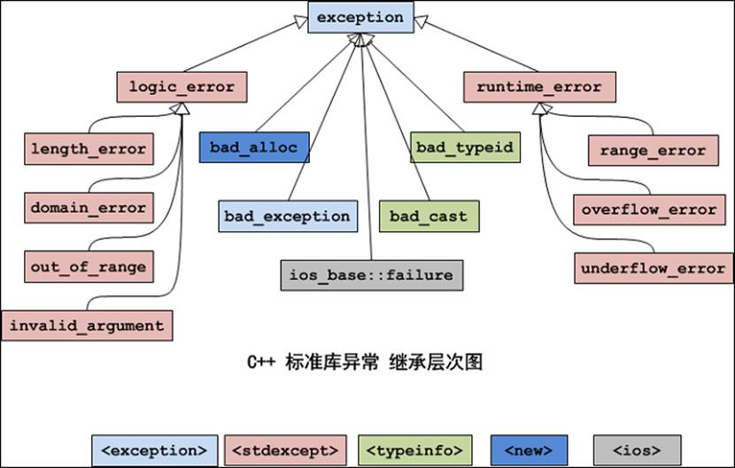

<!-- 2023年10月08日 -->
## C++类型转换
类型转换(cast)是将一种数据类型转换成另一种数据类型。例如，如果将一个整型值赋给一个浮点类型的变量，编译器会暗地里将其转换成浮点类型。  
转换是非常有用的，但是它也会带来一些问题，比如在转换指针时，我们很可能将其转换成一个比它更大的类型，但这可能会破坏其他的数据。  
应该小心类型转换，因为转换也就相当于对编译器说：忘记类型检查，把它看做其他的类型。
一般情况下，尽量少的去使用类型转换，除非用来解决非常特殊的问题。  
    无论什么原因，任何一个程序如果使用很多类型转换都值得怀疑.  

标准c++提供了一个显示的转换的语法，来替代旧的C风格的类型转换。  
使用C风格的强制转换可以把想要的任何东西转换成我们需要的类型。那为什么还需要一个新的C++类型的强制转换呢？  
新类型的强制转换可以提供更好的控制强制转换过程，允许控制各种不同种类的强制转换。C++风格的强制转换其他的好处是，它们能更清晰的表明它们要干什么。程序员只要扫一眼这样的代码，就能立即知道一个强制转换的目的。  
### 静态转换(static_cast)

- 用于类层次结构中基类和派生类之间指针或引用的转换
  - 进行上行转换（把派生类的指针或引用转换成基类表示）是安全的
  - 进行下行转换（把基类的指针或引用转换为派生类表示），由于没有动态类型检查，所以是不安全的
- 用于基本数据类型之间的转换，如把int转换成char。这种转换的安全也要开发人员来保证
- 把空指针转换成目标类型的空指针
- 把任何类型的表达式转换为void类型

注意：static_cast不能转换掉expression的const、volitale或者__unaligned属性。

static_cast:可以实现C++中内置基本数据类型之间的相互转换。

如果涉及到类的话，static_cast只能在有相互联系的类型中进行相互转换,不一定包含虚函数。

### 动态转换(dynamic_cast)
- dynamic_cast主要用于类层次间的上行转换和下行转换；
- 在类层次间进行上行转换时，dynamic_cast和static_cast的效果是一样的；
- 在进行下行转换时，dynamic_cast具有类型检查的功能，比static_cast更安全；

用法：`dynamic_cast<type_id> (expression)`

- 其他三种都是编译时完成的，dynamic_cast是运行时处理的，运行时要进行类型检查。
- 不能用于内置的基本数据类型的强制转换。
- dynamic_cast转换如果成功的话返回的是指向类的指针或引用，转换失败的话则会返回NULL。
- 使用dynamic_cast进行转换的，基类中一定要有虚函数，否则编译不通过。  
    B中需要检测有虚函数的原因：类中存在虚函数，就说明它有想要让基类指针或引用指向派生类对象的情况，此时转换才有意义。  
    这是由于运行时类型检查需要运行时类型信息，而这个信息存储在类的虚函数表  
    只有定义了虚函数的类才有虚函数表。
- 在类的转换时，在类层次间进行上行转换时，dynamic_cast 和 static_cast的效果是一样的。在进行下行转换时，dynamic_cast 具有类型检查的功能，比 static_cast 更安全。  
    向上转换，即为子类指针指向父类指针（一般不会出问题）；向下转换，即将父类指针转化子类指针。  
    向下转换的成功与否还与将要转换的类型有关，即要转换的指针指向的对象的实际类型与转换以后的对象类型一定要相同，否则转换失败。  
    在C++中，编译期的类型转换有可能会在运行时出现错误，特别是涉及到类对象的指针或引用操作时，更容易产生错误。Dynamic_cast操作符则可以在运行期对可能产生问题的类型转换进行测试。

dynamic_cast使用起来也是有条件的，它要求所转换的操作数必须包含多态类类型（即至少包含一个虚函数的类）。  
dynamic_cast还要求<>内部所描述的目标类型必须为指针或引用。
```c++
class Animal {
public:
    virtual void ShowName() = 0;
};
class Dog : public Animal{
    virtual void ShowName(){
       cout << "I am  a dog!" << endl;
    }
};
class Other {
public:
    void PrintSomething(){
       cout << "我是其他类!" << endl;
    }
};

//普通类型转换
void test01(){

    //不支持基础数据类型
    int a = 10;
    //double a = dynamic_cast<double>(a);
}

//继承关系指针
void test02(){

    Animal* animal01 = NULL;
    Dog* dog01 = new Dog;

    //子类指针转换成父类指针 可以
    Animal* animal02 = dynamic_cast<Animal*>(dog01);
    animal02->ShowName();
    //父类指针转换成子类指针 不可以
    //Dog* dog02 = dynamic_cast<Dog*>(animal01);
}

//继承关系引用
void test03(){

    Dog dog_ref;
    Dog& dog01 = dog_ref;

    //子类引用转换成父类引用 可以
    Animal& animal02 = dynamic_cast<Animal&>(dog01);
    animal02.ShowName();
}

//无继承关系指针转换
void test04(){
    
    Animal* animal01 = NULL;
    Other* other = NULL;

    //不可以
    //Animal* animal02 =  dynamic_cast<Animal*>(other);
}
```
### 常量转换(const_cast)
const_cast用于强制去掉这种不能被修改的常数特性，但需要特别注意的是const_cast不是用于去除变量的常量性，而是去除指向常数对象的指针或引用的常量性，其去除常量性的对象必须为指针或引用。

用法：`const_cast<type_id> (expression)`
- 该运算符用来修改类型的const或volatile属性。除了const 或volatile修饰之外,type_id和expression的类型是一样的。
- 常量指针被转化成非常量指针，并且仍然指向原来的对象；
- 常量引用被转换成非常量引用，并且仍然指向原来的对象；
- 常量对象被转换成非常量对象。

注意:不能直接对非指针和非引用的变量使用const_cast操作符去直接移除它的const..

建议在今后的C++程序设计过程中一定不要利用const_cast去掉指针或引用的常量性并且去修改原始变量的数值，这是一种非常不好的行为。
```c++
//常量指针转换成非常量指针
void test01(){
    
    const int* p = NULL;
    int* np = const_cast<int*>(p);

    int* pp = NULL;
    const int* npp = const_cast<const int*>(pp);

    const int a = 10;  //不能对非指针或非引用进行转换
    //int b = const_cast<int>(a); 
}

//常量引用转换成非常量引用
void test02(){

int num = 10;
    int & refNum = num;

    const int& refNum2 = const_cast<const int&>(refNum);
    
}
```
### 重新解释转换(reinterpret_cast)
这是最不安全的一种转换机制，最有可能出问题。  
主要用于将一种数据类型从一种类型转换为另一种类型。它可以将一个指针转换成一个整数，也可以将一个整数转换成一个指针。  
主要的三个用处  
- 改变指针或引用的类型
- 将指针或引用转换为一个足够长度的整形
- 将整型转换为指针或引用类型。

用法：`reinterpret_cast<type_id> (expression)`

- type-id必须是一个指针、引用、算术类型、函数指针或者成员指针。
- 它可以把一个指针转换成一个整数，也可以把一个整数转换成一个指针（先把一个指针转换成一个整数，在把该整数转换成原类型的指针，还可以得到原先的指针值）。
- 在使用reinterpret_cast强制转换过程仅仅只是比特位的拷贝，因此在使用过程中需要特别谨慎！

## 异常
### 异常基本概念
BjarneStroustrup说：提供异常的基本目的就是为了处理上面的问题。基本思想是：让一个函数在发现了自己无法处理的错误时抛出（throw）一个异常，然后它的（直接或者间接）调用者能够处理这个问题。也就是《C++ primer》中说的：将问题检测和问题处理相分离。   
一种思想：在所有支持异常处理的编程语言中（例如java），要认识到的一个思想：在异常处理过程中，由问题检测代码可以抛出一个对象给问题处理代码，通过这个对象的类型和内容，实际上完成了两个部分的通信，通信的内容是“出现了什么错误”。当然，各种语言对异常的具体实现有着或多或少的区别，但是这个通信的思想是不变的。  

一句话：异常处理就是处理程序中的错误。所谓错误是指在程序运行的过程中发生的一些异常事件（如：除0溢出，数组下标越界，所要读取的文件不存在,空指针，内存不足等等）。
### 如何使用
- 若有异常则通过throw操作创建一个异常对象并抛出。
- 将可能抛出异常的程序段放到try块之中。
- 如果在try段执行期间没有引起异常，那么跟在try后面的catch字句就不会执行。
- catch子句会根据出现的先后顺序被检查，匹配的catch语句捕获并处理异常(或继续抛出异常)
- 如果匹配的处理未找到，则运行函数terminate将自动被调用，其缺省功能调用abort终止程序。
- 处理不了的异常，可以在catch的最后一个分支，使用throw，向上抛。
c++异常处理使得异常的引发和异常的处理不必在一个函数中，这样底层的函数可以着重解决具体问题，而不必过多的考虑异常的处理。上层调用者可以在适当的位置设计对不同类型异常的处理。
### 异常严格类型匹配
异常机制和函数机制互不干涉,但是捕捉方式是通过严格类型匹配。
```c++
void TestFunction(){
    
    cout  << "开始抛出异常..." << endl;
    //throw 10; //抛出int类型异常
    //throw 'a'; //抛出char类型异常
    //throw  "abcd"; //抛出char*类型异常
    string  ex = "string exception!";
    throw ex;

}

int main(){

    try{
        TestFunction();
    }
    catch (int){
        cout  << "抛出Int类型异常!" << endl;
    }
    catch (char){
        cout  << "抛出Char类型异常!" << endl;
    }
    catch (char*){
        cout  << "抛出Char*类型异常!" << endl;
    }
    catch (string){
        cout  << "抛出string类型异常!" << endl;
    }
    //捕获所有异常
    catch (...){
        cout  << "抛出其他类型异常!" << endl;
    }


    system("pause");
    return EXIT_SUCCESS;
}
```
### 栈解旋(unwinding)
异常被抛出后，从进入try块起，到异常被抛掷前，这期间在栈上构造的所有对象，都会被自动析构。析构的顺序与构造的顺序相反，这一过程称为栈的解旋(unwinding).
### 异常接口声明
- 为了加强程序的可读性，可以在函数声明中列出可能抛出异常的所有类型，例如：`void func() throw(A,B,C);`这个函数func能够且只能抛出类型A,B,C及其子类型的异常。
- 如果在函数声明中没有包含异常接口声明，则此函数可以抛任何类型的异常，例如:void func()
- 一个不抛任何类型异常的函数可声明为:`void func() throw()`
- 如果一个函数抛出了它的异常接口声明所不允许抛出的异常,unexcepted函数会被调用，该函数默认行为调用terminate函数中断程序。
- 在c++17版本中已经不再支持了

```c++
//可抛出所有类型异常
void TestFunction01(){
    throw 10;
}
//只能抛出int char char*类型异常
void TestFunction02() throw(int,char,char*){
    string  exception = "error!";
    throw exception;
}
//不能抛出任何类型异常
void TestFunction03() throw(){
    throw 10;
}
int main(){
    try{
        //TestFunction01();
        //TestFunction02();
        //TestFunction03();
    }
    catch (...){
        cout  << "捕获异常!" << endl;
    }
    system("pause");
    return EXIT_SUCCESS;
}
```
请分别在qt vs linux下做测试! Qt and Linux 正确!
### 异常变量生命周期
- throw的异常是有类型的，可以是数字、字符串、类对象。
- throw的异常是有类型的，catch需严格匹配异常类型。
```c++
class MyException
{
public:
    MyException(){
        cout  << "异常变量构造" << endl;
    };
    MyException(const MyException & e)
    {
        cout  << "拷贝构造" << endl;
    }
    ~MyException()
    {
        cout  << "异常变量析构" << endl;
    }
};
void DoWork()
{
    throw new MyException(); //test1 2都用 throw  MyExecption();
}

void test01()
{
    try
    {
        DoWork();
    }
    catch (MyException e)
    {
        cout  << "捕获 异常" << endl;
    }
}
void test02()
{
    try
    {
        DoWork();
    }
    catch (MyException &e)
    {
        cout  << "捕获 异常" << endl;
    }
}

void test03()
{
    try
    {
        DoWork();
    }
    catch (MyException *e)
    {
        cout  << "捕获 异常" << endl;
        delete e;
    }
}
```

### 异常的多态使用
```c++
//异常基类
class BaseException{
public:
    virtual void printError(){};
};

//空指针异常
class NullPointerException : public BaseException{
public:
    virtual void printError(){
        cout << "空指针异常!" << endl;
    }
};
//越界异常
class OutOfRangeException : public BaseException{
public:
    virtual void printError(){
        cout << "越界异常!" << endl;
    }
};

void doWork(){

    throw NullPointerException();
}

void test()
{
    try{
        doWork();
    }
    catch (BaseException& ex){
        ex.printError();
    }
}
```
## C++标准异常库
### 标准库介绍
标准库中也提供了很多的异常类，它们是通过类继承组织起来的。异常类继承层级结构图如下：

每个类所在的头文件在图下方标识出来。
标准异常类的成员：
- 在上述继承体系中，每个类都有提供了构造函数、复制构造函数、和赋值操作符重载。
- logic_error类及其子类、runtime_error类及其子类，它们的构造函数是接受一个string类型的形式参数，用于异常信息的描述
- 所有的异常类都有一个`what()`方法，返回c`onstchar*` 类型（C风格字符串）的值，描述异常信息。

标准异常类的具体描述：   
异常名称描述exception所有标准异常类的父类bad_alloc当operator new and operator new[]，请求分配内存失败时bad_exception这是个特殊的异常，如果函数的异常抛出列表里声明了bad_exception异常，当函数内部抛出了异常抛出列表中没有的异常，这是调用的unexpected函数中若抛出异常，不论什么类型，都会被替换为bad_exception类型bad_typeid使用typeid操作符，操作一个NULL指针，而该指针是带有虚函数的类，这时抛出bad_typeid异常bad_cast使用dynamic_cast转换引用失败的时候ios_base::failureio操作过程出现错误logic_error逻辑错误，可以在运行前检测的错误runtime_error     运行时错误，仅在运行时才可以检测的错误

logic_error的子类：  
异常名称描述length_error试图生成一个超出该类型最大长度的对象时，例如vector的resize操作domain_error参数的值域错误，主要用在数学函数中。例如使用一个负值调用只能操作非负数的函数out_of_range超出有效范围invalid_argument参数不合适。在标准库中，当利用string对象构造bitset时，而string中的字符不是’0’或’1’的时候，抛出该异常

runtime_error的子类：  
异常名称描述range_error计算结果超出了有意义的值域范围overflow_error算术计算上溢underflow_error算术计算下溢invalid_argument参数不合适。在标准库中，当利用string对象构造bitset时，而string中的字符不是’0’或’1’的时候，抛出该异常
```c++
#include<stdexcept>
class Person{
public:
    Person(int age){
        if (age < 0 || age > 150){
             throw out_of_range("年龄应该在0-150岁之间!");
        }
    }
public:
    int mAge;
};

int main(){

    try{
        Person  p(151);
    }
    catch (out_of_range& ex){
        cout  << ex.what() << endl;
    }
    
    system("pause");
    return EXIT_SUCCESS;
}
```
### 编写自己的异常类
- 标准库中的异常是有限的；
- 在自己的异常类中，可以添加自己的信息。（标准库中的异常类值允许设置一个用来描述异常的字符串）。


#### 如何编写自己的异常类？
- 建议自己的异常类要继承标准异常类。因为C++中可以抛出任何类型的异常，所以我们的异常类可以不继承自标准异常，但是这样可能会导致程序混乱，尤其是当我们多人协同开发时。
- 当继承标准异常类时，应该重载父类的what函数和虚析构函数。
- 因为栈展开的过程中，要复制异常类型，那么要根据你在类中添加的成员考虑是否提供自己的复制构造函数。

当 C++ 中的异常被捕获时，程序会跳转到第一个能够处理该异常的 catch 块，然后继续执行该块中的代码。如果在 catch 块中不重新抛出该异常，那么程序就会继续执行接下来的代码。

如果你希望让所有的 catch 块都知道该异常的信息，可以在其中任意一个块中重新抛出该异常。这样做可以使用`throw ;`让程序继续向上层抛出异常，直到找到合适的 catch 块为止。
```c++
#include <iostream>
#include <stdexcept>

using namespace std;

class my_out_of_range : public out_of_range
{
private:
    string str;

public:
    my_out_of_range() : out_of_range("")
    {
    }
    my_out_of_range(const char *str) : out_of_range(str), str(str)
    {
    }
    ~my_out_of_range()
    {
    }
    const char *what() const noexcept
    {
        return "抛出自定义范围异常";
    }
};

void my_throw_err1()
{
    throw my_out_of_range();
}
void my_throw_err2()
{
    try
    {
        my_throw_err1();
    }
    catch (exception &e)
    {
        cout << e.what() << "------my_throw_err2" << endl;
        throw;//继续向上抛出异常
    }
    cout << "继续运行my_throw_err2" << endl;
}
void my_throw_err3()
{
    try
    {
        my_throw_err2();
    }
    catch (exception &e)
    {
        cout << e.what() << "------my_throw_err3" << endl;
        throw;//继续向上抛出异常
    }
    cout << "继续运行my_throw_err3" << endl;
}

int main(int argc, char **argv, char **envp)
{
    string name = "hello";
    cout << "开始运行" << endl;
    try
    {
        cout << "产生错误" << endl;
        // name.at(100);
        my_throw_err3();
    }
    catch (exception &e)
    {
        cout << "捕获错误" << endl;
        cout << e.what() << "-----main" << endl;
    }
    cout << "继续运行main" << endl;
    return 0;
}
```
该程序在`my_throw_err1()`处抛出异常,并在`my_throw_err2()`处捕获异常,并在捕获异常后再通过`throw ;`向上抛出刚才的异常

空的throw语句只能出现在catch语句或者catch语句直接或者间接调用的函数内,如果在catch语句外使用空的throw语句,编译器将直接调用terminate终止程序

noexcept说明符，使用了该说明符就相当于对程序员和编译器双方承诺不会抛出异常。程序员看到这个承诺，可以不必编写复杂的异常捕捉代码；编译器看到这个承诺，可以执行某些可能抛出异常时无法进行的优化操作。

noexcept说明符是可以接受一个bool类型的参数的。表明该程序是否会抛出异常,但这个应该由程序员去保证

C++11还另外提供了noexcept运算符，用于确认一个处理是否会抛出异常,参数是一个表达式/函数,返回值是bool,表示该表达式/函数是否会抛出异常
## 练习
- 当使用string字符串的at()成员函数越界访问时，会产生out_of_range异常。尝试捕获这个异常不让他终止当前程序。

```c++
#include <iostream>

using namespace std;

int main(int argc, char **argv, char **envp)
{
    string name = "hello";
    cout << "开始运行" << endl;
    try
    {
        cout << "产生错误" << endl;
        name.at(100);
    }
    catch (exception &e)
    {
        cout << "捕获错误" << endl;
        cerr << e.what() << endl;
    }
    cout << "继续运行" << endl;
    return 0;
}
```

- 思考，如果自己写的异常类继承了out_of_range这个基类，那么是否能在catch中使用std::except捕获这个自定义异常？使用代码验证自己的想法。验证完之后实际情况和你想的是否一样？有什么感悟？
```c++
#include <iostream>
#include <stdexcept>

using namespace std;

class my_out_of_range : public out_of_range
{
private:
string str;
public:
    my_out_of_range():out_of_range("")
    {
        
    }
    my_out_of_range(const char * str):out_of_range(str),str(str)
    {
        
    }
    ~my_out_of_range()
    {
        
    }
    const char *what() const noexcept
    {
        return "抛出自定义范围异常";
    }
};

void my_throw_err()
{
    throw my_out_of_range();
}

int main(int argc, char **argv, char **envp)
{
    string name = "hello";
    cout << "开始运行" << endl;
    try
    {
        cout << "产生错误" << endl;
        // name.at(100);
        my_throw_err();
    }
    catch (exception &e)
    {
        cout << "捕获错误" << endl;
        cout << e.what() << endl;
    }
    cout << "继续运行" << endl;
    return 0;
}

```