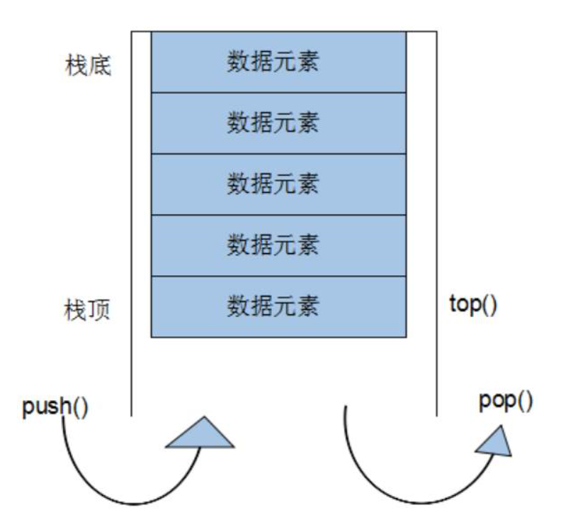
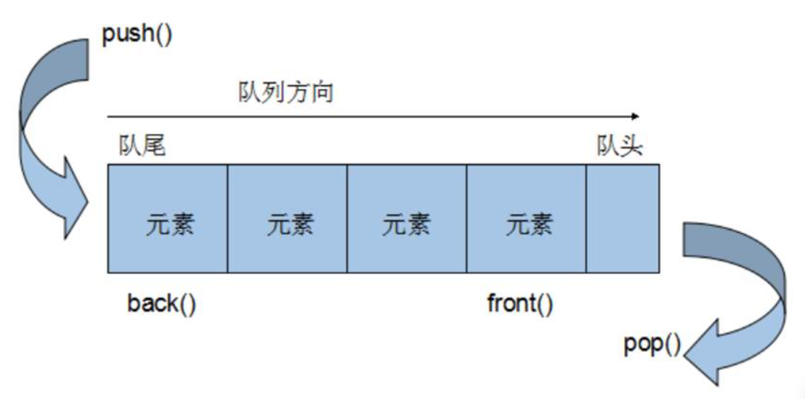

## string容器
### string容器基本概念
C风格字符串(以空字符结尾的字符数组)太过复杂难于掌握,不适合大程序的开发,所以C++标准库定义了一种string类,定义在头文件`<string>`.
String和c风格字符串对比：
- Char*是一个指针,String是一个类
string封装了char*,管理这个字符串,是一个char*型的容器.
- String封装了很多实用的成员方法
查找find,拷贝copy,删除delete 替换replace,插入insert
- 不用考虑内存释放和越界
 string管理char*所分配的内存.每一次string的复制,取值都由string类负责维护,不用担心复制越界和取值越界等.

### string 构造函数
```c++
string();//创建一个空的字符串 例如: string str;      
string(const string& str);//使用一个string对象初始化另一个string对象
string(const char* s);//使用字符串s初始化
string(int n, char c);//使用n个字符c初始化  
```
### stconst stringring基本赋值操作
```c++
string&operator=(const char* s);//char*类型字符串 赋值给当前的字符串
string&operator=(const string&s);//把字符串s赋给当前的字符串
string&operator=(char c);//字符赋值给当前的字符串
string& assign(const char *s);//把字符串s赋给当前的字符串
string& assign(const char *s, int n);//把字符串s的前n个字符赋给当前的字符串
string& assign(const string&s);//把字符串s赋给当前字符串
string& assign(int n, char c);//用n个字符c赋给当前字符串
string& assign(const string&s, int start, int n);//将s从start开始n个字符赋值给字符串,如s=hello,那么n=3,start=1,那么是hel中从e开始赋值3-1个字符
```
### string存取字符操作
使用`[]`没有越界检查,使用at方法越界会抛出错误  
而且返回的是字符引用,当string重新赋值后会重新分配地址,不要使用之前的引用
```c++
char& operator[](int n);//通过[]方式取字符char&
char& at(int n);//通过at方法获取字符
```
### string拼接操作
```c++
string&operator+=(const string& str);//重载+=操作符
string&operator+=(const char* str);//重载+=操作符
string&operator+=(const char c);//重载+=操作符
string& append(const char *s);//把字符串s连接到当前字符串结尾
string& append(const char *s, int n);//把字符串s的前n个字符连接到当前字符串结尾
string& append(const string&s);//同operator+=()
string& append(const string&s, int pos, int n);//把字符串s中从pos开始的n个字符连接到当前字符串结尾
string& append(int n, char c);//在当前字符串结尾添加n个字符c
```
### string查找和替换
查找失败,返回-1 (返回的是std::size_t类型,不存在负数,所以说返回的是18446744073709551615,强转为int后为-1)
```c++
int find(const string& str, int pos = 0) const; //查找str第一次出现位置,从pos开始查找
int find(const char* s, int pos = 0) const;   //查找s第一次出现位置,从pos开始查找
int find(const char* s, int pos, int n) const;   //从pos位置查找s的前n个字符第一次位置
int find(const char c, int pos = 0) const;   //查找字符c第一次出现位置
int rfind(const string& str, int pos = npos) const;//查找str最后一次位置,从pos开始查找
int rfind(const char* s, int pos = npos) const;//查找s最后一次出现位置,从pos开始查找
int rfind(const char* s, int pos, int n) const;//从pos查找s的前n个字符最后一次位置
int rfind(const char c, int pos = 0) const; //查找字符c最后一次出现位置
string& replace(int pos, int n, const string& str); //替换从pos开始n个字符为字符串str
string& replace(int pos, int n, const char* s); //替换从pos开始的n个字符为字符串s
```
### string比较操作
```c++
/*
compare函数在>时返回 1,<时返回 -1,==时返回 0.
比较区分大小写,比较时参考字典顺序,排越前面的越小.
大写的A比小写的a小.
*/
int compare(const string&s) const;//与字符串s比较
int compare(const char *s) const;//与字符串s比较
```
### string子串
```c++
string substr(int pos = 0, int n = npos) const;//返回由pos开始的n个字符组成的字符串
```
### string插入和删除操作

```c++
string& insert(int pos, const char* s); //在pos处插入字符串
string& insert(int pos, const string& str); //插入字符串
string& insert(int pos, int n, char c);//在指定位置插入n个字符c
string& erase(int pos, int n = npos);//删除从Pos开始的n个字符  
```
### string和c-style字符串转换
```c++
//string 转 char*
string str = "itcast";
const char* cstr = str.c_str();
//char* 转 string 
char* s = "itcast";
string sstr(s);
```
提示:
在c++中存在一个从const char*到string的隐式类型转换,却不存在从一个string对象到C_string的自动类型转换.对于string类型的字符串,可以通过c_str()函数返回string对象对应的C_string.        
通常,程序员在整个程序中应坚持使用string类对象,直到必须将内容转化为char*时才将其转换为C_string.


## vector容器
### vector容器基本概念
vector的数据安排以及操作方式,与array非常相似,两者的唯一差别在于空间的运用的灵活性.Array是静态空间,一旦配置了就不能改变,Vector是动态空间,随着元素的加入,它的内部机制会自动扩充空间以容纳新元素.因此vector的运用对于内存的合理利用与运用的灵活性有很大的帮助   
Vector的实现技术,关键在于其对大小的控制以及重新配置时的数据移动效率,一旦vector旧空间满了,如果客户每新增一个元素,vector内部只是扩充一个元素的空间,实为不智,因为所谓的扩充空间(不论多大),一如刚所说,是”配置新空间-数据移动-释放旧空间”的大工程,时间成本很高,应该加入某种未雨绸缪的考虑,  


### vector迭代器
Vector维护一个线性空间,所以不论元素的型别如何,普通指针都可以作为vector的迭代器,因为vector迭代器所需要的操作行为,如`operaroe*`, `operator->`, `operator++`, `operator--`, `operator+`,`operator-`, `operator+=`, o`perator-=`, 普通指针天生具备.Vector支持随机存取,而普通指针正有着这样的能力.所以vector提供的是随机访问迭代器(Random Access Iterators).  
根据上述描述,如果我们写如下的代码：
```c++
Vector<int>::iterator It1;
Vector<Teacher>::iterator It2;
```
It1的其实就是Int*,it2的其实就是Teacher*.
```c++
#define _CRT_SECURE_NO_WARNINGS
#include<iostream>
#include<vector>
using namespace std;

int main(){

    vector<int> v;
    for(int i =0; i <10;i ++){
        v.push_back(i);
        cout  << v.capacity()<< endl;
    }
    
    int* start =&v[0];
    int* end =&v[v.size()-1];

    for(; start <= end; start++){
        cout  <<*start << endl;
    }

    system("pause");
    return EXIT_SUCCESS;
}
```
容量依次增加,分别是1,2,4,8,16...  
但是在其他编译器不一定是这样的
### vector的数据结构
Vector所采用的数据结构非常简单,线性连续空间,它以两个迭代器_Myfirst和_Mylast分别指向配置得来的连续空间中目前已被使用的范围,并以迭代器_Myend指向整块连续内存空间的尾端.   
为了降低空间配置时的速度成本,vector实际配置的大小可能比客户端需求大一些,以备将来可能的扩充,这边是容量的概念.换句话说,一个vector的容量永远大于或等于其大小,一旦容量等于大小,便是满载,下次再有新增元素,整个vector容器就得另觅居所.  

注意：  
   所谓动态增加大小,并不是在原空间之后续接新空间(因为无法保证原空间之后尚有可配置的空间),而是一块更大的内存空间,然后将原数据拷贝新空间,并释放原空间.因此,对vector的任何操作,一旦引起空间的重新配置,指向原vector的所有迭代器就都失效了.这是程序员容易犯的一个错误,务必小心.

### vector构造函数
```c++
// vector<T> v; //采用模板实现类实现,默认构造函数
vector(v.begin(), v.end());//将v[begin(), end())区间中的元素拷贝给本身.
vector(n, elem);//构造函数将n个elem拷贝给本身.
vector(const vector &vec);//拷贝构造函数.
```
### vector常用赋值操作
```c++
assign(beg, end);//将[beg, end)区间中的数据拷贝赋值给本身.
assign(n, elem);//将n个elem拷贝赋值给本身.
vector&operator=(const vector   &vec);//重载等号操作符
swap(vec);// 将vec与本身的元素互换.
```
### vector大小操作
```c++
size();//返回容器中元素的个数
empty();//判断容器是否为空
resize(int num);//重新指定容器的长度为num,若容器变长,则以默认值填充新位置.如果容器变短,则末尾超出容器长度的元素被删除.
resize(int num, elem);//重新指定容器的长度为num,若容器变长,则以elem值填充新位置.如果容器变短,则末尾超出容器长>度的元素被删除.
capacity();//容器的容量
reserve(int len);//容器预留len个元素长度,预留位置不初始化,元素不可访问.
```
### vector数据存取操作
```c++
at(int idx); //返回索引idx所指的数据,如果idx越界,抛出out_of_range异常.
operator[];//返回索引idx所指的数据,越界时,运行直接报错
front();//返回容器中第一个数据元素
back();//返回容器中最后一个数据元素
```

### vector插入和删除操作
```c++
insert(const_iterator pos, int count,ele);//迭代器指向位置pos插入count个元素ele.
push_back(ele); //尾部插入元素ele
pop_back();//删除最后一个元素
erase(const_iterator start,  const_iterator end);//删除迭代器从start到end之间的元素
erase(const_iterator pos);//删除迭代器指向的元素
clear();//删除容器中所有元素
```
### vector收缩内存
```c++
//相对于重新开辟一块匿名空间用原来的数据初始化并交换
vector<int>(v).swap(v);
```
### reserve预留空间
```c++
//预先开辟空间,防止反复开辟空间
v.reserve(100000);
```

## deque容器
### deque容器基本概念
Vector容器是单向开口的连续内存空间,deque则是一种双向开口的连续线性空间.  
所谓的双向开口,意思是可以在头尾两端分别做元素的插入和删除操作,  
当然,vector容器也可以在头尾两端插入元素,但是在其头部操作效率奇差,无法被接受.


Deque容器和vector容器最大的差异,  
一在于deque允许使用常数项时间对头端进行元素的插入和删除操作.  
二在于deque没有容量的概念,   
因为它是动态的以分段连续空间组合而成,随时可以增加一段新的空间并链接起来,换句话说,像vector那样,”旧空间不足而重新配置一块更大空间,然后复制元素,再释放旧空间”这样的事情在deque身上是不会发生的.也因此,deque没有必须要提供所谓的空间保留(reserve)功能.  
虽然deque容器也提供了Random Access Iterator,但是它的迭代器并不是普通的指针,其复杂度和vector不是一个量级,这当然影响各个运算的层面.因此,除非有必要,我们应该尽可能的使用vector,而不是deque.    
对deque进行的排序操作,为了最高效率,可将deque先完整的复制到一个vector中,对vector容器进行排序,再复制回deque.  
### deque容器实现原理
Deque容器是连续的空间,至少逻辑上看来如此,连续现行空间总是令我们联想到array和vector,array无法成长,vector虽可成长,却只能向尾端成长,而且其成长其实是一个假象,事实上是(1) 申请更大空间 (2)原数据复制新空间 (3)释放原空间 三个步骤,如果不是vector每次配置新的空间时都留有余裕,其成长假象所带来的代价是非常昂贵的.     
Deque是由一段一段的定量的连续空间构成.一旦有必要在deque前端或者尾端增加新的空间,便配置一段连续定量的空间,串接在deque的头端或者尾端.Deque最大的工作就是维护这些分段连续的内存空间的整体性的假象,并提供随机存取的接口,避开了重新配置空间,复制,释放的轮回,代价就是复杂的迭代器架构.    
既然deque是分段连续内存空间,那么就必须有中央控制,维持整体连续的假象,数据结构的设计及迭代器的前进后退操作颇为繁琐.Deque代码的实现远比vector或list都多得多.  
Deque采取一块所谓的map(注意,不是STL的map容器)作为主控,这里所谓的map是一小块连续的内存空间,其中每一个元素(此处成为一个结点)都是一个指针,指向另一段连续性内存空间,称作缓冲区.缓冲区才是deque的存储空间的主体.

### deque构造函数
```c++
deque<T> deqT;//默认构造形式
deque(beg, end);//构造函数将[beg, end)区间中的元素拷贝给本身.
deque(n, elem);//构造函数将n个elem拷贝给本身.
deque(const deque &deq);//拷贝构造函数.
```
### deque赋值操作
```c++
assign(beg, end);//将[beg, end)区间中的数据拷贝赋值给本身.
assign(n, elem);//将n个elem拷贝赋值给本身.
deque& operator=(const deque &deq); //重载等号操作符 
swap(deq);// 将deq与本身的元素互换
```
### deque大小操作
```c++
deque.size();//返回容器中元素的个数
deque.empty();//判断容器是否为空
deque.resize(num);//重新指定容器的长度为num,若容器变长,则以默认值填充新位置.如果容器变短,则末尾超出容器长度的元素被删除.
deque.resize(num,  elem); //重新指定容器的长度为num,若容器变长,则以elem值填充新位置,如果容器变短,则末尾超出容器长度的元素被删除.
```
###  deque双端插入和删除操作
```c++
push_back(elem);//在容器尾部添加一个数据
push_front(elem);//在容器头部插入一个数据
pop_back();//删除容器最后一个数据
pop_front();//删除容器第一个数据
```
### deque双端插入和删除操作
```c++
at(idx);//返回索引idx所指的数据,如果idx越界,抛出out_of_range.
operator[];//返回索引idx所指的数据,如果idx越界,不抛出异常,直接出错.
front();//返回第一个数据.
back();//返回最后一个数据
```
### deque插入操作
```c++
insert(pos,elem);//在pos位置插入一个elem元素的拷贝,返回新数据的位置.
insert(pos,n,elem);//在pos位置插入n个elem数据,无返回值.
insert(pos,beg,end);//在pos位置插入[beg,end)区间的数据,无返回值.
```
### deque删除操作
```c++
clear();//移除容器的所有数据
erase(beg,end);//删除[beg,end)区间的数据,返回下一个数据的位置.
erase(pos);//删除pos位置的数据,返回下一个数据的位置.
```
## stack容器
### stack容器基本概念
stack是一种先进后出(First In Last Out,FILO)的数据结构,它只有一个出口,形式如图所示.stack容器允许新增元素,移除元素,取得栈顶元素,但是除了最顶端外,没有任何其他方法可以存取stack的其他元素.换言之,stack不允许有遍历行为.  
有元素推入栈的操作称为:push,将元素推出stack的操作称为pop.




### stack没有迭代器
Stack所有元素的进出都必须符合”先进后出”的条件,只有stack顶端的元素,才有机会被外界取用.Stack不提供遍历功能,也不提供迭代器.
### stack构造函数
```c++
stack<T> stkT;//stack采用模板类实现, stack对象的默认构造形式：  
stack(const stack &stk);//拷贝构造函数
```
### stack赋值操作
```c++
stack&operator=(const stack &stk);//重载等号操作符
```
### stack数据存取操作
```c++
push(elem);//向栈顶添加元素
pop();//从栈顶移除第一个元素
top();//返回栈顶元素
emplace()// 和top类似,但是有些不一样,比如在赋值对象时间,emplace会传值后调用构造函数,而pop会调用构造函数后再调用拷贝构造
```
### stack大小操作
```c++
empty();//判断堆栈是否为空
size();//返回堆栈的大小
```
## queue容器
### queue容器基本概念
Queue是一种先进先出(First In First Out,FIFO)的数据结构,它有两个出口,queue容器允许从一端新增元素,从另一端移除元素.




### queue没有迭代器
Queue所有元素的进出都必须符合”先进先出”的条件,只有queue的顶端元素,才有机会被外界取用.Queue不提供遍历功能,也不提供迭代器.

### queue构造函数
```c++
queue<T> queT;//queue采用模板类实现,queue对象的默认构造形式：
queue(const queue &que);//拷贝构造函数
```
### queue存取、插入和删除操作
```c++
push(elem);//往队尾添加元素
pop();//从队头移除第一个元素
back();//返回最后一个元素
front();//返回第一个元素
```
### queue赋值操作
```c++
queue&operator=(const queue &que);//重载等号操作符
```
### queue大小操作
```c++
empty();//判断队列是否为空
size();//返回队列的大小
```
## list容器
### list容器基本概念
链表是一种物理存储单元上非连续、非顺序的存储结构,数据元素的逻辑顺序是通过链表中的指针链接次序实现的.链表由一系列结点(链表中每一个元素称为结点)组成,结点可以在运行时动态生成.每个结点包括两个部分：一个是存储数据元素的数据域,另一个是存储下一个结点地址的指针域.   
相较于vector的连续线性空间,list就显得负责许多,它的好处是每次插入或者删除一个元素,就是配置或者释放一个元素的空间.因此,list对于空间的运用有绝对的精准,一点也不浪费.而且,对于任何位置的元素插入或元素的移除,list永远是常数时间.  
List和vector是两个最常被使用的容器.  
List容器是一个双向链表.  


- 采用动态存储分配,不会造成内存浪费和溢出
- 链表执行插入和删除操作十分方便,修改指针即可,不需要移动大量元素
- 链表灵活,但是空间和时间额外耗费较大
### list容器的迭代器
List容器不能像vector一样以普通指针作为迭代器,因为其节点不能保证在同一块连续的内存空间上.List迭代器必须有能力指向list的节点,并有能力进行正确的递增、递减、取值、成员存取操作.所谓”list正确的递增,递减、取值、成员取用”是指,递增时指向下一个节点,递减时指向上一个节点,取值时取的是节点的数据值,成员取用时取的是节点的成员.  
由于list是一个双向链表,迭代器必须能够具备前移、后移的能力,所以list容器提供的是Bidirectional Iterators.  
List有一个重要的性质,插入操作和删除操作都不会造成原有list迭代器的失效.这在vector是不成立的,因为vector的插入操作可能造成记忆体重新配置,导致原有的迭代器全部失效,甚至List元素的删除,也只有被删除的那个元素的迭代器失效,其他迭代器不受任何影响.  
### list容器的数据结构
list容器不仅是一个双向链表,而且还是一个循环的双向链表.
```c++
#define _CRT_SECURE_NO_WARNINGS
#include<iostream>
#include<list>
usingnamespace std;

int main(){

    list<int> myList;
    for(int i =0; i <10; i ++){
        myList.push_back(i);
    }

    list<int>::_Nodeptr node =  myList._Myhead->_Next;

    for(int i =0; i < myList._Mysize *2;i++){
        cout  <<"Node:"<< node->_Myval << endl;
        node  = node->_Next;
        if(node == myList._Myhead){
             node  = node->_Next;
        }
    }

    system("pause");
    return EXIT_SUCCESS;
}
```
### list构造函数
```c++
list<T> lstT;//list采用采用模板类实现,对象的默认构造形式：
list(beg,end);//构造函数将[beg, end)区间中的元素拷贝给本身.
list(n,elem);//构造函数将n个elem拷贝给本身.
list(const list &lst);//拷贝构造函数.
```

### list数据元素插入和删除操作

```c++
push_back(elem);//在容器尾部加入一个元素
pop_back();//删除容器中最后一个元素
push_front(elem);//在容器开头插入一个元素
pop_front();//从容器开头移除第一个元素
insert(pos,elem);//在pos位置插elem元素的拷贝,返回新数据的位置.
insert(pos,n,elem);//在pos位置插入n个elem数据,无返回值.
insert(pos,beg,end);//在pos位置插入[beg,end)区间的数据,无返回值.
clear();//移除容器的所有数据
erase(beg,end);//删除[beg,end)区间的数据,返回下一个数据的位置.
erase(pos);//删除pos位置的数据,返回下一个数据的位置.
remove(elem);//删除容器中所有与elem值匹配的元素.
```

### list大小操作

```c++
size();//返回容器中元素的个数
empty();//判断容器是否为空
resize(num);//重新指定容器的长度为num,
若容器变长,则以默认值填充新位置.
如果容器变短,则末尾超出容器长度的元素被删除.
resize(num, elem);//重新指定容器的长度为num,
若容器变长,则以elem值填充新位置.
如果容器变短,则末尾超出容器长度的元素被删除.
```
### list赋值操作
```c++
assign(beg, end);//将[beg, end)区间中的数据拷贝赋值给本身.
assign(n, elem);//将n个elem拷贝赋值给本身.
list&operator=(const list &lst);//重载等号操作符
swap(lst);//将lst与本身的元素互换.
```
### list数据的存取
```c++
front();//返回第一个元素.
back();//返回最后一个元素.
```
### list反转排序
```c++
reverse();//反转链表,比如lst包含1,3,5元素,运行此方法后,lst就包含5,3,1元素.
sort();  //list排序
```
## set/multiset容器
### set容器基本概念
Set的特性是.所有元素都会根据元素的键值自动被排序.Set的元素不像map那样可以同时拥有实值和键值,set的元素即是键值又是实值.Set不允许两个元素有相同的键值.
我们可以通过set的迭代器改变set元素的值吗？不行,因为set元素值就是其键值,关系到set元素的排序规则.如果任意改变set元素值,会严重破坏set组织.换句话说,set的iterator是一种const_iterator.
set拥有和list某些相同的性质,当对容器中的元素进行插入操作或者删除操作的时候,操作之前所有的迭代器,在操作完成之后依然有效,被删除的那个元素的迭代器必然是一个例外.
### multiset容器基本概念
multiset特性及用法和set完全相同,唯一的差别在于它允许键值重复.set和multiset的底层实现是红黑树,红黑树为平衡二叉树的一种.
树的简单知识：
二叉树就是任何节点最多只允许有两个字节点.分别是左子结点和右子节点.


二叉树示意图

二叉搜索树,是指二叉树中的节点按照一定的规则进行排序,使得对二叉树中元素访问更加高效.二叉搜索树的放置规则是：任何节点的元素值一定大于其左子树中的每一个节点的元素值,并且小于其右子树的值.因此从根节点一直向左走,一直到无路可走,即得到最小值,一直向右走,直至无路可走,可得到最大值.那么在儿茶搜索树中找到最大元素和最小元素是非常简单的事情.下图为二叉搜索树：


上面我们介绍了二叉搜索树,那么当一个二叉搜索树的左子树和右子树不平衡的时候,那么搜索依据上图表示,搜索9所花费的时间要比搜索17所花费的时间要多,由于我们的输入或者经过我们插入或者删除操作,二叉树失去平衡,造成搜索效率降低.
所以我们有了一个平衡二叉树的概念,所谓的平衡不是指的完全平衡.


RB-tree(红黑树)为二叉树的一种.

### set构造函数
```c++
set<T> st;//set默认构造函数：
mulitset<T> mst; //multiset默认构造函数: 
set(const set &st);//拷贝构造函数
```
### set赋值操作
```c++
set&operator=(const set &st);//重载等号操作符
swap(st);//交换两个集合容器
```
### set大小操作
```c++
size();//返回容器中元素的数目
empty();//判断容器是否为空
```
### set插入和删除操作
```c++
insert(elem);//在容器中插入元素.
clear();//清除所有元素
erase(pos);//删除pos迭代器所指的元素,返回下一个元素的迭代器.
erase(beg, end);//删除区间[beg,end)的所有元素  ,返回下一个元素的迭代器.
erase(elem);//删除容器中值为elem的元素.
```

### set查找操作
```c++
find(key);//查找键key是否存在,若存在,返回该键的元素的迭代器；若不存在,返回set.end();
count(key);//查找键key的元素个数
lower_bound(keyElem);//返回第一个key>=keyElem元素的迭代器
upper_bound(keyElem);//返回第一个key>keyElem元素的迭代器.
equal_range(keyElem);//返回容器中key与keyElem相等的上下限的两个迭代器.
```
set的返回值和指定set排序规则:
```c++
//插入操作返回值
void test01(){

    set<int> s;
    pair<set<int>::iterator,bool> ret = s.insert(10);
    if(ret.second){
        cout  <<"插入成功:"<<*ret.first << endl;
    }
    else{
        cout  <<"插入失败:"<<*ret.first << endl;
    }
    s.insert(20);
    ret  = s.insert(10);
    if(ret.second){
        cout  <<"插入成功:"<<*ret.first << endl;
    }
    else{
        cout  <<"插入失败:"<<*ret.first << endl;
    }

}

struct MyCompare02{
    booloperator()(int v1,int v2){
        return v1 > v2;
    }
};

//set从大到小
void test02(){

    srand((unsignedint)time(NULL));
    //我们发现set容器的第二个模板参数可以设置排序规则,默认规则是less<_Kty>
    set<int, MyCompare02> s;
    for(int i =0; i <10;i++){
        s.insert(rand()%100);
    }
    
    for(set<int, MyCompare02>::iterator it = s.begin(); it != s.end(); it ++){
        cout  <<*it <<" ";
    }
    cout  << endl;
}

//set容器中存放对象
class Person{
public:
    Person(string name,int age){
        this->mName = name;
        this->mAge = age;
    }
public:
    string  mName;
    int mAge;
};


struct MyCompare03{
    booloperator()(const Person& p1,const Person& p2){
        return p1.mAge > p2.mAge;
    }
};

void test03(){

    set<Person, MyCompare03> s;

    Person  p1("aaa",20);
    Person  p2("bbb",30);
    Person  p3("ccc",40);
    Person  p4("ddd",50);

    s.insert(p1);
    s.insert(p2);
    s.insert(p3);
    s.insert(p4);

    for(set<Person, MyCompare03>::iterator it = s.begin(); it != s.end(); it++){
        cout  <<"Name:"<< it->mName <<" Age:"<< it->mAge << endl;
    }

}
```
### 对组(pair)
对组(pair)将一对值组合成一个值,这一对值可以具有不同的数据类型,两个值可以分别用pair的两个公有属性first和second访问.   
类模板：`template <class T1, class T2> struct pair`.  
如何创建对组? 
```c++
//第一种方法创建一个对组
pair<string, int> pair1(string("name"), 20);
cout << pair1.first <<  endl; //访问pair第一个值
cout << pair1.second <<  endl;//访问pair第二个值
//第二种
pair<string, int> pair2 = make_pair("name", 30);
cout << pair2.first <<  endl;
cout << pair2.second <<  endl;
//pair=赋值
pair<string, int> pair3 = pair2;
cout << pair3.first <<  endl;
cout <<  pair3.second << endl;
```
## map/multimap容器
### map/multimap基本概念
Map的特性是,所有元素都会根据元素的键值自动排序.Map所有的元素都是pair,同时拥有实值和键值,pair的第一元素被视为键值,第二元素被视为实值,map不允许两个元素有相同的键值.  
我们可以通过map的迭代器改变map的键值吗？答案是不行,因为map的键值关系到map元素的排列规则,任意改变map键值将会严重破坏map组织.如果想要修改元素的实值,那么是可以的.  
Map和list拥有相同的某些性质,当对它的容器元素进行新增操作或者删除操作时,操作之前的所有迭代器,在操作完成之后依然有效,当然被删除的那个元素的迭代器必然是个例外.  
Multimap和map的操作类似,唯一区别multimap键值可重复.  
Map和multimap都是以红黑树为底层实现机制.  

### map构造函数
```c++
map<T1, T2> mapTT;//map默认构造函数: 
map(const map &mp);//拷贝构造函数
```
### map赋值操作
```c++
map&operator=(const map &mp);//重载等号操作符
swap(mp);//交换两个集合容器
```
### map大小操作
```c++
size();//返回容器中元素的数目
empty();//判断容器是否为空
```
### map插入数据元素操作
```c++
map.insert(...); //往容器插入元素,返回元组pair<iterator,bool>
map<int, string> mapStu;
// 第一种 通过pair的方式插入对象
mapStu.insert(pair<int, string>(3, "小张"));
// 第二种 通过pair的方式插入对象
mapStu.inset(make_pair(-1, "校长"));
// 第三种 通过value_type的方式插入对象
mapStu.insert(map<int, string>::value_type(1, "小李"));
// 第四种 通过数组的方式插入值
mapStu[3] = "小刘";
mapStu[5]  = "小王";
```
### map删除操作
```c++
clear();//删除所有元素
erase(pos);//删除pos迭代器所指的元素,返回下一个元素的迭代器.
erase(beg,end);//删除区间[beg,end)的所有元素 ,返回下一个元素的迭代器.
erase(keyElem);//删除容器中key为keyElem的对组.
```
### map查找操作
```c++
find(key);//查找键key是否存在,若存在,返回该键的元素的迭代器；/若不存在,返回map.end();
count(keyElem);//返回容器中key为keyElem的对组个数.对map来说,要么是0,要么是1.对multimap来说,值可能大于1.
lower_bound(keyElem);//返回第一个key>=keyElem元素的迭代器.
upper_bound(keyElem);//返回第一个key>keyElem元素的迭代器.           
equal_range(keyElem);//返回容器中key与keyElem相等的上下限的两个迭代器.
```
### multimap案例
```c++
//公司今天招聘了5个员工,5名员工进入公司之后,需要指派员工在那个部门工作
//人员信息有: 姓名 年龄 电话 工资等组成
//通过Multimap进行信息的插入 保存 显示
//分部门显示员工信息 显示全部员工信息

#define _CRT_SECURE_NO_WARNINGS

#include<iostream>
#include<map>
#include<string>
#include<vector>
using namespace std;

//multimap 案例
//公司今天招聘了 5 个员工,5  名员工进入公司之后,需要指派员工在那个部门工作
//人员信息有: 姓名 年龄 电话 工资等组成
//通过 Multimap 进行信息的插入 保存 显示
//分部门显示员工信息 显示全部员工信息


#define SALE_DEPATMENT 1 //销售部门
#define DEVELOP_DEPATMENT 2 //研发部门
#define FINACIAL_DEPATMENT 3 //财务部门
#define ALL_DEPATMENT 4 //所有部门

//员工类
class person{
public:
    string  name;//员工姓名
    int age;//员工年龄
    double salary;//员工工资
    string  tele;//员工电话
};

//创建5个员工
void CreatePerson(vector<person>& vlist){

    string  seed ="ABCDE";
    for(int i =0; i <5; i++){
        person  p;
        p.name ="员工";
        p.name += seed[i];
        p.age = rand()%30+20;
        p.salary = rand()%20000+10000;
        p.tele ="010-8888888";
        vlist.push_back(p);
    }

}

//5名员工分配到不同的部门
void PersonByGroup(vector<person>& vlist, multimap<int, person>& plist){


    int operate =-1;//用户的操作

    for(vector<person>::iterator it = vlist.begin(); it != vlist.end(); it++){

        cout  <<"当前员工信息:"<< endl;
        cout  <<"姓名："<< it->name <<" 年龄:"<< it->age <<" 工资:"<< it->salary <<" 电话："<< it->tele << endl;
        cout  <<"请对该员工进行部门分配(1 销售部门, 2 研发部门, 3 财务部门):"<< endl;
        scanf("%d",&operate);

        while(true){

             if(operate == SALE_DEPATMENT){//将该员工加入到销售部门
                 plist.insert(make_pair(SALE_DEPATMENT,*it));
                 break;
             }
             elseif(operate == DEVELOP_DEPATMENT){
                 plist.insert(make_pair(DEVELOP_DEPATMENT,*it));
                 break;
             }
             elseif(operate == FINACIAL_DEPATMENT){
                 plist.insert(make_pair(FINACIAL_DEPATMENT,*it));
                 break;
             }
             else{
                 cout  <<"您的输入有误,请重新输入(1 销售部门, 2 研发部门, 3 财务部门):"<< endl;
                 scanf("%d",&operate);
             }

        }

    }
    cout  <<"员工部门分配完毕!"<< endl;
    cout  <<"***********************************************************"<< endl;

}

//打印员工信息
void printList(multimap<int, person>& plist,int myoperate){

    if(myoperate == ALL_DEPATMENT){
        for(multimap<int, person>::iterator it = plist.begin(); it != plist.end(); it++){
             cout  <<"姓名："<< it->second.name <<" 年龄:"<< it->second.age <<" 工资:"<< it->second.salary <<" 电话："<< it->second.tele << endl;
        }
        return;
    }

    multimap<int, person>::iterator it = plist.find(myoperate);
    int depatCount = plist.count(myoperate);
    int num =0;
    if(it != plist.end()){
        while(it != plist.end()&& num < depatCount){
             cout  <<"姓名："<< it->second.name <<" 年龄:"<< it->second.age <<" 工资:"<< it->second.salary <<" 电话："<< it->second.tele << endl;
             it++;
             num++;
        }
    }
}

//根据用户操作显示不同部门的人员列表
void ShowPersonList(multimap<int, person>& plist,int myoperate){

    switch(myoperate)
    {
    case SALE_DEPATMENT:
        printList(plist, SALE_DEPATMENT);
        break;
    case DEVELOP_DEPATMENT:
        printList(plist, DEVELOP_DEPATMENT);
        break;
    case FINACIAL_DEPATMENT:
        printList(plist, FINACIAL_DEPATMENT);
        break;
    case ALL_DEPATMENT:
        printList(plist, ALL_DEPATMENT);
        break;
    }
}

//用户操作菜单
void PersonMenue(multimap<int, person>& plist){

    int flag =-1;
    int isexit =0;
    while(true){
        cout  <<"请输入您的操作((1 销售部门,  2 研发部门, 3 财务部门, 4 所有部门, 0退出)："<< endl;
        scanf("%d",&flag);

        switch(flag)
        {
        case SALE_DEPATMENT:
             ShowPersonList(plist, SALE_DEPATMENT);
             break;
        case DEVELOP_DEPATMENT:
             ShowPersonList(plist, DEVELOP_DEPATMENT);
             break;
        case FINACIAL_DEPATMENT:
             ShowPersonList(plist, FINACIAL_DEPATMENT);
             break;
        case ALL_DEPATMENT:
             ShowPersonList(plist, ALL_DEPATMENT);
             break;
        case0:
             isexit  =1;
             break;
        default:
             cout  <<"您的输入有误,请重新输入!"<< endl;
             break;
        }

        if(isexit ==1){
             break;
        }
    }

}

int main(){

    vector<person>  vlist;//创建的5个员工 未分组
    multimap<int, person> plist;//保存分组后员工信息

    //创建5个员工
    CreatePerson(vlist);
    //5名员工分配到不同的部门
    PersonByGroup(vlist, plist);
    //根据用户输入显示不同部门员工信息列表 或者 显示全部员工的信息列表
    PersonMenue(plist);

    system("pause");
    return EXIT_SUCCESS;
}
```
## STL容器元素深/浅拷贝问题
STL容器所提供的都是值(value)寓意,而非引用(reference)寓意,也就是说当我们给容器中插入元素的时候,容器内部实施了拷贝动作,将我们要插入的元素再另行拷贝一份放入到容器中,而不是将原数据元素直接放进容器中,也就是说我们提供的元素必须能够被拷贝.
```c++
#define _CRT_SECURE_NO_WARNINGS
#include<iostream>
#include<vector>
usingnamespace std;

class myclass{
public:
    myclass(char* data){
        int len = strlen(data)+1;//计算传进来的字符串长度
        this->data =newchar[len];//在堆区分配了len字节内存
        strcpy(this->data, data);//将数据拷贝到我们在堆分配的内存中
    }
    //增加拷贝构造函数
    myclass(const myclass& mc){
        int len = strlen(mc.data)+1;
        this->data =newchar[len];
        strcpy(this->data, mc.data);
    }
    //重载operator=操作符
    myclass&operator=(const myclass& mc){

       if (this->data != NULL){
                  delete[] this->data;
                  this->data = NULL;
            }

        int len = strlen(mc.data)+1;
        this->data =newchar[len];
        strcpy(this->data, mc.data);
        return*this;
    }
    //既然我们在堆区分配了内存,需要在析构函数中释放内存
    ~myclass(){
        if(NULL!=this->data){
             delete[]this->data;
             this->data =NULL;
        }
    }
private:
    char* data;
};

void test_deep_copy(){
    char* data ="abcd";
    myclass  mc(data);//创建myclass的实例 并用char*字符串data初始化对象

    vector<myclass> v;//创建vector容器
    v.push_back(mc);//将mc实例插入到vector容器尾部

}

int main(){

    test_deep_copy();//调用测试函数

    system("pause");
    return0;
}
```
## STL容器使用时机
| -            | vector   | deque    | list     | set    | multiset | map             | multimap      |
| ------------ | -------- | -------- | -------- | ------ | -------- | --------------- | ------------- |
| 典型内存结构 | 单端数组 | 双端数组 | 双向链表 | 二叉树 | 二叉树   | 二叉树          | 二叉树        |
| 可随机存取   | 是       | 是       | 否       | 否     | 否       | 对key而言：不是 | 否            |
| 元素搜寻速度 | 慢       | 慢       | 非常慢   | 快     | 快       | 对key而言：快   | 对key而言：快 |
| 元素安插移除 | 尾端     | 头尾两端 | 任何位置 | -      | -        | -               | -             |

- vector的使用场景：比如软件历史操作记录的存储,我们经常要查看历史记录,比如上一次的记录,上上次的记录,但却不会去删除记录,因为记录是事实的描述.
- deque的使用场景：比如排队购票系统,对排队者的存储可以采用deque,支持头端的快速移除,尾端的快速添加.如果采用vector,则头端移除时,会移动大量的数据,速度慢.   
- list的使用场景：比如公交车乘客的存储,随时可能有乘客下车,支持频繁的不确实位置元素的移除插入.
- set的使用场景：比如对手机游戏的个人得分记录的存储,存储要求从高分到低分的顺序排列. 
- map的使用场景：比如按ID号存储十万个用户,想要快速要通过ID查找对应的用户.二叉树的查找效率,这时就体现出来了.如果是vector容器,最坏的情况下可能要遍历完整个容器才能找到该用户.
- 
vector与deque的比较：
  1. vector.at()比deque.at()效率高,比如vector.at(0)是固定的,deque的开始位置      却是不固定的.
  2. 如果有大量释放操作的话,vector花的时间更少,这跟二者的内部实现有关.
  3. deque支持头部的快速插入与快速移除,这是deque的优点. 

## stl函数大特殊概括
## 基本上都共有的函数
- clear
- empty
- size
- swap
- pop
- push
- inster
- assign
## emplace函数与pop函数
一共有三个函数
- emplace_back(type) 对应 push_back(type)  
- emplace(i, type) 对应于 insert(type, i)  
- emplace_front(type) 对应于 push_front()  

但是！对于stack 和 queue，只有push操作，所以也只有emplace操作，此时它们是相对应的。

1. 直接传入对象（int, double 或者 构造好了的对象）
```c++
//假设栈内的数据类型是data
class data {
  int a;
  int b;
public:
  data(int x, int y):a(x), b(y) {}
};
//push
data d(1,2);
S.push(d) 或 S.emplace(d);
```
2. 在传入时候构造对象  
```c++
S.push(data(1,2));
S.emplce(data(1,2));
```
3. emplace可以直接接收该类型的构造函数的参数，然后自己调用其构造函数！
```c++
S.emplace(1,2)
// 意思是，emplace这样接受新对象的时候，自己会调用其构造函数生成对象然后放在容器内（比如这里传入了1，2，它则会自动调用一次data(1,2)
```

而push，只能让其构造函数构造好了对象之后，再使用复制构造函数！

相当于emplace直接把原料拿进家，造了一个。而push是造好了之后，再复制到自己家里，多了复制这一步。

所以emplace相对于push，使用第三种方法会更节省内存。

重点:  
emplace可以直接传入构造对象需要的元素，然后自己调用其构造函数  
而push，只能让其构造函数构造好了对象之后，再使用复制构造函数！

但是emplace是c++11新增函数,如果想要兼容过去的,就还是用push比较好