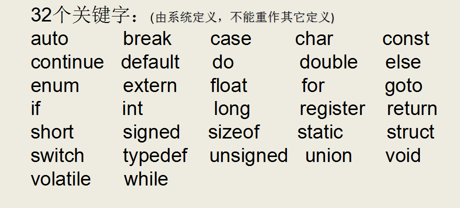
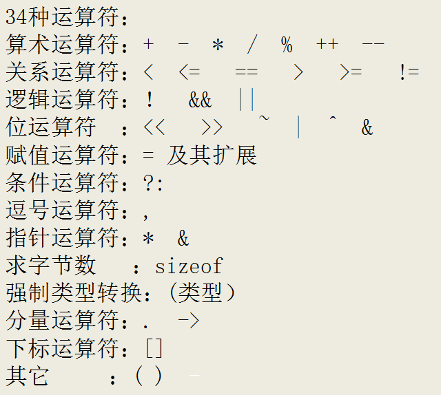

<!-- 2023年07月11日 -->
# C
## C语言的背景知识
### 诞生
1972年，贝尔实验室的丹尼斯·里奇（Dennis Ritch）和肯·汤普逊（Ken Thompson）在开发UNIX操作系统时设计了C语言。然而，C语言不完全是里奇突发奇想而来，他是在B语言（汤普逊发明）的基础上进行设计。至B语言的起源，那是另一个故事。C 语言设计的初衷是将其作为程序员使用的 一种编程工具，因此，其主要目标是成为有用的语言。

### C语言的优缺点
优点：

1. C语 言的设计理念让用户能轻松地完成自顶向下的规划、结构化编程和模块化设计。因此，用C语言编写的程序更易懂、更可靠。
2. C是高效的语言。C 程序相对更紧凑，而且运行速度很快。C 语言具有通常是汇编语言才具有的微调控制能力。
3. 	C是可移植的语言。在一种系统中编写的 C程序稍作修改或 不修改就能在其他系统运行。如需修改，也只需简单更改主程序头文件中的少许项即可。大部分语言都希望成为可移植语言，从8位微处理器到克雷超级计算机，许多计算机体系结构 29 都可以使用C编译器。
4. C语言功能强大且灵活，UNIX操作系统，大部分是用C语言写的；其他语言（如， FORTRAN、Perl、Python、Pascal、LISP、Logo、BASIC）的许多编译器和 解释器都是用C语言编写的。注：开发操作系统、编译器、解释器。
    * 编译性语言和解释性语言：
        编译型语言：程序在执行之前需要一个专门的编译过程，把程序编译成 为机器语言的文件，运行时不需要重新翻译，直接使用编译的结果就行了。程序执行效率高，依赖编译器，跨平台性差些。如C、C++、Delphi等。而相对的，解释性语言编写的程序不进行预先编译，以文本方式存储程序代码。在发布程序时，看起来省了道编译工序。但是在运行程序的时候，解释性语言必须先解释再运行。
5.	库函数丰富。大多数C实现都有一个大型的库，包含众多有用的C函数。这些 函数用于处理程序员经常需要解决的问题。（C实现：编译器。gcc、g++、 MSVC++、clang）
    * 集成开发环境（IDE，Integrated Development Environment ）,集成了很多组件，，一般包括代码编辑器、编译器、调试器和图形用户界面等工具。
6. 机械硬盘原理（视频）：[3D动画图解：机械硬盘的结构原理_哔哩哔哩](https://www.bilibili.com/video/BV1H24y1S7bJ/?vd_source=e180e9cb2987a028f39c27ea5d3a843a)  
固态硬盘原理（视频）：[固态硬盘_百度百科](https://baike.baidu.com/item/%E5%9B%BA%E6%80%81%E7%A1%AC%E7%9B%98/453510?fr=aladdin)  
固态硬盘详解（图文）：[固态硬盘原理大揭秘 - 知乎](https://zhuanlan.zhihu.com/p/106150566)

缺点：欲戴王冠，必承其重。
1. C语言也有一些缺点。例如，前面提到的，要享受用C语言自由编程的乐趣，就必须承担更多的责任。特别是，C语言使用指针，而涉及指针的编程错误往往难以察觉。
2. 
### C语言的用途
 
C语言主要开发领域：C操作系统、嵌入式开发、服务器开发、军工。


简而言之，C 语言是最重要的编程语言之一，将来也是如此。如果你想拿下一份编程的工作，被问到是否会C语言时，最好回答“是”。

C++几乎是C的超集，这意味着任何C程序差不多就是一个C++程序。学习C 语言，也相当于学习了许多C++的知识。

### 计算机的工作原理

现代的计算机由多种部件构成。中央处理单元（CPU）承担绝大部分的 运算工作。随机存取内存（RAM）是存储程序和文件的工作区；而永久内存存储设备（ROM）（过去一般指机械硬盘，现在还包括固态硬盘）即使在关闭计算机后，也不会丢失之前储存的程序和文件。另外，还有各种外围设备（如， 键盘、鼠标、触摸屏、监视器）提供人与计算机之间的交互。CPU负责处理 程序，


下面介绍两个有趣的知识。其一，储存在计算机中的所有内容都是数字。计算机以数字形式储存数字和字符（如，在文本文档中使用的字母）。 每个字符都有一个数字码（ASCII码）。计算机载入寄存器的指令也以数字形式储存，指 令集中的每条指令都有一个数字码。其二，计算机程序最终必须以数字指令 码（即，机器语言来表示。  
[100秒解释CPU工作原理_哔哩哔哩](https://www.bilibili.com/video/BV1734y1C7Cc/?vd_source=e180e9cb2987a028f39c27ea5d3a843a)


### C语言标准
#### K&R C(1978年)

1978年，布莱恩·柯林汉（Brian Kernighan）和丹尼斯·里奇（Dennis Ritchie）合著的The C Programming Language（《C语言程序设计》）第1版是公认的C标准，通常称之为K&R C 或经典C。它定 义了C语言，但却没有定义C库。与大多数语言不同的是，C语言比其他语言 更依赖库，因此需要一个标准库。实际上，由于缺乏官方标准，UNIX实现 提供的库已成为了标准库。#include < unistd.h >

#### ANSI/ISO C (1989/1990年)

于1989年正式公布。该标准（ANSI C）定义了C语言和C标准库。国际标准 化组织于1990年采用了这套C标准（ISO C）。ISO C和ANSI C是完全相同的 标准。ANSI/ISO标准的最终版本通常叫作C89（因为ANSI于1989年批准该标 准）或C90（因为ISO于1990年批准该标准）。另外，由于ANSI先公布C标准，因此业界人士通常使用ANSI C。 
ANSI在该委员会制定的指导原则中，最有趣的可能是：保持 C的精神。委员 会在表述这一精神时列出了以下几点： 信任程序员； 不要妨碍程序员做需要做的事； 保持语言精练简单； 只提供一种方法执行一项操作； 让程序运行更快，即使不能保证其可移植性。 在最后一点上，标准委员会的用意是：作为实现，应该针对目标计算机 来定义最合适的某特定操作，而不是强加一个抽象、统一的定义。在学习C 语言过程中，许多方面都反映了这一哲学思想。

#### C99标准
1994年，ANSI/ISO联合委员会（C9X委员会）开始修订C标准，最终发 布了C99标准。该委员会遵循了最初C90标准的原则，包括保持语言的精练 简单。委员会的用意不是在C语言中添加新特性，而是为了达到新的目标。 第1个目标是，支持国际化编程。例如，提供多种方法处理国际字符集。第2 个目标是，“调整现有实践致力于解决明显的缺陷”。因此，在遇到需要将C 移至64位处理器时，委员会根据现实生活中处理问题的经验来添加标准。第 3个目标是，为适应科学和工程项目中的关键数值计算，提高C的适应性， 让C比FORTRAN更有竞争力。

C99的修订保留了C语言的精髓，C仍是一门简洁高效的语言。

#### C11标准
标准委员会在2007年承诺C标准的下一个版本是C1X，2011年终于发布了C11标准。此次，委员会提出了一些新的指导原 则。出于对当前编程安全的担忧，不那么强调“信任程序员”目标了。而且， 供应商并未像对C90那样很好地接受和支持C99。这使得C99的一些特性成为 C11的可选项。


### C语言编程机制  
C编程的基本策略是，用程序把源代码文件转换为可执行文件（其中包 含可直接运行的机器语言代码）。典型的C实现通过编译和链接两个步骤来 完成这一过程。编译器把源代码转换成中间代码，链接器把中间代码和其他 代码合并，生成可执行文件。C 使用这种分而治之的方法方便对程序进行模 块化，可以独立编译单独的模块，稍后再用链接器合并已编译的模块。通过 这种方式，如果只更改某个模块，不必因此重新编译其他模块。另外，链接器还将你编写的程序和预编译的库代码合并。 中间文件有多种形式。我们在这里描述的是最普遍的一种形式，即把源 代码转换为机器语言代码，并把结果放在目标代码文件（或简称目标文件） 中（这里假设源代码只有一个文件）。虽然目标文件中包含机器语言代码， 但是并不能直接运行该文件。因为目标文件中储存的是编译器翻译的源代码，这还不是一个完整的程序。 目标代码文件缺失启动代码（startup code）。启动代码充当着程序和操 作系统之间的接口。例如，可以在MS Windows或Linux系统下运行IBM PC兼 容机。这两种情况所使用的硬件相同，所以目标代码相同，但是Windows和 Linux所需的启动代码不同，因为这些系统处理程序的方式不同。 目标代码还缺少库函数。几乎所有的C程序都要使用C标准库中的函数。例如，concrete.c中就使用了 printf()函数。目标代码文件并不包含该函 48 数的代码，它只包含了使用 printf()函数的指令。printf()函数真正的代码储存 在另一个被称为库的文件中。库文件中有许多函数的目标代码。 链接器的作用是，把你编写的目标代码、系统的标准启动代码和库代码 这 3 部分合并成一个文件，即可执行文件。对于库代码，链接器只会把程序 中要用到的库函数代码提取出来。  
如何处理目标代码？C 编译器会创建一个与源代码基本名相同的目标代 码文件，但是其扩展名是.o。在该例中，目标代码文件是 inform.o。然而， 却找不到这个文件，因为一旦链接器生成了完整的可执行程序，就会将其删 除。如果原始程序有多个源代码文件，则保留目标代码文件。学到后面多文  件程序时，你会明白到这样做的好处。


如果要储存可执行文件（a.out），应该把它重命名。否则，该文件会被 下一次编译程序时生成的新a.out文件替换。


## C语言概述
1. 先看一个基本的程序
    ```c
    #include <stdio.h>	//预处理器指令
    //函数是封装起来的一个代码块，用于实现特定的功能
    int main(void)		//int:main这个函数的返回值类型是int。
    // main：函数名 
    //（void）：参数列表，void表示函数不接受参数
    
    { 
    	int num; /* 定义一个名为num的变量 	1、在内存空间开辟了一个int型空间
    2、给这块空间起了一个别名：num。
    */
     
    	num = 1; /* 为num赋一个值 */
    	printf("I am a simple "); /* 使用printf()函数 */
    	printf("computer.\n");		//\n、\r、\b、\a 、\t是转义字符
    	printf("My favorite number is %d because it is first.\n", num);//%：是占位符，表示这里会输出一个变量。d表示%所占的变量的类型是有符号整数。
    	return 1;				//表示当前函数返回。函数执行完毕，如果函数的返回值不是void，那么return后面应该跟一个值，表示把这个值返回。这个值得类型必须和函数头的返回类型一致。
    }
    ```    

    
 
2. 一些概念：  
    * 标识符：  
        标识一个变量、函数或其他实体的名称。
        标识符命名规范：用小写字母、大写字母、数字和下划线（_）来命名名称 的第1个字符必须是字母或下划线，不能是数字。操作系统和C库经常使用以一个或两个下划线字符开始的标识符（如， _kcab），因此最好避免在自己的程序中使用这种名称。标准标签都以一个 或两个下划线字符开始，如库标识符。这样的标识符都是保留的。这意味 着，虽然使用它们没有语法错误，但是会导致名称冲突。C语言的名称区分大小写，即把一个字母的大写和小写视为两个不同的 字符。  
    * 关键字(key word)  
        关键字是语言定义的单词，不能做其他用途。  
    * 声明  
        声明把特定标识符与计算机内存中的特定位置联系起来，同时也确定了储存在某位置的信息类型或数据类型。所有变量都必须先声明才能使用。以前的C语言，还要求把变量声明在块的顶部，其他语句不能在任何声明的前面。C99和C11遵循C++的惯例，可以把声明放在块中的任何位置。
    * 数据类型  
        一个数据只有有了类型计算机才能正确地储存、读取和解释数据。
    * 赋值(=)  
        在执行int num;声明时，编译器在计算机内存中为变量num预留了空间，然后在执行这行赋值表达式语 句时，把值储存在之前预留的位置。可以给num赋不同的值，这就是num之 所以被称为变量（variable）的原因。注意，该赋值表达式语句从右侧把值 赋到左侧。
    * 函数调用  
        printf()圆括号表明printf是一 个函数名。圆括号中的内容是从主调函数传递给printf()函数的信息。该信息被称为参数，或 者更确切地说，是函数的实际参数（actual argument）。
	* 函数调用的流程  
        C语言中如何调用函数。只需输入函数名，把所需的参数填入圆括号即可。当程序运行到这一行时，控制权被转给已命名的函 数（该例中是printf()）。函数执行结束后，控制权被返回至主调函数。
    * 转义序列  
        转义序列用于代表难以表 示或无法输入的字符。如，\t代表Tab键，\b代表Backspace键（退格键）。每 个转义序列都以反斜杠字符（\）开始。
    * 占位符   
        %提醒 程序，要在该处打印一个变量，d表明把变量作为十进制整数打印。
    * return语句  
        main()函数应返回一个整数。C标准要求main()这样做。。有返回值的C函数要 有return语句。该语句以return关键字开始，后面是待返回的值，并以分号结 尾。如果遗漏 main()函数中的 return 语句，程序在运行至最外面的右花括号 （}）时会返回0。强烈建议读者养成在 main()函数中 保留 return 语句的好习惯。在这种情况下，可将其看作是统一代码风格。但对于某些操作系统（包括Linux和UNIX），return语句有实际的用途。
    * 一个简单的C程序的格式如下：
        ```c
        #include<stdio.h>
        int main(void)
        {
            语句;
            retrun 0;
        }
        ```
3. 提高程序的可读性：比写代码更痛苦的是读别人的代码。

多种提高程序可读性的技巧：  
    1. 选择有意义的函数名  
    2. 写注释  
    3. 在函数中用空行分隔概念上的多个部分。  
    4. 每条语句各占一行。  

4. 程序中的错误：  
    * 语法错误  
        如果不遵循 C 语言的规则就会犯语法 错误。这类似于英文中的语法错误。编译的时候编译器会直接报错。
    * 语义错误  
        在C语言中，如果遵循了C规则，但是结果不正确，那就是犯了语义错误。又称为逻辑错误或者bug。bug指的是程序能够正常编译、运行，但是运行结果不对。


5. C语言中的关键字和保留字
   * 关键字（key word）  
       关键字是C语言的词汇。它们对C而言比较特殊，不能用它们作为标识 符（如，变量名）。，许多关键字用于指定不同的类型，。许多关键字用于指定不同的类型，如 int。还有一些关 键字（如，if）用于控制程序中语句的执行顺序。在表 2.2 中所列的C语言关 键字中，粗体表示的是C90标准新增的关键字，斜体表示的C99标准新增的 关键字，粗斜体表示的是C11标准新增的关键字。
       

   * 保留字（reserved identifier）  
       保留标识符（reserved identifier），C语言已经指定了它们的用途或保留它们的使用权，如果你使用这些标识符来表示其他意思会导致一些问题。因此，尽管它们也是有效的名称，不会引起语法错误，也不能 随便使用。保留标识符包括那些以下划线字符开头的标识符和标准库函数 名，如printf()。

C语言概览：








C语言从源代码到可执行程序一共要经历四步：
1.	预处理：gcc -E hello.c -o hello.i   
    * 进行了头文件替换（执行了预处理指令）
    * 删除注释
    * 不会检查语法
2.	编译：gcc -S hello.i -o hello.s 
    * 会进行语法检查
    * 把C语言代码翻译为对应平台的汇编语言。
3.	汇编：gcc -c hello.s -o hello.o
    * 把汇编语言翻译为二进制指令
4.	链接：gcc hello.o -o hello
    * 把用到的标准库中函数实现、系统的启动代码一起连接到最后生成的可执行文件中。
 
* 命令行的实现  
    * gcc 文件名.c -o 输出别名  
    ./文件名