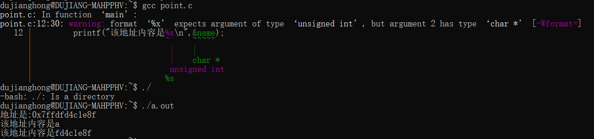

# 指针
## 地址和指针
### 地址
    变量在内存中的编号,是一个8字节的十六进制无符号整数,unsigned long long类型
在内存中每一个存储单元为8个bit位，也就是一个字节byte，简写为B。  
这样多个存储单元线性的排列在一起，就构成了一定大小的存储空间。  
1024个字节为1KB，1024KB为1MB，  
而1024MB为1GB，1024GB为1TB等等。  
其实内存的本质就是由这样很多个字节所组成的存储单元。

在32位架构下计算机只有32根内存地址总线，所以CPU只能使用2<sup>32</sup>,也就是4GB的内存地址  
而在64位架构下计算机有64根内存地址总线所以能最后最多使用2<sup>64</sup>的内存地址。 

在32位系统下内存地址变量占4个字节，而64位系统下内存地址占8个字节
对应`sizeof()`指针大小,在32位系统中是4字节大小指针,在64位系统中是8字节大小指针,

利用`&`符号可以取出对应变量的地址

### 指针
    一种特殊存变量,存储地址的变量  
我们访问内存地址时，需要根据其内存地址来访问其所在的内存内容。C语言中提供了这样的方法可以通过内存地址来访问内存的内容。与其它基本变量类型一样，  
我们 可以定义一种指针类型的变量，这个所谓的指针就是一个普通变量，这个变量中存放的是一个内存地址，在定义指针变量时需要为其指针类型,用`*`表示,如:
```c
char *p=NULL;
```
通过&符可以将ch变量的所在的内存地址取出来再通过=赋值赋值给p_ch变量，同样p_sh中存放存入的是sh的地址，p_i中存放的是i的地址。得到这些内存地址之后就可以根据自己的需要对这个内存地址所在的变量做相应的操作，对地址取其变量的操作过程就是对变量取地址的逆操作，
```c
char name='a';
char* p=&name;
/*
取出name变量的地址赋给p指针,此时p变量存储的数是name的地址值
假如一个变量是指针类型,就可以通过*取出该地址的内容,使用%p占位符
*/
printf("地址是:%p\n",p);
printf("该地址内容是%c\n",*p);
```

指针一般用于间接修改变量的值


### 使用指针应当注意的点

1. 也可以使用`%x`占位符,但是会有警告,且在32位系统中可能会出现部分丢失
    
    所以说理论上可以用`%llu`打印,只不过是十进制的数字,不方便看   
1. 关于指针类型,因为不同类型占用大小不用,变量应当用对应变量的类型的指针来存储
    比如:`char`占1字节,`int`占4字节,那么`char*p=&num;`,当使用`*p`时,编译器不知道取1个字节还是取4字节
2. 说下 `%p` 和 `%x` 的区别，  
    在32位机中，两者只差一个前面的0x，`%p` 有，`%x` 没有；  
    在64位机中，`%p` 可以打印64位（理论上是64位，实际上目前是48位），`%x` 只能打印32位；  
    在打印指针变量的值（所指变量的地址）时，`%p` 能正确打印，`%x` 则只能打印后32位。 
4. 指针大小和指针的类型无关,只与系统位数和编译器有关

## 常量 - const

```c
//宏定义,只能写在头部
#define PI3.1415926;
//const 修饰,常量,定义后不能修改
const double PI=3.1415926;
```

### 当常量const和指针*相遇
```c
const int i0=1;
int *p=&i0;
/*
在c语言中,指针指向了const定义的内容,可以通过指针p更改i0的值,在c++中不行;
*p=10;在c中是可行,在c++中不可行
*/
int i1=1;
int i2=1;
const int*p1 =&i1;
//  int const* p1    //与const int*p1是一样的
//*p1=10;        //是错误的
 p1=&i2;  
/*
不能通过指针p1修改i1中的内容,但能修改p1的内容
*/
int * const p2=&i1;
// p2=&i2;   //是错误的
*p2=10;
/*
不可修改指针指向的地址,但是能修改指针指向的地址里面的内容
*/
```

当`const`右边靠近变量类型或者*时,修饰的是指针指向的空间,及不可修改指针所指向的内容  
当`const`右边靠近变量名时,修饰的是指针变量,及不可修改指针所指向的地址  
所以可以理所当然这样用`const int * const p=&a;`

### 多级指针

```c
char c='c'; 
char *p=&c;          //一级指针
char **pp=&p;        //二级指针
char ***ppp=&pp;     //三级指针
```
多级指针一般不建议超过三个,因为越多越容易造成混乱导致容易有野指针

### 指针,解引用,引用
```c
char c='c'; 
char *p=&c; //此处的*为指针,&为引用
printf("%d",*p);//此处的*为解引用
```
## 指针的加减
```c
int a=1;
char b=1;
int* pa=&a;
char* pb=&b;
printf("%p,,%p\n",pa,pa+1);
printf("%p,,%p\n",pb,pb+1);
```
实际下来  
    指针`p`每次+1都是相差一个类型,  
    pa和pa+1差4字节  
    pb和pb+1差1字节

指针

```c
int a[2]={1,2};
int b[2]={0,1};
int* pa=&a[0];
int* pb=&a[1];
int* pc=&b[0];
printf("%zd\n",pa-pb); //结果是1 
//printf("%zd\n",pa+pb); //指针不能相加,会erro,无意义
//printf("%zd\n",pc-pb);//不同数组的指针相减,值不确定,编译器不同会出现不同结果
```
实际上返回的是相差的(字节数/字符类型字节长度)


```c
int a=1;
char b=1;

int* pa=&a;
int* pb=&b;
printf("%zd\n",pa-pb); //结果是1
```

建议两指针相减最好用同一数组的两指针

```c
int a=0;
int *p=&a;
printf("%p\n",p);
printf("%p,%p,%p\n",p,++p,p);
printf("%p\n",p);
```
结果是  

    0x7fffd6d8a43c
    0x7fffd6d8a440,0x7fffd6d8a440,0x7fffd6d8a440
    0x7fffd6d8a440
用`++`或者`--`最好单独写一行执行,用`printf()`一起打印`p`和`p++`可能出现问题,`++p`也应该慎用


