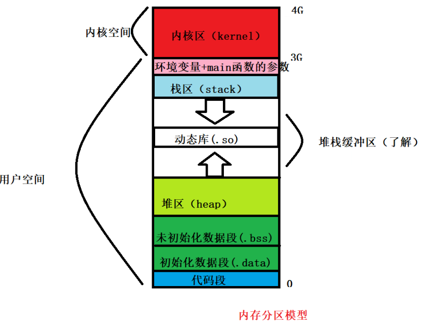

<!-- 2023年07月21日 -->
## 生命周期、作用域、链接属性

### 生命周期和作用域的概念

生命周期指的是变量从创建到销毁所持续的时间和空间

一个对象/变量的可见范围

#### 自动变量
自动变量(auto)定义  
已称为局部变量,定义在代码块{ }里面声明的变量,默认是自动变量  
在写时可以不用加auto关键字

自动变量的作用域  
局限于定义它的代码块内,从定义语句开始,到第一它所在的块结束

自动变量的生命周期  
局限于定义它的代码块内,从定义语句开始,到定义它所在的块结束

#### 全局变量
全局变量定义  
定义在所有代码块{ }外面声明的变量,默认是全局变量

全局变量的作用域  
从定义语句开始,到文件尾结束,可以被一同编译的其他文件访问

全局变量的生命周期  
全局变量的生命周期和进程生命周期一样

#### 作用域的相互屏蔽
最近的作用域会屏蔽较远的作用域  
命名冲突的条件:在同一个作用域下,定义了多个同名变量

#### 静态(static)变量
静态变量初始化语句只会执行一次
##### 静态局部变量
静态变量定义  
定义在代码块{ }里面声明的变量,在变量声明前加static

静态变量的作用域  
从定义语句开始,到定义它的代码块的结束

静态变量的生命周期  
全局变量的生命周期和进程生命周期一样

static只是提高了变量的生命周期,让其生命周期与进程一样长,但不会影响局部变量的作用域

##### 静态全局变量
静态全局变量定义  
定义在所有代码块{ }外面声明的变量,在变量声明前加static

静态全局变量的作用域  
从定义语句开始,到文件尾结束,不可以被一同编译的其他文件访问

静态全局变量的生命周期  
全局变量的生命周期和进程生命周期一样

##### 静态全局变量和全局变量的区别
静态全局变量的作用域被限定到当前文件,不可以被一同编译的其他文件访问

全局变量的作用域是本文件和其他引入了本文件的文件,可以被一同编译的其他文件访问

#### 变量默认值

局部变量: 如果没有被初始化,值是随机的
静态局部变量: 如果没有被初始化,编译器会默认初始化为0
静态全局变量: 如果没有被初始化,编译器会默认初始化为0
全局变量: 如果没有被初始化,编译器会默认初始化为0

### 链接属性
#### 外部链接
可以被一同编译的其他文件访问,可以在定义它的文件内访问
#### 内部链接
不可以被一同编译的其他文件访问,只能在定义它的文件内访问

### 引用声明
使用extern引用其他文件的全局变量

在1.c中
```c
int c=100;
{
    int d=100;
}
int fun(int a,int b)
{
    return a+b;
}
```
在2.c中
```c
#include<stdio.h>
extern int c;
//不能使用extern int c=100;  //这个是引入外部变量的同时不能初始化
extern int d;//erorr 不能引入局部变量
int fun(int a,int b); //引入外部函数
int main()
{
    printf("c=%d\n",c);
    printf("d=%d\n",d);
    printf("d=%d\n",fun(1,2));
    return 0;
}
```
使用命令同时编译两个文件 链接和运行
    
    gcc 1.c 2.c -o a.out

### 声明和定义的区别
在声明变量的同时,如果进行初始化,那么就叫做变量的定义
```c
#include<stdio.h>
int x;
int x=100;
int x=99;//这里才会出错
int main()
{    
    int y=1;
    int y=1;
    return 0;
}
```
一个变量只能被定义一次,但是可以声明多次,  
但是局部变量只能声明一次,全局变量可以声明多次

### 全局函数和静态函数
#### 全局函数

函数默认是全局的,外部链接的

#### 静态函数

如果在函数定义前加上一个static关键字,函数就会变成静态函数,是内部链接的.


### 全局区
所有代码块之外称为全局区,这个区域只能进行函数的声明,定义,变量的声明定义,  
其他语句都不可以,比如函数调用,分支语句都不可以用\

## 动态内存分配
### 创建和释放内存

```c
 #include <stdlib.h>
void *malloc(size_t size);
void free(void *ptr);

int *p=(int *)mallloc(sizeof(int));
free(p);
/*
malloc和free要配套使用
    malloc给内存
    free销毁内存
*/
```
void*为万能指针,  
但可以将其他指针赋值给void*  
但不可以将void*赋值给其他指针(应该使用强转)  

当`free()`函数接收的是NULL时,函数不进行任何操作

既不能多free,也不能少free

`calloc()`和`malloc()`函数类似,但参数不同

动态分配的内存默认是随机的,需要自己手动初始化
### 内存操作函数
```c
//函数原型
void *memset(void *s, int c, size_t n);
//将s的内存区域的前n个字节以参数c填入
/*
    s：需要操作内存s的首地址
	c：填充的字符，c虽然参数为int，但必须是unsigned char , 范围为0~255
	n：指定需要设置的大小
返回s的首地址

逐字节赋值,每个字节8位
*/

//函数原型
void *memcpy(void *dest, const void *src, size_t n);
//拷贝src所指的内存内容的前n个字节到dest所值的内存地址上。
/*
    dest：目的内存首地址
	src：源内存首地址，注意：dest和src所指的内存空间不可重叠，可能会导致程序报错
	n：需要拷贝的字节数
返回dest的首地址
*/

//函数原型
int memcmp(const void *s1, const void *s2, size_t n);
//比较s1和s2所指向内存区域的前n个字节
/*
    s1：内存首地址1
	s2：内存首地址2
	n：需比较的前n个字节
返回值：
	相等：=0
	大于：>0
	小于：<0
*/

//函数原型
void *memmove(void *dest, const void *src, size_t n);
/*
memmove()功能用法和memcpy()一样，
区别在于：dest和src所指的内存空间重叠时，memmove()仍然能处理，不过执行效率比memcpy()低些。
*/
```

## 关于数据所在位置
栈区(stack) - 局部变量在的地方  
数据段(.data段) - 已经初始化的 局部静态变量,全局变量,全局静态变量在的地方   
未初始化数据段(.bss) - 未初始化的静态或全局数据放在未初始化数据段   
堆区(heap) - 动态内存分配的空间在的地方   
代码段(.text段) - 如字符串常量,函数   

内存四区  

    数据段  
    代码段  
    堆  
    栈  

对于栈的数据，指定大小为4k，因为系统分页一般为4k  
所以说数据较大可以用`char c[4096]`


32位系统占用分区模型如下  
课程所讲

网上


## 随机数

### 随机数生成函数：rand()
```c
int rand(void);
//功能：返回0至RAND_MAX之间的随机数值，RAND_MAX定义在stdlib.h，其值为2147483647。

```
### 随机数发生器的初始化函数srand()
```c
void srand(unsigned int seed);
//功能：用来设置rand()产生随机数时的随机种子
//参数：如果每次seed相等，rand()产生随机数相等
time_t time(time_t *t);
//功能：获取当前系统时间，（从1970年1月1日到此刻的秒数）
//返回值：当前系统时间, time_t 相当于long类型，单位为毫秒
```

## 练习
实现一个石头剪刀布的程序，让玩家和电脑pk。用户可以输入自己的选择（石头、剪刀、布，如果输入不是这三者之一，提示用户重新输入）。用户输入后，电脑随机产生一个石头剪刀布，程序根据石头剪刀布的规则，提示谁胜谁负。实现五局三胜。
```c
#include <stdio.h>
#include <stdlib.h>
#include <string.h>
#include <time.h>

char rule[3][10]={"石头","剪刀","布"};

int strToChoose(char *player_choose);
int showWin(int compute,int player,int *win_times);
int pk(int compute,int player);
int main()
{
	char player_choose[10]={0};
	int player_choose_num=0;
	int conputer_choose_num=0;
	int win_times[3]={0};
	/*
		i=0 平局
		i=1 计算机胜
		i=2 玩家胜
	*/
    srand((unsigned int)time(0));//初始化种子为随机值
	printf("石头、剪刀、布对战平台\n");
	while(1)
	{
		printf("请输入你的选择:");
		scanf("%s",player_choose);
		fflush(stdout);
		if((player_choose_num=strToChoose(player_choose))==-1)
		{
			printf("输入有误,请重新输入!\n");
			continue;
		}
		conputer_choose_num=rand()%3;
		if(!showWin(player_choose_num,conputer_choose_num,win_times))
			break;
		// printf("玩家出 %s\n",rule[player_choose_num]);
		// printf("机器出 %s\n",rule[conputer_choose_num]);

	}
	printf("统计:\n\t共进行 %d轮\n\t平局%d轮\n\t计算机胜利%d轮\n\t玩家胜利%d轮\n",win_times[0]+win_times[1]+win_times[2],win_times[0],win_times[1],win_times[2]);
	return 0;
}
int strToChoose(char *player_choose)
{
	for (int i = 0; i < 3; i++)
	{
		if(!strcmp(player_choose,rule[i]))
		{
			return i;
		}
	}
	return -1;
}
int showWin(int compute,int player,int *win_times)
{
	printf("玩家出 %s\n",rule[compute]);
	printf("机器出 %s\n",rule[player]);
	win_times[pk(compute,player)]++;
	if(win_times[0]+win_times[1]+win_times[2]>=3)
	{
		if(win_times[0]+win_times[1]+win_times[2]==5)
		{
			if(win_times[1]==win_times[2])
			{
				printf("\n双方你来我往,打成平局!\n");
			}
			else if (win_times[1]-win_times[2]>0)
			{
				printf("这局计算机技高一筹,计算机获得胜利!\n");
			}
			else
			{
				printf("还是玩家厉害,玩家获得胜利!\n");
			}
			return 0;
		}
		else if (win_times[1]==3)
		{
			printf("这局计算机技高一筹,计算机获得胜利!\n");
			return 0;
		}
		else if (win_times[2]==3)
		{
			printf("还是玩家厉害,玩家获得胜利!\n");
			return 0;
		}
		else
			return 1;
	}
	else
	{
		return 1;
	}
}
int pk(int compute,int player)
{
	if((compute-player)==0)
	{
		printf("平局!\n");
		return 0;
	}
	else if((compute-player)==-1||(compute-player)==2)
	{
		printf("计算机赢!\n");
		return 1;
	}
	else
	{
		printf("玩家赢!\n");
		return 2;
	}
}
```