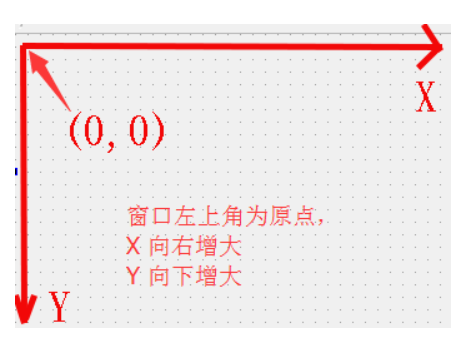

<!-- 2023年10月15日 -->
## Qt按钮小程序
### 按钮的创建和父子关系
在Qt程序中，最常用的控件之一就是按钮了，首先我们来看下如何创建一个按钮
```c++
#include <QPushButton>
QPushButton * btn = new QPushButton; 

    //设置父亲
    btn->setParent(this);
    //设置文字
    btn->setText("德玛西亚");
    //移动位置
    btn->move(100,100);

    //第二种创建
    QPushButton * btn2 = new QPushButton("孙悟空",this);
    //重新指定窗口大小
    this->resize(600,400);

    //设置窗口标题
    this->setWindowTitle("第一个项目");

    //限制窗口大小
    this->setFixedSize(600,400);
```
上面代码中，一个按钮其实就是一个QPushButton类的对象，如果只是创建出对象，是无法显示到窗口中的，所以我们需要依赖一个父窗口，也就是指定一个父亲，利用setParent函数或者按钮创建的时候通过构造函数传参，此时我们称两个窗口建立了父子关系。在有父窗口的情况下，窗口调用show会显示在父窗口中，如果没有父窗口，那么窗口调用show显示的会是一个顶层的窗口（顶层窗口是能够在任务栏中找到的，不依赖于任何一个窗口而独立存在）（按钮也是继承于QWidget，也属于窗口）。

设置按钮上显示的文字可以用setText，  
移动按钮位置用move。  
  
对于窗口而言，  
我们可以修改左上角窗口的标题setWindowTitle，  
重新指定窗口大小：resize，  
或者设置固定的窗口大小setFixedSize。  
## Qt窗口坐标体系
通过以上代码可以看出Qt的坐标体系。
以左上角为原点（0,0），以向右的方向为x轴的正方向，以向下方向为y轴的正方向。


对于嵌套窗口，其坐标是相对于父窗口来说的。顶层窗口的父窗口就是屏幕。
## 对象树模型
QObject是Qt里边绝大部分类的根类
- QObject对象之间是以对象树的形式组织起来的。
  - 当两个QObject（或子类）的对象建立了父子关系的时候。子对象就会加入到父对象的一个成员变量叫children（孩子）的list（列表）中。(非继承关系)
  - 当父对象析构的时候，这个列表中的所有对象也会被析构。（注意，这里是说父对象和子对象，不要理解成父类和子类）
- QWidget是能够在屏幕上显示的一切组件的父类
  - QWidget继承自QObject，因此也继承了这种对象树关系。一个孩子自动地成为父组件的一个子组件。我们向某个窗口中添加了一个按钮或者其他控件（建立父子关系），当用户关闭这个窗口的时候，该窗口就会被析构，之前添加到他上边的按钮和其他控件也会被一同析构。这个结果也是我们开发人员所期望的。
  - 当然，我们也可以手动删除子对象。当子对象析构的时候会发出一个信号destroyed，父对象收到这个信号之后就会从children列表中将它剔除。比如，当我们删除了一个按钮时，其所在的主窗口会自动将该按钮从其子对象列表（children）中删除，并且自动调整屏幕显示，按钮在屏幕上消失。当这个窗口析构的时候，children列表里边已经没有这个按钮子对象，所以我们手动删除也不会引起程序错误。  

Qt 引入对象树的概念，在一定程度上解决了内存问题。
- 对象树中对象的顺序是没有定义的。这意味着，销毁这些对象的顺序也是未定义的。
- 任何对象树中的 QObject对象 delete 的时候，如果这个对象有 parent，则自动将其从 parent 的children()列表中删除；如果有孩子，则自动 delete 每一个孩子。Qt 保证没有QObject会被 delete 两次，这是由析构顺序决定的。
  
如果QObject在栈上创建，Qt 保持同样的行为。正常情况下，这也不会发生什么问题。来看下下面的代码片段：
```c++
{
    QWidget window;
    QPushButtonquit("Quit", &window);
}
```
作为父组件的 window 和作为子组件的 quit 都是QObject的子类（事实上，它们都是QWidget的子类，而QWidget是QObject的子类）。这段代码是正确的，quit 的析构函数不会被调用两次，因为标准 C++要求，局部对象的析构顺序应该按照其创建顺序的相反过程。因此，这段代码在超出作用域时，会先调用 quit 的析构函数，将其从父对象 window 的子对象列表中删除，然后才会再调用 window 的析构函数。  
但是，如果我们使用下面的代码：
```c++
{
    QPushButtonquit("Quit");
    QWidget window;
   quit.setParent(&window);
}
```
情况又有所不同，析构顺序就有了问题。我们看到，在上面的代码中，作为父对象的 window 会首先被析构，因为它是最后一个创建的对象。在析构过程中，它会调用子对象列表中每一个对象的析构函数，也就是说， quit 此时就被析构了。然后，代码继续执行，在 window析构之后，quit 也会被析构，因为 quit 也是一个局部变量，在超出作用域的时候当然也需要析构。但是，这时候已经是第二次调用 quit 的析构函数了，C++ 不允许调用两次析构函数，因此，程序崩溃了。  
由此我们看到，Qt 的对象树机制虽然帮助我们在一定程度上解决了内存问题，但是也引入了一些值得注意的事情。这些细节在今后的开发过程中很可能时不时跳出来烦扰一下，所以，我们最好从开始就养成良好习惯，在 Qt 中，尽量在构造的时候就指定 parent 对象，并且大胆在堆上创建。
