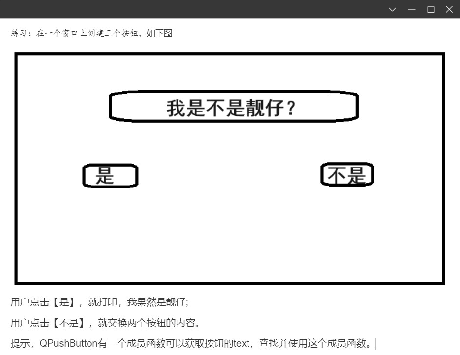

<!-- 2023年10月17日 -->
## 信号和槽机制

信号：各种事件  
槽： 响应信号的动作  
当某个事件发生后，如某个按钮被点击了一下，它就会发出一个被点击的信号（signal）。  

某个对象接收到这个信号之后，就会做一些相关的处理动作（称为槽slot）。  
但是Qt对象不会无故收到某个信号，要想让一个对象收到另一个对象发出的信号，这时候需要建立连接（connect）  

### 自定义信号和槽
Qt框架默认提供的标准信号和槽不足以完成我们日常应用开发的需求，比如说点击某个按钮让另一个按钮的文字改变，这时候标准信号和槽就没有提供这样的函数。但是Qt信号和槽机制提供了允许我们自己设计自己的信号和槽。
#### 自定义信号使用条件
1) 声明在类的signals域下
2) 没有返回值，void类型的函数
3) 只有函数声明，没有定义
4) 可以有参数，可以重载
5) 通过emit关键字来触发信号，形式：`emit object->sig(参数)`;
#### 自定义槽函数使用条件
1) qt4 必须声明在 private/public/protected slots域下面，qt5之后可以声明public下，同时还可以是静态的成员函数，全局函数，lambda表达式
2) 没有返回值，void类型的函数
3) 不仅有声明，还得要有实现
4) 可以有参数，可以重载
#### 使用自定义信号和槽
定义场景：下课了，老师跟同学说肚子饿了（信号），学生请老师吃饭（槽）
首先定义一个学生类和老师类：
老师类中声明信号饿了 hungry
```c++
signals:
       voidhungry();
```
学生类中声明槽请客treat
```c++
public slots:
    void treat();
```
在窗口中声明一个公共方法下课，这个方法的调用会触发老师饿了这个信号，而响应槽函数学生请客
```c++ 
void MyWidget::ClassIsOver()
{
    //发送信号
    emit teacher->hungry();
}
```
学生响应了槽函数，并且打印信息
```c++
//自定义槽函数 实现
voidStudent::treat()
{
       qDebug() << "Student treatteacher";
}
```
在窗口中连接信号槽
```c++
teacher = new Teacher(this);
student= new Student(this);
connect(teacher,&Teacher::hungury,student,&Student::treat);
```
并且调用下课函数，测试打印出相应log
自定义的信号 hungry带参数，需要提供重载的自定义信号和 自定义槽
```c++
void hungry(QString name);  自定义信号
void treat(QString name );    自定义槽
```
但是由于有两个重名的自定义信号和自定义的槽，直接连接会报错，所以需要利用函数指针来指向函数地址， 然后在做连接
```c++
void (Teacher:: * teacherSingal)(QString)= &Teacher:: hangry;
void (Student:: * studentSlot)(QString) = &Student::treat;
connect(teacher,teacherSingal,student,studentSlot);
```
也可以使用static_cast静态转换挑选我们要的函数
```c++
connect(
teacher,
static_cast<void(Teacher:: *)(QString)>(&Teacher:: hangry),
student,
static_cast<void(Student:: *)(QString)>(& Student::treat));
```
### 信号和槽的拓展
- 一个信号可以和多个槽相连
如果是这种情况，这些槽会一个接一个的被调用，但是槽函数调用顺序是不确定的。像上面的例子，可以将一个按钮点击信号连接到关闭窗口的槽函数，同时也连接到学生请吃饭的槽函数，点击按钮的时候可以看到关闭窗口的同时也学生请吃饭的log也打印出来。
- 多个信号可以连接到一个槽
只要任意一个信号发出，这个槽就会被调用。如：一个窗口多个按钮都可以关闭这个窗口。
- 一个信号可以连接到另外的一个信号
当第一个信号发出时，第二个信号被发出。除此之外，这种信号-信号的形式和信号-槽的形式没有什么区别。注意这里还是使用connect函数，只是信号的接收者和槽函数换成另一个信号的发送者和信号函数。如上面老师饿了的例子，可以新建一个按钮btn。
connect(btn,&QPushButton::clicked,teacher,&Teacher::hungry);
- 信号和槽可以断开连接
可以使用disconnect函数，当初建立连接时connect参数怎么填的，disconnect里边4个参数也就怎么填。这种情况并不经常出现，因为当一个对象delete之后，Qt自动取消所有连接到这个对象上面的槽。
- 信号和槽函数参数类型和个数必须同时满足两个条件
1) 信号函数的参数个数必须大于等于槽函数的参数个数
2) 信号函数的参数类型和槽函数的参数类型必须一一对应
### Qt4版本的信号槽写法
```c++
connect(
    teacher,
    SIGNAL(hungry(QString)),
    student,
    SLOT(treat(QString))
);
```
这里使用了SIGNAL和SLOT这两个宏，宏的参数是信号函数和槽函数的函数原型。
因为直接填入了函数原型，所有这里边编译不会出现因为重载导致的函数指针二义性的问题。但问题是如果函数原型填错了，或者不符合信号槽传参个数类型约定，编译期间也不会报错，只有运行期间才会看到错误log输出。
原因就是这两个宏将后边参数（函数原型）转化成了字符串。目前编译器还没有那么智能去判断字符串里边的内容符不符合运行条件。
## lambda表达式 
C++11中的Lambda表达式用于定义匿名的函数对象，以简化编程工作。首先看一下Lambda表达式的基本构成：
分为四个部分：[局部变量捕获列表]、（函数参数）、函数额外属性设置opt、函数返回值->retype、{函数主体}
```c++
[capture](parameters) opt ->retType
{
    ……;
}
```
### 局部变量引入方式
[ ]，标识一个Lambda的开始。由于lambda表达式可以定义在某一个函数体A里边，所以lambda表达式有可能会去访问A函数中的局部变量。中括号里边内容是描述了在lambda表达式里边可以使用的外部局部变量的列表：
- [ \]  
表示lambda表达式不能访问外部函数体的任何局部变量
- [a]  
在函数体内部使用值传递的方式访问a变量
-  [&b]  
在函数体内部使用引用传递的方式访问b变量
- [=]  
函数外的所有局部变量都通过值传递的方式使用, 函数体内使用的是副本
- [&]  
引用的方式使用lambda表达式外部的所有变量
-  [=, &foo]  
foo使用引用方式, 其余是值传递的方式
-  [&,foo]  
foo使用值传递方式, 其余是引用传递的方式
- [this]  
在函数内部可以使用类的成员函数和成员变量，=和&形式也都会默认引入
由于引用方式捕获对象会有局部变量释放了而lambda函数还没有被调用的情况。如果执行lambda函数那么引用传递方式捕获进来的局部变量的值不可预知。
所以在无特殊情况下建议使用`[=](){}`的形式
### 函数参数
(params)表示lambda函数对象接收的参数，类似于函数定义中的小括号表示函数接收的参数类型和个数。参数可以通过按值（如：(int a,int b)）和按引用（如：(int &a,int&b)）两种方式进行传递。函数参数部分可以省略，省略后相当于无参的函数。
### 选项Opt
Opt 部分是可选项，最常用的是mutable声明，这部分可以省略。外部函数局部变量通过值传递引进来时，其默认是const，所以不能修改这个局部变量的拷贝，加上mutable就可以
```c++
int a = 10 ;
[=]()
{
    a=20;//编译报错，a引进来是const
}

[=]()mutable
{
    a=20;//编译成功
};
```
### 函数返回值 ->retType
->retType，标识lambda函数返回值的类型。这部分可以省略，但是省略了并不代表函数没有返回值，编译器会自动根据函数体内的return语句判断返回值类型，但是如果有多条return语句，而且返回的类型都不一样，编译会报错，如：
```c++
[=]()mutable
{
    int b = 20;
    float c = 30.0;
    if(a>0)
        return b;
    else
        return c;//编译报错，两条return语句返回类型不一致
};
```

### 函数主体{}
 {}，标识函数的实现，这部分不能省略，但函数体可以为空。
#### 槽函数使用Lambda表达式
以QPushButton点击事件为例：
```c++
    connect(btn,&QPushButton::clicked,[=](){
        qDebug()<<"Clicked";
});
```
这里可以看出使用Lambda表达式作为槽的时候不需要填入信号的接收者。当点击按钮的时候，clicked信号被触发，lambda表达式也会直接运行。当然lambda表达式还可以指定函数参数，这样也就能够接收到信号函数传递过来的参数了。  
由于lambda表达式比我们自己自定义槽函数要方便而且灵活得多，所以在实现槽函数的时候优先考虑使用Lambda表达式。一般我们的使用习惯也是lambda表达式外部函数的局部变量全部通过值传递捕获进来，也就是:
`[=](){  }`的形式

## 练习
在一个窗口上创建两个按钮,点击按钮1设置按钮2的文本为"hello"。点击按钮2设置按钮1的文本为world。
```c++
QtStudy::QtStudy(QWidget *parent)
    : QMainWindow(parent)
{
    this->resize(500, 500);
    this->butt1 = new QPushButton("按钮1", this);
    this->butt1->move(10, 10);
    this->butt2 = new QPushButton("按钮2", this);
    this->butt2->move(100, 100);
    this->butt1->show();
    this->butt2->show();
    connect(this->butt1, &QPushButton::clicked, this->butt2, [&]()
            {
                qDebug() << "1111";
                this->butt2->setText("被按钮1点击");
            });
    connect(this->butt2, &QPushButton::clicked, this->butt1, [&]()
            {
        qDebug()<<"2222";
        this->butt1->setText("被按钮2点击"); });
}
```



widget.h
```c++
#ifndef WIDGET_H
#define WIDGET_H

#include <QWidget>
#include <QDesktopWidget>
#include <QPushButton>
#include <QtDebug>
#include <QMessageBox> 

class Widget : public QWidget
{
    Q_OBJECT

public:
    Widget(QWidget *parent = nullptr);
    ~Widget();

public slots:
    // 交换两个按钮
    void swap_button(void);

private:
    // 左边按钮
    QPushButton *buttonLeft;
    // 右边按钮
    QPushButton *buttonRight;
    // 中间显示框
    QPushButton *buttonCenter;
};
#endif // WIDGET_H

```
widget.cpp
```c++
#include "widget.h"

Widget::Widget(QWidget *parent)
    : QWidget(parent)
{
    setFixedSize(800, 600);
    std::shared_ptr<QDesktopWidget> m_pDeskdop = std::make_shared<QDesktopWidget>();
    move(
        (m_pDeskdop->width() - width()) / 2, 
        (m_pDeskdop->height() - height()) / 2);
    // 初始化中间组件
    this->buttonCenter=new QPushButton("我是不是靓仔?",this);
    this->buttonCenter->resize(400,30);
    this->buttonCenter->move(
        (width()-this->buttonCenter->width())/2,(height()-this->buttonCenter->height())/2-height()/5);
    // 初始化 是 按钮
    this->buttonLeft=new QPushButton("是",this);
    this->buttonLeft->move((width()-this->buttonLeft->width())/2-width()/5,(height()-this->buttonLeft->height())/2);
    // 初始化 不是 按钮
    this->buttonRight=new QPushButton("不是",this);
    this->buttonRight->move((width()-this->buttonRight->width())/2+width()/5,(height()-this->buttonRight->height())/2);
    // 建立槽,交换按钮位置
    connect(this->buttonRight,&QPushButton::clicked,this,&swap_button);
    // 建立槽,点击 是 会显示 我就知道
    connect(this->buttonLeft,&QPushButton::clicked,[&](){
        QMessageBox *mess_box=new QMessageBox(
            QMessageBox::NoIcon,
            " ",
            "我就知道!",
            QMessageBox::Ok,
            this);
            mess_box->show();
    });

}

Widget::~Widget()
{
}

void Widget::swap_button(void)
{
    QPoint xy=this->buttonLeft->pos();
    int x=xy.rx();
    int y=xy.ry();
    // 打印一下位置
    //qDebug()<<x<<y;
    this->buttonLeft->move(this->buttonRight->x(),this->buttonRight->y());
    this->buttonRight->move(x,y);
}

```