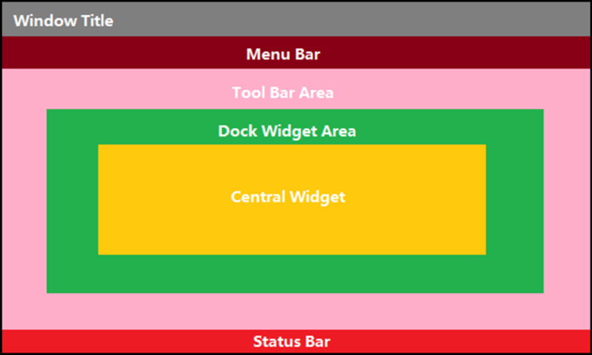
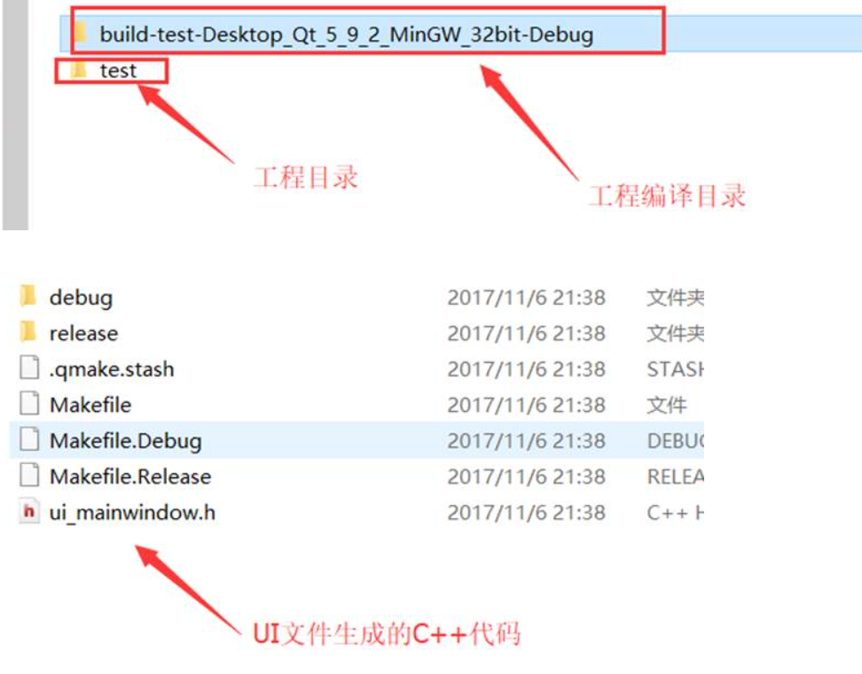
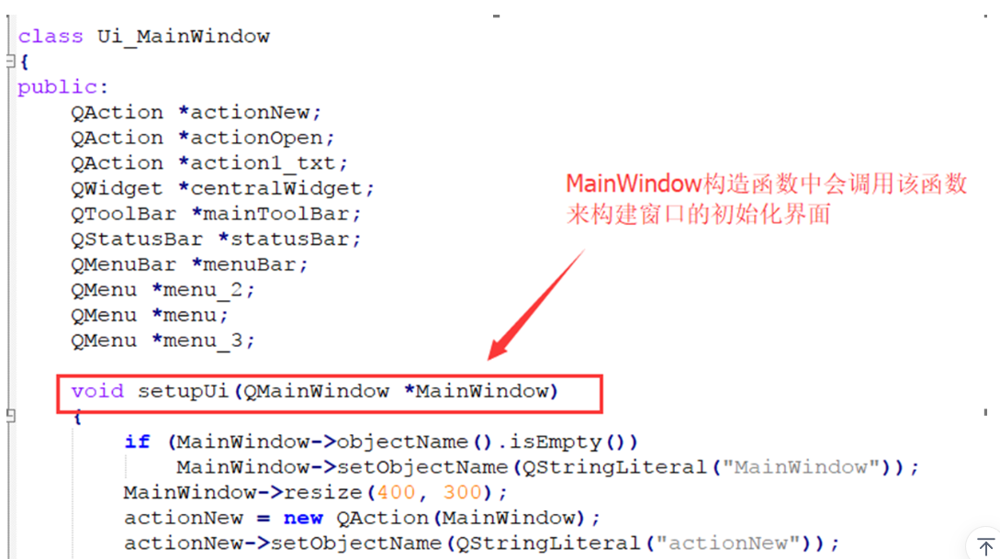
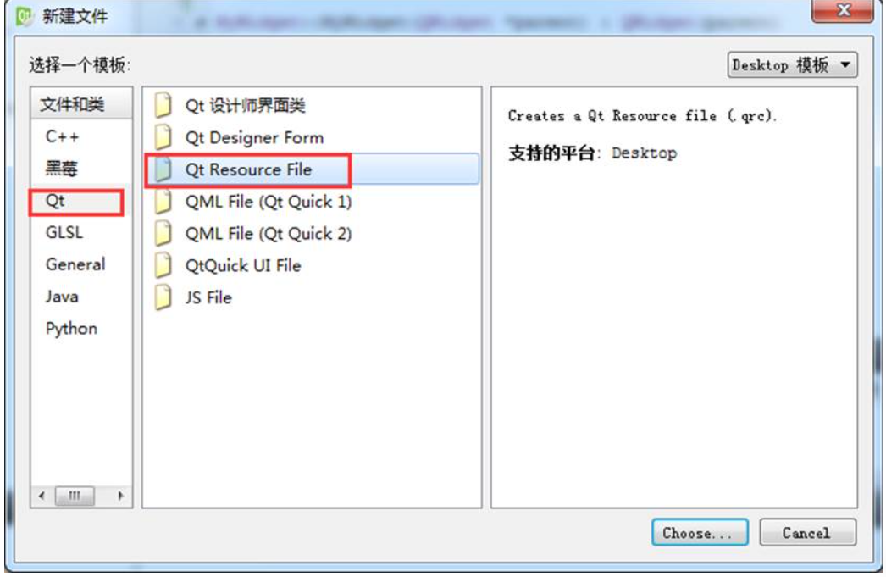
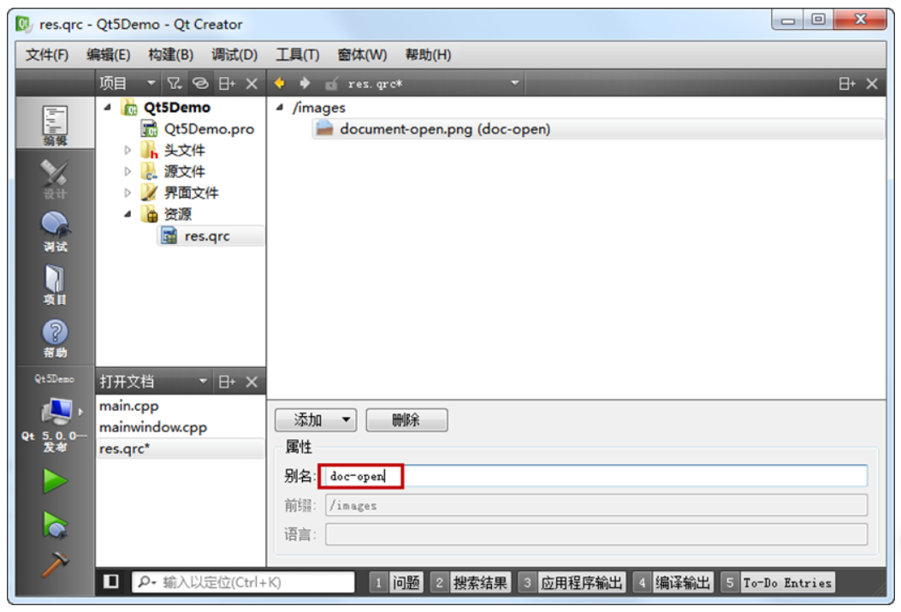
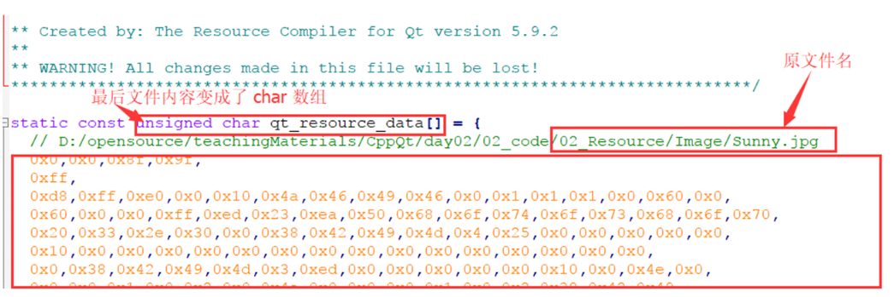

<!-- 2023年10月18日 -->
## QMainWindow
QMainWindow是一个为用户提供主窗口程序的类，包含一个菜单栏（menu bar）、多个工具栏(tool bars)、多个停靠部件(dock widgets)、一个状态栏(status bar)及一个中心部件(central widget)，是许多应用程序的基础，如文本编辑器，图片编辑器等。  
想要使用需继承QMainWindow类


## 菜单栏
一个主窗口最多只有一个菜单栏。位于主窗口顶部、主窗口标题栏下面。
- 通过QMainWindow类的menubar（）函数获取主窗口菜单栏指针，如果当前窗口没有菜单栏，该函数会自动创建一个。
    ```c++
    QMenuBar * menuBar() const;
    ```
- 创建菜单，调用QMenu的成员函数addMenu来添加菜单
    ```c++
    QAction* addMenu(QMenu * menu);
    QMenu* addMenu(const QString & title);
    QMenu* addMenu(const QIcon & icon, const QString & title);
    ```
- 创建菜单项，调用QMenu的成员函数addAction来添加菜单项
    ```c++
    QAction* activeAction() const;
    QAction* addAction(const QString & text);
    QAction* addAction(const QIcon & icon, const QString & text);
    QAction* addAction(const QString & text, const QObject * receiver,
    const char * member, const QKeySequence & shortcut = 0);
    QAction* addAction(const QIcon & icon, const QString & text, 
    const QObject * receiver, const char * member, 
    const QKeySequence & shortcut = 0);
    ```
Qt 并没有专门的菜单项类，只是使用一个QAction类，抽象出公共的动作。当我们把QAction对象添加到菜单，就显示成一个菜单项，添加到工具栏，就显示成一个工具按钮。用户可以通过点击菜单项、点击工具栏按钮、点击快捷键来激活这个动作。
## 工具栏
主窗口的工具栏上可以有多个工具条，通常采用一个菜单对应一个工具条的的方式，也可根据需要进行工具条的划分。
- 调用QMainWindowd对象的成员函数addToolBar（）,该函数每次调用都会创建一个新的工具栏，并且返回该工具栏的指针。
- 插入属于工具条的项，这时工具条上添加项也是用QAction。
通过QToolBar类的addAction函数添加。
- 工具条是一个可移动的窗口，它的停靠区域由QToolBar的allowAreas决定，包括（以下值可以通过查帮助文档allowAreas来索引到）：
  - Qt::LeftToolBarArea           停靠在左侧
  - Qt::RightToolBarArea         停靠在右侧
  - Qt::TopToolBarArea           停靠在顶部
  - Qt::BottomToolBarArea    停靠在底部
  - Qt::AllToolBarAreas           以上四个位置都可停靠

使用setAllowedAreas（）函数指定停靠区域
```c++
setAllowedAreas（Qt::LeftToolBarArea| Qt::RightToolBarArea）
```
使用setFloatable（trueOrFalse）函数来设定工具栏可否浮动  
使用setMoveable（trueOrFalse）函数设定工具栏的可移动性：
```c++
setMoveable（false）//工具条不可移动, 只能停靠在初始化的位置上 
```
## 状态栏
一个QMainWindow的程序最多只有一个状态栏。QMainWindow中可以有多个的部件都使用add…名字的函数，而只有一个的部件，就直接使用获取部件的函数，如menuBar。同理状态栏也提供了一个获取状态栏的函数statusBar()，没有就自动创建一个并返回状态栏的指针。
```c++
QMenuBar * menuBar() const;
```
- 添加小部件（从状态栏左侧添加）
    ```c++
    void addWidget(QWidget * widget, int stretch = 0);
    //插入小部件
    int insertWidget(int index, QWidget * widget, int stretch = 0);
    //删除小部件
    void removeWidget(QWidget * widget);
    ```
- 添加小部件（从状态栏右侧添加）
    ```c++
    void addPermenentWidget (QWidget *widget, int stretch = 0);
    ```
## 停靠部件（也称为铆接部件、浮动窗口）
停靠部件 QDockWidget，也称浮动窗口，可以有多个。
```c++
QDockWidget * dock = new QDockWidget("标题",this);
//添加停靠部件到mainWindow中，并且设定默认停靠在左边
addDockWidget(Qt::LeftDockWidgetArea,dock);
//设定停靠部件允许停靠的范围
dock->setAllowedAreas(Qt::LeftDockWidgetArea |
Qt::RightDo    ckWidgetArea | Qt::TopDockWidgetArea); 
```
## 核心部件（中心部件）
除了以上几个部件，中心显示的部件都可以作为核心部件，例如一个记事本程序中，就是一个QTextEdit（编辑框控件）做核心部件
```c++
QTextEdit * edit = new QTextEdit(this);
//设置mainWindow的核心部件
setCentralWidget(edit);
```
## 简单示例
```c++

    setFixedSize(800, 600);
    std::shared_ptr<QDesktopWidget> m_pDeskdop = std::make_shared<QDesktopWidget>();
    move((m_pDeskdop->width() - width()) / 2, (m_pDeskdop->height() - height()) / 2);

    // 菜单栏只能有一个
    // QMenuBar *m_bar=new QMenuBar(this);//创建菜单栏
    QMenuBar *m_bar = this->menuBar(); // 在继承QMainWindow类的时候使用这个也能创建菜单栏
    this->setMenuBar(m_bar);           // 给本窗口设置菜单栏
    // 给菜单栏添加菜单
    QMenu *file_menu = m_bar->addMenu("文件");
    // 给菜单栏添加菜单项
    file_menu->addAction("新建文本文件");
    // 给菜单项之间添加一个横线分类
    file_menu->addSeparator();
    // 给菜单栏添加菜单项
    file_menu->addAction("打开文件");
    // 给菜单栏添加菜单
    QMenu *edit_menu = m_bar->addMenu("编辑");
    // 也可以给菜单项里面添加菜单,相对于会存在子项
    // 菜单项不能添加子项,而菜单可以
    // 给菜单栏添加菜单
    QMenu *edit_uodo = edit_menu->addMenu("撤销");
    edit_uodo->addAction("第一步");
    edit_uodo->addAction("第二步");

    // 工具栏可以有多个
    QToolBar *t_bar = new QToolBar(this);
    // 设置工具栏初始浮动地方
    this->addToolBar(Qt::TopToolBarArea, t_bar);
    t_bar->addAction("保存");
    // 添加分割线
    file_menu->addSeparator();
    // 工具栏可以任意添加窗口类对象
    t_bar->addWidget(new QPushButton("按钮"));
    // 设置浮动的地方只能是哪几个方向
    t_bar->setAllowedAreas(Qt::LeftToolBarArea | Qt::RightToolBarArea);
    // 设置是否能浮动,只能停靠
    t_bar->setFloatable(true);
    // 设置是否能移动到其他方向
    t_bar->setMovable(false);

    // 创建状态栏,最多一个,自带有,则直接this->statusBar()获取
    QStatusBar *s_bar = this->statusBar();
    // 给状态栏添加信息,默认添加到左边
    s_bar->addWidget(new QLabel("字数"));
    // 在右边插入信息
    s_bar->addPermanentWidget(new QLabel("tab size 4"));
    s_bar->addPermanentWidget(new QLabel("提示信息"));
    s_bar->addWidget(new QLabel("行数"));
    // 在在指定位置插入某一个
    s_bar->insertWidget(1, new QLabel("列数"));

    // 投靠部件 浮动窗口,可以拖动
    QDockWidget *dw1 = new QDockWidget("我的浮动窗口", this);
    QDockWidget *dw2 = new QDockWidget("我的浮动2", this);
    // 在中心区域添加窗口,并设置默认停靠位置
    this->addDockWidget(Qt::BottomDockWidgetArea, dw1);
    // 设置窗口允许停靠的方向
    dw1->setAllowedAreas(Qt::BottomDockWidgetArea | Qt::TopDockWidgetArea);
    this->addDockWidget(Qt::TopDockWidgetArea, dw2);
    // dw1->setWidget(new QLineEdit());
    dw1->setWindowTitle("编辑区");
    dw1->setWidget(new QTextEdit(this));

    // 中心部件,不可移动
    this->setCentralWidget(new QPushButton("中心按钮"));
    // this->setCentralWidget(new QTextEdit(this));
```
## UI文件原理
使用UI文件创建界面很轻松很便捷，他的原理就是每次我们保存UI文件的时候，QtCreator就自动帮我们将UI文件翻译成C++的图形界面创建代码。可以通过以下步骤查看代码  
到工程编译目录，一般就是工程同级目录下会生成另一个编译目录，会找到一个带ui_前缀跟ui文件同名的.h文件，这就是代码


代码内容：


在项目MainWindow的构造函数中会调用这个函数来初始化窗口，其实这里边就是初始化我们的各个控件。
```c++
MainWindow::MainWindow(QWidget *parent) :
    QMainWindow(parent),
    ui(new Ui::MainWindow)
{
    ui->setupUi(this);
    //如果想要使用ui里边的控件对象
    //代码必须写在setupUi之下
    //否则ui各个控件没有初始化时使用会出问题
    ui->pushButton->setText("Hello");
}
```

## 资源文件
Qt 资源系统是一个跨平台的资源机制，用于将程序运行时所需要的资源以二进制的形式存储于可执行文件内部。如果你的程序需要加载特定的资源（图标、文本翻译等），那么，将其放置在资源文件中，就再也不需要担心这些文件的丢失。也就是说，如果你将资源以资源文件形式存储，它是会编译到可执行文件内部。    
使用 Qt Creator 可以很方便地创建资源文件。我们可以在工程上点右键，选择“添加新文件…”，可以在 Qt 分类下找到“Qt 资源文件”：


点击“选择…”按钮，打开“新建 Qt 资源文件”对话框。在这里我们输入资源文件的名字和路径：

点击下一步，选择所需要的版本控制系统，然后直接选择完成。我们可以在 Qt Creator 的左侧文件列表中看到“资源文件”一项，也就是我们新创建的资源文件

右侧的编辑区有个“添加”，我们首先需要添加前缀，比如我们将前缀取名为 images。然后选中这个前缀，继续点击添加文件，可以找到我们所需添加的文件。这里，我们选择 document-open.png 文件。

接下来，我们还可以添加另外的前缀或者另外的文件。这取决于你的需要。当我们添加完成之后，我们可以像前面一章讲解的那样，通过使用 : 开头的路径来找到这个文件。比如，我们的前缀是/images，文件是 document-open.png，那么就可以使用:/images/document-open.png找到这个文件。



这么做带来的一个问题是，如果以后我们要更改文件名，比如将 docuemnt-open.png 改成 docopen.png，那么，所有使用了这个名字的路径都需要修改。所以，更好的办法是，我们给这个文件去一个“别名”，以后就以这个别名来引用这个文件。具体做法是，选中这个文件，添加别名信息：


这样，我们可以直接使用`:/images/doc-open`引用到这个资源，无需关心图片的真实文件名。   
Qrc文件只是记录了我们要用到的资源文件在项目路径哪个位置的一个信息，如果我们使用文本编辑器打开 `res.qrc` 文件，就会看到以下内容：
```xml
<RCC>
        <qresource prefix="/images">
           <filealias="doc-open">document-open.png</file>
        </qresource>
        <qresource prefix="/images/fr"lang="fr">
           <filealias="doc-open">document-open-fr.png</file>
        </qresource>
</RCC>
```
当我们编译工程之后，我们可以在构建目录中找到 qrc_res.cpp 文件。

这就是 Qt 将我们的资源编译成了 C++ 代码：

可以看出Qt帮我们将资源文件内容一个字节一个字节的读出来最终放到了代码里，使用字符数组的形式保存着，所以程序启动的时候这些资源就会以数组的形式占用到程序内存里。当我们使用qt的qrc资源文件时要考虑内存占用的问题，如果Qt程序资源很多，而且并不是每次运行程序都会加载所有的资源，比如制作一个游戏，所需要的图片声音资源量很大，可能超过了机器内存大小，这时候使用qrc加载资源的方式很不合适。    
可以考虑动态加载资源的方式，当切入到某个游戏场景的时候才加载场景相关的图片声音资源。Qt有提供rcc的方式动态加载资源，不过不常用，所以一般游戏资源都放在可执行文件exe所在目录或者子目录下，程序运行的时候就从游戏exe文件路径去搜寻资源。
