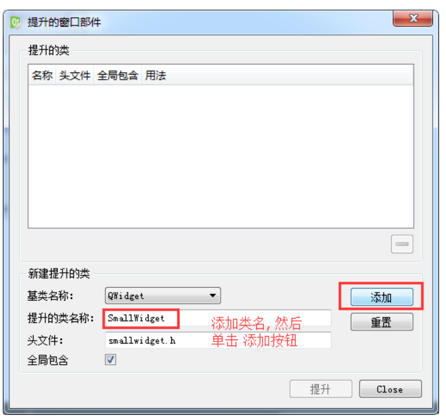
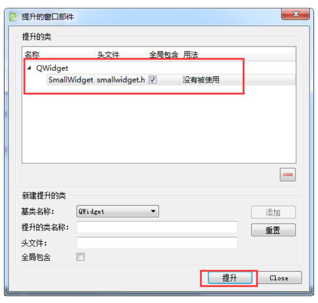

<!-- 2023年10月19日 -->
## 布局
所谓 GUI 界面，归根结底，就是一堆组件的叠加。我们创建一个窗口，把按钮放上面，把图标放上面，这样就成了一个界面。在放置时，组件的位置尤其重要。我们必须要指定组件放在哪里，以便窗口能够按照我们需要的方式进行渲染。这就涉及到组件布局定位的机制。
Qt 提供了两种组件布局定位机制：静态布局和动态布局。
- 静态布局就是一种最原始的定位方法：给出这个组件的坐标和长宽值。
这样，Qt 就知道该把组件放在哪里以及如何设置组件的大小。但是这样做带来的一个问题是，如果用户改变了窗口大小，比如点击最大化按钮或者使用鼠标拖动窗口边缘，采用静态布局的组件是不会有任何响应的。这也很自然，因为你并没有告诉 Qt，在窗口变化时，组件是否要更新自己以及如何更新。或者，还有更简单的方法：禁止用户改变窗口大小。但这总不是长远之计。
- 动态布局：你只要把组件放入某一种布局(layout)，布局由专门的布局管理器进行管理。当需要调整大小或者位置的时候，Qt 使用对应的布局管理器进行调整。
动态布局解决了使用静态布局的缺陷。
Qt 提供的动态布局中以下三种是我们最常用的：
- QHBoxLayout：按照水平方向从左到右布局；
- QVBoxLayout：按照竖直方向从上到下布局；
- QGridLayout：在一个网格中进行布局，类似于 HTML 的 table；

这4个为系统给我们提供的布局的控件，但是使用起来不是非常的灵活

## 常用控件
Qt为我们应用程序界面开发提供的一系列的控件，下面我们介绍两种最常用一些控件，所有控件的使用方法我们都可以通过帮助文档获取。
### QLabel控件使用
QLabel是我们最常用的控件之一，其功能很强大，我们可以用来显示文本，图片和动画等。
#### 显示文字 （普通文本、html）
通过QLabel类的setText函数设置显示的内容:
```c++
void     setText(const QString&)
```
- 可以显示普通文本字符串
```c++
QLable *label = new QLable;
label->setText(“Hello, World!”);
```
- 可以显示HTML格式的字符串
比如显示一个链接:
```c++
QLabel * label = new QLabel(this);
label ->setText("Hello, World");
label ->setText("<h1><ahref=\"https://www.baidu.com\">百度一下</a></h1>");
label ->setOpenExternalLinks(true);
```
其中`setOpenExternalLinks()`函数是用来设置用户点击链接之后是否自动打开链接，如果参数指定为true则会自动打开。
#### 显示图片
可以使用QLabel的成员函数setPixmap设置图片
```c++
// void     setPixmap(constQPixmap &)
// 首先定义QPixmap对象
QPixmap pixmap;
// 然后加载图片
pixmap.load(":/Image/boat.jpg");
最后将图片设置到QLabel中
QLabel *label = new QLabel;
label.setPixmap(pixmap);
```
#### 显示动画
可以使用QLabel 的成员函数setMovie加载动画，可以播放gif格式的文件
```c++
void     setMovie(QMovie *movie)
// 首先定义QMovied对象，并初始化:
QMovie *movie = new QMovie(":/Mario.gif");
// 播放加载的动画：
movie->start();
// 将动画设置到QLabel中：
QLabel *label = new QLabel;
//设置动画开始播放
label->setMovie(movie);
```
### QLineEdit
Qt提供的单行文本编辑框。
#### 设置/获取内容
- 获取编辑框内容使用text（），函数声明如下：
    ```c++
    QString      text() const
    ```
- 设置编辑框内容
    ```c++
    void     setText(const QString&)
    ```
#### 设置显示模式
使用QLineEdit类的setEchoMode () 函数设置文本的显示模式,函数声明:
```c++
void     setEchoMode(EchoModemode)
```
EchoMode是一个枚举类型,一共定义了四种显示模式:
- QLineEdit::Normal   模式显示方式，按照输入的内容显示。
- QLineEdit::NoEcho 不显示任何内容，此模式下无法看到用户的输入。
- QLineEdit::Password    密码模式，输入的字符会根据平台转换为特殊字符。
- QLineEdit::PasswordEchoOnEdit    编辑时显示字符否则显示字符作为密码。

另外，我们再使用QLineEdit显示文本的时候，希望在左侧留出一段空白的区域，那么，就可以使用QLineEdit给我们提供的setTextMargins函数：
```c++
void setTextMargins(int left, int top, int right, int bottom)
```
用此函数可以指定显示的文本与输入框上下左右边界的间隔的像素数。
### 其他控件
Qt中控件的使用方法可参考Qt提供的帮助文档。
### 自定义控件
在搭建Qt窗口界面的时候，在一个项目中很多窗口，或者是窗口中的某个模块会被经常性的重复使用。一般遇到这种情况我们都会将这个窗口或者模块拿出来做成一个独立的窗口类，以备以后重复使用。  
在使用Qt的ui文件搭建界面的时候，工具栏栏中只为我们提供了标准的窗口控件，如果我们想使用自定义控件怎么办？  
例如：我们从QWidget派生出一个类SmallWidget，实现了一个自定窗口，
```c++
// smallwidget.h
class SmallWidget : public QWidget
{
    Q_OBJECT
public:
    explicit SmallWidget(QWidget *parent = 0);
    
signals:
    
public slots:
private:
    QSpinBox* spin;
    QSlider* slider;
};

// smallwidget.cpp
SmallWidget::SmallWidget(QWidget *parent) : QWidget(parent)
{
    spin = new QSpinBox(this);
    slider = new QSlider(Qt::Horizontal, this);
    
    // 创建布局对象
    QHBoxLayout* layout = new QHBoxLayout;
    // 将控件添加到布局中
    layout->addWidget(spin);
    layout->addWidget(slider);
    // 将布局设置到窗口中
    setLayout(layout);
    
    // 添加消息响应
    connect(spin, 
            static_cast<void (QSpinBox::*)(int)>(&QSpinBox::valueChanged),
            slider, &QSlider::setValue);
    connect(slider, &QSlider::valueChanged, 
            spin, &QSpinBox::setValue);
}
```

那么这个SmallWidget可以作为独立的窗口显示,也可以作为一个控件来使用：
打开Qt的.ui文件,因为SmallWidget是派生自Qwidget类,所以需要在ui文件中先放入一个QWidget控件, 然后再上边鼠标右键


弹出提升窗口部件对话框


添加要提升的类的名字,然后选择 添加 


添加之后,类名会显示到上边的列表框中,然后单击提升按钮,完成操作.
我们可以看到, 这个窗口对应的类从原来的QWidget变成了SmallWidget



再次运行程序,这个widget_3中就能显示出我们自定义的窗口了.
