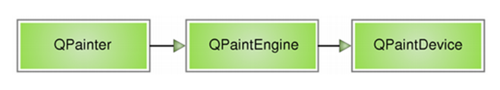
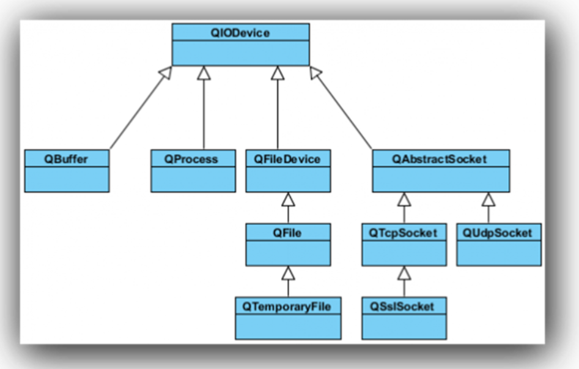

<!-- 2023年10月23日 -->
## 绘图事件和绘图设备
### QPainter-绘画者
Qt 的绘图系统允许使用相同的 API 在屏幕和其它打印设备上进行绘制。整个绘图系统基于QPainter，QPainterDevice和QPaintEngine三个类。

QPainter用来执行绘制的操作；QPaintDevice是一个二维空间的抽象，这个二维空间允许QPainter在其上面进行绘制，也就是QPainter工作的空间；     
QPaintEngine提供了画家（QPainter）在不同的设备上进行绘制的统一的接口。QPaintEngine类应用于QPainter和QPaintDevice之间，通常对开发人员是透明的。除非你需要自定义一个设备，否则你是不需要关心QPaintEngine这个类的。我们可以把QPainter理解成画笔；把QPaintDevice理解成使用画笔的地方，比如纸张、屏幕等；而对于纸张、屏幕而言，肯定要使用不同的画笔绘制，为了统一使用一种画笔，我们设计了QPaintEngine类，这个类让不同的纸张、屏幕都能使用一种画笔。  
下图给出了这三个类之间的层次结构:



上面的示意图告诉我们，Qt 的绘图系统实际上是，使用QPainter在QPainterDevice上进行绘制，它们之间使用QPaintEngine进行通讯（也就是翻译QPainter的指令）。    
下面我们通过一个实例来介绍QPainter的使用：
```c++
class PaintedWidget : public QWidget
{
    Q_OBJECT
public:
    PaintedWidget(QWidget *parent = 0);
protected:
    void paintEvent(QPaintEvent *);
}
```
注意我们重写了QWidget的paintEvent()函数。接下来就是PaintedWidget的源代码：
```c++
PaintedWidget::PaintedWidget(QWidget *parent) :
    QWidget(parent)
{
    resize(800, 600);
    setWindowTitle(tr("Paint Demo"));
}

void PaintedWidget::paintEvent(QPaintEvent *)
{
    QPainter painter(this);
    painter.drawLine(80, 100, 650, 500);
    painter.setPen(Qt::red);
    painter.drawRect(10, 10, 100, 400);
    painter.setPen(QPen(Qt::green, 5));
    painter.setBrush(Qt::blue);
    painter.drawEllipse(50, 150, 400, 200);
}
```
在构造函数中，我们仅仅设置了窗口的大小和标题。而paintEvent()函数则是绘制的代码。首先，我们在栈上创建了一个QPainter对象，也就是说，每次运行paintEvent()函数的时候，都会重建这个QPainter对象。注意，这一点可能会引发某些细节问题：由于我们每次重建QPainter，因此第一次运行时所设置的画笔颜色、状态等，第二次再进入这个函数时就会全部丢失。有时候我们希望保存画笔状态，就必须自己保存数据，否则的话则需要将QPainter作为类的成员变量。 

QPainter接收一个QPaintDevice指针作为参数。QPaintDevice有很多子类，比如QImage，以及QWidget。QPaintDevice可以理解成要在哪里去绘制，而现在我们希望画在这个组件，因此传入的是 this 指针。   
QPainter有很多以 draw 开头的函数，用于各种图形的绘制，比如这里的drawLine()，drawRect()以及drawEllipse()等。当绘制轮廓线时，使用QPainter的pen()属性。  
比如，我们调用了`painter.setPen(Qt::red)`将 pen 设置为红色，则下面绘制的矩形具有红色的轮廓线。接下来，我们将 pen 修改为绿色，5 像素宽（`painter.setPen(QPen(Qt::green, 5))）`，又设置了画刷为蓝色。这时候再调用 draw 函数，则是具有绿色 5 像素宽轮廓线、蓝色填充的椭圆。
## 绘图设备
绘图设备是指继承QPainterDevice的子类。Qt一共提供了四个这样的类，分别是QPixmap、QBitmap、QImage和 QPicture。其中，
- QPixmap专门为图像在屏幕上的显示做了优化
- QBitmap是QPixmap的一个子类，它的色深限定为1，可以使用 QPixmap的isQBitmap()函数来确定这个QPixmap是不是一个QBitmap。
- QImage专门为图像的像素级访问做了优化。 
- QPicture则可以记录和重现QPainter的各条命令。
### QPixmap、QBitmap、QImage
QPixmap继承了QPaintDevice，因此，你可以使用QPainter直接在上面绘制图形。QPixmap也可以接受一个字符串作为一个文件的路径来显示这个文件，  
比如你想在程序之中打开png、jpeg之类的文件，就可以使用 QPixmap。  

使用QPainter的drawPixmap()函数可以把这个文件绘制到一个QLabel、QPushButton或者其他的设备上面。QPixmap是针对屏幕进行特殊优化的，因此，它与实际的底层显示设备息息相关。注意，这里说的显示设备并不是硬件，而是操作系统提供的原生的绘图引擎。所以，在不同的操作系统平台下，QPixmap的显示可能会有所差别。   

QBitmap继承自QPixmap，因此具有QPixmap的所有特性，提供单色图像。  
QBitmap的色深始终为1. 

    色深这个概念来自计算机图形学，是指用于表现颜色的二进制的位数。我们知道，计算机里面的数据都是使用二进制表示的。为了表示一种颜色，我们也会使用二进制。比如我们要表示8种颜色，需要用3个二进制位，这时我们就说色深是3. 因此，所谓色深为1，也就是使用1个二进制位表示颜色。1个位只有两种状态：0和1，因此它所表示的颜色就有两种，黑和白。所以说，QBitmap实际上是只有黑白两色的图像数据。
由于QBitmap色深小，因此只占用很少的存储空间，所以适合做光标文件和笔刷。

白色的背景在QBitmap中消失了，而透明色在QBitmap中转换成了黑色；其他颜色则是使用点的疏密程度来体现（像以前黑白报纸图片打印原理一样）的。

QPixmap使用底层平台的绘制系统进行绘制，无法提供像素级别的操作，而QImage则是使用独立于硬件的绘制系统，实际上是自己绘制自己，因此提供了像素级别的操作，并且能够在不同系统之上提供一个一致的显示形式。  
我们声明了一个QImage对象，大小是300 x 300，颜色模式是RGB32，即使用32位数值表示一个颜色的RGB值，也就是说每种颜色使用8位。然后我们对每个像素进行颜色赋值，从而构成了这个图像。我们可以把QImage想象成一个RGB颜色的二维数组，记录了每一像素的颜色。
```c++
void PaintWidget::paintEvent(QPaintEvent *)
{
    QPainter painter(this);
    QImage image(300, 300, QImage::Format_RGB32);
    QRgb value;

    //将图片背景填充为白色
    image.fill(Qt::white);

    //改变指定区域的像素点的值
    for(int i=50; i<100; ++i)
    {
        for(int j=50; j<100; ++j)
        {
            value = qRgb(255, 0, 0); // 红色
            image.setPixel(i, j, value);
        }
    }

    //将图片绘制到窗口中
    painter.drawImage(QPoint(0, 0), image);
}
se't
```
### QImage与QPixmap的区别
- QPixmap主要是用于绘图，针对屏幕显示而最佳化设计，QImage主要是为图像I/O、图片访问和像素修改而设计的
- QPixmap依赖于所在的平台的绘图引擎，故例如反锯齿等一些效果在不同的平台上可能会有不同的显示效果，QImage使用Qt自身的绘图引擎，可在不同平台上具有相同的显示效果
- 由于QImage是独立于硬件的，也是一种QPaintDevice，因此我们可以在另一个线程中对其进行绘制，而不需要在GUI线程中处理，使用这一方式可以很大幅度提高UI响应速度。
- QImage可通过setPixpel()和pixel()等方法直接存取指定的像素。
QImage与QPixmap之间的转换:
- QImage转QPixmap  
    使用QPixmap的静态成员函数: fromImage()
    ```c++
    QPixmap fromImage(const QImage &image,                  
    Qt::ImageConversionFlags flags = Qt::AutoColor);
    ```
-  QPixmap转QImage:  
    使用QPixmap类的成员函数: toImage()
    ```c++
    QImage toImage() const;
    ```
### QPicture
最后一个需要说明的是QPicture。这是一个可以记录和重现QPainter命令的绘图设备。   
QPicture将QPainter的命令序列化到一个IO设备，保存为一个平台独立的文件格式。这种格式有时候会是“元文件(meta- files)”。  
Qt的这种格式是二进制的，不同于某些本地的元文件，Qt的pictures文件没有内容上的限制，只要是能够被QPainter绘制的元素，不论是字体还是pixmap，或者是变换，都可以保存进一个picture中。  
QPicture是平台无关的，因此它可以使用在多种设备之上，比如svg、pdf、ps、打印机或者屏幕。回忆下我们这里所说的QPaintDevice，实际上是说可以有QPainter绘制的对象。QPicture使用系统的分辨率，并且可以调整 QPainter来消除不同设备之间的显示差异。  
如果我们要记录下QPainter的命令，首先要使用QPainter::begin()函数，将QPicture实例作为参数传递进去，以便告诉系统开始记录，记录完毕后使用QPainter::end()命令终止。代码示例如下：
```c++
void PaintWidget::paintEvent(QPaintEvent *)
{
    QPicture pic;
    QPainter painter;
         //将图像绘制到QPicture中,并保存到文件
    painter.begin(&pic);
    painter.drawEllipse(20, 20, 100, 50);
    painter.fillRect(20, 100, 100, 100, Qt::red);
    painter.end();
    pic.save("D:\\drawing.pic");

         //将保存的绘图动作重新绘制到设备上
    pic.load("D:\\drawing.pic");
    painter.begin(this);
    painter.drawPicture(200, 200, pic);
    painter.end();
}
```
## 文件操作
### 文件操作
文件操作是应用程序必不可少的部分。Qt 作为一个通用开发库，提供了跨平台的文件操作能力。Qt通过QIODevice提供了对 I/O 设备的抽象，这些设备具有读写字节块的能力。下面是I/O 设备的类图（Qt5）：


- QIODevice：所有 I/O 设备类的父类，提供了字节块读写的通用操作以及基本接口；
- QFileDevice：Qt5新增加的类，提供了有关文件操作的通用实现。
- QFlie：访问本地文件或者嵌入资源；
- QTemporaryFile：创建和访问本地文件系统的临时文件；
- QBuffer：读写QbyteArray, 内存文件；
- QProcess：运行外部程序，处理进程间通讯；
- QAbstractSocket：所有套接字类的父类；
- QTcpSocket：TCP协议网络数据传输；
- QUdpSocket：传输 UDP 报文；
- QSslSocket：使用 SSL/TLS 传输数据；
### 文件系统分类:
- 顺序访问设备:
    是指它们的数据只能访问一遍：从头走到尾，从第一个字节开始访问，直到最后一个字节，中途不能返回去读取上一个字节，这其中，QProcess、QTcpSocket、QUdpSoctet和QSslSocket是顺序访问设备。
- 随机访问设备:
可以访问任意位置任意次数，还可以使用QIODevice::seek()函数来重新定位文件访问位置指针，QFile、QTemporaryFile和QBuffer是随机访问设备， 
### 基本文件操作
文件操作是应用程序必不可少的部分。Qt 作为一个通用开发库，提供了跨平台的文件操作能力。在所有的 I/O 设备中，文件 I/O 是最重要的部分之一。因为我们大多数的程序依旧需要首先访问本地文件（当然，在云计算大行其道的将来，这一观点可能改变）。QFile提供了从文件中读取和写入数据的能力。  
我们通常会将文件路径作为参数传给QFile的构造函数。不过也可以在创建好对象最后，使用setFileName()来修改。QFile需要使用 / 作为文件分隔符，不过，它会自动将其转换成操作系统所需要的形式。例如 C:/windows 这样的路径在 Windows 平台下同样是可以的。  
QFile主要提供了有关文件的各种操作，比如打开文件、关闭文件、刷新文件等。我们可以使用QDataStream或QTextStream类来读写文件，也可以使用QIODevice类提供的read()、readLine()、readAll()以及write()这样的函数。  
值得注意的是，有关文件本身的信息，比如文件名、文件所在目录的名字等，则是通过QFileInfo获取，而不是自己分析文件路径字符串。
下面我们使用一段代码来看看QFile的有关操作：
```c++
int main(int argc, char *argv[])
{
    QApplication app(argc, argv);
    
    QFile file("in.txt");
    if (!file.open(QIODevice::ReadOnly | QIODevice::Text)) {
        qDebug() << "Open file failed.";
        return -1;
    } else {
        while (!file.atEnd()) {
            qDebug() << file.readLine();
        }
    }
    
    QFileInfo info(file);
    qDebug() << info.isDir();
    qDebug() << info.isExecutable();
    qDebug() << info.baseName();
    qDebug() << info.completeBaseName();
    qDebug() << info.suffix();
    qDebug() << info.completeSuffix();
    
    return app.exec();
}
```
- 我们首先使用QFile创建了一个文件对象。  
    这个文件名字是 in.txt。如果你不知道应该把它放在哪里，可以使用QDir::currentPath()来获得应用程序执行时的当前路径。只要将这个文件放在与当前路径一致的目录下即可。
- 使用open()函数打开这个文件，打开形式是只读方式，文本格式。  
    这个类似于fopen()的 r 这样的参数。open()函数返回一个 bool 类型，如果打开失败，我们在控制台输出一段提示然后程序退出。否则，我们利用 while 循环，将每一行读到的内容输出。
- 可以使用QFileInfo获取有关该文件的信息。  
    QFileInfo有很多类型的函数，我们只举出一些例子。比如：
- isDir() 检查该文件是否是目录（在操作系统这种，文件夹是一种特殊的文件，我们可以通过QFile来打开一个文件夹或者路径，这个函数返回值就是判断他是不是一个文件夹或路径）；
-  isExecutable()   检查该文件是否可以被执行。
- baseName()           可以直接获得文件名；
- completeBaseName()  获取完整的文件名
- suffix()  则直接获取文件后缀名。
-  completeSuffix()     获取完整的文件后缀

我们可以由下面的示例看到，baseName()和completeBaseName()，以及suffix()和completeSuffix()的区别：
```c++
QFileInfo fi("/tmp/archive.tar.gz");
QString base  = fi.baseName();  // base = "archive"
QString base  = fi.completeBaseName();  // base = "archive.tar"
QString ext   = fi.suffix();  // ext = "gz"
QString ext   = fi.completeSuffix();  // ext = "tar.gz"
```
### 二进制文件读写
QDataStream提供了基于QIODevice的二进制数据的序列化。数据流是一种二进制流，这种流完全不依赖于底层操作系统、CPU 或者字节顺序（大端或小端）。例如，在安装了 Windows 平台的 PC 上面写入的一个数据流，可以不经过任何处理，直接拿到运行了 Solaris 的 SPARC 机器上读取。由于数据流就是二进制流，因此我们也可以直接读写没有编码的二进制数据，例如图像、视频、音频等。  
QDataStream既能够存取 C++ 基本类型，如 int、char、short 等，也可以存取复杂的数据类型，例如自定义的类。实际上，QDataStream对于类的存储，是将复杂的类分割为很多基本单元实现的。
结合QIODevice，QDataStream可以很方便地对文件、网络套接字等进行读写操作。我们从代码开始看起：
```c++
QFile file("file.dat");
file.open(QIODevice::WriteOnly);
QDataStream out(&file);
out << QString("the answer is");
out << (qint32)42;
```
在这段代码中，我们首先打开一个名为 file.dat 的文件（注意，我们为简单起见，并没有检查文件打开是否成功，这在正式程序中是不允许的）。然后，我们将刚刚创建的file对象的指针传递给一个QDataStream实例out。类似于std::cout标准输出流，QDataStream也重载了输出重定向<<运算符。后面的代码就很简单了：将“the answer is”和数字 42 输出到数据流。由于我们的 out 对象建立在file之上，因此相当于将问题和答案写入file。  
需要指出一点：最好使用 Qt 整型来进行读写，比如程序中的qint32。这保证了在任意平台和任意编译器都能够有相同的行为。  
如果你直接运行这段代码，你会得到一个空白的 file.dat，并没有写入任何数据。这是因为我们的file没有正常关闭。为性能起见，数据只有在文件关闭时才会真正写入。因此，我们必须在最后添加一行代码：  
```c++
file.close(); // 如果不想关闭文件，可以使用 file.flush();
```
接下来我们将存储到文件中的答案取出来
```c++
QFile file("file.dat");
file.open(QIODevice::ReadOnly);
QDataStream in(&file);
QString str;
qint32 a;
in >> str >> a;
```
唯一需要注意的是，你必须按照写入的顺序，将数据读取出来。顺序颠倒的话，程序行为是不确定的，严重时会直接造成程序崩溃。
那么，既然QIODevice提供了read()、readLine()之类的函数，为什么还要有QDataStream呢？  
QDataStream同QIODevice有什么区别？区别在于，QDataStream提供流的形式，性能上一般比直接调用原始 API 更好一些。我们通过下面一段代码看看什么是流的形式：
```c++
QFile file("file.dat");
file.open(QIODevice::ReadWrite);
    
QDataStream stream(&file);
QString str = "the answer is 42";

stream << str;
```
### 文本文件读写
二进制文件比较小巧，却不是人可读的格式。而文本文件是一种人可读的文件。为了操作这种文件，我们需要使用QTextStream类。QTextStream和QDataStream的使用类似，只不过它是操作纯文本文件的。     
QTextStream会自动将 Unicode 编码同操作系统的编码进行转换，这一操作对开发人员是透明的。它也会将换行符进行转换，同样不需要自己处理。QTextStream使用 16 位的QChar作为基础的数据存储单位，同样，它也支持 C++ 标准类型，如 int 等。实际上，这是将这种标准类型与字符串进行了相互转换。  
QTextStream同QDataStream的使用基本一致，例如下面的代码将把“The answer is 42”写入到 file.txt 文件中：
```c++
QFile data("file.txt");
if (data.open(QFile::WriteOnly | QIODevice::Truncate)) 
{
    QTextStream out(&data);
    out << "The answer is " << 42;
}
```
这里，我们在open()函数中增加了QIODevice::Truncate打开方式。我们可以从下表中看到这些打开方式的区别：  
枚举值                  |      描述|
-|-
QIODevice::NotOpen     |   未打开
QIODevice::ReadOnly    |    以只读方式打开
QIODevice::WriteOnly   |     以只写方式打开
QIODevice::ReadWrite   |    以读写方式打开
QIODevice::Append      |            以追加的方式打开，新增加的内容将被追加到文件末尾
QIODevice::Truncate    |      以重写的方式打开，在写入新的数据时会将原有数据全部清除，游标设置在文件开头。
QIODevice::Text        |       在读取时，将行结束符转换成 \n；在写入时，将行结束符转换成本地格式，例如 Win32 平台上是 \r\n
QIODevice::Unbuffered |忽略缓存

我们在这里使用了QFile::WriteOnly | QIODevice::Truncate，也就是以只写并且覆盖已有内容的形式操作文件。注意，QIODevice::Truncate会直接将文件内容清空。  
虽然QTextStream的写入内容与QDataStream一致，但是读取时却会有些困难：
```c++
QFile data("file.txt");
if (data.open(QFile::ReadOnly)) 
{
    QTextStream in(&data);
    QString str;
    int ans = 0;
    in >> str >> ans;
}
```
在使用QDataStream的时候，这样的代码很方便，但是使用了QTextStream时却有所不同：读出的时候，str 里面将是 The answer is 42，ans 是 0。这是因为当使用QDataStream写入的时候，实际上会在要写入的内容前面，额外添加一个这段内容的长度值。而以文本形式写入数据，是没有数据之间的分隔的。因此，使用文本文件时，很少会将其分割开来读取，而是使用诸如使用：
```c++
QTextStream::readLine();//读取一行
QTextStream::readAll();//读取所有文本
```
这种函数之后再对获得的QString对象进行处理。
默认情况下，QTextStream的编码格式是 Unicode，如果我们需要使用另外的编码，可以使用：
`stream.setCodec("UTF-8");`
这样的函数进行设置。
    ## 综合实例
画笔
```c++

// 重写分类的绘图成员
void MainWindow::paintEvent(QPaintEvent *event)
{

    // 在窗口上绘图

    // // 创建画家对象
    // //  QPainter* painter = new QPainter(this); //不建议new对象
    // QPainter painter(this);
    // QPen pen;
    // pen.setWidth(5);                 // 设置画笔宽度
    // pen.setColor(QColor(255, 0, 0)); // 设置画笔颜色
    // // pen.setStyle(Qt::DashDotLine);  //设置画笔风格
    // // pen.setBrush(QBrush(Qt::Dense3Pattern));    //设置画笔的画刷
    // // painter.setRenderHint(QPainter::HighQualityAntialiasing);   //设置高质量绘图
    // QBrush brush(Qt::HorPattern);
    // painter.setBrush(brush); // 设置画家的画刷
    // painter.setPen(pen);
    // painter.drawPoint(50, 50);
    // painter.drawLine(QPoint(0, 0), QPoint(50, 50)); // 画线
    // painter.drawEllipse(QPoint(100, 100), 50, 50); // 画椭圆,画正的就圆
    // painter.drawRect(150, 120, 100, 62);//画长方形 ,画正的就是正方形

    // 在推图设备上绘制
    // QPixmap pixmap(200, 200);         // 设置画布大小为200*200
    // pixmap.fill(Qt::black);           // 设置画布背景填充为黑色
    // QPainter painter(&pixmap);        // 设置画家在自定义的pixmap画布上画图
    // painter.setPen(QColor(Qt::cyan)); // 设置笔的颜色是青色
    // painter.drawEllipse(QPoint(100, 100), 50, 50);
    // pixmap.save("./1.png");         // 设置保存画布的地址,运行时要注意工程目录设置,使用vscode和qtcreate的工程目录是不一样的

    // 将图片在本窗口显示
    // QPixmap pixmap11("./1.png");        // 打开指定图片
    // QPainter painter1(this);           // 设置画板为当前窗口
    // painter1.drawPixmap(0, 0, pixmap11); // 在某个位置画出某个图

    // 效果同上
    // QBitmap bitmap = QBitmap("./1.png");
    // QPainter painter(this);
    // painter.drawPixmap(QPoint(0, 0), bitmap);

    //    QBitmap bitmap(200,200);//设置画布
    //    bitmap.fill(Qt::white);//填充白色`
    //    QPainter painter(&bitmap);//让画家在这里画
    //    painter.setPen(QColor(Qt::black));
    //    painter.drawEllipse(QPoint(0,0),50,50);//画圆
    //    bitmap.save("./bitmap.png");//保存画布到磁盘

    // QImage image("./AA.bmp");
    // image.setPixel(QPoint(9, 9), qRgb(255, 0, 0)); // 设置坐标为9,9的点的颜色并保存
    // image.save("./bitmap_image.png");

    // QImage image("./AA.bmp");
    // QPainter painter(this);

    // for (int i = 0; i < 200; ++i)
    // {
    //     for (int j = 0; j < 200; ++j)
    //         image.setPixel(i, j, qRgb( 0,255, 0));
    // }

    // painter.drawImage(QPoint(0, 0), image);

    // image.save("./draw_bitmap.png");

    // // 绘制picture
    // QPicture picture;
    
    // QPainter painter;//定义画者

    // painter.begin(&picture); // 需要启动绘图

    // painter.setPen(QColor(0, 255, 0));

    // painter.drawRect(0, 0, 100, 100);
    // painter.drawLine(QPoint(0, 0), QPoint(50, 50));
    // painter.end(); // 手动调用结束绘图
    // painter.drawLine(QPoint(0, 0), QPoint(100, 100));//在end外面不会执行

    // picture.save("./qt_picture.png");

    //    //读取picture图片
    // QPicture picture;
    // picture.load("./qt_picture.png");
    // QPainter painter(this);
    // painter.drawPicture(0, 0, picture);//画出来

    //    //移动画家位置
    //    QPainter painter(this);
    //    painter.drawEllipse(0,0,50,50);

    //    for(int i = 0;i<10;++i)
    //    {
    //        painter.translate(50,0);        //移动画家位置
    //        painter.drawEllipse(0,0,50,50);
    //    }

    // QPixmap pixmap("F:/QtProject/day08/paintEvent/1.png");
    // QPainter painter(this);
    // painter.drawPixmap(x, 0, pixmap);

    // qDebug() << x; // 注意这里不能增加x，因为一个窗口的绘制不是调用一次绘图事件就能完成的。因此会导致x增加多次。
}
/*
void MainWindow::on_pushButton_clicked()
{
    x++;
    update(); // 手动调用重新绘图事件,即调用重写的paintEvent函数
} */
```
文件操作
```c++

```