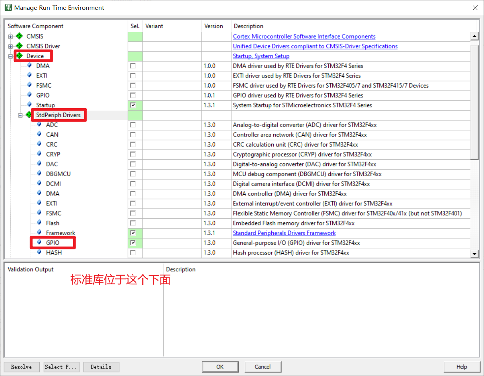
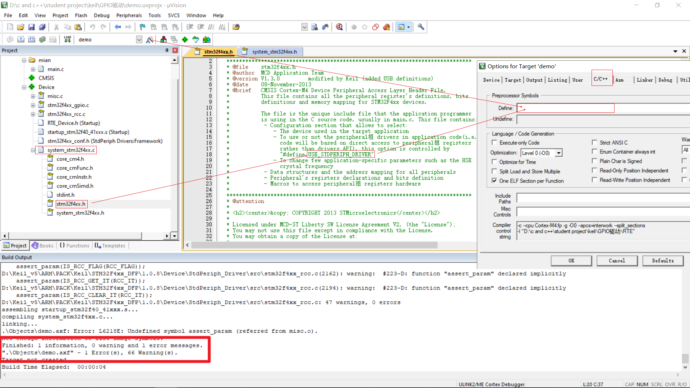

## 标准库的使用
创建工程时,添加标准库

标准库添加后,应添加全局宏,负责会报错


## volatile优化
我们平时使用一般使用二级优化  
而三级优化一般不用,有可能过于优化  
告诉编译器不要优化指定 变量/地址

在stm32中`volatile`一般用于全局变量/地址

## 练习
### 跑马灯
main.c
```c
#include "stdio.h"
#include "led.h"

// 延时
void daley(int mtime);
int main(void)
{
    int i;
    // 初始化灯
    initLed(LED_All);
    for (i = 0; i < 5; i++)
    {
        if (i == 4)
        {
            i = 0;
        }
        ledLight(1 << i, ON);
        daley(7000);
        ledLight(1 << i, OFF);
    }
    return 0;
}

// 延时
void daley(int mtime)
{
    int i = 0;
    for (i = 0; i < 1000 * mtime; i++)
        ;
}


```
### 流水灯
```c
#include "stdio.h"
#include "led.h"

// 延时
void daley(int mtime);
int main(void)
{
    int i;
    // 初始化灯
    initLed(LED_All);
    for (i = 0; i < 5; i++)
    {
        if (i == 4)
        {
            i = 0;
            ledLight(1 << 0, OFF);
            ledLight(1 << 1, OFF);
            ledLight(1 << 2, OFF);
            ledLight(1 << 3, OFF);
            daley(7000);
        }
        ledLight(1 << i, ON);
        daley(7000);
    }
    return 0;
}

// 延时
void daley(int mtime)
{
    int i = 0;
    for (i = 0; i < 1000 * mtime; i++)
        ;
}

```

### 按下对应按键就亮对应的灯
```c
#include "stdio.h"
#include "led.h"
#include "key.h"

// 延时
void daley(int mtime);
int main(void)
{
    uint8_t i,state;
    // 初始化灯
    initLed(LED_All);
    initKey(KEY_All);
    for(i=0;i<5;i++)
    {
        i%=2;
        state=i?keyPush(KEY_All):keyUp(KEY_All);
        if(KEY_0&state)
        {
            i?ledLight(1 << 0, OFF):ledLight(1 << 0, ON);
        }
        if(KEY_1&state)
        {
            i?ledLight(1 << 1, OFF):ledLight(1 << 1, ON);
        }
        if(KEY_2&state)
        {
            i?ledLight(1 << 2, OFF):ledLight(1 << 2, ON);
        }
        if(KEY_3&state)
        {
            i?ledLight(1 << 3, OFF):ledLight(1 << 3, ON);
        }
    }
    
    return 0;
}

// 延时
void daley(int mtime)
{
    int i = 0;
    for (i = 0; i < 1000 * mtime; i++)
        ;
}

```
按键主函数的循环也能这样写  
将四个if缩减为一个for  
```c
int main(void)
{
    uint8_t i, state, j;
    // 初始化灯
    initLed(LED_All);
    initKey(KEY_All);
    for (i = 0; i < 5; i++)
    {
        i %= 2;
        state = i ? keyPush(KEY_All) : keyUp(KEY_All);
        for (j = 0; j < 4; j++)
        {
            if ((KEY_0<<j) & state)
            {
                i ? ledLight(1 << j, OFF) : ledLight(1 << j, ON);
            }
        }
    }

    return 0;
}
```