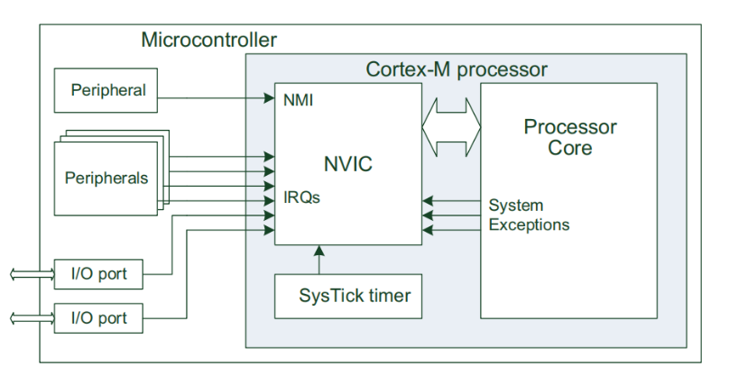
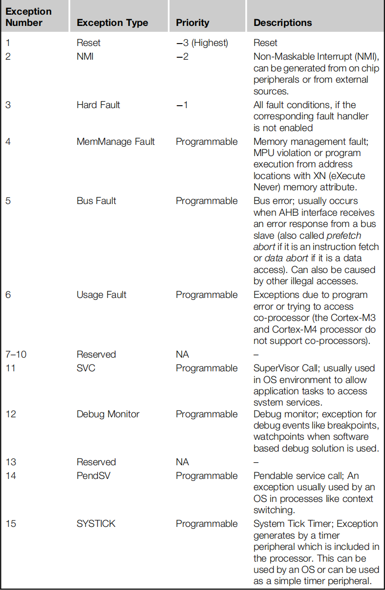
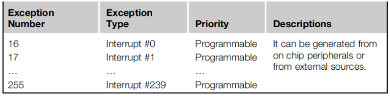
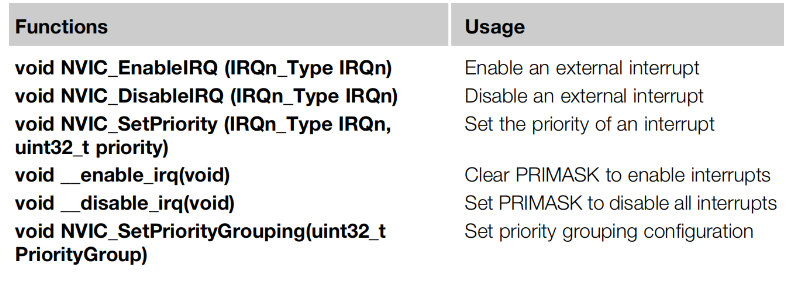
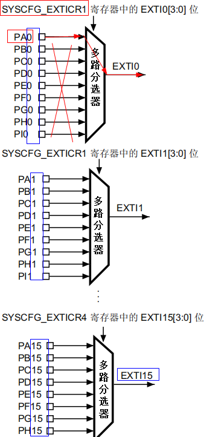
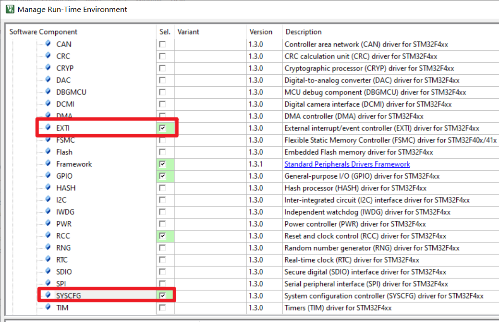
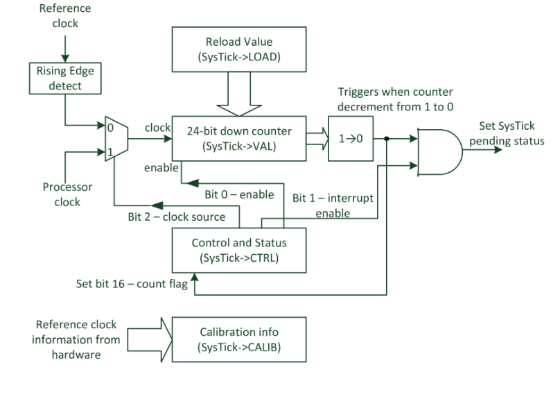
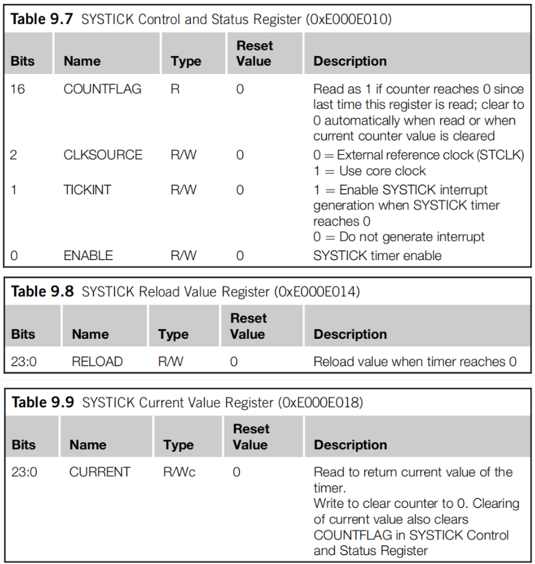
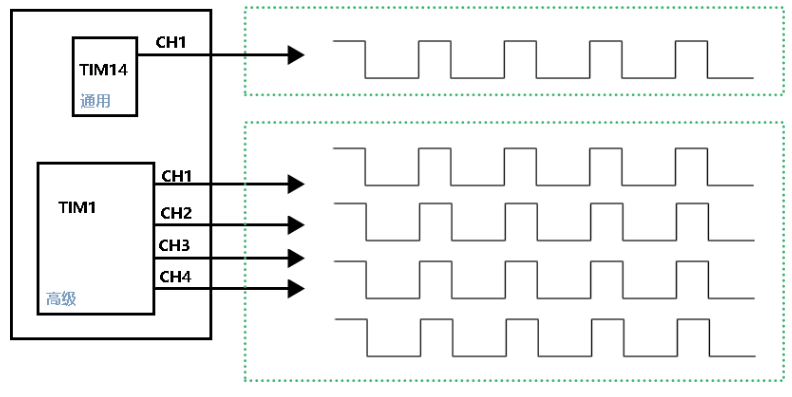

## 中断
### 中断的基本概念
中断的定义及中断工作方式  
中断，即CPU在正常执行程序的过程中，遇到外部／内部的紧急事件需要处理，暂时中断(中止)当前程序的执行，而转去为事件服务，待服务完毕，再返回到暂停处(断点)继续执行原来的程序。

通俗的说：比如我正在写代码，老板突然给我一个任务，我暂停的写代码，转而把老板布置的任务完成之后，再继续写代码，这个过程就可以理解成中断。

从中断的定义中引出了以下几个新的概念：   
1. 事件的“偶然”性与“必然”性  
	例如，计算机键盘、鼠标的设置就为计算机系统增加了两个必然的“偶然”事件发生的机会。


通俗一点来讲，中断，意味着中途打断现在干的事情，要立即处理紧急的事件。
现实的例子：手机玩游戏的时候，突然来电话。在编程当中还常遇到实时接收数据的请求，都使用中断服务函数，


### 中断的作用
提高硬件响应，及时处理。

### 中断源（中断触发的硬件） 
1. 中断源：介于事件与CPU之间的电路模块。
1. 中断请求信号：事件引起的，由中断源产生的，能被单片机识别的信号。 

### 中断类型
- 中断产生来源于事件。因此根据事件来源地，将中断分为外部中断和内部中断两种类型。  
- 外部中断是指由单片机外部事件引发的中断。  
- 内部中断是指由单片机芯片内部事件引发的中断。  

### 中断优先级
事件具有不同的轻重、缓急程度。系统工作时，我们总希望最紧急的事件优先被处理，以保证系统的实时性。这就引出了中断的优先级、中断嵌套问题。


## 异常与中断

（一）概述
《Cortex M3与M4权威指南》章节4.5 P104
Exceptions are events that cause changes to program flow. When one happens, the processor suspends the current executing task and executes a part of the program called the exception handler. After the execution of the exception handler is completed, the processor then resumes normal program execution. In the ARM architecture, interrupts are one type of exception. Interrupts are usually generated from peripheral or external inputs, and in some cases they can be triggered by software. The exception handlers for interrupts are also referred to as Interrupt Service Routines (ISR)。
Each exception source has an exception number. Exception numbers 1 to 15  as system exceptions, and exceptions 16 and above are for interrupts. The design of the NVIC in the Cortex-M3 and Cortex-M4 processors can support up to 240 interrupt inputs. However, in practice the number of interrupt inputs imple mented in the design is far less, typically in the range of 16 to 100. In this way the silicon size of the design can be reduced, which also reduces power consumption。



Nested vectored interrupt controller (NVIC，嵌套向量中断控制器)
The NVIC is a part of the Cortex-M processor. It is programmable and its registers are located in the System Control Space (SCS) of the memory map 
The NVIC handles the exceptions and interrupt configurations, prioritization, and interrupt masking. The NVIC has the following features:
• Flexible exception and interrupt management
• Nested exception/interrupt support
• Vectored exception/interrupt entry
• Interrupt masking


### 异常类型
《Cortex M3与M4权威指南》章节7.2 P232
1.系统异常


2.中断



（三）中断控制
《Cortex M3与M4权威指南》章节7.3 P235



After reset, all interrupts are disabled and given a priority-level value of 0. Before using any interrupts, you need to:
Set up the priority level of the required interrupt (this step is optional)
Enable the interrupt generation control in the peripheral that triggers the interrupt
Enable the interrupt in the NVIC

In most typical applications, this is all you need to do. When the interrupt triggers, the corresponding Interrupt Service Routine (ISR) will execute (you might need to clear the interrupt request from the peripheral within the handler). The name of the ISR can be found inside the vector table inside the startup code, which is also provided by the microcontroller vendor. The name of the ISR needs to match the name used in the vector table so that the linker can place the starting address of the ISR into the vector table correctly.

（四）向量表（Vector table）
《Cortex M3与M4权威指南》章节4.5.3 P107
When an exception event takes place and is accepted by the processor core, the corresponding exception handler is executed. To determine the starting address of the exception handler, a vector table mechanism is used. The vector table is an array of word data inside the system memory, each representing the starting address of one exception type。

## STM32 的外部中断


### 中断引脚
多达 140 个 GPIO（STM32F405xx/07xx 和 STM32F415xx/17xx）通过以下方式连接到 16 个外部中断/事件线。  
例如：PA0占用了EXTI0，其他PB0~PI0是不能使用的。




引脚编号决定了对应哪个外部中断。

### 代码思路

#### 8051单片机
外部中断的触发方式：低电平触发、下降沿触发 IT0=1
允许外部中断引脚申请中断请求 EX0=1
优先级的配置
中断服务函数

#### STM32
端口A硬件时钟使能  
SYSCFG硬件时钟使能  
配置引脚的工作模式  
将引脚连接到外部中断  
中断触发方式：电平触发、边沿触发  
允许外部中断引脚申请中断请求  
优先级的配置  
中断服务函数  

注：
中断服务函数是不能被调用，编写格式不能随意编写，这是它特有的存在形式。不同的硬件平台，其编写方法是不一样的。

### 函数接口

#### 为引脚选择使用哪个中断
```c
/**
  * @brief  Selects the GPIO pin used as EXTI Line.
  * @param  EXTI_PortSourceGPIOx : selects the GPIO port to be used as source for
  *          EXTI lines where x can be (A..K) for STM32F42xxx/43xxx devices, (A..I) 
  *          for STM32F405xx/407xx and STM32F415xx/417xx devices or (A, B, C, D and H)
  *          for STM32401xx devices.  
  *            
  * @param  EXTI_PinSourcex: specifies the EXTI line to be configured.
  *           This parameter can be EXTI_PinSourcex where x can be (0..15, except
  *           for EXTI_PortSourceGPIOI x can be (0..11) for STM32F405xx/407xx
  *           and STM32F405xx/407xx devices and for EXTI_PortSourceGPIOK x can   
  *           be (0..7) for STM32F42xxx/43xxx devices. 
  *             
  * @retval None
  */
void SYSCFG_EXTILineConfig(uint8_t EXTI_PortSourceGPIOx, uint8_t EXTI_PinSourcex)
```
#### 配置外部中断
```c
/**
  * @brief  Initializes the EXTI peripheral according to the specified
  *         parameters in the EXTI_InitStruct.
  * @param  EXTI_InitStruct: pointer to a EXTI_InitTypeDef structure
  *         that contains the configuration information for the EXTI peripheral.
  * @retval None
  */
void EXTI_Init(EXTI_InitTypeDef* EXTI_InitStruct)
```

#### 中断优先级配置
```c
/**
  * @brief  Initializes the NVIC peripheral according to the specified
  *         parameters in the NVIC_InitStruct.
  * @note   To configure interrupts priority correctly, the NVIC_PriorityGroupConfig()
  *         function should be called before. 
  * @param  NVIC_InitStruct: pointer to a NVIC_InitTypeDef structure that contains
  *         the configuration information for the specified NVIC peripheral.
  * @retval None
  */
void NVIC_Init(NVIC_InitTypeDef* NVIC_InitStruct)
```
#### 获取外部中断状态
```c
/**
  * @brief  Checks whether the specified EXTI line is asserted or not.
  * @param  EXTI_Line: specifies the EXTI line to check.
  *          This parameter can be EXTI_Linex where x can be(0..22)
  * @retval The new state of EXTI_Line (SET or RESET).
  */
ITStatus EXTI_GetITStatus(uint32_t EXTI_Line)
```

#### 清空外部中断标志位
```c
/**
  * @brief  Clears the EXTI's line pending bits.
  * @param  EXTI_Line: specifies the EXTI lines to clear.
  *          This parameter can be any combination of EXTI_Linex where x can be (0..22)
  * @retval None
  */
void EXTI_ClearITPendingBit(uint32_t EXTI_Line)
```

### 中断优先级

中断优先级的一个意义：出现多个中断同时触发，但是不能同时处理，所以先后顺序之分，要根据实际上的运行环境优先处理重要的中断。
#### 概述
STM32 对中断优先级进行分组，共 5 组，组 0~4，这些分组是用于指定当前M4支持多少级抢占优先级和多少个响应优先级。同时，对每个中断设置一个抢占优先级和一个响应优先级。函数原型如下：
```c
/**
  * @brief  Configures the priority grouping: pre-emption priority and subpriority.
  * @param  NVIC_PriorityGroup: specifies the priority grouping bits length. 
  *   This parameter can be one of the following values:
  *     @arg NVIC_PriorityGroup_0: 0 bits for pre-emption priority    //不支持抢占优先级
  *                                4 bits for subpriority             //支持16级响应优先级
  *     @arg NVIC_PriorityGroup_1: 1 bits for pre-emption priority    //支持2级抢占优先级
  *                                3 bits for subpriority             //支持8级响应优先级
  *     @arg NVIC_PriorityGroup_2: 2 bits for pre-emption priority    //支持4级抢占优先级
  *                                2 bits for subpriority             //支持4级响应优先级
  *     @arg NVIC_PriorityGroup_3: 3 bits for pre-emption priority    //支持8级抢占优先级
  *                                1 bits for subpriority             //支持2级响应优先级
  *     @arg NVIC_PriorityGroup_4: 4 bits for pre-emption priority    //支持16级抢占优先级
  *                                0 bits for subpriority             //不支持响应优先级
  * @note   When the NVIC_PriorityGroup_0 is selected, IRQ pre-emption is no more possible. 
  *         The pending IRQ priority will be managed only by the subpriority. 
  * @retval None
  */
void NVIC_PriorityGroupConfig(uint32_t NVIC_PriorityGroup)
```
只要开机初始化一次就可以了。

#### 抢占优先级与响应优先级区别
1) 高抢占优先级是可以打断正在进行的低抢占优先级的中断。抢占优先级若相同，则不会出现抢占的过程。
2) 抢占优先级相同的中断，高响应优先级不可以打断低响应优先级的中断。
3) 抢占优先级相同的中断，当两个中断同时发生的情况下，哪个响应优先级高，哪个先执行（响应）。
4) 抢占优先级相同且响应优先级相同的中断，假如同时发生，会按照硬件内部固定的优先级执行
5) 无论是抢占优先级、响应优先级还是硬件内部的优先级，优先级数值越小，就代表优先级越高。


组|寄存器\[0:3\]|分配情况|分配结果
-|-|-|-|
0|111|0bit抢占中断<br/>4bit响应中断|中断:<br/>不可以配置抢占优先级<br/>可配置0-15级抢占优先级
1|110|1bit抢占中断<br/>3bit响应中断|中断:<br/>可配置0-1级抢占优先级<br/>可配置0-7级抢占优先级
2|101|2bit抢占中断<br/>2bit响应中断|中断:<br/>可配置0-3级抢占优先级<br/>可配置0-3级抢占优先级
3|100|3bit抢占中断<br/>1bit响应中断|中断:<br/>可配置0-7级抢占优先级<br/>可配置0-1级抢占优先级
4|011|4bit抢占中断<br/>0bit响应中断|中断:<br/>可配置0-15级抢占优先级<br/>不可以配置0-1级抢占优先级


使用系统中断需要添加两个


## 系统定时器

### 简介
SysTick 叫做系统滴答时钟、系统定时器，属于 Cortex-M4 内核中的一个外设(外围设备)，并且是24bit向下递减的计数器。

《STM32中文参考手册》P108
RCC 向 Cortex 系统定时器 (SysTick) 馈送 8 分频的 AHB 时钟 (HCLK)。SysTick 可使用此时钟作为时钟源，也可使用 HCLK 作为时钟源。


具体可在 SysTick 控制和状态寄存器中配置。

注意：
- 定时器的位数越多，定时时间更长。
- 通过计数值间接计算定时时间，不能像操作系统直接调用函数实现延时或定时功能。

计数值，就是要进行多少个计数。

### 工作原理


### 频率的概念

物质在1s内完成周期性变化的次数叫做频率，常用f表示。为了纪念德国物理学家赫兹的贡献，人们把频率的单位命名为赫兹，简称“赫”，符号为HZ。  
周期与频率的关系：f=1/T。（其中f为频率，T为周期）。  
周期，物体作往复运动或物理量作周而复始的变化时，重复一次所经历的时间。物体或物理量（如交变电流、电压等）完成一次振动（或振荡）所经历的时间。

### 库函数

参考文档：《Cortex M3与M4权威指南.pdf》第314页

#### 系统定时器配置
```c
/** \brief  System Tick Configuration

    The function initializes the System Timer and its interrupt, and starts the System Tick Timer.
    Counter is in free running mode to generate periodic interrupts.

    \param [in]  ticks  Number of ticks between two interrupts.

    \return          0  Function succeeded.
    \return          1  Function failed.

    \note     When the variable <b>__Vendor_SysTickConfig</b> is set to 1, then the
    function <b>SysTick_Config</b> is not included. In this case, the file <b><i>device</i>.h</b>
    must contain a vendor-specific implementation of this function.

 */
__STATIC_INLINE uint32_t SysTick_Config(uint32_t ticks)
```
示例：
```c
//系统定时器触发1KHz的中断,中断周期时间T= 1/f = 1000ms/1000=1ms
//系统定时器连接到PLL输出的168MHz时钟 
//只要系统定时器进行168000000次计数，就是1秒时间的到达
//只要系统定时器进行168000次计数，就是1ms时间的到达
//只要系统定时器进行168次计数，就是1us时间的到达	
SysTick_Config(SystemCoreClock/1000);
SysTick_Config(168000);
```
注：若发现定时不准确，检查PLL配置是否正确。

### 最大定时时间

- 确定最大的计数值2^24 -1，若计算到0，则进行2^24次计数。
```c
1000ms       Tmax
--------  = --------  
168000000    2^24

Tmax = 2^24 *1000ms/168000000 = 99.86ms。

```

- 测试结果

初始化系统定时器，1S 内核触发 1000 次中断，说白了定时 1ms，能够成功
```c
SysTick_Config(SystemCoreClock/1000);
```
初始化系统定时器，1S 内核触发 10 次中断，说白了定时 100ms,现象失败
```c
SysTick_Config(SystemCoreClock/10);
```
初始化系统定时器，1S 内核触发 11 次中断，说白了定时 90.90ms,能够成功
```c
SysTick_Config(SystemCoreClock/11);
```
总结：填写中断频率值不能小于11，否则定时时间不准确。
```
SysTick_Config(SystemCoreClock/11);
```
## 系统定时器的延时函数

### 系统定时器的用途

没有操作系统：只用于延时
有操作系统（ucos2 ucos3 freertos....）:为操作系统提供精准的定时中断（1ms~50ms）

### 官方示例

参考文档：《Cortex M3与M4权威指南.pdf》第314页

In many cases you might not want to use the SysTick_Config function because you might want to use the reference clock or you might not want to enable the SysTick interrupt. In these cases you need to program the SysTick registers directly,and the following sequence is recommended:
1). Disable the SysTick timer by writing 0 to SysTick->CTRL. This step is optional.It is recommended for reusable code because the SysTick could have been enabled previously.
2). Write the new reload value to SysTick->LOAD.
3). Write to the SysTick Current Value register SysTick->VAL with any value to clear the current value to 0.
4). Write to the SysTick Control and Status register SysTick->CTRL to start the SysTick timer.

参考文档：《Cortex M3与M4权威指南.pdf》第316页

If you want to use the SysTick timer in polling mode, you can use the count flag in the SysTick Control and Status Register (SysTick->CTRL) to determine when the timer reaches zero. For example, you can create a timed delay by setting the SysTick timer to a certain value and waiting until it reaches zero:
```c
SysTick->CTRL = 0; // Disable SysTick
SysTick->LOAD = 0xFF; // Count from 255 to 0 (256 cycles)
SysTick->VAL = 0; // Clear current value as well as count flag
SysTick->CTRL = 5; // Enable SysTick timer with processor clock
while ((SysTick->CTRL & 0x00010000)==0);// Wait until count flag is set
SysTick->CTRL = 0; // Disable SysTick
```

### 相关寄存器




### 毫秒级延时函数
```c
void delay_ms(uint32_t ms)
{
	while(ms --)
	{
		SysTick->CTRL = 0; 			// 关闭系统定时器后才能配置寄存器
		SysTick->LOAD = 21000; 			// 设置计数值，用于设置定时的时间
		SysTick->VAL = 0; 			// 清空当前值还有计数标志位
		SysTick->CTRL = 1; 			// 使能系统定时器工作，且时钟源为系统时钟的8分频（168MHz/8=21MHz）
		while ((SysTick->CTRL & (1<<16))==0);	// 等待系统定时器计数完毕
		SysTick->CTRL = 0; 			// 关闭系统定时器	
	}
}
```

### 微秒和毫秒延时的优化[拓展]
官方代码没有想到意外关闭的问题
```c
int32_t delay_us(uint32_t nus)
{
	uint32_t temp;

	SysTick->CTRL = 0; 					
	SysTick->LOAD = (nus*21)-1; 		
	SysTick->VAL = 0; 					
	SysTick->CTRL = 1; 					
	
	while(1)
	{
	
		temp=SysTick->CTRL;
		
		//检测count flag
		if(temp & 0x00010000)
			break;
		
		//检测系统定时器是否意外关闭	
		if((temp & 0x1)==0)
			return -1;		
	}
	
	SysTick->CTRL = 0; 					

	return 0;
}
```

```c

int32_t  delay_ms(uint32_t nms)
{
	uint32_t t = nms;

	uint32_t temp;
	
	
	while(t--)
	{
		SysTick->CTRL = 0; 			
		SysTick->LOAD = 21000-1; 	
		SysTick->VAL = 0; 			
		SysTick->CTRL = 1; 			
		while(1)
		{

			temp=SysTick->CTRL;
			
			//检测count flag
			if(temp & 0x00010000)
				break;
			
			//检测系统定时器是否意外关闭	
			if((temp & 0x1)==0)
				return -1;		
		}
	}	
	
	SysTick->CTRL = 0; 	
	
	return 0;
}
```

## 外设定时器
### 定义
设置等待时间，到达后则执行指定操作的硬件。

### STM32F407的定时器有以下特征
具有基本的定时功能，也有 PWM 输出（灯光亮度控制、电机的转速）、脉冲捕获功能（红外捕捉）。

- 2个高级控制定时器、10 个通用定时器 和 2 个基本定时器    
- 高级控制定时器（TIM1 和 TIM8），挂载到APB2  
具有 16 位定时器功能，也具有 PWM 输出高级控制功能   
- 通用定时器（TIM2 到 TIM5），挂载到APB1  
具有 16 或 32位定时功能，也具有 PWM 输出控制功能  
- 通用定时器（TIM9 到 TIM14），挂载到AP1或APB2  
具有 16 位定时功能，也具有 PWM 输出控制功能  
- 基本定时器（TIM6 和 TIM7），挂载到APB1  
具有 16 位定时功能。  

注：
1）TIM 是 TIMER 英文的缩写。

2）通用定时器与高级控制定时器


### 定时计算

1.定时器时钟频率由硬件自动设置
```c
STM32F405xx/07xx 和 STM32F415xx/17xx 的定时器时钟频率由硬件自动设置。分为两种情况：
如果 APB 预分频器为 1，定时器时钟频率等于 APB 域（APB1和APB2）的频率。
否则，等于 APB 域（APB1和APB2）的频率的两倍 (×2)。
```
关于APB1与APB2预分频值的说明在system_stm32f4xx.c文件的头部，详细描述如下：
```c
  * 5. This file configures the system clock as follows:
  *=============================================================================
  *=============================================================================
  *                    Supported STM32F40xxx/41xxx devices
  *-----------------------------------------------------------------------------
  *        System Clock source                    | PLL (HSE)
  *-----------------------------------------------------------------------------
  *        SYSCLK(Hz)                             | 168000000
  *-----------------------------------------------------------------------------
  *        HCLK(Hz)                               | 168000000
  *-----------------------------------------------------------------------------
  *        AHB Prescaler                          | 1
  *-----------------------------------------------------------------------------
  *        APB1 Prescaler                         | 4
  *-----------------------------------------------------------------------------
  *        APB2 Prescaler                         | 2
  *-----------------------------------------------------------------------------
  *        HSE Frequency(Hz)                      | 25000000
```


关于APB1与APB2预分频值设置在system_stm32f4xx.c文件，详细代码如下：
```c
/**
  * @brief  Configures the System clock source, PLL Multiplier and Divider factors, 
  *         AHB/APBx prescalers and Flash settings
  * @Note   This function should be called only once the RCC clock configuration  
  *         is reset to the default reset state (done in SystemInit() function).   
  * @param  None
  * @retval None
  */
static void SetSysClock(void)
{

	............

    /* HCLK = SYSCLK / 1*/
    RCC->CFGR |= RCC_CFGR_HPRE_DIV1;

#if defined (STM32F40_41xxx) || defined (STM32F427_437xx) || defined (STM32F429_439xx)      
    /* PCLK2 = HCLK / 2*/
    RCC->CFGR |= RCC_CFGR_PPRE2_DIV2;
    
    /* PCLK1 = HCLK / 4*/
    RCC->CFGR |= RCC_CFGR_PPRE1_DIV4;
#endif /* STM32F40_41xxx || STM32F427_437x || STM32F429_439xx */

	............
}
```
### 定时器3硬件时钟

3.定时500ms	
```c
	TIM_TimeBaseStructure.TIM_Period = (10000/2)-1;			//定时时间的配置，也就是配置计数值
	TIM_TimeBaseStructure.TIM_Prescaler = 8400-1;			//配置分频值，确定定时器的时钟频率
	TIM_TimeBaseStructure.TIM_CounterMode = TIM_CounterMode_Up;	//向上计数，0->TIM_Period就会触发中断请求
	TIM_TimeBaseInit(TIM3, &TIM_TimeBaseStructure);
```

拓展1：若定时器3的硬件时钟频率为10000Hz，最大的定时时间？
```c
1000ms     Tmax
------- = ------- 
10000      65536

Tmax = 6553.6ms = 6.5536s
```
拓展2：
下图STM32F407无时钟分频。


其他ARM平台具有时钟分频（Clock Division），如下图S3C2440 定时器硬件时钟。


### 库函数

#### 定时器基本初始化
/**
  * @brief  Initializes the TIMx Time Base Unit peripheral according to 
  *         the specified parameters in the TIM_TimeBaseInitStruct.
  * @param  TIMx: where x can be  1 to 14 to select the TIM peripheral.
  * @param  TIM_TimeBaseInitStruct: pointer to a TIM_TimeBaseInitTypeDef structure
  *         that contains the configuration information for the specified TIM peripheral.
  * @retval None
  */
void TIM_TimeBaseInit(TIM_TypeDef* TIMx, TIM_TimeBaseInitTypeDef* TIM_TimeBaseInitStruct)

#### 定时器中断配置
```c
/**
  * @brief  Enables or disables the specified TIM interrupts.
  * @param  TIMx: where x can be 1 to 14 to select the TIMx peripheral.
  * @param  TIM_IT: specifies the TIM interrupts sources to be enabled or disabled.
  *          This parameter can be any combination of the following values:
  *            @arg TIM_IT_Update: TIM update Interrupt source
  *            @arg TIM_IT_CC1: TIM Capture Compare 1 Interrupt source
  *            @arg TIM_IT_CC2: TIM Capture Compare 2 Interrupt source
  *            @arg TIM_IT_CC3: TIM Capture Compare 3 Interrupt source
  *            @arg TIM_IT_CC4: TIM Capture Compare 4 Interrupt source
  *            @arg TIM_IT_COM: TIM Commutation Interrupt source
  *            @arg TIM_IT_Trigger: TIM Trigger Interrupt source
  *            @arg TIM_IT_Break: TIM Break Interrupt source
  *  
  * @note   For TIM6 and TIM7 only the parameter TIM_IT_Update can be used
  * @note   For TIM9 and TIM12 only one of the following parameters can be used: TIM_IT_Update,
  *          TIM_IT_CC1, TIM_IT_CC2 or TIM_IT_Trigger. 
  * @note   For TIM10, TIM11, TIM13 and TIM14 only one of the following parameters can
  *          be used: TIM_IT_Update or TIM_IT_CC1   
  * @note   TIM_IT_COM and TIM_IT_Break can be used only with TIM1 and TIM8 
  *        
  * @param  NewState: new state of the TIM interrupts.
  *          This parameter can be: ENABLE or DISABLE.
  * @retval None
  */
void TIM_ITConfig(TIM_TypeDef* TIMx, uint16_t TIM_IT, FunctionalState NewState)
```

#### 定时器工作使能
```c
/**
  * @brief  Enables or disables the specified TIM peripheral.
  * @param  TIMx: where x can be 1 to 14 to select the TIMx peripheral.
  * @param  NewState: new state of the TIMx peripheral.
  *          This parameter can be: ENABLE or DISABLE.
  * @retval None
  */
void TIM_Cmd(TIM_TypeDef* TIMx, FunctionalState NewState)
```

### 代码思路

1. 使能定时器硬件时钟
1. 设置定时器分频值
1. 确定定时器计数值		
1. 使能定时器工作		
1. 使能定时器更新中断触发				
1. 配置定时器中断优先级
1. 编写定时器中断服务函数

## 示例
```c
#include "stdio.h"
#include "stm32f4xx.h"
#include "led.h"
#include "key.h"
#include "beep.h"
#include "stm32f4xx_exti.h"
// 延时
void daley(int mtime);
// 初始化第一个按键的中断
void my_EXTI_Init(void);
int main(void)
{
    ledInit(LED_All); // 初始化所有灯
    // keyInit(KEY_All); // 初始化所有按键
    my_EXTI_Init();   // 初始化外部中断
    while (1)
    {
        ledLight(LED_0, LED_OFF); // 亮灯
    }

    return 0;
}

// 延时
void daley(int mtime)
{
    int i = 0;
    for (i = 0; i < 1000 * mtime; i++)
        ;
}
// 初始化第一个按键的中断
void my_EXTI_Init(void)
{
    /* stm32f4xx_exti.c中的内容,描述如何使用中断
                        ##### How to use this driver #####
    ===================================================================

    [..] In order to use an I/O pin as an external interrupt source, follow steps
        below:
    (#) Configure the I/O in input mode using GPIO_Init()
    (#) Select the input source pin for the EXTI line using SYSCFG_EXTILineConfig()
    (#) Select the mode(interrupt, event) and configure the trigger
        selection (Rising, falling or both) using EXTI_Init()
    (#) Configure NVIC IRQ channel mapped to the EXTI line using NVIC_Init()

    [..]
    (@) SYSCFG APB clock must be enabled to get write access to SYSCFG_EXTICRx
        registers using RCC_APB2PeriphClockCmd(RCC_APB2Periph_SYSCFG, ENABLE);
     */
    GPIO_InitTypeDef GPIO_InitStructure;
    EXTI_InitTypeDef EXTI_InitStructure;
    NVIC_InitTypeDef NVIC_InitStructure;

    // 使能A端口时钟
    RCC_AHB1PeriphClockCmd(RCC_AHB1Periph_GPIOA, ENABLE);
    // 配置引脚
    GPIO_InitStructure.GPIO_Pin = GPIO_Pin_0;        // 0号引脚
    GPIO_InitStructure.GPIO_Mode = GPIO_Mode_IN;     // 输入模式
    GPIO_InitStructure.GPIO_PuPd = GPIO_PuPd_NOPULL; // 无上下拉电阻

    GPIO_Init(GPIOA, &GPIO_InitStructure); // 初始化A端口0号引脚

    // PA0与外部中断线0建立联系
    SYSCFG_EXTILineConfig(EXTI_PortSourceGPIOA, EXTI_PinSource0);
    // 配置是中断模式,而非事件模式 ;是上升沿,下降沿触发
    EXTI_InitStructure.EXTI_Line = EXTI_Line0;             // 外部中断0,启用的是第0行
    EXTI_InitStructure.EXTI_Mode = EXTI_Mode_Interrupt;    // 中断模式
    EXTI_InitStructure.EXTI_Trigger = EXTI_Trigger_Rising; // 上升沿触发
    EXTI_InitStructure.EXTI_LineCmd = ENABLE;              // 使能(启用)
    EXTI_Init(&EXTI_InitStructure);

    // 配置中断请求到NVIC,使用NVIC_Init(0配置映射到EXTI线路的NVIC_IRO通道
    NVIC_InitStructure.NVIC_IRQChannel = EXTI0_IRQn;          // 启用EXTI0_IRQn通道
    NVIC_InitStructure.NVIC_IRQChannelPreemptionPriority = 0; // 抢占优先级
    NVIC_InitStructure.NVIC_IRQChannelSubPriority = 0;        // 响应优先级
    NVIC_InitStructure.NVIC_IRQChannelCmd = ENABLE;           // 使能(启用)
    NVIC_Init(&NVIC_InitStructure);

    // 使能系统时钟, SYSCFG APB时钟必须启用才能获得对SYSCEG EXTICRx寄存器的写访问权限:
    RCC_APB2PeriphClockCmd(RCC_APB2Periph_SYSCFG, ENABLE);
}
// 中断服务程序/函数,名字对应自己的外部中断几
void EXTI0_IRQHandler(void)
{
    // 判断中断是否由外部中断0触发的(对应标志位会置为1)
    if (EXTI_GetFlagStatus(EXTI_Line0) == SET)
    {
        ledLight(LED_0, LED_ON); // 亮灯
        // daley(100);
    }
    EXTI_ClearFlag(EXTI_Line0);
    // 对应标志位会置为1,为了防止重复触发,应当将标志位置为0
}

```