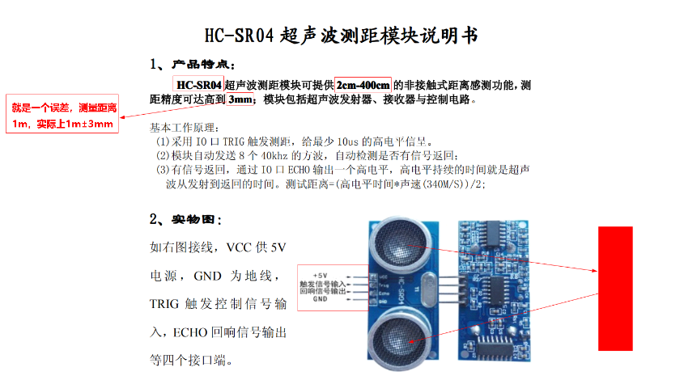
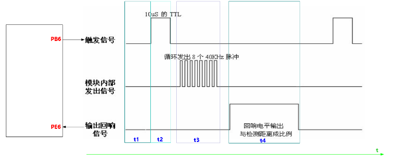
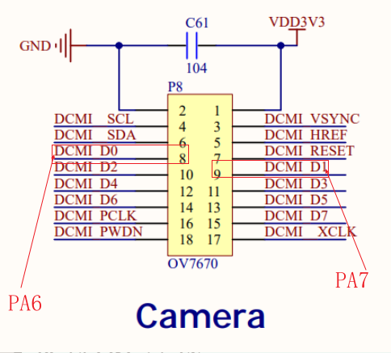
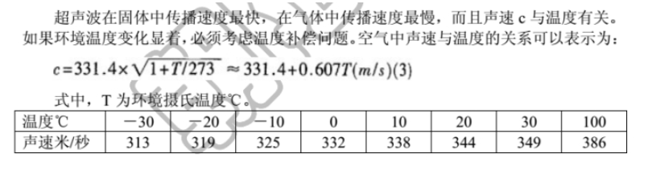
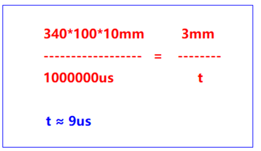

## 超声波
### 引脚

- VCC引脚：5V电源
- TRIG引脚：触发信号引脚，单片机给超声波模块一个信号，超声波模块就会工作。
- ECHO引脚：回响信号引脚，当超声波模块已经测量距离成功后，通过该引脚告诉单片机当前超声波传输的时间。
- GND：信号地。

此模块不宜带电连接,若带电,则先接地,否则影响模块正常工作  
测距时,被测物体面积不少于0.5平方米且尽量平整
### 时序图

看时序图的技巧，从上到下，从左到右，因为一般的时序图是隐含了时间轴。如何区分t1、t2、t3、t4，就是要找出它们的变化点。




超声波模块实物硬件连接如下：  



### 注意事项
 
1、不同的温度，声音的传播速度是不一样的，有以下公式
 
 

 
 
2、超声波代码可简单编写如下，以后测量距离必须根据温湿度传感器提供的温度代入上述公式，动态切换声音传播速度值。
 
3、超声波的测量误差为3mm，可根据3mm的测距求出测量时间，求算如下：
 

4、综合上述部分，可编写简单代码如下：
```c
int32_t sr04_get_distance(void)
{
	uint32_t t=0;
	uint32_t d=0;
	
	//1.PB6引脚输出至少10us以上的高电平
	PBout(6)=1;
	
	delay_us(20);
	
	PBout(6)=0;	

	//2.等待超声波模块测距完毕，标志性的动作就是回响信号引脚从输出低电平变为输出高电平
	//在等待过程当中，最好添加超时处理
	
	t=0;
	while(PEin(6)==0)
	{
	
		delay_us(1);
		
		t++;
		
		//超时处理
		if(t >= 1000000)
			return -1;
	}
	
	
	//3.测量PE6引脚的高电平时间，该高电平的持续时间就是超声波模块的传输时间
	
	t=0;
	while(PEin(6))
	{
		
		delay_us(9); //9us == 3mm
		t++;
		
		//超时处理
		if(t >= 1000000)
			return -2;	
	}

	//4.将时间转换为距离
	d =  t*3/2;
	
	return  d;
}
```
加超时处理（属于容错处理中的一部分）有以下原因：
1. 硬件问题：引脚连接有问题、超声波模块的损坏
2. 软件问题：延时不准确


