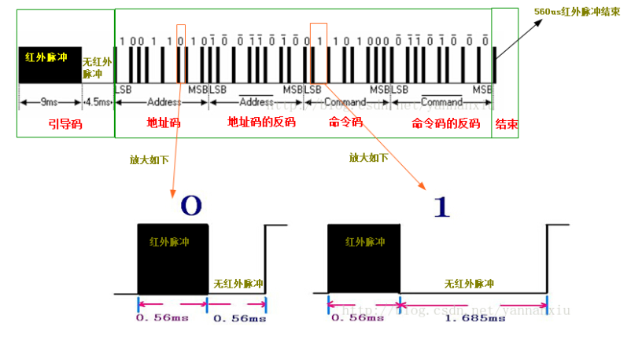
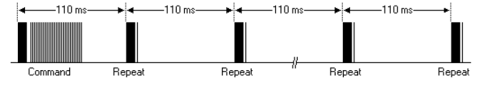

## 红外
### 红外线
红外线是波长介于微波和可见光之间的电磁波，波长在760纳米到1毫米之间，是波形比红光长的非可见光。自然界中的一切物体，只要它的温度高于绝对零度(-273)就存在分子和原子的无规则运动，其表面就会不停的辐射红外线。当然了，虽然都是辐射红外线，但是不同的物体辐射的强度是不一样的，而我们正是利用了这一点把红外技术应用到我们的实际开发中。

#### 红外发射管
红外发射管很常用，在我们的遥控器上都可以看到，它类似发光二极管，但是它发射出来的是红外光，是我们肉眼所看不到的。我们学过发光二极管的亮度会随着电流的增大而增加，同样的道理，红外发射管发射红外线的强度也会随着电流的增大而增强，常见红外发射管如下：

#### 红外接收管
红外接收管内部是一个具有红外光敏感特征的 PN 节，属于光敏二极管，但是它只对红外光有反应。无红外光时，光敏管不导通，有红外光时，光敏管导通形成光电流，并且在一定范围内电流随着红外光的强度的增强而增大，常见的红外接收管如下：


目前大量的使用的红外发光二极管发出的红外线波长为940nm左右。

### 红外遥控器发射

#### 概念
远程遥控技术又称为遥控技术，是指实现对被控目标的遥远控制，在工业控制、航空航天、家电领域应用广泛。
红外遥控是一种无线、非接触控制技术，具有抗干扰能力强，信息传输可靠，功耗低，成本低，易实现等显著优点，被诸多电子设备特别是家用电器广泛采用，并越来越多的应用到计算机和手机系统中。
随着家用电器、视听产品的普及，红外线遥控器已被广泛使用在各种类型的家电产品上（如遥控开关、智能开关等）。其具有体积小、抗干扰能力强、功耗低、功能强、成本低等特点，在工业设备中也得到广泛应用。一般而言，一个通用的红外遥控系统由发射和接收两大部分组成，如下图所示：


#### 基本原理
通常红外遥控为了提高抗干扰性能和降低电源消耗，红外遥控器常用载波的方式传送二进制编码，常用的载波频率为38KHz，这是由发射端所使用的455KHz晶振来决定的。在发射端要对晶振进行整数分频，分频系数一般取12，所以455KHz÷12≈37.9KHz≈38KHz。也有一些遥控系统采用36KHz、40 KHz、56 KHz等，一般由发射端晶振的振荡频率来决定。所以，通常的红外遥控器是将遥控信号（二进制脉冲码）调制在38KHz的载波上，经缓冲放大后送至红外发光二极管，转化为红外信号发射出去的。

二进制脉冲码的形式有多种，其中最为常用的是PWM码（脉冲宽度调制码）和PPM码（脉冲位置调制码，脉冲串之间的时间间隔来实现信号调制）。如果要开发红外接收设备，一定要知道红外遥控器的编码方式和载波频率，我们才可以选取一体化红外接收头和制定解码方案。

红外遥控的发射电路是采用红外发光二极管来发出经过调制的红外光波；红外接收电路由红外接收二极管、三极管或硅光电池组成，它们将红外发射器发射的红外光转换为相应的电信号，再送后置放大器。

- 发射端
一般由指令键(或操作杆)、指令编码系统、调制电路、驱动电路、发射电路等几部分组成。当按下指令键或推动操作杆时，指令编码电路产生所需的指令编码信号，指令编码信号对载波进行调制，再由驱动电路进行功率放大后由发射电路向外发射经调制定的指令编码信号。

- 接收端
一般由接收电路、放大电路、调制电路、指令译码电路、驱动电路、执行电路(机构)等几部分组成。接收电路将发射器发出的已调制的编码指令信号接收下来，并进行放大后送解调电路，解调电路将已调制的指令编码信号解调出来，即还原为编码信号。指令译码器将编码指令信号进行译码，最后由驱动电路来驱动执行电路实现各种指令的操作控制。

### 应用范围
由于红外线遥控不具有像无线电遥控那样穿过障碍物去控制被控对象的能力，所以，在设计家用电器的红外线遥控器时，不必要像无线电遥控器那样，每套(发射器和接收器)要有不同的遥控频率或编码(否则，就会隔墙控制或干扰邻居的家用电器)，所以同类产品的红外线遥控器，可以有相同的遥控频率或编码，而不会出现遥控信号“串门”的情况。这对于大批量生产以及在家用电器上普及红外线遥控提供了极大的方便。由于红外线为不可见光，因此对环境影响很小，再由红外光波动波长远小于无线电波的波长，所以红外线遥控不会影响其他家用电器，也不会影响临近的无线电设备。

### 编码格式
现有的红外遥控包括两种方式：PWM（脉冲宽度调制）和PPM（脉冲位置调制）。
　　两种形式编码的代表分别为NEC和PHILIPS 的RC-5、RC-6 以及将来的RC-7。

　　PWM（脉冲宽度调制）：以发射红外载波的占空比代表“0”和“1”。为了节省能量，一般情况下，发射红外载波的时间固定，通过改变不发射载波的时间来改变占空比。例如常用的电视遥控器，使用NEC upd6121，其“0”为载波发射0.56ms，不发射0.56ms；其“1”为载波发射0.56ms，不发射1.68ms；此外，为了解码的方便，还有引导码，upd6121 的引导码为载波发射9ms，不发射4.5ms。upd6121 总共的编码长度为108ms。
　　但并不是所有的编码器都是如此，比如TOSHIBA 的TC9012，其引导码为载波发射4.5ms，不发射4.5ms，其“0”为载波发射0.52ms，不发射0.52ms，其“1”为载波发射0.52ms，不发射1.04ms。

　　PPM（脉冲位置调制）：以发射载波的位置表示“0”和“1”。从发射载波到不发射载波为“0”，从不发射载波到发射载波为“1”。其发射载波和不发射载波的时间相同，都为0.68ms，也就是每位的时间是固定的。

　　通过以上对编码的分析，可以得出以某种固定格式的“0”和“1”去学习红外，是很有可能不成功的。即市面上所宣传的可以学习64 位、128 位必然是不可靠的。
　　另外，由于空调的状态远多于电视、音像，并且没有一个标准，所以各厂家都按自己的格式去做一个，造成差异更大。比如：美的的遥控器采用PWM 编码，码长120ms 左右；新科的遥控器也采用PWM 编码，码长500ms 左右。如此大的差异，如果按“位”的概念来讲，应该是多少位呢？64？128？显然都不可能包含如此长短不一的编码。  
对于电视、音响等，一般使用专用的遥控芯片，比nec,philips,toshiba,sanyo,mitsubish,panasonic的芯片，其编码格式固定，一个键只有一个编码，学习比较容易。  
　　而空调不一样，各家空调厂商都是按自己的要求用cpu 做遥控芯片，编码形式就有很多种。比如可能没有引导码（电视音响类都有）、校验方式取累加和（电视音响类一般取反码）等。因为空调的状态多，必须一次发送完毕，有制冷、温度、风速、自动、定时、加湿、制热等，所以编码很长，并且同一个按键，在不同状态下发送的编码不一样，造成学习上的困难。
红外遥控器的编码格式通常有两种格式：NEC 和RC5。


### NEC协议

#### NEC 格式的特征
使用38 kHz 载波频率
引导码间隔是9 ms + 4.5 ms
使用16 位客户代码
使用8 位数据代码和8 位取反的数据代码

#### 时序图分析
2.1 单次触发



NEC 协议通过脉冲串之间的时间间隔来实现信号的调制（英文简写PWM）。逻辑“0”是由0.56ms的38KHZ 载波和0.560ms 的无载波间隔组成；逻辑“1”是由0.56ms 的38KHZ 载波和1.685ms 的无载波间隔组成；结束位是0.56ms 的38K 载波。

通过示波器观察到引导码如下图：

通过示波器观察到的数据0与数据1如下图：


2.2 重复码[拓展]
标准的NEC协议的重复码如下图：


发了一次命令码之后，不会再发送命令码，而是每隔110ms时间，发送一段重复码。
重复码由9ms红外脉冲和2.25ms的无红外脉冲以及560us的红外脉冲组成。如下图：


2.3 完整的波形
以下是购买到的遥控器输长按某按键的波形，实际上在重复码中没有命令码。
 引导码|地址码+地址码反码+命令码+命令码反码|结束                     |重复码-引导码|


### 红外接收注意事项

#### LSB和MSB

LSB（least significant bit）：最低有效位优先，例如红外通信是以最低有效位发送和接收的。  
MSB（Most Significant Bit）：最高有效位优先，例如获取温湿度比特流数据的时候是以最高有效位接收的。

例子，发送0xF4(1111 0100)，采用LSB和MSB区别如下：

LSB发送的比特顺序： 0010 1111  
MSB发送的比特顺序： 1111 0100  


### 思考题

思考题1：红外通信的过程，反码的作用是什么？

截取到的红外遥控器的数据
    
    ir data: 00 FF 45 BA
    ir data: 00 FF 46 B9
    ir data: 00 FF 47 B8
    ir data: 00 FF 45 BA
    ir data: 00 FF 19 E6
    ir data: 00 FF 19 E6
    ir data: 00 FF 08 F7
    ir data: 00 FF 08 F7
    ir data: 00 FF 4A B5
    .......
    
回答：反码的作用是用于校验，如果反码不正确，也代表说当前接收到红外数据是有问题的！

思考题2：红外接收检测使用中断检测，优点是什么？

回答： 因为接收红外脉冲的时刻是随机发生的，必须使用中断，达到实时响应

编写中断服务函数，引脚使用下降沿触发方式，在中断服务函数当中，然后实现这个接收过程。
```c
void 中断服务函数 (void)
{ 
     ......
      ir_read(buf);
     ......    
}
```