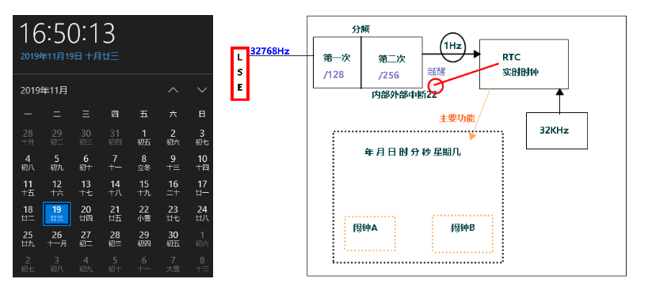
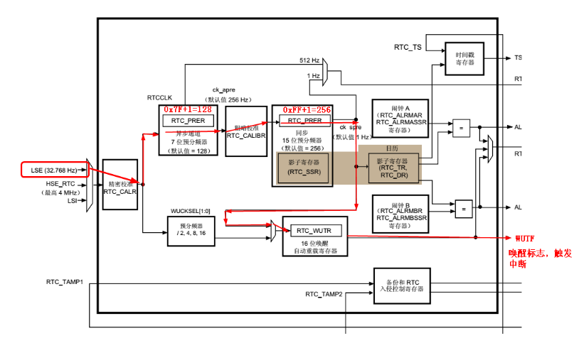
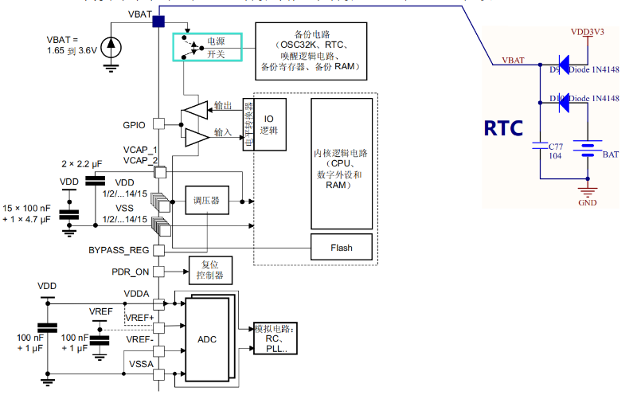
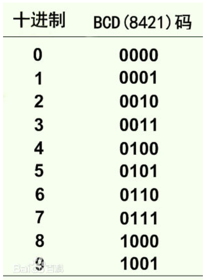
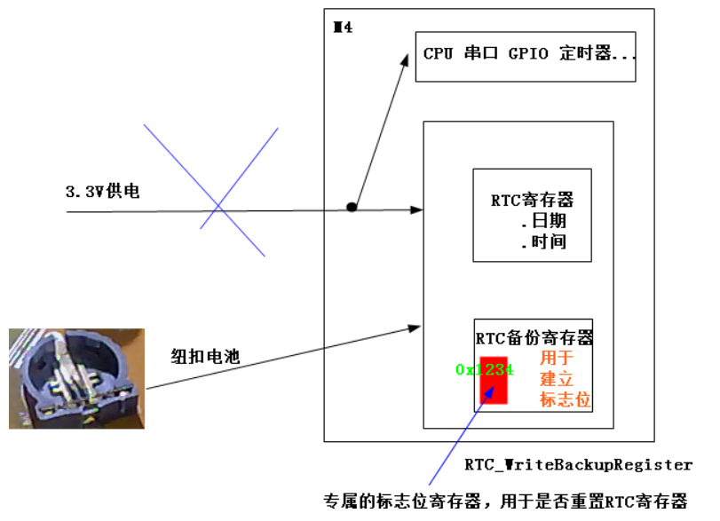

## RTC
### RTC的概述

RTC就是实时时钟，详细英文 Real Time Clock。  
实时时钟 (RTC) 是一个独立的 BCD 定时器/计数器。RTC 提供一个日历时钟、两个可编程闹钟中断，以及一个具有中断功能的周期性可编程唤醒标志。RTC 还包含用于管理低功耗模式的自动唤醒单元。  
两个 32 位寄存器包含二进码十进数格式 (BCD) 的秒、分钟、小时（12 或 24 小时制）、星期几、日期、月份和年份。此外，还可提供二进制格式的亚秒值。  
系统可以自动将月份的天数补偿为 28、29（闰年）、30 和 31 天。并且还可以进行夏令时补偿。  
其它 32 位寄存器还包含可编程的闹钟亚秒、秒、分钟、小时、星期几和日期。
此外，还可以使用数字校准功能对晶振精度的偏差进行补偿。  
上电复位后，所有 RTC 寄存器都会受到保护，以防止可能的非正常写访问。无论器件状态如何（运行模式、低功耗模式或处于复位状态），只要电源电压保持在工作范围内，RTC 便不会停止工作。  

二、详细描述




### 中断配置注意事项
《stm32f4xx中文参考手册》P585有如下内容：

1. 所有 RTC 中断均与 EXTI 控制器相连。

2. 要使能 RTC 闹钟中断，需按照以下顺序操作：
将 EXTI 线 17 配置为中断模式并将其使能，然后选择上升沿有效。
配置 NVIC 中的 RTC_Alarm IRQ 通道并将其使能。
配置 RTC 以生成 RTC 闹钟（闹钟 A 或闹钟 B）。

3. 要使能 RTC 唤醒中断，需按照以下顺序操作：
将 EXTI 线 22 配置为中断模式并将其使能，然后选择上升沿有效。
配置 NVIC 中的 RTC_WKUP IRQ 通道并将其使能。
配置 RTC 以生成 RTC 唤醒定时器事件。

### 时钟体系


### 供电
当主电源 VDD 断电时，可通过 VBAT 电压为实时时钟 (RTC)、RTC 备份寄存器和备份 SRAM (BKP SRAM) 供电。


### 程序设计

1.rtc的初始化
```c
void rtc_init(void)
{

	 /* Enable the PWR clock ,使能电源时钟*/
	RCC_APB1PeriphClockCmd(RCC_APB1Periph_PWR, ENABLE);

	/* Allow access to RTC ，允许访问RTC*/
	PWR_BackupAccessCmd(ENABLE);
	
#if 0
	/* 使能LSE*/
	RCC_LSEConfig(RCC_LSE_ON);
	
	/* 检查该LSE是否有效*/  
	while(RCC_GetFlagStatus(RCC_FLAG_LSERDY) == RESET);

	/* 选择LSE作为RTC的硬件时钟源*/
	RCC_RTCCLKConfig(RCC_RTCCLKSource_LSE);
	

#else  //若LSE无法工作，可用内部LSI
	/* 使能LSI*/
	RCC_LSICmd(ENABLE);
	
	/* 检查该LSI是否有效*/  
	while(RCC_GetFlagStatus(RCC_FLAG_LSIRDY) == RESET);

	/* 选择LSI作为RTC的硬件时钟源*/
	RCC_RTCCLKConfig(RCC_RTCCLKSource_LSI);
	

#endif
	
	/* ck_spre(1Hz) = RTCCLK(LSE) /(uwAsynchPrediv + 1)*(uwSynchPrediv + 1)*/
	/* Enable the RTC Clock ，使能RTC时钟*/
	RCC_RTCCLKCmd(ENABLE);

	/* Wait for RTC APB registers synchronisation ，等待RTC相关寄存器就绪*/
	RTC_WaitForSynchro();
 
 #if 0 //LSE
	/* Configure the RTC data register and RTC prescaler，配置RTC数据寄存器与RTC的分频值 */
	RTC_InitStructure.RTC_AsynchPrediv = 0x7F;				//异步分频系数
	RTC_InitStructure.RTC_SynchPrediv = 0xFF;				//同步分频系数
	RTC_InitStructure.RTC_HourFormat = RTC_HourFormat_24;	//24小时格式
	RTC_Init(&RTC_InitStructure);
#else //LSI
	/* Configure the RTC data register and RTC prescaler，配置RTC数据寄存器与RTC的分频值 */
	RTC_InitStructure.RTC_AsynchPrediv = 0x7F;				//异步分频系数
	RTC_InitStructure.RTC_SynchPrediv = 0xF9;				//同步分频系数
	RTC_InitStructure.RTC_HourFormat = RTC_HourFormat_24;	//24小时格式
	RTC_Init(&RTC_InitStructure);

#endif

	/* Set the date: Wednesday 2017/11/29 */
	RTC_DateStructure.RTC_Year = 0x17;
	RTC_DateStructure.RTC_Month = RTC_Month_November;
	RTC_DateStructure.RTC_Date = 0x29;
	RTC_DateStructure.RTC_WeekDay = RTC_Weekday_Wednesday;
	RTC_SetDate(RTC_Format_BCD, &RTC_DateStructure);

	/* Set the time to 14h 56mn 00s PM  */
	RTC_TimeStructure.RTC_H12     = RTC_H12_PM;
	RTC_TimeStructure.RTC_Hours   = 0x14;
	RTC_TimeStructure.RTC_Minutes = 0x56;
	RTC_TimeStructure.RTC_Seconds = 0x00; 
	RTC_SetTime(RTC_Format_BCD, &RTC_TimeStructure); 
	
	//关闭唤醒功能
	RTC_WakeUpCmd(DISABLE);
	
	//为唤醒功能选择RTC配置好的时钟源
	RTC_WakeUpClockConfig(RTC_WakeUpClock_CK_SPRE_16bits);
	
	//设置唤醒计数值为自动重载，写入值默认是0
	RTC_SetWakeUpCounter(1-1);
	
	//清除RTC唤醒中断标志
	RTC_ClearITPendingBit(RTC_IT_WUT);
	
	//使能RTC唤醒中断
	RTC_ITConfig(RTC_IT_WUT, ENABLE);

	//使能唤醒功能
	RTC_WakeUpCmd(ENABLE);

	/* Configure EXTI Line22，配置外部中断控制线22 */
	EXTI_InitStructure.EXTI_Line = EXTI_Line22;			//当前使用外部中断控制线22
	EXTI_InitStructure.EXTI_Mode = EXTI_Mode_Interrupt;		//中断模式
	EXTI_InitStructure.EXTI_Trigger = EXTI_Trigger_Rising;		//上升沿触发中断 
	EXTI_InitStructure.EXTI_LineCmd = ENABLE;			//使能外部中断控制线22
	EXTI_Init(&EXTI_InitStructure);
	
	NVIC_InitStructure.NVIC_IRQChannel = RTC_WKUP_IRQn;		//允许RTC唤醒中断触发
	NVIC_InitStructure.NVIC_IRQChannelPreemptionPriority = 0x03;	//抢占优先级为0x3
	NVIC_InitStructure.NVIC_IRQChannelSubPriority = 0x03;		//响应优先级为0x3
	NVIC_InitStructure.NVIC_IRQChannelCmd = ENABLE;			//使能
	NVIC_Init(&NVIC_InitStructure);
}
```

2.rtc的唤醒中断服务函数
```c
void RTC_WKUP_IRQHandler(void)
{
	if(RTC_GetITStatus(RTC_IT_WUT) != RESET)
	{
		printf("RTC_WKUP_IRQHandler\r\n");
		RTC_ClearITPendingBit(RTC_IT_WUT);
		EXTI_ClearITPendingBit(EXTI_Line22);
	} 
}
```
3.获取时间与日期
```c
//获取时间
RTC_GetTime(RTC_Format_BCD,&RTC_TimeStructure);
printf("%02x:%02x:%02x\r\n",RTC_TimeStructure.RTC_Hours,RTC_TimeStructure.RTC_Minutes,RTC_TimeStructure.RTC_Seconds);

//获取日期
RTC_GetDate(RTC_Format_BCD,&RTC_DateStructure);
printf("20%02x/%02x/%02xWeek:%x\r\n",RTC_DateStructure.RTC_Year,RTC_DateStructure.RTC_Month,RTC_DateStructure.RTC_Date,RTC_DateStructure.RTC_WeekDay);			
```
4.改写时间与日期
```c
/* Set the date: Wednesday 2017/11/29 */
RTC_DateStructure.RTC_Year = 0x17;
RTC_DateStructure.RTC_Month = RTC_Month_November;
RTC_DateStructure.RTC_Date = 0x29;
RTC_DateStructure.RTC_WeekDay = RTC_Weekday_Wednesday;
RTC_SetDate(RTC_Format_BCD, &RTC_DateStructure);

/* Set the time to 23h 59mn 50s PM  */
RTC_TimeStructure.RTC_H12     = RTC_H12_PM;
RTC_TimeStructure.RTC_Hours   = 0x23;
RTC_TimeStructure.RTC_Minutes = 0x59;
RTC_TimeStructure.RTC_Seconds = 0x50; 
RTC_SetTime(RTC_Format_BCD, &RTC_TimeStructure); 
```

### BCD码
二进制编码的十进制数，简称BCD码（Binary Coded Decimal）。这种方法是用4位二进制码的组合代表十进制数的0，1，2，3，4，5，6 ，7，8，9 十个数符。4位二进制数码有16种组合，原则上可任选其中的10种作为代码，分别代表十进制中的0，1，2，3，4，5，6，7，8，9 这十个数符。最常用的BCD码称为8421BCD码，8.4.2.1 分别是4位二进数的位取值。 下图为十进制数和8421BCD编码的对应关系表：




### 闹钟代码

1.闹钟初始化
```c
void rtc_alarm_init(void)
{
	/* 允许RTC的A闹钟触发中断 */
	RTC_ITConfig(RTC_IT_ALRA, ENABLE);
	
	/* 清空标志位 */
	RTC_ClearFlag(RTC_FLAG_ALRAF);

	/*使能外部中断控制线17的中断*/
	EXTI_ClearITPendingBit(EXTI_Line17);
	EXTI_InitStructure.EXTI_Line = EXTI_Line17;
	EXTI_InitStructure.EXTI_Mode = EXTI_Mode_Interrupt;
	EXTI_InitStructure.EXTI_Trigger = EXTI_Trigger_Rising;
	EXTI_InitStructure.EXTI_LineCmd = ENABLE;
	EXTI_Init(&EXTI_InitStructure);
	
	/*使能闹钟的中断 */
	NVIC_InitStructure.NVIC_IRQChannel = RTC_Alarm_IRQn;
	NVIC_InitStructure.NVIC_IRQChannelPreemptionPriority = 0;
	NVIC_InitStructure.NVIC_IRQChannelSubPriority = 0;
	NVIC_InitStructure.NVIC_IRQChannelCmd = ENABLE;
	NVIC_Init(&NVIC_InitStructure);
}
```
2.设定闹钟的时间
```c
void rtc_alarm_set(RTC_AlarmTypeDef RTC_AlarmStructure)
{
	/* 关闭闹钟，若不关闭，配置闹钟触发的中断有BUG，无论怎么配置，只要到00秒，则触发中断*/
	RTC_AlarmCmd(RTC_Alarm_A, DISABLE);
	
	/* 配置RTC的A闹钟，注：RTC的闹钟有两个，分别为闹钟A与闹钟B */
	RTC_SetAlarm(RTC_Format_BCD, RTC_Alarm_A, &RTC_AlarmStructure);
	
	/* 让RTC的闹钟A工作*/
	RTC_AlarmCmd(RTC_Alarm_A, ENABLE);
}
```
示例：
```c
RTC_AlarmTypeDef RTC_AlarmStructure;

int main(void)
{
    ......
  
#if 1  
     //闹钟每天生效
    RTC_AlarmStructure.RTC_AlarmMask = RTC_AlarmMask_DateWeekDay;
    rtc_alarm_set(RTC_AlarmStructure); 
#endif
 
#if 0           
    //闹钟指定20号生效
 	 RTC_AlarmStructure.RTC_AlarmDateWeekDay = 0x20;				//20号
	 RTC_AlarmStructure.RTC_AlarmDateWeekDaySel = RTC_AlarmDateWeekDaySel_Date;	//指定哪一天生效
	 RTC_AlarmStructure.RTC_AlarmMask = RTC_AlarmMask_None;				//不屏蔽哪一天和星期的配置   
     rtc_alarm_set(RTC_AlarmStructure);
     #endif
#if 0      
    //闹钟指定星期三
	 RTC_AlarmStructure.RTC_AlarmDateWeekDay = RTC_Weekday_Wednesday;		//星期三
	 RTC_AlarmStructure.RTC_AlarmDateWeekDaySel = RTC_AlarmDateWeekDaySel_WeekDay;//指定星期几生效
	 RTC_AlarmStructure.RTC_AlarmMask = RTC_AlarmMask_None;				//不屏蔽哪一天和星期的配置   
     rtc_alarm_set(RTC_AlarmStructure);
#endif
     
     ...... 
}
```
3. 闹钟相关参数详细分析

1） RTC_AlarmTime：闹钟时间设置，配置的是 RTC时间初始化结构体，主要配置小时的制式，有 12小时或者是 24 小时，配套具体的时、分、秒。 

2） RTC_AlarmMask：闹钟掩码字段选择，即选择闹钟时间哪些字段无效，取值可为：

    RTC_AlarmMask_None(全部有效)
    RTC_AlarmMask_DateWeekDay（日期或者星期无效）
    RTC_AlarmMask_Hours（小时无效）
    RTC_AlarmMask_Minutes（分钟无效）
    RTC_AlarmMask_Seconds（秒钟无效）
    RTC_AlarmMask_All（全部无效）。
比如我们选择 RTC_AlarmMask_DateWeekDay，那么就是当 RTC 的时间的小时等于闹钟时间小时字段时，每天的这个小时都会产生闹钟中断。

3） RTC_AlarmDateWeekDaySel ： 闹 钟 日 期 或 者 星 期 选 择 ， 可 选 择RTC_AlarmDateWeekDaySel_WeekDay 或者 RTC_AlarmDateWeekDaySel_Date。要想这个配置有效，则 RTC_AlarmMask 不能配置为 RTC_AlarmMask_DateWeekDay，否则会被 MASK（屏蔽）掉。

4） RTC_AlarmDateWeekDay：具体的日期或者星期几，当 RTC_AlarmDateWeekDaySel 设置成 RTC_AlarmDateWeekDaySel_WeekDay时，取值为 1~7，对应星期一~星期日，当设置成 RTC_AlarmMask_DateWeekDay时，取值为 1~31。


### RTC 备份寄存器

#### 概述  
备份寄存器 (RTC_BKPxR) 包括20 个 32 位寄存器，用于存储 80 字节的用户应用数据（例如临时密码、复位标记等）。这些寄存器在备份域中实现，可在 VDD 电源关闭时通过 VBAT 保持上电状态。备份寄存器不会在系统复位或电源复位时重置，也不会在器件从待机模式唤醒时复位。  
为了防止每次复位重置RTC时间，可以利用RTC自带的备份寄存器来实现。步骤如下：    
初始化RTC时间的时候，接着去设置RTC备份寄存器的值。
复位的时候，去读取RTC备份寄存器的值，判断是否跟之前的值是否一致，若一致，则执行普通的时钟、电源、中断初始化。
发生入侵检测事件时，将复位备份寄存器。

#### 函数接口

2.1写备份寄存器函数
```c
//用于建立重启标志，是否需要重置RTC的时间
RTC_WriteBackupRegister(RTC_BKP_DR0,0x5678);
```
2.2读备份寄存器函数
```c
int rt = RTC_ReadBackupRegister(RTC_BKP_DR0)
```

备份寄存器示意图如下：




## 练习1
通过串口1或手机蓝牙发送特定的字符串修改RTC日期与时间。

特定的字符串：
修改日期：“DATE SET-2021-2-23-2#” 	//年-月-日-星期
修改时间：“TIME SET-10-20-30#”     //时-分-秒
 
提示：得到数值后，直接调用RTC_SetDate和RTC_SetTime就可以设置日期和时间。

提示函数：strtok atoi strstr、sscanf(虽然方便，但不推荐，原因大幅增加代码占用)

[sscanf使用技巧]
```c
/* 一定要为32位类型变量，否则取出字符串数据内容会丢失数据 */
uint32_t year,month,date,weekday=0;
uint32_t hour,minute,second=0;

/* 慎用可变参数类型代码，会大幅增加代码(约1.4K)*/
rt = sscanf((char *)g_usart1_recv_buf,
	"DATE SET-20%d-%d-%d-%d#",
	&year,&month,&date,&weekday); 
 
rt = sscanf((char *)g_usart1_recv_buf,
	"TIME SET-%d-%d-%d#",
	&hour,&minute,&second);  

```
练习2
通过串口1或手机蓝牙发送特定的字符串设定RTC的闹钟时间，当时间到达设定的值后，则使用蜂鸣器与led灯模拟响铃效果（滴滴，滴滴，滴滴....）持续一段时间后，自动关闭蜂鸣器与led灯。

特定的字符串：  
修改闹钟日期与时间：“ALARM SET-14-20-10#” //时-分-秒    
提示函数：strtok atoi strstr、sscanf(虽然方便，但不推荐，调用一次，则大幅增加代码占用)

[sscanf使用技巧]
```c
/* 一定要为32位类型变量，否则取出字符串数据内容会丢失数据 */
uint32_t hour,minute,second=0;

rt = sscanf((char *)g_usart1_recv_buf,
	"ALARM SET-%d-%d-%d#",
	&hour,&minute,&second);  
```