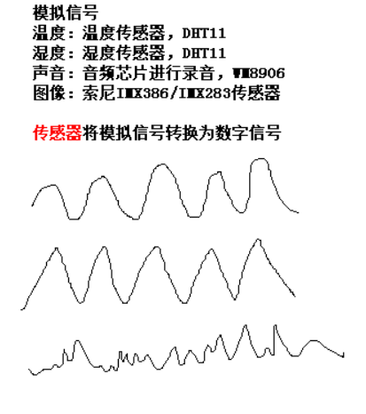

## ADC 模转数

### 定义
ADC，Analog-to-Digital Converter的缩写，指模/数转换器或者模数转换器。是指将连续变化的模拟信号转换为离散的数字信号的器件。真实世界的模拟信号，例如温度、压力、声音或者图像等，需要转换成更容易储存、处理和发射的数字形式。模/数转换器可以实现这个功能，在各种不同的产品中都可以找到它的身影。

### 模拟信号

模拟信号，就是数值上是连续的，就是数值的数量是无限多。

三、数字信号

数字信号，就是数值是不连续的，就是数值的数量是有限的。

数字信号优点
1）抗干扰能力强
2）方便存储
3）方便加密

四、模数转换的过程

五、特性

精度的理解
精度越高，数据越是准确。
12位精度：3300mv/4096=0.8mv，也就是说只要电压值有±0.8mv的变化，adc就能分辨出来。
10位精度：3300mv/1024=3.22mv，也就是说只要电压值有±3.22mv的变化，adc就能分辨出来。
8位精度：3300mv/256=12mv，也就是说只要电压值有±12mv的变化，adc就能分辨出来。
6位精度：3300mv/64=51.5625mv，也就是说只要电压值有±51.5625mv的变化，adc就能分辨出来。

六、硬件电路

实物

可调电阻的作用等同于初中物理课常见的滑动变阻器，如下图。

原理图

1）VREF引脚是参考电压，可以理解为决定了ADC测量的最大值。

VREF引脚的连接是决定当前的电压测量范围0V~3.3V。一般来说，该引脚不能超过芯片的供电电压！

2）可调电阻用到的引脚

                          

3.通过了解原理图，不同的引脚支持的ADC是不一样的。

PC0引脚能够使用ADC1、ADC2或ADC3转换器，使用第10个输入通道！

PF10引脚只能够使用ADC3转换器，使用第8个输入通道！

注意事项：
如何知道当前是使用哪个ADC硬件，同时使用哪个通道？
答：PA5/ADC12_IN5，表示PA5引脚支持ADC1或ADC2进行扫描，使用通道是第五个输入通道
存储对齐方式

思考题：通过ADC硬件获取到的结果值，为什么还得要进行转换为电压值，依据是什么？

七、光敏电阻

原理
光敏电阻的工作原理：光照时，电阻很小；无光照时，电阻很大。光照越强，电阻越小；光照停止，电阻又恢复原值。

应用案例：
手机自动亮度，根据的光照的强度来动态调整手机屏幕的亮度。

硬件实物

原理图

## DAC 数转模

一、概述
二、硬件的连接
三、根据公式输出自定义电压值
四、输出结果分析
五、应用领域
一、概述

二、硬件的连接

1.使用到的PA4与PA6引脚

2.PA4与PA6引脚的连接原理图示例

3.PA4与PA6引脚的连接实物示例

三、根据公式输出自定义电压值

四、输出结果分析
1.dac输出通道1（PA4引脚）输出1800mv，adc输入通道6（PA6引脚），得到检测结果如下：
adc_val:2235,adc_vol=1801mv
adc_val:2242,adc_vol=1806mv
adc_val:2241,adc_vol=1805mv
adc_val:2239,adc_vol=1804mv
adc_val:2241,adc_vol=1805mv
adc_val:2248,adc_vol=1811mv
adc_val:2227,adc_vol=1794mv
adc_val:2249,adc_vol=1812mv
adc_val:2235,adc_vol=1801mv
adc_val:2234,adc_vol=1800mv
adc_val:2252,adc_vol=1814mv
adc_val:2248,adc_vol=1811mv
adc_val:2246,adc_vol=1809mv
adc_val:2247,adc_vol=1810mv

为了让数据更加平滑，可以采用平均滤波算法。如果最后得到的结果还是有一点的偏差，就得自我数据补偿，纠正并接近实际值，以下代码是求平均值并加上数据补偿的例子：
for(sum=0,i=0; i<1000; i++)
{
	//等待ADC1转换结束
	while(ADC_GetFlagStatus(ADC1,ADC_FLAG_EOC)==RESET);
	
	//读取转换结果
	adc_val = ADC_GetConversionValue(ADC1);
    
    ADC_ClearFlag(ADC1,ADC_FLAG_EOC);

	//将结果值转换为电压值
	adc_vol = adc_val * 3300 /4095;	
 
	sum+=adc_vol;

}

adc_vol = sum/1000;

#if 0
//adc_vol减去10就是一个数据补偿,纠正并接近实际值
adc_vol -=10;
#endif
printf("adc vol = %dmv\r\n",adc_vol);

五、应用领域

1.恒流调光

2.烟雾传感器

A0引脚就是DAC功能的实现，输出的电压值就是浓度的等级

3.信号发生器

