<!-- 2023年07月27日 -->
# 初识开发板
[资源文件-百度网盘](https://pan.baidu.com/s17uEDAJZ2vT_UkkO4coF4kA?pwd=dudu)提取码：dudu

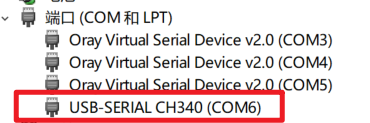

没有串口驱动

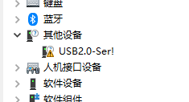

打开CH340驱动文件所在路径，直接安装

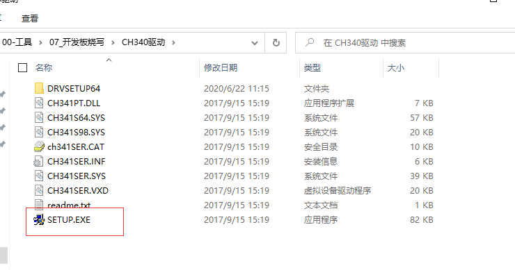

如果是PL2303HXA已停产


下载这个文件，安装这个.exe，按照解决步骤找到驱动安装

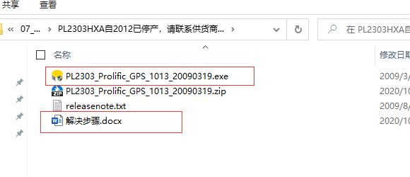

3. 打开CRT工具  

（1）第一次连接  

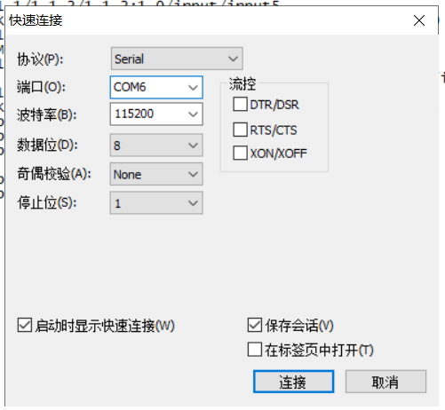

其中端口对应自己驱动的端口  
波特率指的是传输数据的快慢,   
每次传输9个位,8位数据+1位停止符  
115200/9/1024=12k/s 
 
出现这个额绿色的√表示连接成功


如果不是第一次连接，就会显示以前连接过的记录


## fastboot方式烧写系统（开发板故障）
开发板连接电脑，上电开机  
在倒计时过程中按回车键进入uboot 

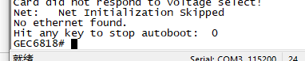

输入命令fastboot，按下回车  

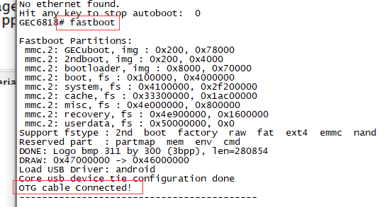  

连接开发板数据线到PC机  
设备管理器出现这个新的设备  

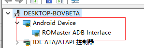

找到系统镜像包

自动安装系统的脚本文件
脚本文件里面的内容

双击auto.bat，自动烧写

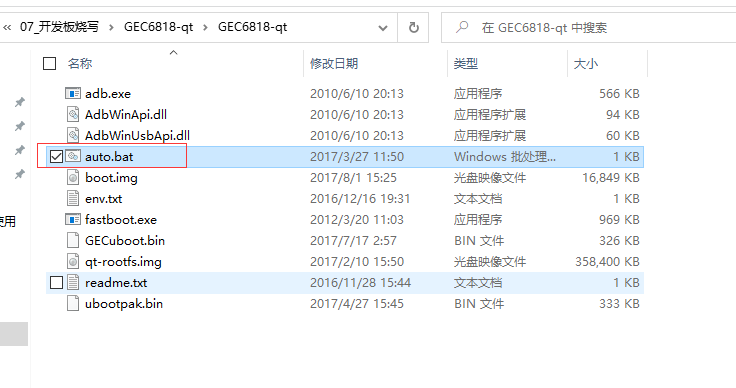

烧写成功
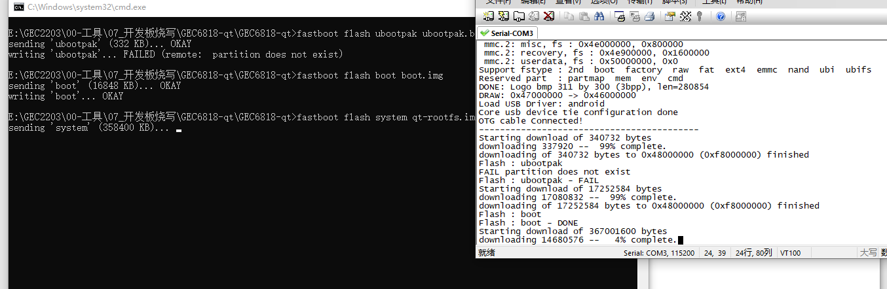
开发板自动重启进入系统

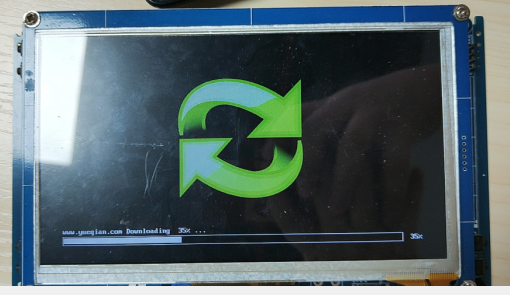
串口工具会进入系统命令行

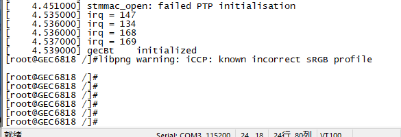

## 关闭系统预装的启动后的第一个程序  
vi /etc/profile  
找到文件末尾，按i键进入插入模式，注释掉这两行   
(关闭开机自启动的程序)

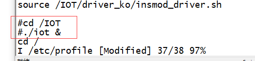

按下ESC，进入命令模式，输入:wq，保存退出  
reboot重启开发板  

建议：  
自己在根路径下建立一个文件夹，用来存放自己以后的程序，用来作为大目录的挂载  

## 开发板挂载大目录
（1）df -h可以查看内存使用情况

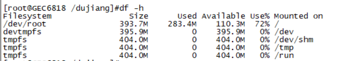

（2）格式化未使用分区mmcblk0p7


（3）创建一个空的目录文件用来作为挂载的文件夹
mkdir dirname

（4）将挂载命令写到/etc/profile中

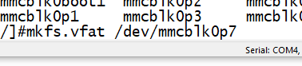

（5）保存退出，reboot重启

## 程序（文件）移植到开发板
### U盘拷贝（最快的）
（1）将要移植的文件拷贝到U盘里面
（2）将U盘插入到已经启动的开发板USB接口
（3）找到U盘的挂载路径
/mnt/udisk

（4）将要拷贝的文件直接拷贝到开发板

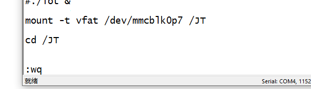

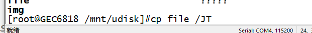


注意：U盘拷贝，U盘的系统要是FAT32的系统

### tftp网络传输
（1）将开发板连接网线  
（2）给开发板设置IP  
动态分配  
udhcpc  

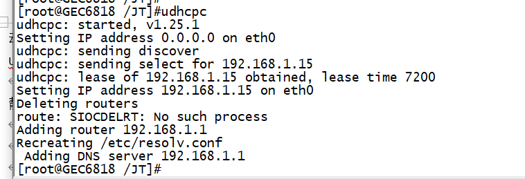
静态分配
ifconfig eth0 192.168.1.xxx

（3）查看IP地址  开发板  ifconfig

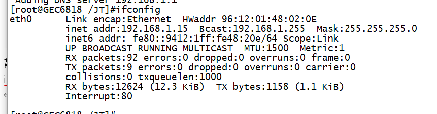

查看电脑的IP地址   ipconfig
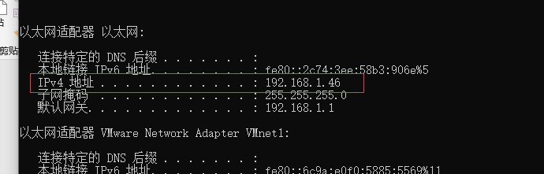


（4）查看开发板与电脑是否连通

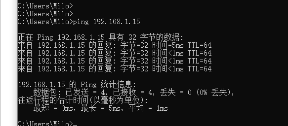

（5）在电脑端打开tftp服务器  

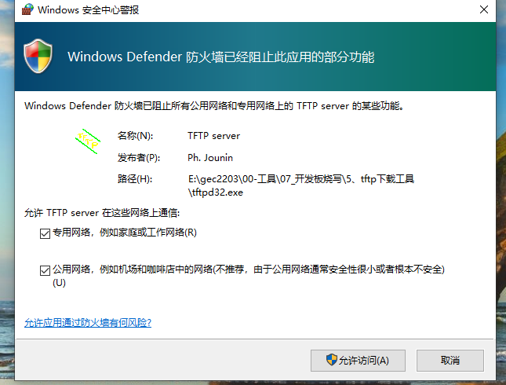

网络要允许访问

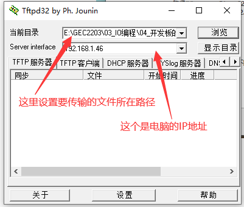


（6）输入下载命令
tftp -g -r <文件名> <电脑的IP>

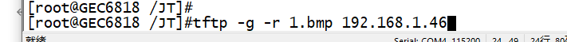
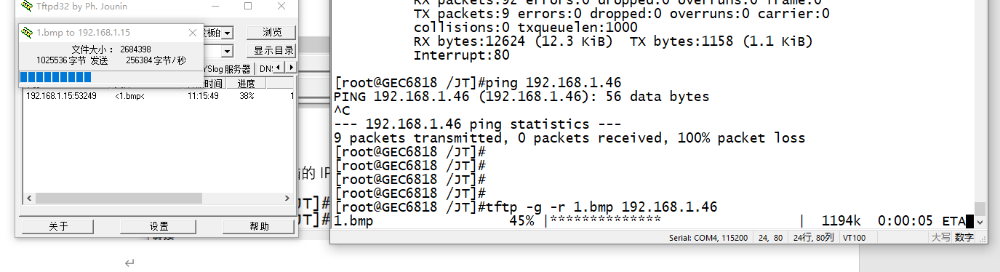


### 直接通过串口下载
（1）正常连接开发板和电脑
（2）在CRT的命令行输入
rx <文件名>  


（3）找到要下载的文件

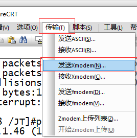

点击发送

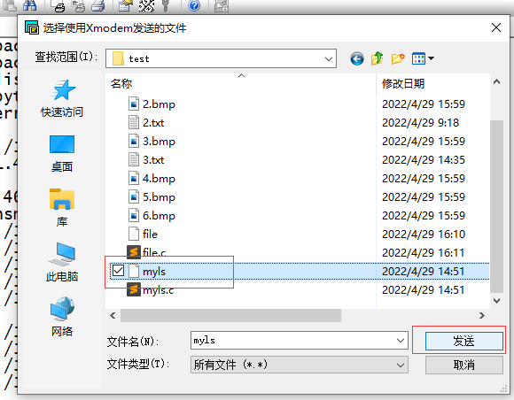

等待传输，传输成功
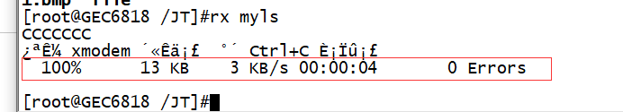


### 破解版rz传输
（1）将rz移植到开发板  
（2）给rz权限  

    chmod 0777 rz

（3）将rz拷贝（移动）到/bin/中

    mv rz /bin

（4）今后就可以直接拖动文件到CRT就可以直接传输文件到开发板，或者输入rz命令

    rz -y

## 开发板回传文件
9.1、U盘

9.2、网络传输，也要先去配置tftp服务器

    tftp -p -l 1.bmp 192.168.1.46

9.3、破解版的sz  
（1）先将sz移植到开发板   
（2）给sz给上权限  

    chmod 0777 sz  
（3）将sz移动到/bin路径  

    mv sz /bin  
（4）传输文件回去  
直接文件拖拽
选择Zmodem格式
sz <文件名>  

传输回来的文件存放在电脑的下载


## 交叉编译
什么是交叉编译？  
不同的编译器编译的程序，只能在指定的系统硬件平台中运行。  
那么我们需要在A平台下编译一个B平台可以运行的可执行程序，那么这个过程我们就叫它交叉编译  
使用`file 文件名`可以发现,linux用`gcc`编译的文件适用于`x86_64`,所以说需要工具将`.c`文件编译为`arm`架构的给单片机使用
### 安装arm-linux-gcc交叉编译器

安装交叉工具链  
（1）将arm-linux-gcc5.4.0.tar.gz文件下载到共享目录下  
（2）将普通权限切换到管理员权限`sudo -s`  
（4）解压压缩包   

    tar -zvf arm-linux-gcc5.4.0.tar.gz -C /usr/local/  
    
（5）运行./arm-linux.sh  
    实际上就是在`~/.bashrc`文件里面添加两个环境变量
```bash
#添加环境变量
export PATH=$PATH:/usr/local/arm/5.4.0/usr/bin/
#添加arm-linux-gcc所需要的库
export LD_LIBRARY_PATH=$LD_LIBRARY_PATH:/usr/local/arm/5.4.0/usr/lib
```
（6）让文件生效  
```bash
source ~/.bashrc  
```
（9）使用arm-linux-gcc -v查看交叉工具链的版本信息  

普通编译：  
```bash
gcc 源文件名 -o 目标文件名  
```

交叉编译：  
```bash
arm-linux-gcc 源文件名 -o 目标文件名  
```
使用`file 文件名`可以观察其类型

将交叉编译之后的文件下载到开发板里面，给上权限，就可以运行了

```bash
chmod 0777 文件名
```


乱码问题解决：

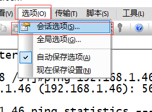

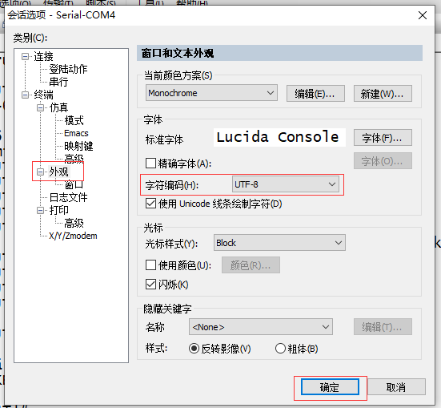


## 练习
实现一个程序，名为lsdir。执行lsdir dir。会显示dir中的所有文件（包括子文件中的子文件）

```c
#include <stdio.h>
#include <string.h>
#include <sys/types.h>
#include <dirent.h>
int reDir(int level, char *dirName);
void printSpace(int num);
int main(int argc, char **argv, char **envp)
{
    if (argc < 2)
    {
        printf("请输入目录后再重试!\n");
        return -1;
    }

    return reDir(0, argv[1]);
    return 0;
}
int reDir(int level, char *dirName)
{
    DIR *dir = NULL;
    char fileName[1024];
    struct dirent *dirfile = NULL;
    /*
        struct dirent {
            ino_t          d_ino;       // Inode number
            off_t          d_off;       // Not an offset; see below
            unsigned short d_reclen;    // Length of this record
            unsigned char  d_type;      // Type of file; not support
                        // by all filesystem types
            char           d_name[256]; // Null-terminated filename
        };
    */
    strcpy(fileName, dirName);
    if (NULL == (dir = opendir(dirName)))
    {
        printf("%s目录打开错误!\n", dirName);
        return -1;
    }
    while (NULL != (dirfile = readdir(dir)))
    {
        strcpy(fileName, dirName);
        printSpace(level);
        if ('.' == dirfile->d_name[0])
            continue;
        if (4 == dirfile->d_type)
        {
            printf("\033[0m\033[0;34m%s\033[0m\n", dirfile->d_name);
            strcat(fileName, "/");
            strcat(fileName, dirfile->d_name);
            if (-1 == reDir(level + 1, fileName))
            {
                return -1;
            }
        }
        else
        {
            printf("\033[0m\033[0;32m%s\033[0m\n", dirfile->d_name);
        }
    }

    closedir(dir);
}
void printSpace(int num)
{
    for (; num; num--)
    {
        putchar(' ');
    }
}
```

