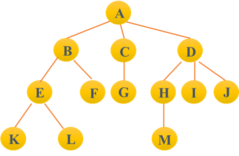
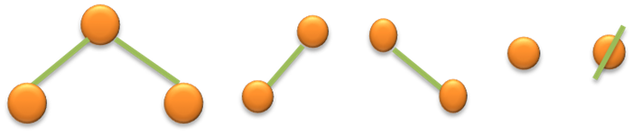
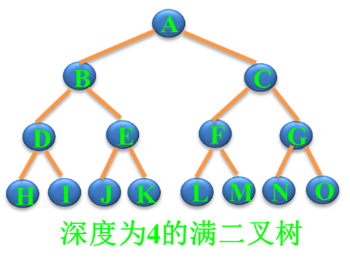
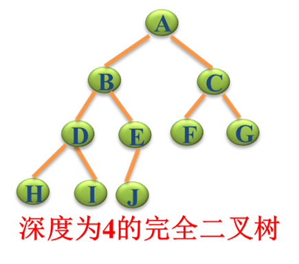
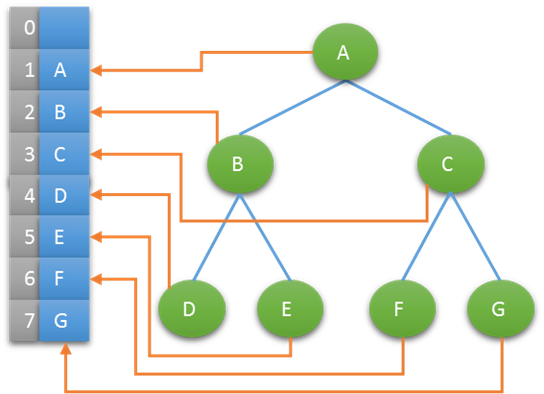
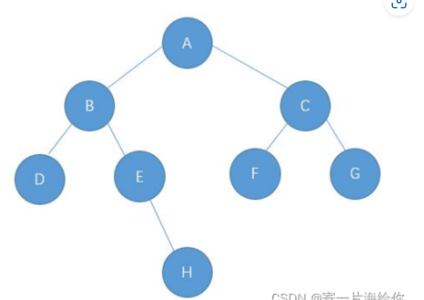
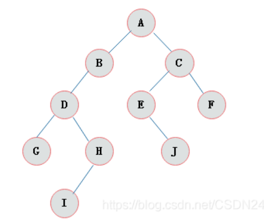
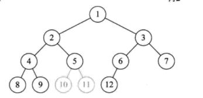

<!-- 2023年08月15日 -->
## 树(tree)
### 基本概念
####  树的定义：
由一个或多个(n≥0)结点组成的有限集合T，有且仅有一个结点称为根（root），当n>1时，其余的结点分为m(m≥0)个互不相交的有限集合T1,T2，…，Tm。每个集合本身又是棵树，被称作这个根的子树 。
####  树的结构特点
 非线性结构，有一个直接前驱，但可能有多个直接后继（1:n）
 树的定义具有递归性，树中还有树。
  树可以为空，即节点个数为0。
#### 若干术语
- 根  即根结点(没有前驱)
- 叶子 即终端结点(没有后继)
- 森林   指m棵不相交的树的集合(例如删除A后的子树个数)
- 有序树   结点各子树从左至右有序，不能互换（左为第一）
- 无序树   结点各子树可互换位置。
- 双亲（父节点）   即上层的那个结点(直接前驱) parent
- 孩子（子节点）   即下层结点的子树 (直接后继) child
- 兄弟   同一双亲下的同层结点（孩子之间互称兄弟）sibling
- 堂兄弟   即双亲位于同一层的结点（但并非同一双亲）cousin
- 祖先  即从根到该结点所经分支的所有结点
- 子孙   即该结点下层子树中的任一结点




- 结点 即树的数据元素 
- 结点的度 结点挂接的子树数（有几个直接后继就是几度）
- 结点的层次 从根到该结点的层数（根结点算第一层）  
- 终端结点 即度为0的结点，即叶子             
- 分支结点 除树根以外的结点（也称为内部结点）
- 树的度 所有结点度中的最大值（Max{各结点的度}）       
- 树的深度(或高度) 指所有结点中最大的层数（Max{各结点的层次}）
- 上图中的结点数＝ 13，树的度＝ 3，树的深度＝ 4

### 树的表示法

#### 图形表示法


#### 广义表表示法


利用广义表表示法,上面图形表示法的为  
`A(B(E(K,L),F),C(G),D(H(M),I,J))`

## 二叉树

### 二叉树基本概念
#### 定义：
n（n≥0）个结点的有限集合，由一个根结点以及最多两棵互不相交的、分别称为左子树和右子树的二叉树组成 。二叉树可以为空。
#### 逻辑结构
父对子 一对二（1：2） 
#### 基本特征
- 每个结点最多只有两棵子树（不存在度大于2的结点）；
- 左子树和右子树次序不能颠倒（有序树）。 

基本形态:



#### 二叉树性质
- 性质1: 在二叉树的第i层上至多有2i-1（2<sup>(i-1)</sup>）个结点（i>0）
- 性质2: 深度为k的二叉树至多有2k -1（2<sup>k</sup>-1）个结点（k>0）
- 性质3: 对于任何一棵二叉树，若度为2的结点数有n2个，则叶子数（n0）必定为n2＋1 （即n0=n2+1）（一颗二叉树的叶子树=度为2的节点的个数+1）

### 其他类型二叉树
#### 满二叉树
一颗深度为k且有2<sup>k</sup>-1个节点的二叉树  
每一层都充满了节点




#### 完全二叉树
除最后一层外，每一层上的节点数均达到最大值；在最后一层上只缺少右边的若干结点。



完全二叉树的第k-1层与满二叉树完全一样,  
但是第k层的节点都靠左边

> 具有n个节点的完全二叉树深度为log<sub>2</sub>n-1

> 对完全二叉树，若从上至下、从左至右编号，则编号为i 的结点，其左孩子编号必为2i，其右孩子编号必为2i＋1；其双亲的编号必为i/2（i＝1 时为根,除外）



### 二叉树的遍历
指按某条搜索路线、规则不重复、不遗漏的访问每个节点(又称周游)

牢记一种约定，对每个结点的查看都是“先左后右”。

限定先左后右，树的遍历有三种实现方案：

| DLR           | LDR           | LRD          |
| ------------- | ------------- | ------------ |
| 先 (根)序遍历 | 中 (根)序遍历 | 后(根)序遍历 |

    DLR — 先序遍历，即先根再左再右
    LDR — 中序遍历，即先左再根再右
    LRD — 后序遍历，即先左再右再根
注：“先、中、后”的意思是指访问的根结点D是先于子树出现还是后于子树出现。

从递归的角度看，这三种算法是完全相同的，或者说这三种遍历算法的访问路径是相同的，只是访问结点的时机不同。

## 练习

### 栈的实际使用

就近匹配
几乎所有的编译器都具有检测括号是否匹配的能力，那么如何实现编译器中的符号成对检测？如下字符串:    
`5+5*(6)+9/3*1)-(1+3(`

算法思路  
&ensp;&ensp;从第一个字符开始扫描   
&ensp;&ensp;当遇见普通字符时忽略，   
&ensp;&ensp;当遇见左符号时压入栈中   
&ensp;&ensp;当遇见右符号时从栈中弹出栈顶符号，并进行匹配   
&ensp;&ensp;匹配成功：继续读入下一个字符   
&ensp;&ensp;匹配失败：立即停止，并报错   
结束：   
&ensp;&ensp;成功: 所有字符扫描完毕，且栈为空   
&ensp;&ensp;失败：匹配失败或所有字符扫描完毕但栈非空  

<details>
  <summary>main.c</summary>

```c
#include <stdio.h>
#include <string.h>
#include <pthread.h> //线程头文件
#include "stack.h"
typedef struct
{
    LinkNode stack;
    char ch;
} Data;
typedef struct
{
    //等待处理的字符串
    char str[1024];
    //字符串当前下表
    int index;
} Str;
//初始化字符串
Str str = {"", 0};
void *weScanf(void *arg);
int main(int argc, char **argv, char **envp)
{
    // 用于遍历字符串的指针
    char *p;
    //保存的本地已经处理的下标
    int cahe_index = 0;
    //有错误的下标
    int index = 0;
    //栈堆
    Stack *stack = NULL;
    //栈堆保存有的数据
    Data d[2] =
        {
            {NULL, '('},
            {NULL, ')'}};
    int flag = 1;
    printf("请输入匹配的字符串");
    //输入的多线程
    pthread_t pth_scanf;
    pthread_create(&pth_scanf, NULL, weScanf, NULL);
    // 设置终端为非规范模式和无回显模式
    // system("stty raw -echo");
    system("stty -icanon"); // 关闭缓冲区，输入字符无需按回车键直接接受
    while (-1!= str.index)
    {
        //判断是否有新的数据输入 
        if (cahe_index != str.index)
        {
            p = str.str;
            stack = init_stack();
            flag = 1;
            index=0;
            while (*p != 0)
            {
                if ('(' == *p)
                {
                    push(stack, &d[0], sizeof(Data));
                }
                else if (')' == *p)
                {
                    if (NULL != stack->head)
                    {
                        pop(stack);
                    }
                    else
                    {
                        flag = 0;
                        break;
                    }
                }
                p++;
                index++;
            }
            system("clear");
            if (1 == flag && NULL == stack->head)
            {
                printf("\033[0m\033[1;32;40m%s\033[0m\n", str.str);
            }
            else
            {
                printf("\033[0m\033[1;31;40m%s\033[0m\n", str.str);
                for(int i=0;i<index-1;i++)
                    putchar(' ');
                printf("\033[0m\033[1;31;40m%c\033[0m\n", '^');
            }
            destory(&stack);
            cahe_index = str.index;
        }
    }
            printf("退出程序!\n");
    // 恢复终端设置
    system("stty cooked echo");
    pthread_cancel(pth_scanf);
    return 0;
}
void *weScanf(void *arg)
{
    char c;
    while (1)
    {
        c = getchar();
        if (c == 127)
        {
            if(0==str.index)
            {
                continue;
            }
            str.index--;
            str.str[str.index] = 0;
        }
        else if (c == '\n')
        {   
            str.index=-1;
            break;
        }
        else
        {
            str.str[str.index] = c;
            str.index++;
        }
    }
    // 恢复终端设置
    // system("stty cooked echo");
}

```
</details>


### 树的先中后序



- 先序:A-B-D-E-H-C-F-G
- 中序:D-B-E-H-A-F-C-G
- 后序:D-H-E-B-F-G-C-A




- 先序:A-B-D-G-H-I-C-E-J-F
- 中序:G-D-I-H-B-A-E-J-C-F
- 后序:G-I-H-D-B-J-E-F-C-A




- 先序:1-2-4-8-9-5-10-11-3-6-12-7
- 中序:8-4-9-2-10-5-11-1-12-6-3-7
- 后序:8-9-4-10-11-5-2-12-6-7-3-1