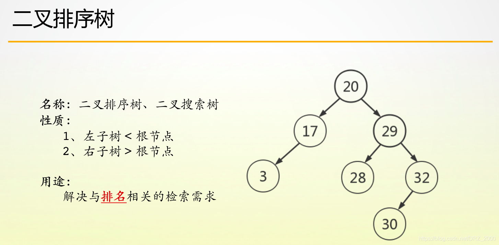

<!-- 2023年08月16日 -->
## 二叉树

学会利用前中后序中的两个来推导出另外一个序

### 二叉树的遍历

简单实现二叉树
- 统计节点个数
- 统计叶子节点个数
- 统计树的高度
- 先中后序遍历
<details>
  <summary>main.c</summary>

```c
#include <stdio.h>
typedef struct BtNode
{
    struct BtNode *left;
    struct BtNode *right;
    char c;
}btTree;
//统计节点个数
int statsNode(btTree*bt);
//统计叶子节点个数
int statsLeafNode(btTree*bt);
//统计树的高度
int statsHeigth(btTree*bt);

//先序遍历
int DLR_Traverse(btTree*bt);
//中序遍历
int LDR_Traverse(btTree*bt);
//后序遍历
int LRD_Traverse(btTree*bt);

int main(int argc , char** argv,char** envp)
{
    btTree tree[10]=
    {
        {NULL,NULL,'A'},//0
        {NULL,NULL,'B'},//1
        {NULL,NULL,'C'},//2
        {NULL,NULL,'D'},//3
        {NULL,NULL,'E'},//4
        {NULL,NULL,'F'},//5
        {NULL,NULL,'G'},//6
        {NULL,NULL,'H'},//7
        {NULL,NULL,'I'},//8
        {NULL,NULL,'J'}
    };
    tree[0].left=&tree[1];
    tree[0].right=&tree[2];
    tree[1].left=&tree[3];
    tree[1].right=&tree[4];
    tree[4].right=&tree[7];
    tree[2].left=&tree[5];
    tree[2].right=&tree[6];

    printf("树的节点个数为:%d\n",statsNode(tree));
    printf("树的叶子节点个数为:%d\n",statsLeafNode(tree));
    printf("树的高度为:%d\n",statsHeigth(tree));
    printf("\n先序遍历:");
    DLR_Traverse(tree);
    printf("\n中序遍历:");
    LDR_Traverse(tree);
    printf("\n后序遍历:");
    LRD_Traverse(tree);
    printf("\n");
    return 0;
}

//统计节点个数
int statsNode(btTree*bt)
{
    if(NULL==bt)
        return 0;
    return 1+statsNode(bt->left)+statsNode(bt->right);
}
//统计叶子节点个数
int statsLeafNode(btTree*bt)
{
    if(NULL==bt)
        return 0;
    if(NULL==bt->left&&NULL==bt->right)
        return 1;
    return statsLeafNode(bt->left)+statsLeafNode(bt->right);
}
//统计树的高度
int statsHeigth(btTree*bt)
{
    if(NULL==bt)
        return 0;
    if(NULL==bt->left&&NULL==bt->right)
        return 1;
    int l=statsHeigth(bt->left);
    int r=statsHeigth(bt->right);
    return 1+(l>r?l:r);
}


//先序遍历
int DLR_Traverse(btTree*bt)
{
    if(NULL==bt)
        return 0;
    printf("%c ",bt->c);
    DLR_Traverse(bt->left);
    DLR_Traverse(bt->right);
}
//中序遍历
int LDR_Traverse(btTree*bt)
{
    if(NULL==bt)
        return 0;
    LDR_Traverse(bt->left);
    printf("%c ",bt->c);
    LDR_Traverse(bt->right);
}
//后序遍历
int LRD_Traverse(btTree*bt)
{
    if(NULL==bt)
        return 0;
    LRD_Traverse(bt->left);
    LRD_Traverse(bt->right);
    printf("%c ",bt->c);
}
```
</details>

### 二叉搜索树(BST)
#### 二叉搜索树的性质

二叉排序树，又称二叉搜索树    
它最重要的性质就是：  
- 根结点左子树中所有结点的值均小于根结点值，  
- 右子树中所有结点的值都大于根结点的值，  
  
所以我们在中序遍历这棵二叉树时，将会得到一个升序序列，这也是我们验证二叉排序树的一个手段。



其结构为
```c
//二叉搜索树节点
typedef struct BST_tree
{
	int data;
	struct BST_tree* left;
	struct BST_tree* right;
}BST_tree;
```
主要实现的功能为
- 插入数据
- 先中后序遍历
- 删除节点 
- 销毁树  
  
还有其他功能
- 查找节点
- 查找指定节点的父节点
- 封装bst节点
<details>
  <summary>main.c</summary>

```c
#include <stdio.h>
#include <stdlib.h>
// 二叉搜索树节点
typedef struct BST_tree
{
    int data;
    struct BST_tree *left;
    struct BST_tree *right;
} BST_tree;
// 封装bst树
BST_tree *packNode(int data);
// 插入数据
BST_tree *insert_tree(BST_tree **tree, int data);
// 先序遍历
void DLRNode(BST_tree *tree);
// 中序遍历
void LDRNode(BST_tree *tree);
// 后序遍历
void LRDNode(BST_tree *tree);
// 查找节点
BST_tree *findNode(BST_tree *tree, int data);
// 查找指定节点的父节点
BST_tree *findFatherNode(BST_tree *tree, int data);
// 删除节点
void del_tree(BST_tree **tree, int val);
// 销毁树
void destoryNode(BST_tree **tree);
int main(int argc, char **argv, char **envp)
{
    BST_tree *tree;
    BST_tree **p = &tree;
    insert_tree(p, 5);
    insert_tree(p, 3);
    insert_tree(p, 1);
    insert_tree(p, 4);
    insert_tree(p, 7);
    insert_tree(p, 6);
    insert_tree(p, 8);
    LDRNode(tree);
    putchar('\n');
    del_tree(p,1);
    LDRNode(tree);
    putchar('\n');

    destoryNode(p);
    return 0;
}
// 封装bst树
BST_tree *packNode(int data)
{
    BST_tree *temp = (BST_tree *)malloc(sizeof(BST_tree));
    temp->data = data;
    temp->left = NULL;
    temp->right = NULL;
    return temp;
}

// 插入数据
BST_tree *insert_tree(BST_tree **tree, int data)
{
    if (NULL == *tree)
    {
        *tree = packNode(data);
    }
    else if (data == (*tree)->data)
    {
        return NULL;
    }
    else if (data < (*tree)->data)
    {
        insert_tree(&((*tree)->left), data);
    }
    else
    {
        insert_tree(&((*tree)->right), data);
    }
}

// 先序遍历
void DLRNode(BST_tree *tree)
{
    if (NULL == tree)
        return;
    printf("%d ", tree->data);
    DLRNode(tree->left);
    DLRNode(tree->right);
}
// 中序遍历
void LDRNode(BST_tree *tree)
{
    if (NULL == tree)
        return;
    LDRNode(tree->left);
    printf("%d ", tree->data);
    LDRNode(tree->right);
}
// 后序遍历
void LRDNode(BST_tree *tree)
{
    if (NULL == tree)
        return;
    LRDNode(tree->left);
    LRDNode(tree->right);
    printf("%d ", tree->data);
}
// 查找节点
BST_tree *findNode(BST_tree *tree, int data)
{
    if (NULL == tree)
        return NULL;
    else if (data == tree->data)
        return tree;
    else if (data < tree->data)
        return findNode(tree->left, data);
    else
        return findNode(tree->right, data);
}
// 查找指定节点的父节点
BST_tree *findFatherNode(BST_tree *tree, int data)
{
    if (NULL == tree)
        return NULL;
    else if ((NULL != tree->left && data == tree->left->data) || (NULL != tree->right && data == tree->right->data))
        return tree;
    else if (data < tree->data)
        return findFatherNode(tree->left, data);
    else
        return findFatherNode(tree->right, data);
}
// 删除节点
void del_tree(BST_tree **tree, int val)
{
    // 保存查找到的节点
    BST_tree *temp = findNode(*tree, val);
    // 保存查找到的父节点
    BST_tree *father_node = findFatherNode(*tree, val);
    if (NULL == temp || NULL == father_node)
        return;
    // 保存查找到的节点的右子树中,左子树为空的节点
    BST_tree **p = &(temp->right);
    // 查找到右子树中左节点为空的情况
    for (p = &(temp->right); NULL != *p; p = &((*p)->left))
        ;
    // 将左节点放在右子树的左节点底下
    *p = temp->left;
    if (temp == father_node->left)
        father_node->left = temp->right;
    else
        father_node->right = temp->right;
    free(temp);
}
// 销毁树
void destoryNode(BST_tree **tree)
{
    if (NULL == *tree)
        return;
    destoryNode(&((*tree)->left));
    destoryNode(&((*tree)->right));
    free(*tree);
    *tree = NULL;
}
```
</details>