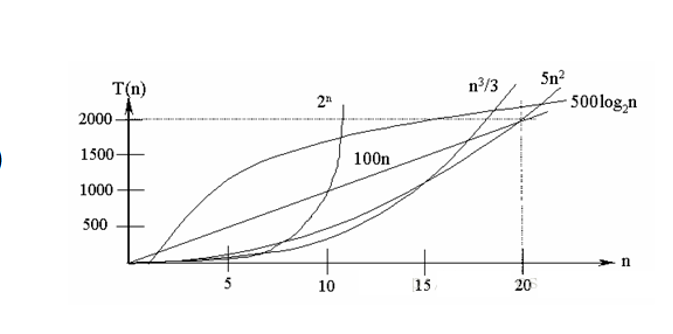
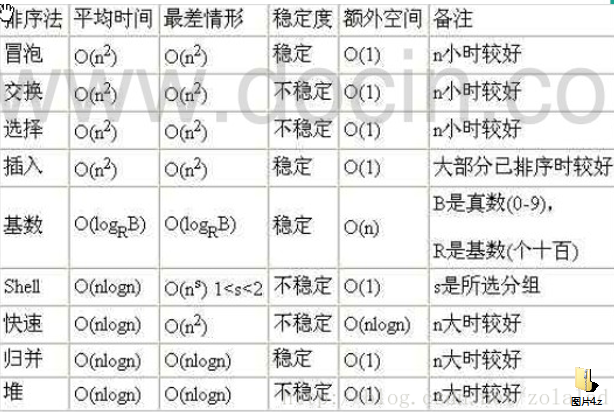

<!-- 2023年08月17日 -->
## 算法 
算法(Algorithm)是指解题方案的准确而完整的描述，是一系列解决问题的清晰指令，算法代表着用系统的方法描述解决问题的策略机制。也就是说，能够对一定规范的输入，在有限时间内获得所要求的输出。如果一个算法有缺陷，或不适合于某个问题，执行这个算法将不会解决这个问题。不同的算法可能用不同的时间，空间或效率来完成同样的任务。一个算法的优劣可以用空间复杂度与时间复杂度来衡量。

### 时间复杂度的概念
时间复杂度的定义:  
    在计算机科学中，算法的时间复杂度是一个函数表达式，它定量描述了该算法的运行时间。一个算法执行所耗费的时间，从理论上说，是不能算出来的，只有你把你的程序放在机器上跑起来，才能知道。但是我们需要每个算法都上机测试吗?是可以都上机测试，但是这很麻烦，所以才有了时间复杂度这个分析方式。一个算法所花费的时间与其中语句的执行次数成正比例，算法中的基本操作的执行次数，为算法的时间复杂度。

即:找到某条基本语句与问题规模N之间的数学表达式，就是算出了该算法的时间复杂度。

实际中我们计算时间复杂度时，我们其实并不一定要计算精确的执行次数，而只需要大概执行次数，那么这里我们使用大O的渐进表示法。
实际中我们计算时间复杂度时，我们其实并不一定要计算精确的执行次数，而只需要大概执行次数，那么这里我们使用大O的渐进表示法.

###  大O的渐进表示法

大O符号(Big O notation) :是用于描述函数渐进行为的数学符号.  
推导大o阶方法:

1. 用常数1取代运行时间中的所有加法常数.
1. 在修改后的运行次数函数中,只保留最高阶项.
1. 如果最高阶项存在且不是1,则去除与这个项相乘的常数。得到的结果就是大O阶.

常见的时间复杂度  



其中对其排序为
O(1)<
O(log<sub>2</sub>n)<
O(n)<
O(n*log<sub>2</sub>n)<
O(n<sup>2</sup>)<
O(n<sup>3</sup>)<
O(n<sup>k</sup>)<
O(2<sup>n</sup>)

常见排序算法时间复杂度  



### 算法的空间复杂度基本介绍

类似于时间复杂度的讨论，一个算法的空间复杂度(Space Complexity)定义为该算法所耗费的存储空间，它也是问题规模n的函数。

空间复杂度(Space Complexity)是对一个算法在运行过程中临时占用存储空间大小的量度。有的算法需要占用的临时工作单元数与解决问题的规模n有关，它随着n的增大而增大，当n较大时，将占用较多的存储单元，例如快速排序和归并排序算法就属于这种情况

在做算法分析时，主要讨论的是时间复杂度。从用户使用体验上看，更看重的程序执行的速度。一些缓存产品(redis, memcache)和算法(基数排序)本质就是用空间换时间。

### 算法的重要的五个指标

#### 有穷性（Finiteness）
算法的有穷性是指算法必须能在执行有限个步骤之后终止；

#### 确切性(Definiteness)
算法的每一步骤必须有确切的定义；

#### 输入项(Input)
一个算法有0个或多个输入，以刻画运算对象的初始情况，所谓0个输入是指算法本身定出了初始条件；

#### 输出项(Output)
一个算法有一个或多个输出，以反映对输入数据加工后的结果。没有输出的算法是毫无意义的；

#### 可行性(Effectiveness)
算法中执行的任何计算步骤都是可以被分解为基本的可执行的操作步骤，即每个计算步骤都可以在有限时间内完成（也称之为有效性）。

简而言之：算法，是解决一类问题的特定的有效步骤。

## 排序算法
### 冒泡排序
对原始数据按照从前往后的方向进行多次扫描，每次扫描称为一趟。对于每一趟遍历，当发现相邻两个数据的次序与排序要求的次序不符合时，即将两个数据进行交换。如果从小到大排序，这时，较大的数据就会逐个向后移动，好像气泡向上漂浮一样。
<details>
  <summary>冒泡排序-bubbleSort</summary>

```c
// 冒泡排序 
void bubbleSort(int *arr, int size)
{
    int temp;
    for (int i = 0; i < size - 1; i++)
        for (int j = 0; j < size - i - 1; j++)
        {
            if (*(arr + j) > *(arr + j + 1))
            {
                temp = *(arr + j);
                *(arr + j) = *(arr + j + 1);
                *(arr + j + 1) = temp;
            }
        }
}
```
</details>

### 选择排序
首先在未排序序列中找到最大（小）的元素，然后将这个数据放到序列的一端，再从剩下的序列中找到最大（小）的元素，放到剩余序列的一端，以此类推，直到序列全部完成排序。

<details>
  <summary>选择排序-select_sort</summary>

```c
// 选择排序
void select_sort(int *arr, int size)
{
    int i, j, temp;
    int index;
    for (i = 0; i < size-1 ; i++)
    {
        index = i;
        for (j = i+1; j < size; j++)
        {
            if (*(arr + j) > *(arr + index))
            {
                index = j;
            }
        }
        //交换两数
        temp = *(arr + i);
        *(arr + i) = *(arr + index);
        *(arr + index) = temp;
    }
}
```
</details>

### 插入排序

将未排序的序列不断地插入到已排序的序列中，直到未排序的序列全部排序完成。

<details>
  <summary>插入排序-insert_sort</summary>

```c
// 插入排序
void insert_sort(int *arr, int size)
{
    int temp;
    for(int i=1;i<size;i++)
    {
        temp=*(arr+i);
        for(int j=i;j>=0;j--)
        {
            else if(j!=0&&temp<*(arr+j-1))
            {
                //该处的值赋值给下一个
                *(arr+j)=*(arr+j-1);
            }
            else
            {
                *(arr+j)=temp;
                break;
            }
            
        }
    }
}
```
</details>