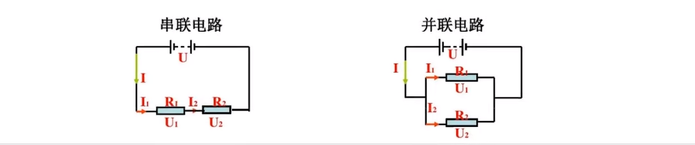

## 电流
原子  
世间万物都是由原子组成,原子由中间带正电荷的原子核和置为带负电的电子组成  
在金属固体中,电子较为远离原子核,

### 电流定义
单位 安培(A)
1秒内有6.2415093x10^18个元电荷通过横截面的电流 就是1A

| 常见电流大小     | 电流大小 |
| ---------------- | -------- |
| 单片机待机电流   | 10mA     |
| 鼠标和键盘的电流 | 50mA     |
| 强光手电筒       | 1A       |
| 笔记本电脑       | 3A       |
| 微波炉           | 10A      |
| 闪电             | 10000A   |

单位换算
1A=1000mA  
1安=1000毫安

10mA电流人体没有感觉  
超过16mA会根据轻微的肌肉刺痛  
长期超过80mA可能会导致肌肉麻痹  
长期超过3000mA会导致心脏肌肉收缩异常,导致心脏紊乱,停搏,甚至骤停  

皮肤电阻大概10万欧姆,但在潮湿的情况下可能只有几百欧姆   
所以一般来讲,36V以下对人体来说是安全的电压

 
## 电路和电池
电路就是电流导通的道路  

电池是一种特殊的通过化学反应产生能量的装置  
电池正极吸收电子,电池负极发送电子,
### 电流的方向

之后的笔记都是传统电学,即电流从正极流向负极
### 开路和闭路
Open circuit和Close circuit的区别在于电路中开关是否闭合,这直接影响电路中的电器设备是否正常工作

电工操作安全要求就是,保证电路是开路,千万不要让电流通过身体形成回路

### 交流电和直流电
| -            | 交流电                                       | 直流电                                 |
| ------------ | -------------------------------------------- | -------------------------------------- |
| 缩写         | AC(ALTERNATING CURRENT)                      | DC(DIRECT CURRENT)                     |
| 符号         | ~                                            | —                                      |
| 电流方向     | 电流方向随时间变化而变化                     | 电流方向不会改变                       |
| 电荷方向     | 电荷会在正负两个方向上流动，周期性的交替反向 | 电荷始终在同一个方向上流动             |
| 来源         | 通过电网供应的电力                           | 由电池或者是其他直流电源供应           |
| 用途         | 用于各种大型的较大功耗的电器设备和机械中     | 用于需要稳定电压和核定方向的小型设备中 |
| 传输损失     | 传输损失较小                                 | 传输损失较大                           |
| 方便改变电压 | 不太方便                                     | 十分方便                               |

虽然直流电的传输损耗小，但是不能很方便的改变电压，所以说实际生活中远距离输电是使用交流电

## 电压
电压就是一种势能,一种电势能,是指电子在电路中的动能  
单位为 伏特(V)

电压决定着电流流动的强度,电压越高,电子移动的越快,电流就会越大

电压产生电势差推动电流的流动
## 电阻
电阻是电子学中的基本概念,指的是电流经过导体时阻碍电子流流动的程度   
单位是欧姆(Ω)

## 欧姆定律
描述了电流和电压之间的关系  
公式为I=U/R

$$
    \tag{1} I=\frac{U}{R} 
$$
$$
    \tag{2} R=\frac{U}{I}   
$$
$$
    \tag{3} U=I*R 
$$
## 串联和并联电路

| 关系         | 串联电路                          | 并联电路                                  |
| ------------ | --------------------------------- | ----------------------------------------- |
| 电流关系     | $I=I_1=I_2$                       | $I=I_1+I_2$                               |
| 电压关系     | $U=U_1+U_2$                       | $U=U_1=U_2$                               |
| 电阻关系     | $R=R_1+R_2$                       | $\frac{1}{R}=\frac{1}{R_1}+\frac{1}{R_2}$ |
| 电压分配关系 | $\frac{U_1}{R_1}=\frac{U_2}{R_2}$ | $I_1*R_1=I_2*R_2$                         |

串联分压 , 并联分流