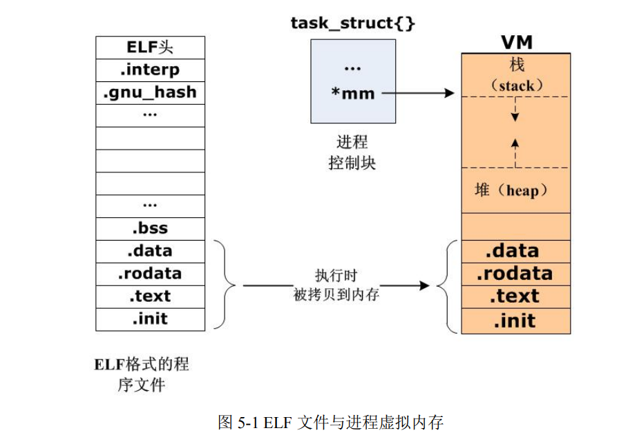
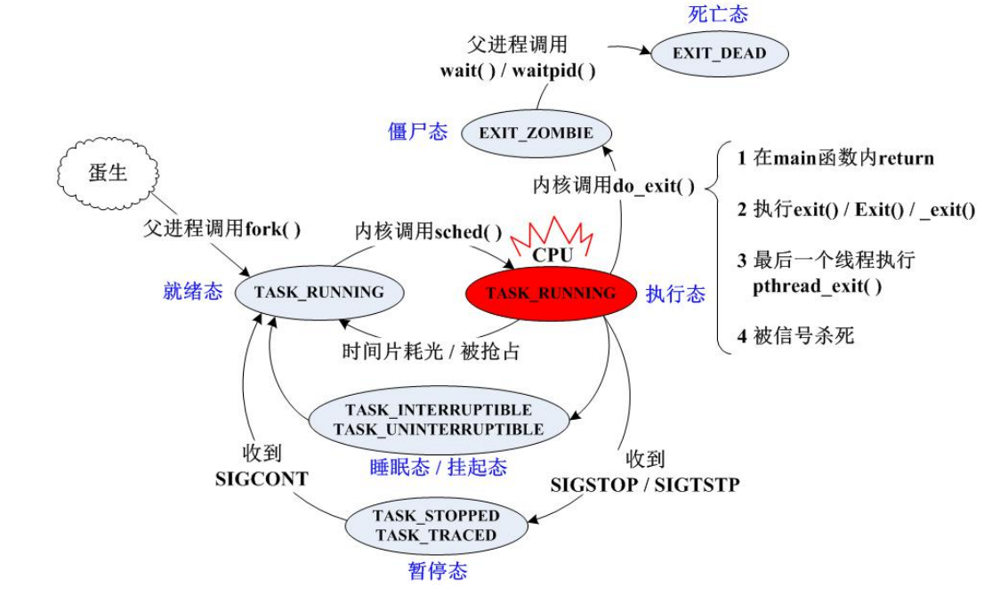
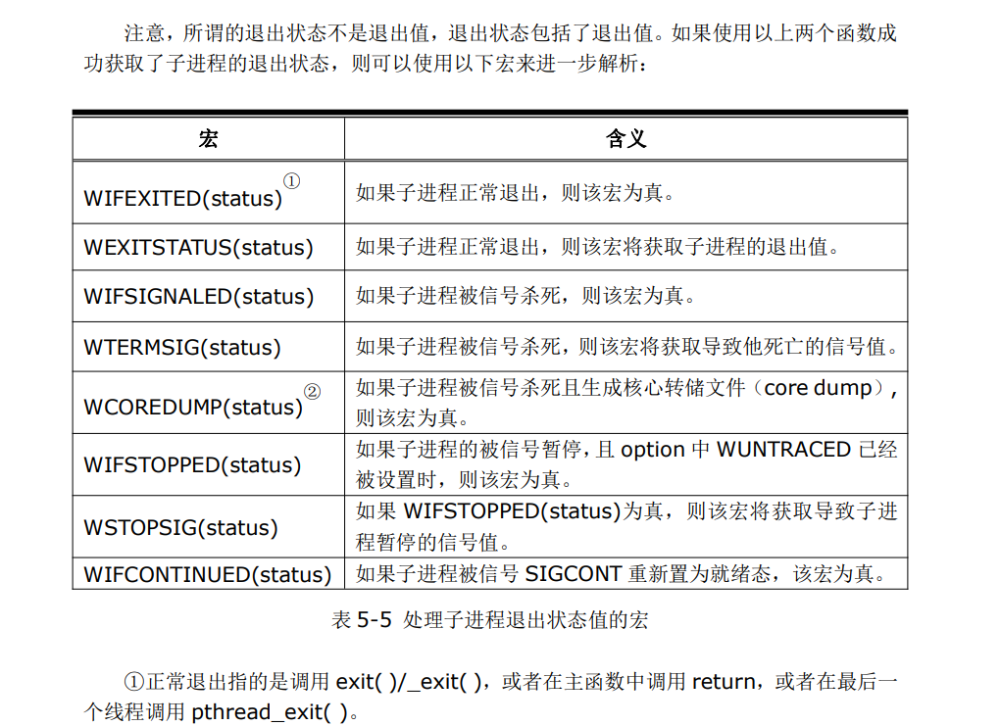
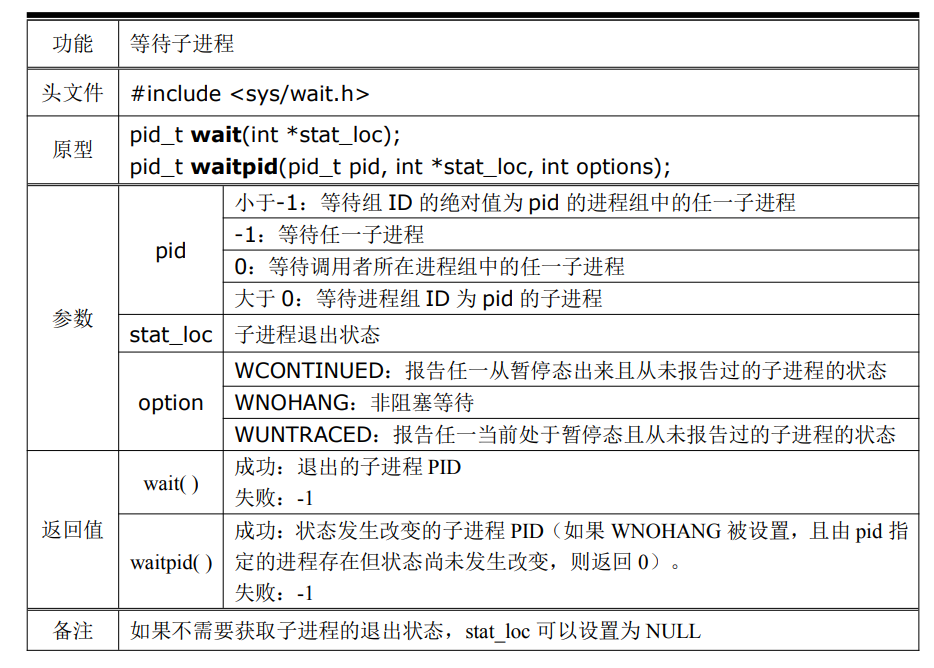

<!-- 2023年08月21日 -->
## 进程的概念

### 程序和进程的区别
- 程序:编译后产生的,格式为ELF的,存储于硬盘中的文件
- 进程:程序中的代码和数据,被加载到内存中运行的过程,当程序被CPU加载时,根据每一行代码做出相应的效果,形成动态的过程,那么这个过程就是进程.即-进程就是一个正在执行的程序
- 程序是静态的概念,进程是动态的概念

### 开启进程
直接在Linux下,执行一个程序,就会开启相应的进程  
例如: ./hello -> 开启一个名为hello的进程

### 当进程开启后,系统也会为进程分配的资源

可以使用 `readelf hello -s` 可以查看ELF文件(gcc编译后的文件)的内容

当进程开启后,会分配进程对应内存空间

进程在系统内核中如何进行表示呢
    
    当进程开启之后，会为这个进程分配一个任务结构体，这个任务结构体就是用于描述这个进程的。  
    也就是说，进程在内核中是以结构体struct task_struct{} 进行表示的。这个结构体也被称之为进程控制块。    
    结构体：进程ID号、信号、文件、资源....  
    /usr/src/linux-headers-3.5.0-23/include/linux/sched.h    ----第1229行



在Linux中，程序文件的格式都是ELF，  
这些文件在被执行的瞬间，就被载入内存，  
所谓的载入内存，如上图所示，就是将数据段、代码段这些运行时必要的资源拷贝到内存，另外系统会再分配相应的栈、堆等内存空间给这个进程，使之成为一个动态的实体
## 关于进程的命令
### 查看整个Linux系统进程之间关系的命令
在Linux系统中，除了系统的初始进程之外，其余所有进程都是通过从一个父进程（parent）复刻（fork）而来的，  
就像人类社会，每个个体都是由亲代父母繁衍而来。  
因此，在整个Linux系统中，所有的进程都起源于相同的初始进程，它们之间形成一棵倒置的进程树，就像家族族谱，可以使用命令`pstree`查看这些进程的关系：
```bash
gec@ubuntu:~$ pstree
systemd─┬─ModemManager───2*[{ModemManager}]
        ├─NetworkManager───2*[{NetworkManager}]
        ├─VGAuthService
        ├─accounts-daemon───2*[{accounts-daemon}]
        ├─acpid
        ├─anacron
        ├─avahi-daemon───avahi-daemon
        ├─blkmapd
        ├─colord───2*[{colord}]
        ├─cron
        ├─cups-browsed───2*[{cups-browsed}]
        ├─cupsd
        ├─2*[dbus-daemon]
        ├─fcitx
        ├─fcitx-dbus-watc

```
最开始的系统进程叫systemd，这个进程的诞生比较特别，其身份信息在系统启动前就已经存在于系统分区之中，在系统启动时直接复制到内存。而其余的进程，从上述pstree命令的执行效果可见，都是系统初始进程的直接或间接的后代进程。
### 查看进程ID号  ----> `ps -ef`（静态）
```bash
gec@ubuntu:~$ ps -ef
用户名   进程ID      父进程     cpu占用      进程启动时间              进程持续时间         进程名
UID       PID        PPID        C           STIME               TIME           TIME CMD
root       1           0             0           14:32 ?                00:00:00           /sbin/init
root       2           0             0           14:32 ?                00:00:00           [kthreadd]
gec       3026       2856        96          18:59 pts/1            00:00:09           ./while
gec       3032       2849        1           19:00 pts/2            00:00:00           bash
gec       3087       3032        0           19:00 pts/2            00:00:00           ps -ef
```

### 查看进程CPU的占用率 ---> top (动态)
```c
gec@ubuntu:~$ top
top - 06:43:17 up 1 min,  2 users,  load average: 0.06, 0.02, 0.01
PID USER      PR  NI  VIRT  RES  SHR S %CPU %MEM    TIME+  COMMAND
1001 root      20   0 87580  22m 6716 S  1.0  2.3   0:00.84 Xorg
1 root      20   0  3668 2004 1284 S  0.3  0.2   0:00.61 init
2307 gec       20   0 90992  14m  10m S  0.3  1.5   0:00.27 gnome-terminal
2 root      20   0     0    0    0 S  0.0  0.0   0:00.00 kthreadd
3 root      20   0     0    0    0 S  0.0  0.0   0:00.05 ksoftirqd/0
4 root      20   0     0    0    0 S  0.0  0.0   0:00.10 kworker/0:0
5 root      20   0     0    0    0 S  0.0  0.0   0:00.23 kworker/u:0
```
## 进程的状态
| 状态名 | 状态描述     | 状态描述                                                                                      |
| ------ | ------------ | --------------------------------------------------------------------------------------------- |
| 就绪态 | TASK_RUNNING | 等待CPU资源  不占用CPU资源，不运行代码。                                                      |
| 运行态 | TASK_RUNNING | 占用CPU资源，运行代码。                                                                       |
| 暂停态 | TASK_STOPPED | 占用CPU资源，不运行代码。 可以到就绪态。                                                      |
| 睡眠态 |              | 占用CPU资源，运行代码。   可以到就绪态。                                                      |
| 僵尸态 | EXIT_ZOMBIE  | 占用CPU资源，不运行代码。不可以到运行态。进程退出的时候，就一定会变成僵尸态                   |
| 死亡态 | EXIT_DEAD    | 不占用CPU资源，不运行代码。进程退出的时候，如果有人去帮自己回收资源，那么僵尸态就会变为死亡态 |

睡眠态的两种睡眠
- TASK_INTERRUPTIBLE       响应信号 ---->浅度睡眠  pause()--->一直等待下一信号（等待的是软件资源：IO等）
- TASK_UNINTERRUPTIBLE  不响应信号 ---->深度睡眠（硬件反应---->按键）



什么是僵尸态？  
进程结束时，就从运行态变成僵尸态，所谓僵尸态，就是代表这个进程所占用的CPU资源和自身的任务结构体没有被释放，这个状态的进程就是僵尸态进程。

总结：
- 进程在暂停态时，收到继续的信号时，是切换到就绪态，而不是运行态。
- 程序的main函数执行return 0就会导致进程的退出，一定会变成僵尸态。
- 进程不可以没有父进程，也不能同时拥有两个父进程。
- 孤儿进程特征就是失去父进程时，会马上寻找继父，而不是等到孤儿进程变成僵尸态再找。
- 祖先进程一定要帮其他的进程回收资源。

## 进程的函数接口
单进程程序  -> 只能一行行代码去执行。  
多进程程序  -> 同时执行两行代码  -> 产生一个子进程，帮自己处理另外一件事情。
### 产生子进程-`fork()`

```c
#include <unistd.h>
pid_t fork(void);
/* 
作用
    创建一个进程，将父进程的资源复制一份，申请一片新的资源给子进程，他们的资源都是独立的
    并且从fork创建处开始运行 相对应数据一模一样
返回值
    成功： （一次调用，两次返回）
        >0       父进程            但是返回的ID号表示的是子进程的ID号
        =0       子进程
    失败
        返回  -15

    fork出错可能有两种原因：
    1）当前的进程数已经达到了系统规定的上限，这时errno的值被设置为EAGAIN。
    2）系统内存不足，这时errno的值被设置为ENOMEM。
 */
```

实例
```c
#include<stdio.h>
#include <unistd.h>
int main()
{
    printf("main process\n");
    /*产生一个子进程*/
    fork();
    /* 一个父进程，一个子进程 */
    /* 接下来的代码，父进程会执行一遍，子进程也会执行一遍 */
    printf("after fork\n");
    return 0;
}
/* 
会先打印一个main process 再打印两次after fork
 */
```
注意：只有父进程退出，才会出现命令行，子进程退出是不会出现命令行。  
这两个进程执行没有固定的先后顺序，哪个进程先执行要看系统的进程调度策略。

循环产生进程
```c
#include <unistd.h>  
#include <stdio.h>  
int main(void)  
{  
   int i=0;  
   printf("i son/pa ppid pid  fpid/n");  
   //ppid指当前进程的父进程pid  
   //pid指当前进程的pid,  
   //fpid指fork返回给当前进程的值  
   for(i=0;i<2;i++){  
       pid_t fpid=fork();  
       if(fpid==0)  
           printf("%d child  %4d %4d %4d/n",i,getppid(),getpid(),fpid);  
       else  
           printf("%d parent %4d %4d %4d/n",i,getppid(),getpid(),fpid);  
   }  
   return 0;  
}  
/* 
 运行结果是：
    i son/pa ppid pid  fpid
    0 parent 2043 3224 3225
    0 child  3224 3225    0
    1 parent 2043 3224 3226
    1 parent 3224 3225 3227
    1 child     1 3227    0
    1 child     1 3226    0
 */
```
总结一下规律，对于这种N次循环的情况，执行printf函数的次数为2*（1+2+4+……+2N）次，创建的子进程数为1+2+4+……+2N个。

```c
#include <stdio.h>  
int main(int argc, char* argv[])  
{  
   fork();  
   fork() && fork() || fork();  
   fork();  
   printf("+\n");  
}  
```
会执行20次 注意`&&` 和`||`的用法


想确保子进程先运行，做法： 就是让父进程先睡眠  
-> 子进程不用睡眠，父进程需要睡眠。  -> 父子进程任务不一样。  -> 思路： 通过返回值判断。
```c
#include<stdio.h>
#include <unistd.h>
int main()
{
    /这是单进程的程序/    
    printf("main process\n");
    /*产生一个子进程*/
    pid_t id = fork();
    if(id>0)//父进程
    {
        //延时 确保子进程先运行
        sleep(1);
        printf("我是你爹 parent\n");
    }
    else if(id == 0)//子进程
    {
        printf("楼上有人在骂我 child\n");
    }
    else{//出错
        printf("完犊子了\n");
    }
    
    printf("after fork\n");

    return 0;
}
```
总结
- 父子进程执行顺序随机的。
- fork()之后的代码，两个进程都会执行。

### 在一个进程中查看自己的PID号以及父进程的PID号
```c
#include <sys/types.h>
#include <unistd.h>
pid_t getpid(void);
pid_t getppid(void);
/* 
返回值
    成功
        getpid---->返回自己的ID号
        getppid--->返回父进程的ID号
    失败
        不会失败
 */
```

## 关于僵尸进程 与 孤儿进程


孤儿进程：一般情况下，调用fork()函数创建的子进程，父进程如果比子进程先退出，那么这个子进程称之为 孤儿进程。那么，祖先进程init 就会成为该子进程的父进程，回收该子进程的资源。  
僵尸进程：父进程还存在，但是去做的别的事情了（比如在一个死循环，没有退出），此时子进程退出之后，就变成了僵尸进程。（可以用ps -ef 查看，进程的状态栏为defunct，这就是所谓的“僵尸”进程）

###  如何解决僵尸进程问题
#### 父进程结束
父进程退出后，子进程会寻找继父帮自己回收资源。
#### 父进程未结束
父进程还在，主动回收资源。  -> `wait() `
功能： wait for process to change state  
```c
#include <sys/types.h>
#include <sys/wait.h>
//等待一个进程为的就是帮这个进程修改状态 (从僵尸态变成死亡态)  
pid_t wait(int *status);
/* 
参数：
    status：    监听子进程的退出状态
    填NULL，例如： wait(NULL)        -> 代表父进程只回收资源，但是不关心子进程的退出状态。
    不填NULL，例如： int x; wait(&x);-> 代表父进程不仅回收资源，还关心子进程的退出状态，退出状态会保存到x变量中。

    返回值：
        成功：回收资源的那个子进程的ID号
        失败：-1
 */
```
注意：  
wait属于一个阻塞函数，如果子进程没有退出变成僵尸态，那么这个函数就会阻塞，直到子进程变成僵尸态之后，才会将子进程的资源回收。status还可以保存子进程的退出状态。

## 进程的退出
大概分为这几种方式  
`exit()` /`_Exit()` / `_exit()`/`return 0(main函数中)`
### exit()
功能： cause normal process termination  
//导致一个进程的结束。
```c
#include <stdlib.h>
void exit(int status);
/* 
函数作用
先清洗缓冲区，再退出
exit 函数设置的退出值  只能是 0~255 范围
参数：
    status： 退出状态值
    0  -> 进程正常退出
    非0 -> 进程异常退出
 */
```
### _Exit() / _exit()
`_Exit()` / `_exit()` --------不会清洗缓冲区，直接退出

功能： terminate the calling process
```c
//结束一个正在运行的进程
#include <unistd.h>
void _exit(int status);
#include <stdlib.h>
void _Exit(int status);
/* 
参数：
    status： 退出状态值
    0  -> 进程正常退出
    非0 -> 进程异常退出
 */
```
### exit()与return语句的区别
- 在`main()`函数中`exit()`与 `return`无太大的区别
- 在其他函数中,`exit()`表示程序的结束,`return`表示退出这个函数


## 设置和获取子进程的退出值


获取子进程正常退出值
```c
#include<stdio.h>
#include<stdbool.h>
#include <unistd.h>
#include <sys/types.h>
#include <sys/types.h>
#include <sys/wait.h>
#include <stdlib.h>

int main()
{
    //创建一个子进程
    pid_t id = fork();
    if(id >0)//父进程
    {
        printf("parent:%d\n",getpid());
    }
    else if(id ==0)//子进程
    {
        printf("child:%d\n",getpid());
        exit(15); 
        //调用了exit，子进程后面的代码都不会执行了
        printf("11111111111\n");
    }
    //下面的代码 子进程不会执行了，因为在子进程中已经调用了exit退出函数
    //等待子进程退出,并且获取子进程的状态值
    int status;
    wait(&status);
    //注意：status是 退出状态，里面包括了退出值
    //调用系统已经封装好的宏函数实现  从  退出状态中  提取 出 退出值 
    if(WIFEXITED(status))//先判断子进程是否正常退出
    {
        //使用 WEXITSTATUS 宏函数 获取 子进程的退出值
        printf("status:%d\n", WEXITSTATUS(status));
    }
}
```

获取子进程被信号杀死的信号值  
使用`skill -34 进程id` 其中 34就是信号值
```c
#include<stdio.h>
#include<stdbool.h>
#include <unistd.h>
#include <sys/types.h>
#include <sys/types.h>
#include <sys/wait.h>
#include <stdlib.h>

int main()
{
    //创建一个子进程
    pid_t id = fork();
    if(id >0)//父进程
    {
        printf("parent:%d\n",getpid());
    }
    else if(id ==0)//子进程
    {
        printf("子进程 id:%d 正在运行....\n",getpid());
        pause();//阻塞等待一个信号的到来
    }
    //等待子进程退出,并且获取子进程的状态值
    int status;
    wait(&status);
    //可以给子进程发送杀死信号：kill -9 子进程ID号
    if(WIFSIGNALED(status))//如果子进程被信号杀死，则该宏为真。
    {
        //如果子进程被信号杀死，则该宏将获取导致他死亡的信号值。
        printf("status:%d\n", WTERMSIG(status)); 
    }
}
```
### waitpid 等待子进程退出 



给子进程发送暂停信号

```c
#include<stdio.h>
#include<stdbool.h>
#include <unistd.h>
#include <sys/types.h>
#include <sys/types.h>
#include <sys/wait.h>
#include <stdlib.h>

int main()
{
    //创建一个子进程
    pid_t id = fork();
    if(id >0)//父进程
    {
        printf("parent:%d\n",getpid());
    }
    else if(id ==0)//子进程
    {
        printf("子进程 id:%d 正在运行....\n",getpid());
        pause();//阻塞等待一个信号的到来
       // exit(15);
    }
    //等待子进程退出,并且获取子进程的状态值
    int status;
    waitpid(0,&status,WUNTRACED);
    
    //如果子进程正常退出，则该宏为真。
    if(WIFEXITED(status)){
        //如果子进程正常退出，则该宏将获取子进程的退出值。
        printf("status:%hhu\n",WEXITSTATUS(status) );
    }
    //如果子进程被信号SIGSTOP暂停，且 option 中 WUNTRACED 已经被设置时，则该宏为真。
    if(WIFSTOPPED(status)){
        //如果 WIFSTOPPED(status)为真，则该宏将获取导致子进程暂停的信号值。
         printf("status:%hhu\n",WSTOPSIG(status));
    }
}
```
使用 `skill -19 子线程` 会打印 `status:19`


## 练习

- 子进程每隔1s打印一个apple 父进程每相隔2s打印一个hello
```c
#include <stdio.h>
#include <sys/types.h>
#include <unistd.h>

int main(int argc, char **argv, char **envp)
{

    printf("程序开始\n");
    pid_t id = fork();
    //说明创建错误
    if (id == -1)
    {
        perror("fock错误");
        return 0;
    }
    while (1)
    {
        // id>0 说明进程是父进程
        if (id > 0)
        {
            printf("父进程:hello\n");
            sleep(2);
        }
        // id==0 说明进程是子进程
        else if (id == 0)
        {
            printf("子进程:apple\n");
            sleep(1);
        }
    }
    return 0;
}
```

- 在子进程中打印自己与父进程的PID好 在父进程中打印自己与孩子的PID号
```c
#include <stdio.h>
#include <sys/types.h>
#include <unistd.h>

int main(int argc, char **argv, char **envp)
{

    pid_t id = fork();
    // 说明创建错误
    if (id == -1)
    {
        perror("fock错误");
        return 0;
    }
    // id>0 说明进程是父进程
    if (id > 0)
    {
        printf("父进程:\n");
        printf("\t父进程自己的的PID:%d\n",getpid());
        printf("\t父进程孩子的的PID:%d\n",id);
        printf("\t父进程的父亲的的PID:%d\n",getppid());
        
    }
    // id==0 说明进程是子进程
    else if (id == 0)
    {
        printf("子进程:\n");
        printf("\t子进程自己的的PID:%d\n",getpid());
        printf("\t子进程父亲的的PID:%d\n",getppid());
    }
    return 0;
}
```

- 创建一个子进程,子进程打印hello后父进程打印word,之后父进程再创建两条进程,一条进程打印end,另外一个进程随便打印

```c
#include <stdio.h>
#include <sys/types.h>
#include <unistd.h>

int main(int argc, char **argv, char **envp)
{

    pid_t id = fork();
    // 说明创建错误
    if (id == -1)
    {
        perror("fock错误");
        return 0;
    }
    // id>0 说明进程是父进程
    if (id > 0)
    {
        sleep(1);
        printf("父进程:word\n");
        pid_t id1 = fork();
        if (id1 == -1)
        {
            perror("fock错误");
            return 0;
        }
        else if (id1 > 0)
        {
            pid_t id2 = fork();
            if (id2 == -1)
            {
                perror("fock错误");
                return 0;
            }
            else if (id2 == 0)
            {
                printf("子进程3:getend\n");
            }
        }
        else if (id1 == 0)
        {
            printf("子进程2:end\n");
        }
    }
    // id==0 说明进程是子进程
    else if (id == 0)
    {
        printf("子进程1:hello\n");
    }
    return 0;
}
```