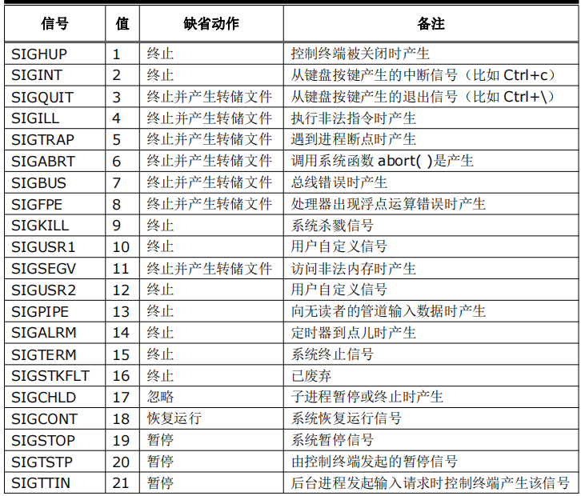
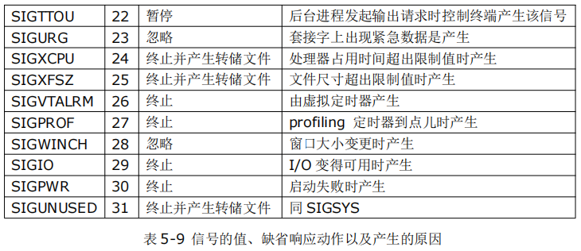

    <!-- 2023年08月23日 -->
## 进程通信之信号量
程序在被cpu加载的过程中形成的动态的过程叫做进程。在这个过程中，我们希望是可控的，也就是可以手动的去控制这个进程的各个状态，  
所以就要制定出一套机制或者命令，比如把停止命令发送给进程时，进程能够接收来自外部的请求命令，做出相应的停止进程默认动作。这一套机制或者命令叫做信号。
### 什么是信号？
信号一种异步通信机制，一般情况下，进程什么时候收到信号、收到信号是无法事先预料到的（就像你的电话，你不知道，它是什么时候响，但是电话响的时候，要去接（挂电话），去处理）。
### linux下的信号
```bsah
gec@jt-gec:/mnt/hgfs/share$ kill -l
SIGHUP     2) SIGINT     3) SIGQUIT     4) SIGILL     5) SIGTRAP
SIGABRT     7) SIGBUS     8) SIGFPE     9) SIGKILL    10) SIGUSR1
SIGSEGV    12) SIGUSR2    13) SIGPIPE    14) SIGALRM    15) SIGTERM
SIGSTKFLT    17) SIGCHLD    18) SIGCONT    19) SIGSTOP    20) SIGTSTP
SIGTTIN    22) SIGTTOU    23) SIGURG    24) SIGXCPU    25) SIGXFSZ
SIGVTALRM    27) SIGPROF    28) SIGWINCH    29) SIGIO    30) SIGPWR
SIGSYS    34) SIGRTMIN    35) SIGRTMIN+1    36) SIGRTMIN+2    37) SIGRTMIN+3
SIGRTMIN+4    39) SIGRTMIN+5    40) SIGRTMIN+6    41) SIGRTMIN+7    42) SIGRTMIN+8
SIGRTMIN+9    44) SIGRTMIN+10    45) SIGRTMIN+11    46) SIGRTMIN+12    47) SIGRTMIN+13
SIGRTMIN+14    49) SIGRTMIN+15    50) SIGRTMAX-14    51) SIGRTMAX-13    52) SIGRTMAX-12
SIGRTMAX-11    54) SIGRTMAX-10    55) SIGRTMAX-9    56) SIGRTMAX-8    57) SIGRTMAX-7
SIGRTMAX-6    59) SIGRTMAX-5    60) SIGRTMAX-4    61) SIGRTMAX-3    62) SIGRTMAX-2
SIGRTMAX-1    64) SIGRTMAX

例如：
19）SIGSTOP
信号值）SIG+信号名字
信号的名字与信号值是等价的，它们是宏定义来的，被定义在一个头文件中：
/usr/include/asm-generic/signal.h
#define SIGHUP         1
#define SIGINT         2
#define SIGQUIT         3
#define SIGILL         4
#define SIGTRAP         5
#define SIGABRT         6
#define SIGIOT         6
#define SIGBUS         7
#define SIGFPE         8
#define SIGKILL         9
#define SIGUSR1        10
#define SIGSEGV        11
#define SIGUSR2        12
#define SIGPIPE        13
#define SIGALRM        14
#define SIGTERM        15
#define SIGSTKFLT     16
#define SIGCHLD        17
#define SIGCONT        18
#define SIGSTOP        19
#define SIGTSTP        20
#define SIGTTIN        21
#define SIGTTOU        22
#define SIGURG        23
#define SIGXCPU        24
#define SIGXFSZ        25
#define SIGVTALRM    26
#define SIGPROF        27
#define SIGWINCH    28
#define SIGIO        29

```
缺省动作（默认执行动作）



### 信号是怎么发出的
#### 系统
    
    14）SIGLRM------->如果到点了，自动发出这个信号
    17）SIGCHLD------>当子进程退出时，自动发出这个信号给父进程
#### 用户
使用`kill`/`killall`

##### 方法1
首先查看PID号：ps -ef
           PID号
gec        4597   2880 99 14:30 pts/3    00:00:13 ./a.out

2）通过kill命令发送9号信号给该进程，杀死进程
kill -9 4597   
kill -SIGKILL 4597 或者kill -KILL 4597

##### 方法2
直接通过killall命令给进程名字发送信号
killall -9 a.out
killall -SIGKILL a.out 或者killall --KILL a.out

### 信号函数的接口
#### 发送信号
```c
#include <sys/types.h>
#include <signal.h>
int kill(pid_t pid, int sig);
/* 
函数作用：向指定的进程或者进程组，发送一个指定的信号
参数：
    pid
        <-1    信号将被发送给组ID等于-pid的进程组里面的所有进程
        -1    信号将被发送给所有进程(如果该进程对其有权限)
        0    信号将被发送给与当前进程同一个进程组内的所有进程
        >0    信号将被发送给PID等于pid的指定进程
    sig
        要发送的信号
 */
```

```c
#include<stdio.h>
#include <sys/types.h>
#include <signal.h>
#include <stdlib.h>

int main(int argc,char *argv[])
{
    //获取你要发送的信号的进程的ID号
    int id=atoi(argv[1]);//把字符串变成数值
    //发送信号
    kill(id,SIGINT);
    return 0;
}
/* 
终端显示：（拿到hello的进程号，用demo.c去杀他）
gec        4750   3158 99 14:51 pts/2    00:00:10 ./hello
gec        4753   2880  0 14:51 pts/3    00:00:00 ps -ef
gec@jt-gec:/mnt/hgfs/share$ gcc demo.c
gec@jt-gec:/mnt/hgfs/share$ ./a.out 4750
 */
```

#### 捕捉信号
```c
#include <signal.h>

void (*signal (int sig ,void (*func)(int))) (int) ;
// 可以表达为
typedef void (*sighandler_t)(int);
sighandler_t signal(int signum, sighandler_t handler);
/* 
函数作用：捕捉一个指定的信号，即预先为某一个到来做好准备                                                       
参数：
    signum
        需要捕捉的信号
    handler
        SIG_IGN ----->忽略该信号
        SIG_DFL-------default--->执行该信号的默认动作
    void（*p）(int)
        执行由p指向的信号 
    func
        响应函数
返回值：
    成功返回 最近一次调用该函数时第二个参数的值
    失败返回： SIG_ERR（#define SIG_ERR -1）

注意：
1.所谓的捕捉信号就是获取当这个信号来之后，去执行信号响应函数，原本的信号默认动作就不会执行了
2.当调用signal函数之后，程序不会阻塞，而是往下面代码执行，这个捕捉设置是去全局有效的
3.SIGKILL,SIGSTOP不能被捕捉，只能执行默认动作
*/
```

实例

```c
#include<stdio.h>
#include <sys/types.h>
#include <signal.h>
#include <stdlib.h>
//信号响应函数，也就是signal捕捉到信号，执行该函数
void signalHandle(int arg)
{
    printf("arg:%d\n",arg);
    printf("signalHandle 听说你想干掉我\n");
}
int main(int argc,char *argv[])
{
    //捕捉信号SIGINI,去执行响应函数
    signal(SIGINT,signalHandle);
    while(1);
    return 0;
}
/* 
终端显示：
gec@ubuntu:/mnt/hgfs/share$ ./a.out
arg:2
signalHandle 听说你想干掉我
arg:2
signalHandle 听说你想干掉我


另一个终端给信号：
gec        6160   3942 47 01:48 pts/4    00:01:01 ./a.out
root       6174      2  0 01:48 ?        00:00:00 [kworker/0:1]
root       6180      1  0 01:48 ?        00:00:00 /usr/sbin/cupsd -l
lp         6181   6180  0 01:48 ?        00:00:00 /usr/lib/cups/notifier/dbus dbus://
lp         6182   6180  0 01:48 ?        00:00:00 /usr/lib/cups/notifier/dbus dbus://
root       6186   3413  0 01:50 pts/17   00:00:00 ps -ef
root@ubuntu:/mnt/hgfs/share# killall -2 ./a.out

总结：捕捉信号就是获取当SIG_INT信号来之后，去执行信号响应函数 signalHandle(int arg)，原本的信号默认动作ctrl+c就不会执行了
 */
```
验证SIG_KILL不会被捕捉
```c
#include<stdio.h>
#include <sys/types.h>
#include <signal.h>
#include <stdlib.h>
//信号响应函数，也就是signal捕捉到信号，执行该函数
void signalHandle(int arg)
{
    printf("arg:%d\n",arg);
    printf("signalHandle 听说你想干掉我\n");
}
int main(int argc,char *argv[])
{
    //捕捉信号SIGINI,去执行响应函数
    signal(SIGKILL,signalHandle);
    while(1);
    return 0;
}
```

#### 挂起进程
```c
#include <unistd.h>

 int pause(void);
/* 
返回值：收到非致命信号或者已经被捕捉的信号 -1
       收到致命信号导致进程异常退出，不返回
 */
```
注意：pause()是在响应函数返回之后，再返回的、
```c
/* #include<stdio.h>
#include <sys/types.h>
#include <signal.h>
#include <stdlib.h>
#include <unistd.h>
int main(int argc,char *argv[])
{
    printf("main start\n");
    //将进程挂起，直到收到一个信号，才继续往下执行
    pause();
    printf("end\n");
    return 0;
} */
#include <stdlib.h>
#include <stdio.h>
#include <unistd.h>
#include <errno.h>
#include <signal.h>
 
/*信号处理函数*/
void sigint_handler(int signum) {
    printf("signum = %d\n", signum);
 
    /*等待输入一个字符*/
    getchar();
    printf("sigint_handler return\n");
 
}    
int main() {
 
    /*注册信号处理函数　*/
    if(SIG_ERR == signal(SIGINT, sigint_handler)) {
        perror("error!\n");
        return -1;
    }
 
    printf("pause begin...\n");
    pause();
    printf("pause end.\n");
 
    return 0;
}
/* 
终端显示：
gec@ubuntu:/mnt/hgfs/share$ ./a.out
pause begin...
1           //getchar 输入1
signum = 2
sigint_handler return
pause end.

另一个终端：
root@ubuntu:/mnt/hgfs/share# killall -2 a.out
 */
```
#### 给自己发信号
```c
#include <signal.h>
int raise(int sig);
/* 
参数：发送的信号
返回值：
    成功返回0
    失败返回非0
 */
```
```c
#include <stdio.h>
#include <sys/types.h>
#include <signal.h>
#include <stdlib.h>
#include <unistd.h>
//信号响应函数，也就是signal捕捉到信号，执行该函数
void signalHandle(int arg)
{
    printf("arg:%d\n",arg);
    printf("signalHandle 听说你想干掉我\n");
}
int main(int argc,char *argv[])
{
    printf("main start\n");
    //捕捉SIGUSR1,去执行信号响应函数
    signal(SIGUSR1,signalHandle);
    while(1)
    {
        sleep(1);
        //自己给自己发信号
        raise(SIGUSR1);
    }
    return 0;
}
/* 
终端显示：
root@ubuntu:/mnt/hgfs/share# ./a.out
main start
arg:10
signalHandle 听说你想干掉我
arg:10
signalHandle 听说你想干掉我
arg:10
signalHandle 听说你想干掉我
 */
```

## 练习
- 模拟屏上播放音乐，使用信号控制音乐
1. 利用ubuntux下面的/usr/bin/madplay
2. 设计界面（怎么好看怎么来）
3. 命令：madplay 1.mp3
4. 部分代码：
    - system("madplay ./mp3/1.mp3 & ");//后台播放
    - system("killall -19 madplay ");//暂停
    - system("killall -18 madplay ");//继续
    - system("killall -9 madplay ");//停止

点击相应的区域：执行相应的功能
注意：切换歌的时候要杀死当前进程，不然会播放两首歌，或者显示设备繁忙device busy

```c

```