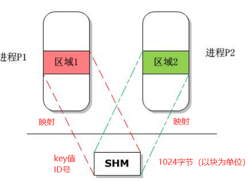

<!-- 2023年08月28日 -->
## 共享内存
对于消息队列和有名管道来讲,使用的时候需要1经过内核的调度,  
所以说共享内存 是比消息队列和有名管道访问还快.

### 作用范围和实现步骤
作用于系统下的任意的两个进程间

机制:任意两个进程通过key值,id值,共享内存得到一片空间,两个进程就能通过读写的方式在共享内存中交换数据



#### 实现步骤
- 申请key值  
    `key_t key= ftok(".",10);`
- 根据key值申请共享内存的id值
- 根据id值将共享内存映射到本机虚拟内存中的空间
### 共享内存相关函数
#### 申请共享内存ID号
```c
#include <sys/ipc.h>
#include <sys/shm.h>

int shmget(key_t key, size_t size, int shmflg);
/* 
---->share memory get
参数
    key值
    size
        共享内存总字节数,必须是PAGE_SIZE(1024)的整数倍
         #define PAGE_SIZE 1024
    shmdlag    
        常使用IPC_CREAT|0666
返回值：
    成功返回：共享内存的ID号
    失败：-1
 */
```
#### 将共享内存映射到本地虚拟内存
```c
// 根据ID号将共享内存的映射至本进程虚拟机内存空间的某一个区域
 #include <sys/types.h>
 #include <sys/shm.h>

 void *shmat(int shmid, const void *shmaddr, int shmflg);
/* 
参数
    shmid
        共享内存的ID
    shmaddr
        共享内存的起始地址 填NULL -> 系统自动分配
    shmflg
        普通属性 填0
返回值：
    成功：共享内存的的起始地址
    失败：（void *）-1 
 */    
         
// 当不在使用时，解除映射    
int shmdt(const void *shmaddr);
/* 
参数：
    shmadd
        你需要解除内存映射的地址
返回值：
    成功返回0
    失败返回-1   
 */
```
#### 删除共享内存
```c
//当没有进程再需要使用这块共享内存，删除它-->shmctl--->man 2 shmctl
#include <sys/ipc.h>
#include <sys/shm.h>

int shmctl(int shmid, int cmd, struct shmid_ds *buf);
/* 
参数
    shmid
        共享内存的ID
    cmd 一些操作命令
        IPC_STAT(获取属性的信息)，必须填第3个参数
        IPC_RMID（删除共享内存）--->第3个参数填NULL
    buf
        根据第二个参数判断是否填
返回值：
    成功返回0
    失败返回-1
 */
```
## IPC对象之信号量

    一些基本概念如下：
    1，多个进程或线程有可能同时访问的资源（变量、链表、文件等等）称为共享资源，也叫临界资源（critical resources）。
    2，访问这些资源的代码称为临界代码，这些代码区域称为临界区（critical zone）。
    3，程序进入临界区之前必须要对资源进行申请，这个动作被称为 P 操作，这就像你要把车开进停车场之前，先要向保安申请一张停车卡一样，P 操作就是申请资源，如果申请成功，资源数将会减少。如果申请失败，要不在门口等，要不走人。
    4，程序离开临界区之后必须要释放相应的资源，这个动作被称为 V 操作，这就像你把车开出停车场之后，要将停车卡归还给保安一样，V 操作就是释放资源，释放资源就是让资源数增加
为了防止相互抢占资源,设置一个信号来指挥操作内存
### 信号量函数的接口
#### 根据key值申请id值
```c
//根据key值申请信号量ID号
#include <sys/types.h>
#include <sys/ipc.h>
#include <sys/sem.h>

int semget(key_t key, int nsems, int semflg);
/* 
参数
    key
        信号量的key值
    nsems
        信号量元素的个数。例如：空间+数据->2
    semflg
        IPC_CREAT|0666--->不存在就创建
返回值：
    成功返回信号量的ID
    失败返回-1
 */
```
#### 控制信号量的参数
```c
// 控制信号量值参数
#include <sys/types.h>
#include <sys/ipc.h>
#include <sys/sem.h>

int semctl(int semid, int semnum, int cmd, ...);
/* 
参数
    semid
        信号量的ID
    semnum
        需要操作的成员的下标 空间0 数据1
    cmd
        SETVAL ---->用于设置信号量的起始值
        IPC_RMID---->删除信号量的ID
    参数4
        空间/数据的起始值
返回值：
    成功返回0
    失败返回-1
 */

// 例子：想设置空间起始值1，数据的起始值为0
semctl(semid,0,SETVAL,1);
semctl(semid,1,SETVAL,0);

// 删除两个信号量
semctl(semid,0,IPC_RMID);
semctl(semid,1,IPC_RMID);
```
#### 信号量的pv操作
```c
// 如何实现信号量的P/V操作？（P操作1->0 V操作0->1）
#include <sys/types.h>
#include <sys/ipc.h>
#include <sys/sem.h>

int semop(int semid, struct sembuf *sops, size_t nsops);
/* 
参数
    semid
        信号量的ID号
    sops
        进程PV操作的结构体
    nsops
        信号量结构体的个数---->1
返回值：
   成功返回0
   失败返回-1
 */
```
#### 信号量的操作结构体
```c

//   信号量操作结构体的定义如下：
struct sembuf
{
    unsigned short sem_num; /* 信号量元素序号（数组下标）如: 空间0 数据1*/
    short sem_op; /* 操作参数 -----PV操作 加或减操作*/
    short sem_flg; /* 操作选项 ----->普通属性，填0*/
};
/* 
  请注意：信号量元素的序号从 0 开始，实际上就是数组下标
  根据 sem_op 的数值，信号量操作分成 3 种情况：
  A) 当 sem_op 大于 0 时：进行 V 操作，即信号量元素的值（semval）将会被加上sem_op 的值。
  C) 当 sem_op 小于 0 时：进行 P 操作，即信号量元素的值（semval）将会被减去sem_op 的绝对值。
 */
```
## 练习
- 消息队列实现进程互发通信,当有一方发出exit,双方退出进程

<details>
  <summary>A</summary>

```c
#include <stdio.h>
#include <string.h>
#include <stdlib.h>
#include <sys/ipc.h>
#include <sys/shm.h>
#include <sys/types.h>
#include <sys/sem.h>
#include <sys/msg.h>
#include <unistd.h>
#include <signal.h>
// 信号响应函数，也就是signal捕捉到信号，执行该函数
void signalHandle(int arg);
key_t key;
struct m
{
   long type;
   char mtext[1024];
};
int main(int argc, char **argv, char **envp)
{
   key = ftok(".", 11);
   int msg_id = msgget(key, IPC_CREAT | 0666);
   int pid = fork();
   signal(SIGUSR1, signalHandle);
   if (-1 == pid)
   {
      perror("子进程创建失败");
      exit(0);
   }
   // 父进程 发送
   if (pid > 0)
   {
      struct m send_msg = {0};
      while (1)
      {
         memset(send_msg.mtext, 0, sizeof(send_msg.mtext));
         send_msg.type = 11;
         fgets(send_msg.mtext, sizeof(send_msg.mtext), stdin);
         msgsnd(msg_id, &send_msg, strlen(send_msg.mtext) + 1, 0);
         if (0 == strncmp("exit", send_msg.mtext, 4))
         {
            kill(pid, SIGUSR1);
            raise(SIGUSR1);
            break;
         }
      }
   }
   // 子进程 接收
   else
   {
      struct m get_msg = {1};
      while (1)
      {
         memset(get_msg.mtext, 0, sizeof(get_msg.mtext));
         get_msg.type = 22;
         if ( msgrcv(msg_id, &get_msg, sizeof(get_msg.mtext), 22, 0)&&strlen(get_msg.mtext)>=1)
            printf("b:%s", get_msg.mtext);
         if (0 == strncmp("exit", get_msg.mtext, 4))
         {
            kill(getppid(), SIGUSR1);
            raise(SIGUSR1);
            break;
         }
      }
   }

   return 0;
}
// 信号响应函数，也就是signal捕捉到信号，执行该函数
void signalHandle(int arg)
{
   int msg_id = msgget(key, IPC_CREAT | 0666);
   msgctl(msg_id, IPC_RMID, NULL);
   exit(0);
}
```

</details>

<details>
  <summary>B</summary>

```c
#include <stdio.h>
#include <string.h>
#include <stdlib.h>
#include <sys/ipc.h>
#include <sys/shm.h>
#include <sys/types.h>
#include <sys/sem.h>
#include <sys/msg.h>
#include <unistd.h>
#include <signal.h>
// 信号响应函数，也就是signal捕捉到信号，执行该函数
void signalHandle(int arg);
key_t key;
struct m
{
    long type;
    char mtext[1024];
};
int main(int argc, char **argv, char **envp)
{
    key = ftok(".", 11);
    int msg_id = msgget(key, IPC_CREAT | 0666);
    signal(SIGUSR1, signalHandle);
    int pid = fork();
    if (-1 == pid)
    {
        perror("子进程创建失败");
        exit(0);
    }
    // 父进程 发送
    if (pid > 0)
    {
        struct m send_msg = {0};
        while (1)
        {
            memset(send_msg.mtext, 0, sizeof(send_msg.mtext));
            send_msg.type = 22;
            fgets(send_msg.mtext, sizeof(send_msg.mtext), stdin);
            msgsnd(msg_id, &send_msg, strlen(send_msg.mtext) + 1, 0);
            if (0 == strncmp("exit", send_msg.mtext, 4))
            {
                kill(pid, SIGUSR1);
                raise(SIGUSR1);
                break;
            }
        }
    }
    // 子进程 接收
    else
    {
        struct m get_msg = {1};
        while (1)
        {
            memset(get_msg.mtext, 0, sizeof(get_msg.mtext));
            get_msg.type = 11;
            if (msgrcv(msg_id, &get_msg, sizeof(get_msg.mtext), 11, 0)&&strlen(get_msg.mtext)>=1)
                printf("a:%s", get_msg.mtext);
            if (0 == strncmp("exit", get_msg.mtext, 4))
            {
                kill(getppid(), SIGUSR1);
                raise(SIGUSR1);
                break;
            }
        }
    }

    return 0;
}
// 信号响应函数，也就是signal捕捉到信号，执行该函数
void signalHandle(int arg)
{
    int msg_id = msgget(key, IPC_CREAT | 0666);
    msgctl(msg_id, IPC_RMID, NULL);
    exit(0);
}
```
</details>

- 共享内存实现进程互发通信,当有一方发出exit,双方退出进程
  
<details>
  <summary>A</summary>

```c
#include <stdio.h>
#include <string.h>
#include <stdlib.h>
#include <sys/ipc.h>
#include <sys/shm.h>
#include <sys/types.h>
#include <sys/sem.h>
#include <sys/msg.h>
#include <unistd.h>
#include <signal.h>
#define SHM_SIZE 1024 // 共享内存大小
// 信号响应函数，也就是signal捕捉到信号，执行该函数
void signalHandle(int arg);
void signalHandle1(int arg);
char*p;
key_t key;
struct m
{
   int type;
   char mtext[512];
};

int main(int argc, char **argv, char **envp)
{
   int send_get=1;
   // 获取key值
   key = ftok(".", 11);
   // 根据key创建共享内存
   int shm_id =shmget(key,SHM_SIZE, IPC_CREAT | 0666);
   // 将内存映射虚拟地址
   p = (char *)shmat(shm_id, NULL, 0);
   if ((void *)-1 == (void *)p)
   {
      perror("内存映射失败");
      exit(0);
   }
   // 信号量申请2个
   int sem_id = semget(key, 2, IPC_CREAT | 0666);
   // 添加用户自定义事件
   signal(SIGUSR1, signalHandle);
   signal(SIGUSR2, signalHandle1);
   int pid = fork();
   if (-1 == pid)
   {
      perror("子进程创建失败");
      exit(0);
   }
   // 父进程 发送
   if (pid > 0)
   {
   semctl(sem_id, 0, SETVAL, 1);
   semctl(sem_id, 1, SETVAL, 0);
   struct sembuf sem_p = {0, -1, 0};
   struct sembuf sem_v = {1, 1, 0};
      struct m send_msg ;
      while (1)
      {
         memset(send_msg.mtext, 0, sizeof(send_msg.mtext));
         send_msg.type = send_get;
         fgets(send_msg.mtext, sizeof(send_msg.mtext)-1, stdin);
         semop(sem_id, &sem_p, 1);
         memcpy(p, &(send_msg.type), sizeof(send_msg));
         if (0 == strncmp("exit", send_msg.mtext, 4))
         {
            kill(pid, SIGUSR1);
            raise(SIGUSR1);
            break;
         }
         else
            kill(pid, SIGUSR2);
         semop(sem_id, &sem_v, 1);
      }
   }
   // 子进程 接收
   else
   {
   semctl(sem_id, 0, SETVAL, 2);
   semctl(sem_id, 1, SETVAL, 0);
   struct sembuf sem_p = {0, 1, 0};
   struct sembuf sem_v = {1, -1, 0};
      struct m get_msg ;
      while (1)
      {

         semop(sem_id, &sem_p, 1);
         memset(get_msg.mtext, 0, sizeof(get_msg.mtext));
         memcpy(&(get_msg.type), p, sizeof(get_msg));
         if (get_msg.type != send_get)
            printf("a:%s", get_msg.mtext);
         if (0 == strncmp("exit", get_msg.mtext, 4))
         {
            kill(getppid(), SIGUSR1);
            raise(SIGUSR1);
            break;
         }
         semop(sem_id, &sem_v, 1);
      }
   }

   return 0;
}
// 信号响应函数，也就是signal捕捉到信号，执行该函数
void signalHandle(int arg)
{
   int msg_id = msgget(key, IPC_CREAT | 0666);
   msgctl(msg_id, IPC_RMID, NULL);
   // 根据key创建共享内存
   int shm_id =shmget(key,SHM_SIZE, IPC_CREAT | 0666);
   shmdt(p);
   shmctl(shm_id,IPC_RMID,NULL);
   // 信号量申请
   int sem_id = semget(key, 2, IPC_CREAT | 0666);
   semctl(sem_id,0,IPC_RMID);
   semctl(sem_id,1,IPC_RMID);
   exit(0);
}
void signalHandle1(int arg)
{
   usleep(10);
}
```
</details>

<details>
  <summary>B</summary>

```c
#include <stdio.h>
#include <string.h>
#include <stdlib.h>
#include <sys/ipc.h>
#include <sys/shm.h>
#include <sys/types.h>
#include <sys/sem.h>
#include <sys/msg.h>
#include <unistd.h>
#include <signal.h>
#define SHM_SIZE 1024 // 共享内存大小
// 信号响应函数，也就是signal捕捉到信号，执行该函数
void signalHandle(int arg);
void signalHandle1(int arg);
char*p;
key_t key;
struct m
{
   int type;
   char mtext[512];
};

int main(int argc, char **argv, char **envp)
{
   int send_get=2;
   // 获取key值
   key = ftok(".", 11);
   // 根据key创建共享内存
   int shm_id =shmget(key,SHM_SIZE, IPC_CREAT | 0666);
   // 将内存映射虚拟地址
   p = (char *)shmat(shm_id, NULL, 0);
   if ((void *)-1 == (void *)p)
   {
      perror("内存映射失败");
      exit(0);
   }
   // 信号量申请2个
   int sem_id = semget(key, 2, IPC_CREAT | 0666);
   // 添加用户自定义事件
   signal(SIGUSR1, signalHandle);
   signal(SIGUSR2, signalHandle1);
   int pid = fork();
   if (-1 == pid)
   {
      perror("子进程创建失败");
      exit(0);
   }
   // 父进程 发送
   if (pid > 0)
   {
   semctl(sem_id, 0, SETVAL, 1);
   semctl(sem_id, 1, SETVAL, 0);
   struct sembuf sem_p = {0, -1, 0};
   struct sembuf sem_v = {1, 1, 0};
      struct m send_msg ;
      while (1)
      {
         memset(send_msg.mtext, 0, sizeof(send_msg.mtext));
         send_msg.type = send_get;
         fgets(send_msg.mtext, sizeof(send_msg.mtext)-1, stdin);
         semop(sem_id, &sem_p, 1);
         memcpy(p, &(send_msg.type), sizeof(send_msg));
         if (0 == strncmp("exit", send_msg.mtext, 4))
         {
            kill(pid, SIGUSR1);
            raise(SIGUSR1);
            break;
         }
         else
            kill(pid, SIGUSR2);
         semop(sem_id, &sem_v, 1);
      }
   }
   // 子进程 接收
   else
   {
   semctl(sem_id, 0, SETVAL, 2);
   semctl(sem_id, 1, SETVAL, 0);
   struct sembuf sem_p = {0, 1, 0};
   struct sembuf sem_v = {1, -1, 0};
      struct m get_msg ;
      while (1)
      {

         semop(sem_id, &sem_p, 1);
         memset(get_msg.mtext, 0, sizeof(get_msg.mtext));
         memcpy(&(get_msg.type), p, sizeof(get_msg));
         if (get_msg.type != send_get)
            printf("b:%s", get_msg.mtext);
         if (0 == strncmp("exit", get_msg.mtext, 4))
         {
            kill(getppid(), SIGUSR1);
            raise(SIGUSR1);
            break;
         }
         semop(sem_id, &sem_v, 1);
      }
   }

   return 0;
}
// 信号响应函数，也就是signal捕捉到信号，执行该函数
void signalHandle(int arg)
{
   int msg_id = msgget(key, IPC_CREAT | 0666);
   msgctl(msg_id, IPC_RMID, NULL);
   // 根据key创建共享内存
   int shm_id =shmget(key,SHM_SIZE, IPC_CREAT | 0666);
   shmdt(p);
   shmctl(shm_id,IPC_RMID,NULL);
   // 信号量申请
   int sem_id = semget(key, 2, IPC_CREAT | 0666);
   semctl(sem_id,0,IPC_RMID);
   semctl(sem_id,1,IPC_RMID);
   exit(0);
}
void signalHandle1(int arg)
{
   usleep(10);
}
```
</details>