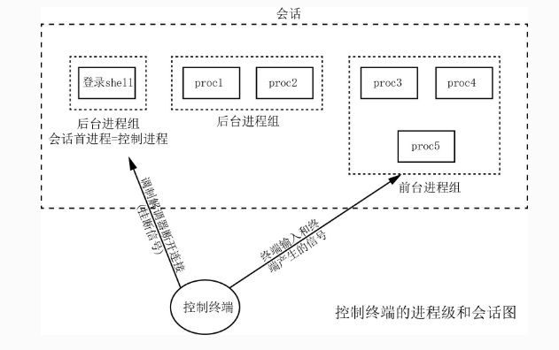

<!-- 2023年08月29日 -->
## 进程和会话
### 关于进程的概念

进程组,前台进程组,后台进程组,会话和控制终端的关系




系统调度的最小单位是进程(或称任务 task)  
CPU的最小调度单位是线程

若干进程可组成一个进程组，若干进程组可组成一个会话  
之所以要构造进程组和会话，其根本目的是为了便于发送信号  
我们可以通过给进程组或会话发送信号，便可使得其内所有的进程均可收到信号。

### 前台进程组
一般而言，进程从终端启动时，会自动创建一个新进程组，并且该进程组内只包含这个创始进程，而其后代进程默认都将会被装载在该进程组内部，这个进程组被称为前台进程组。

前台进程组最大的特点是：  
可以接收控制终端发来的信号，所谓控制终端，一般就是指标准输入/设备键盘。

### 后台进程组
后台进程组  
可以在终端中加个 `&` 来使得进程进入后台进程组：
```bash
# 使 a.out 在后台进程组中运行
gec@ubuntu:~$ ./a.out &
```
### 会话
会话（session）原本指的是一个登录过程中所产生的的所有进程组的总和，可以理解为一个登录窗口就是一个会话。

会话可以理解为就是进程组的进程组，会话的作用可总结为：
- 可关联一个控制终端（比如键盘）设备，并从控制终端获得输入信息
- 可对会话内的所有进程组统一发送信号
- 可将控制终端的关闭动作，转换为触发挂断信号并发送给所有进程
### 控制终端
控制终端通常会关联一个输入设备，可以给前台进程组发送数据或信号，  
平常使用的许多信号快捷键，就是通过控制终端发送给前台进程组内的进程的：
| 快捷键  | 对应信号 |
| ------- | -------- |
| ctrl+c  | SIGINT   |
| ctrl+\\ | SIGQUIT  |
| ctrl+z  | SIGSTOP  |

控制终端不仅可以向前台进程组发送数据，也能向整个会话发送挂断信号（即SIGHUP），默认情况下收到SIGHUP的进程会被终止，因此，为了避免被控制终端“误杀”，常驻内存的守护进程的必备步骤须包括忽略掉SIGHUP、脱离控制终端、避免再次获取控制终端等操作。
### 关于进程组的函数
#### 设置/获取进程所属的进程组
```c
#include <sys/types.h>
#include <unistd.h>

// 功能：将进程pid的所在进程组设置为pgid
//       如果pid == 0，则设置本进程
//       如果pgid == 0，等价于pgid == pid
// 注意：若进程pid与进程组pgid不在同一会话内，设置将失败
int setpgid(pid_t pid, pid_t pgid);
返回值：成功0
       失败-1
// 功能：获取进程pid所在进程组ID
pid_t getpgid(pid_t pid);

 On success, setpgid() and setpgrp() return zero.  On error, -1 is returned
```
例子
```c
// 将指定进程123加入进程组7799中
// 注意，进程组7799必须存在且与进程123同处相同的会话
setpgid(123, 7799);

// 将本进程加入进程组7799中
// 注意，进程组7799必须存在且与本进程同处相同的会话
setpgid(0, 7799);

// 创建一个ID等于本进程PID的进程组
// 并将本进程置入其中，成为进程组组长
setpgid(0, 0);
```
#### 创建新会话
```c
// 当我们打开一个伪终端，或者打开一个远程登录工具输入账户密码的过程中，默认都调用了如下函数接口去创建一个新的会话。
#include <sys/types.h>
#include <unistd.h>

pid_t setsid(void);
```
注意：
- 进程组组长不能调用该函数。
- 新创建的会话没有关联控制终端，因此其内进程不受控制终端影响。
- 创建会话的进程，称为该会话的创始进程，创始进程有权捕获一个控制终端（在编写守护进程时通常需要避免），会话的其余成员进程无权获得控制终端。

例子  
脱离控制终端,避免再次获取控制终端等操作
```c
// 忽略信号SIGHUP
signal(SIGHUP, SIG_IGN);

// 脱离控制终端（新建一个会话）
setsid();

// 避免会话再次关联控制终端（退出会话创始进程）
if(fork() > 0)
    exit(0);
```

## 守护进程
守护进程（Daemon）也被翻译为精灵进程、后台进程，是一种旨在运行于相对干净环境、不受终端影响的、常驻内存的进程，就像神话中的精灵拥有不死的特性，长期稳定提供某种功能或服务。

在Unix/Linux系统中，使用 `ps -ef | grep '.*d$'` 命令可以看到许多以 -d 结尾的进程，它们大多都是守护进程，  
有许多程序或服务理应成为这种“不死”的守护进程，比如提供系统网络服务的核心程序systemd-networkd，只要系统需要基于TCP/IP协议栈进行网络通信，它就应该一直常驻内存，永不退出。

### 守护进程编写步骤
1. 忽略`SIGHUP`信号 
2. 产生子进程
3. 创建新会话
4. 产生孙子进程
5. 进入新进程组
6. 关闭资源文件
7. 关闭文件权限掩码
8. 切换工作路径

#### 忽略`SIGHUP`信号 
由于终端的关闭会触发`SIGHUP`信号并发送给终端所关联的会话的所有进程，而一开始进程尚未脱离原会话，因此应尽早忽略该信号，避免被挂断信号误杀。
```c
// 1，忽略挂断信号SIGHUP，防止被终端误杀
signal(SIGHUP, SIG_IGN);
```
#### 产生子进程
从终端（不管是远程登录窗口还是本地伪终端)启动的进程所在的会话都关联了控制终端，而控制终端会有各种数据或信号的输入干扰，为了避开这些干扰，需要脱离控制终端，而脱离控制终端的简单做法就是新建一个新的、没有控制终端的会话，但创建一个新会话的进程必须是非进程组组长，但Linux系统中，从终端启动的进程默认就是其所在进程组的组长，因此摆脱这一困境的简单做法就是让其产生一个子进程，退出原进程（即父进程）并让子进程继续下面的步骤即可。
实现代码如下：
```c
// 2，退出父进程（原进程组组长），为能成功创建新会话做准备
if(fork() > 0)
    exit(0);
```
#### 创建新会话
创建新会话，脱离原会话，脱离控制终端。
```c
// 3，创建新会话，脱离原会话，脱离控制终端。
setsid();
```
#### 产生孙子进程
时的进程是其所在的会话的创始进程，而创始进程拥有可以再次关联的控制终端的权限，为避免此种情况的发生，最简单的做法就是退出当前创始进程，改由其子进程（非创始进程）继续完成成为守护进程的使命。
```c
// 4，断绝重新关联控制终端的可能性
if(fork() > 0)
    exit(0);
```
#### 进入新进程组
虽然此时进程的父进程、祖父进程已经退出，但进程组是一直都在的，且处于新会话中的孙子进程一直都在其祖父进程的进程组之中，而进程组是可以传递信号的，因此为了与任何方面脱离关系，应“自立门户”创建新进程组，并将自身置入其中。
```c
// 5，脱离原进程组，创建并进入只包含自身的进程组
setgpid(0, 0);
```
#### 关闭资源文件
文件资源是可以在父子进程之间代际相传的，这其中也包括了标准输入输出文件，而作为守护进程，是一种在后台运行的程序，运行过程中一般无需交互，若有消息需要输出一般会以系统日志的方式输出到指定日志文件中。因此，为了节约系统资源，也为了避免不必要的逻辑谬误，守护进程一般都需要将所有从父辈进程继承下来的文件全部关闭。
```c
// 6，关闭父辈继承下来的所有文件
for(int i=0; i<sysconf(_SC_OPEN_MAX); i++)
        close(i);
```
#### 关闭文件权限掩码
在Linux系统中创建一个新文件时，可以通过相关的函数参数指定文件的权限，
```c
// 试图在file.txt不存在的情况下，创建一个权限为0777的文件
int fd = open("file.txt", O_CREAT|O_RDWR, 0777);
```
但其实被创建出来的文件的权限并非代码中指定的权限，该权限与系统当前的文件权限掩码做位与操作之后的值才是文件真正的权限，我们可以通过命令 `umask` 来查看当前系统默认的文件权限掩码的值：大部分是`0022`

因此，上述创建的文件的权限最后不是0777，而是0755：

为了让守护进程在后续工作过程创建文件时指定的权限不受系统文件权限掩码干扰，可以将umask设置为0。
```c
// 7，避开系统文件权限掩码的干扰
umask(0);
```
#### 切换工作路径
任何一个进程都有一个当前工作路径，从终端启动的进程的工作路径就是启动时终端所在的系统路径。以下代码可以输出进程当前所在路径
```c
int main(void)
{
    printf("%s\n", getcwd(NULL, 0));
}
```
当一个进程的工作路径被卸载时，进程也会随时消亡。守护进程为了避免此种情况发生，最简单的做法就是将自身的工作路径切换到一个无法被卸载的路径下，比如根目录。
实现代码如下：
```c
// 8，避免所在路径被卸载
chdir("/");
```
### 完整步骤代码
```c
#include<stdio.h>
#include <sys/types.h>
#include <unistd.h>
#include <unistd.h>
#include <sys/types.h>
#include <sys/stat.h>
#include <signal.h>
#include <stdlib.h>

int main(void)
{
    pid_t a;
    int max_fd, i;

    /*********************************************
    1. ignore the signal SIGHUP, prevent the
       process from being killed by the shutdown
       of the present controlling termination
    **********************************************/
    signal(SIGHUP, SIG_IGN);

    /***************************************
    2. generate a child process, to ensure
       successfully calling setsid()
    ****************************************/
    a = fork();
    if(a > 0)
        exit(0);

    /******************************************************
    3. call setsid(), let the first child process running
       in a new session without a controlling termination
    *******************************************************/
    setsid();

    /*************************************************
    4. generate the second child process, to ensure
       that the daemon cannot open a terminal file
       to become its controlling termination
    **************************************************/
    a = fork();
    if(a > 0)
        exit(0);

    /*********************************************************
    5. detach the daemon from its original process group, to
       prevent any signal sent to it from being delivered
    **********************************************************/
    setpgrp();

    /*************************************************
    6. close any file descriptor to release resource
    **************************************************/
    max_fd = sysconf(_SC_OPEN_MAX);
    for(i=0; i<max_fd; i++)
        close(i);

    /******************************************
    7. clear the file permission mask to zero
    *******************************************/
    umask(0);

    /****************************************
    8. change the process's work directory,
       to ensure it won't be uninstalled
    *****************************************/
    chdir("/");


    // Congratulations! Now, this process is a DAEMON!
    pause();
    return 0;
}

```


## 线程
线程与进程的区别
- 进程： 进程是操作系统资源分配的基本实体
- 线程： 线程是CPU调度和分配的基本单位

    系统调度是指操作系统决定哪一个进程可以使用cpu,当一个进程需要cpu,操作系统会将该进程加入到就绪列中，然后从就绪列中
    选择一个进程来使用。系统调用的目的，尽可能提高系统的吞吐量和响应时间，同时保证公平性与稳定性

    cpu调度是指操作系统中决定在一个进程中哪一个线程可以使用cpu,在多线程应用程序中，一个进程包含多个进程，每个线程
    都可以独立运行，cpu调度的目的，尽可能的提高线程的响应时间和吞吐量，同时保证公平性与稳定性

在Linux系统下是没有线程的概念的，它是用进程模拟的线程，因此把线程叫做轻量级进程。

那为什么还要引入线程呢？  
1. 更加易于调度  
2. 提高并发性，因为可以创建多个线程去执行同一个进程的不同部分  
3. 开销少，因为创建进程的话要创建PCB，存放上下文信息，文件信息等等，开销比较大，二创建线程的话开销就会比较少  
4. 充分发挥多处理器的功能，如果创建出多线程进程，那么可以让线程在不同的处理器上运行，这样不仅可以提高效率，同时也发挥了每个处理器的作用。  

进程和线程的关系  
1. 一个线程只能属于一个进程，但是一个进程可以有多个线程（至少一个线程），一个线程的进程叫做单线程进程，多个线程的进程叫做多线程进程
2. 资源分配给进程之后，进程内部的线程都可以共享该进程的资源
3. 在处理机上运行的是线程
4. 线程在执行的过程中需要协作同步，不同进程的线程需要利用消息通信来实现同步

进程和线程的区别  
- 根本区别： 进程是操作系统分配资源的基本实体，线程是CPU调度的基本单位  
- 开销方面： 每个进程都有自己独立的代码和数据空间，因此进程之间的切换会有较大的开销。但是线程在进程的地址空间内部运行，因此同一类线程共享代码和数据空间，每个线程都有自己独立的运行栈和程序计数器，因此线程之间的切换开销小。  
- 所处环境： 在操作系统中能同时运行多个进程，在同一个进程中有多个线程同时执行  
- 内存分配： 系统在运行的时候会给每个进程分配不同的内存空间，但是不会给线程分配，线程使用的资源均来自于进程  
- 包含关系： 线程是进程的一部分，没有线程的进程叫做单线程进程，有多个线程的进程叫做多线程进程  
  
### 线程函数

#### 线程的创建和回收
```c
 #include <pthread.h>

 int pthread_create(pthread_t *thread, const pthread_attr_t *attr,
void *(*start_routine) (void *), void *arg);
/* 
参数
    thread
        存储线程ID号的变量的地址
    attr
        attribute属性,普通属性填NULL
    start_routine
        线程执行的函数 函数是 void*返回值,void*作为参数
    arg
        传递给子线程的参数
返回值：
    成功：返回0    
    失败：非0错误码
 */
/* 
 注意：
 （1）只要你的程序涉及到线程，就必须编译的时候链接库             
 Compile and link with -pthread.//编译链接需要-pthread库
 （2）如果ubuntu找不到man手册线程库的接口，需要安装
 sudo apt-get install manpages-posix-dev
 */
```

主线程和其他线程的关闭情况

- 情况1：主线程的时间>子线程的工作时间  
    主线程会与子线程一起运行，子线程工作完毕，主线程继续工作，然后就执行return 0，进程退出
- 情况2：主线程的时间<子线程的工作时间  
    主线程工作完毕，执行return 0导致了进程的退出，进程退出就会导致进程内部的所有的线程都退出 
#### 阻塞线程直到线程退出 得到线程的值
```c
 #include <pthread.h>

int pthread_join(pthread_t thread, void **retval);
/* 
 函数作用：阻塞等待子线程的退出,回收资源
参数
    thread
        需要接合的线程ID号
    retval
        存储子线程的退出值指针，如果填NULL,代表不关心子线程的退出状态
返回值：
    成功0
    失败：非0                         
 */
```
 
验证主线程与子线程工作时间长短问题，结果是怎样？  
- 情况1：主线程的工作时间长，去接合----->  pthread_join()会立马返回  
- 情况2：主线程的工作时间短，去接合----->  pthread_join()会阻塞等待子线程的退出。   
#### 线程的主动退出
```c
#include <pthread.h>

void pthread_exit(void *retval);
/* 
函数作用：子线程主动结束退出
参数：
    retval
        子线程退出值变量的地址->这个退出值必须是全局变量
 */
```

### 线程其他问题
#### 关于线程创建的数量 
32 位系统，用户态的虚拟空间只有 3G，如果创建线程时分配的栈空间是 10M，那么一个进程最多只能创建 300 个左右的线程。
64 位系统，用户态的虚拟空间大到有 128T，理论上不会受虚拟内存大小的限制，而会受系统的参数或性能限制。

## 练习
- 使用多线程+消息队列实现两个进程互聊

<details>
  <summary>A</summary>

```c
#include <stdio.h>
#include <string.h>
#include <stdlib.h>
#include <sys/ipc.h>
#include <sys/shm.h>
#include <sys/types.h>
#include <sys/sem.h>
#include <sys/msg.h>
#include <unistd.h>
#include <signal.h>
#include <pthread.h>

//执行和调配收发消息的函数
void sendGetMessage();

// 发送消息
void *sendMessage(void *arr);

// 接收消息
void *getMessage(void *arr);

key_t key;
int quit=0;
struct m
{
   long type;
   char mtext[1024];
};
int main(int argc, char **argv, char **envp)
{
   key = ftok(".", 11);
   sendGetMessage();
   return 0;
}
// 发送消息
void *sendMessage(void *arr)
{
   int msg_id = msgget(key, IPC_CREAT | 0666);
   struct m send_msg = {0};
   while (!quit)
   {
      memset(send_msg.mtext, 0, sizeof(send_msg.mtext));
      send_msg.type = 11;
      fgets(send_msg.mtext, sizeof(send_msg.mtext), stdin);
      msgsnd(msg_id, &send_msg, strlen(send_msg.mtext) + 1, 0);
      if (0 == strncmp("exit", send_msg.mtext, 4))
      {
         quit++;
         break;
      }
   }
}
// 接收消息
void *getMessage(void *arr)
{
   int msg_id = msgget(key, IPC_CREAT | 0666);
   struct m get_msg = {1};
   while (!quit)
   {
      memset(get_msg.mtext, 0, sizeof(get_msg.mtext));
      get_msg.type = 11;
      if (msgrcv(msg_id, &get_msg, sizeof(get_msg.mtext), 22, 0) &&22==get_msg.type)
         printf("b:%s", get_msg.mtext);
      if (0 == strncmp("exit", get_msg.mtext, 4))
      {
         quit++;
         break;
      }
   }
}
//执行和调配收发消息的函数
void sendGetMessage()
{
   // 创建两个线程
   pthread_t send;
   if(pthread_create(&send,NULL,sendMessage,NULL))
   {
      perror("send creat fail");
      return;
   }
   pthread_t get;
   if(pthread_create(&get,NULL,getMessage,NULL))
   {
      perror("get creat fail");
      return;
   }
   // 循环判断两个线程中的一个已经退出
   while (!quit);
   
   int msg_id = msgget(key, IPC_CREAT | 0666);
   msgctl(msg_id,IPC_RMID,NULL);
}
```

</details>
<details>
  <summary>B</summary>

```c
#include <stdio.h>
#include <string.h>
#include <stdlib.h>
#include <sys/ipc.h>
#include <sys/shm.h>
#include <sys/types.h>
#include <sys/sem.h>
#include <sys/msg.h>
#include <unistd.h>
#include <signal.h>
#include <pthread.h>

// 执行和调配收发消息的函数
void sendGetMessage();

// 发送消息
void *sendMessage(void *arr);

// 接收消息
void *getMessage(void *arr);

key_t key;
int quit = 0;
struct m
{
    long type;
    char mtext[1024];
};
int main(int argc, char **argv, char **envp)
{
    key = ftok(".", 11);
    sendGetMessage();
    return 0;
}
// 发送消息
void *sendMessage(void *arr)
{
    int msg_id = msgget(key, IPC_CREAT | 0666);
    struct m send_msg = {0};
    while (!quit)
    {
        memset(send_msg.mtext, 0, sizeof(send_msg.mtext));
        send_msg.type = 22;
        fgets(send_msg.mtext, sizeof(send_msg.mtext), stdin);
        msgsnd(msg_id, &send_msg, strlen(send_msg.mtext) + 1, 0);
        if (0 == strncmp("exit", send_msg.mtext, 4))
        {
            quit++;
            break;
        }
    }
}
// 接收消息
void *getMessage(void *arr)
{
    int msg_id = msgget(key, IPC_CREAT | 0666);
    struct m get_msg = {1};
    while (!quit)
    {
        memset(get_msg.mtext, 0, sizeof(get_msg.mtext));
        get_msg.type = 22;
        if (msgrcv(msg_id, &get_msg, sizeof(get_msg.mtext), 11, 0) && 11==get_msg.type)
            printf("a:%s", get_msg.mtext);
        if (0 == strncmp("exit", get_msg.mtext, 4))
        {
            quit++;
            break;
        }
    }
}
// 执行和调配收发消息的函数
void sendGetMessage()
{
    // 创建两个线程
    pthread_t send;
    if (pthread_create(&send, NULL, sendMessage, NULL))
    {
        perror("send creat fail");
        return;
    }
    pthread_t get;
    if (pthread_create(&get, NULL, getMessage, NULL))
    {
        perror("get creat fail");
        return;
    }
    // 循环判断两个线程中的一个已经退出
    while (!quit)
        ;

    int msg_id = msgget(key, IPC_CREAT | 0666);
    msgctl(msg_id, IPC_RMID, NULL);
}
```

</details>

- 进程和线程的区别