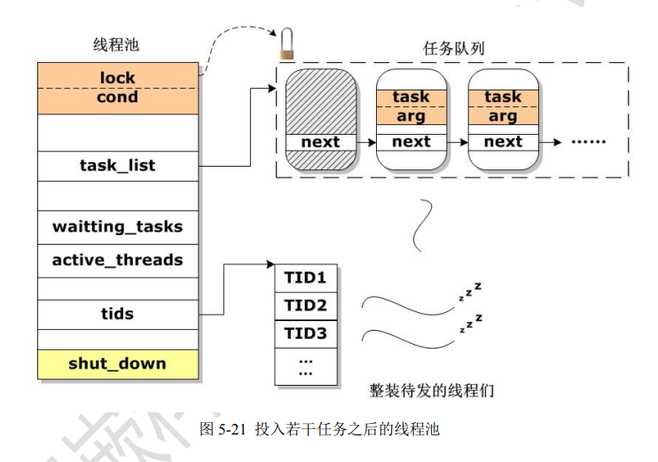
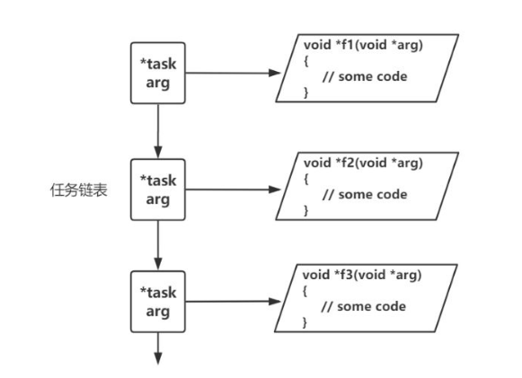

<!-- 2023年09月02日 -->
## 线程池
### 工程背景
考虑这么一个情况：  
为应对某场景的实际需求，要在程序中创建大量线程，并且这些线程的数量和生命周期均不确定，可能方生方死，也可能常驻内存，如何在满足其要求的同时，尽可能降低系统负载？  

一个基本事实是，线程的创建和销毁都是需要额外的系统资源的，如果线程的生命周期很短，那么相对于实际干活的时间，来回重复创建和销毁就显得很不划算，但也不能让线程执行完任务之后耗着不走，因此就需要一个比较科学合理的布局，来管控线程，一个比较成熟的方案是：在上述情况下，将线程放入一个类似缓冲区的池子中，对于生命周期很短的任务，那么什么时候需要线程就从池子中捞出来干活，干完活就放回池子且让线程保持整装待命，并通过精巧的设计使得池子中的线程数量可以动态地发生变化，让线程既可以应对并发性需求，又不会浪费系统资源，这种设计思路就是线程池。  

线程池的基本想法，  
是将许多线程，放置一个池子中(实际就一个结构体)，只要有任务，就将任务投入池中，这些线程们通过某些机制，及时处理这些任务。为了便于管理，线程池还应当提供诸如初始化线程池、增删线程数量、检测未完成任务的数量、检测正在执行任务的线程的数量、销毁线程池等等基本操作。

### 逻辑框架
要让线程池好用，主要是解决如下两个问题：  
如何组织线程？  
如何组织任务？  



### 线程 组织
线程被创建出来之后，都是处于睡眠态，他们实际上是进入了条件变量的等待队列中，而任务都被放进一个链表中，被互斥锁保护起来  
下面是线程池里面线程的一生： 
1. 被创建
2. 写遗书（准备好退出处理函数，防止在持有一把锁的状态中（在执行任务），被杀死）-->压栈
3. 试图持有互斥锁（等待任务）
4. 判断是否有任务，若无则进入条件变量中睡眠等待，若有就直接进入第五步
5. 从任务链表中取的一个任务
6. 释放互斥锁
7. 销毁遗书（将备用的退出处理函数弹出，避免占内存）--->弹栈
8. 执行任务，完毕之后重回第2步

线程示例
```c
while(1)
{
    // 写遗书（准备好退出处理函数，防止在持有一把锁的状态中死去）
    pthread_cleanup_push(handler, (void *)&pool->lock);

    // 试图持有互斥锁
    pthread_mutex_lock(&pool->lock);

    // 判断是否有任务，若无则进入条件量等待队列睡眠
    while(pool->waiting_tasks == 0 && !pool->shutdown)
        pthread_cond_wait(&pool->cond, &pool->lock);

    // 若线程池要关闭并销毁，那么线程就解锁并退出
    if(pool->waiting_tasks == 0 && pool->shutdown == true)
    {
        pthread_mutex_unlock(&pool->lock);
        pthread_exit(NULL);
    }

    // 从任务链表中取得一个任务
    p = pool->task_list->next;
    pool->task_list->next = p->next;
    pool->waiting_tasks--;

    // 释放互斥锁
    pthread_mutex_unlock(&pool->lock);

    // 销毁遗书（将备用的退出处理函数弹出，避免占用内存）
    pthread_cleanup_pop(0);

    // 为避免在执行任务期间被强制终止，可先屏蔽取消指令
    pthread_setcancelstate(PTHREAD_CANCEL_DISABLE, NULL);
    (p->do_task)(p->arg); // 执行任务
    pthread_setcancelstate(PTHREAD_CANCEL_ENABLE, NULL);

    // 释放任务节点
    free(p);
}
```

### 任务组织
任务实质上是用户需要交给线程池执行的函数，为了方便线程们执行，一般做法是将函数（即函数指针）及其参数存入一个任务节点，并将节点链成一个链表。



#### 设计任务节点

对于任务链表，主要操作无非是：
- 设计任务节点
- 构造任务节点
- 在任务链表中增删任务节点
- 执行任务

```c
struct node
{
    void *(*task)(void *);
    void *arg;
    struct node *next;
};
```
#### 构造任务节点
```c
void *f(void *arg)
{
    // some code
}
struct node *p = malloc(sizeof(struct node));
p->task = f;
p->arg  = NULL;
```

#### 执行任务
```c
(p->task)(p->arg);
```
## 库
### 概念
库文件就是将一堆函数的源代码封装在一起，经过编译之后形成一种可执行的二进制代码（但是不可以独立执行），供自己或者他人调用

在linuxc下，有非常多的目录存在库文件
比如：  
/lib  --------->linux协同库文件，一般是linux自带的  
/usr/lib------->有的是系统自带的，有的是用户自己定义移植的  
### 库文件存放的是一些什么数据？
因为库文件是二进制文件，只是看到一片乱码  
库文件里面存放的数据，一般是一些函数  
### 为什么要制作库文件
编译之后的库文件看不到源码的，可保密；同时不会因为不小心修改了函数而出问题，便于维护
### 库文件分类

<table>
  <tbody>
    <tr>
      <th>平台</th>
      <th>Windows</th>
      <th>Linux</th>
    </tr>
    <tr>
      <th>静态库</th>
      <td>.lib</td>
      <td>.a</td>
    </tr> 
    <tr>
      <th>动态库</th>
      <td>.dll</td>
      <td>.so</td>
    </tr> 
  </tbody>
</table>

### 静态库与动态库的区别
1. 静态库在gcc编译阶段把静态库放到一起编译，最后生成的二进制文件（文件比较大）
2. 动态库在gcc编译阶段仅仅是记录了动态库的存放位置，在执行的时候才去指定的路径下调用该库

### Linux库文件名称含义
静态库----->libxxx.a  
动态库----->libxxx.so  

    比如：liblockmgr.so.1.0.1  
        lib:库的前缀  
        lockmgr:库的名字  
        .so------>库的后缀  
        .1-------->版本号  
        .0.1------>库的修正号  

### 静态库的制作
- .c编译为.o文件
    ```bash
    gcc add.c -o add.o -c
    ```
- 把.o文件编译成静态库文件
    ```bash
    ar -rc libadd.a add.o
    #制作完毕之后，libadd.a就是静态库文件
    ```

工程项目在编译的时候，把静态库加进来即可

编译：`gcc main.c libadd.a -o main`  
执行：`./main`  
### 动态库的制作
- 把.c文件制作成.so动态库
    ```bash
    gcc -fpic -shared add.c -o libadd.so
    # -fpic:制作动态库的参数
    # -shared:共享库
    ```

在工程项目编译的时候，把动态库加进来
```bash
gcc main.c -o main -L . -laa
# -L--->告诉编译器去哪里找动态库
# -l告诉编译器要连接的动态库的库名（不需要写前缀、后缀、版本号）
# -I 告诉编译器去哪里找头文件
```

执行
```bash
./main
执行出现了以下错误：
root@ubuntu:/mnt/hgfs/share/project# ./main
./main: error while loading shared libraries: 
libadd.so: cannot open shared object file: No such file or directory
解决方法：
第一种方法：把libadd.so拷贝到/lib
sudo cp libadd.so /lib
root@ubuntu:/mnt/hgfs/share/project# sudo cp libadd.so /lib
root@ubuntu:/mnt/hgfs/share/project# ./main
a+b=9
第二种方法：
把以下添加到配置文件~/.bashrc
export LD_LIBRARY_PATH=$LD_LIBRARY_PATH:/mnt/hgfs/share/project/
使得配置文件生效
source ~/.bashrc
注意：在执行可执行文件时，如果使用到动态库，系统就会自动去LD_LIBRARY_PATH变量设置的路径下查找动态库
，然后进行调用

```
## 工程管理文件makefile
- 什么是makefile   
    Makefile称之为工程管理文件，用于管理一个工程种所有关联的文件。比如：头文件、源文件、库文件...
- Makefile在工程种是不是一定要写  
    不一定。一般来说如果编译命令比较复杂，就会写makefile文件
    项目工程文件比较多的时候，一般都会写makefile去管理所有文件
    项目工程文件比较少的时候，一般不会写makefile，因为编译命令比较简单。
- 目的  
    makefile就是为了简化编译时的复杂度

### 项目文件的组成
#### 简单版
所有的文件都在相同的路径下

    源程序文件 main.c  ------->包含main函数的.c文件
    功能程序文件fun1.c -------->第一个功能.c文件
    功能程序文件fun2.c -------->第二个功能.c文件
    ...
    头文件 myhead.h------->结构体声明，函数声明，宏定义，系统头文件，由extern,static修饰的变量（不能初始化赋值）
    库文件
    工程管理文件Makfile

#### 复杂版
对应的文件放在对应的路径下

    src/------->源程序，功能程序
    include/----->头文件
    lib/---------->库文件
    bin/----------->可执行文件
    Makefile------->工程管理文件

以简单版本为例：  
如果不写makefile那么编译命令：`gcc main.c fun1.c fun2.c -o mian -I .`  
如果写了makefile,只需要输入：`make`

### makefile书写规则
解makefile书写规则两个核心："依赖"和"目标"   
"依赖"------->一般指的是.c文件  
"目标"-------->一般指的是可执行目标文件  
main.c fun1.c fun2.c------->依赖  
main---------------------------->目标  

通过依赖来生成目标
#### makefile书写规则
- 确定目标叫什么名字
- 按照以下规则去写·makefile
```
目标：依赖（如果有多个依赖，则每个依赖之间用空格分开）
<tab键>执行规则
比如：使用makefile来编译一个简单的程序
hello：hello.c
    gcc $^ -o $@
```

执行：make  
结果：gcc hello.c -o hello  
注意事项：  
1）<Tab键>不等于4个空格，执行规则之所以能够识别出来，原因就是因为这个Tab键  
2）如何在执行规则的中调用依赖文件和目标文件  
$^----------->代表所有的依赖  等价于hello.c  
$@---------->代表目标文件    等价于hello  

### 重复执行make命令，那么会出现什么情况
第一次make正常编译  
第二次make  
```bash
root@ubuntu:/mnt/hgfs/share/project# make
make: 'hello' is up to date.
当前hello这个文件已经是最新的了
makefile规则
```
在makefile编译之前，都会检测所有的依赖对应修改时间是否与上一次编译的修改时间一致，  
如果所有的依赖都没有修改过，则不会进行编译，如果有一个依赖的时间被修改过，则makefile就会再次编译
### makefile多个目标的情况
例子：

    target1:
            xxxx
    target2:
            xxxx
    target3:
            xxxx
执行`make`的时候---->默认执行第一个目标等价于`make target1`  
执行`make target2`---->指定执行`target2`

### makefile变量的种类
#### 自定义变量
在makefile中定义变量，不需要声明数据类型,只需要定义名字就可以了，所有的变量默认时字符串类型的   
```
A------->默认就是字符串类型的变量
```
规定：
1. 变量名的命名规则与C语言一致
2. 给变量赋值的时候，等号两边可以有空格，也可以没有空格。
比如说：`A=hello`  或者  `A = hello`
3. 在引用变量的值时，需要在变量前加一个$,变量名也需要用()小括号包含
    ```makefile
    A=hello
    B=$(A) world
    ```
4. 因为变量都是字符串类型，所以双引号可以省略
    ```makefile
    A = hello
    A = "hello"
    ```

修改简单版本的makefile,将目标和依赖保存在变量中，写规则时，我们只需要引用变量，就等价于引用目标和依赖
```makefile
TARGET = main
C_SOURCE = main.c fun1.c fun2.c
$(TARGET):$(C_SOURCE)
    gcc $^ -o $@ -I .
```
#### 系统预设定变量
有的变量已经在系统中定义好了，并且已经赋值，我们直接引用即可  
`CC`---->编译器名字，默认等于`cc` `cc`等价于`gcc` 也就是说`CC = gcc`  
`RM`----->删除命令，默认等于`rm -f` 也就是`RM = rm -f`  
这些变量如果不赋值，就按默认值来处理，但是这些变量也是可以赋值的，如果赋值了，就按照新的值来处理
#### 自动化变量----->变量的值是不固定的，是变化的
    $^------->代表所有依赖
    $@----->代表所有的目标

## makefile伪指令
场景1：假设makefile中有一套规则：  
```makefile
clean:
    $(RM) bin/main  
```
当我们执行`make clean`时，makefile就会执行这个规则

场景2：假设makefile中有一套规则，并且当前目录下有一个文件夹clean  
```makefile
clean:
    $(RM) bin/main
```
当我们执行make clean时，出现如下情况
```bash
root@ubuntu:/mnt/hgfs/share/project# make clean
make: 'clean' is up to date.
```

如何告诉编译器，这个make clean是一套规则，而不是生成文件  
解决方案：使用伪指令  
怎么添加？------->只需要在makefile中添加一句话
```makefile
.PHONY:clean
```

```bash
root@ubuntu:/mnt/hgfs/share/project# cat Makefile 
hello:hello.c
    gcc $^ -o $@
XXX:world.c
    gcc $^ -o $@
clean:
    rm ./hello
.PHONY:clean
```
## makefile函数 -> 在指定的路径下寻找匹配的文件
`wildcard`函数

C语言函数调用 函数名(参数1，参数2，参数3)

makefile函数调用 $(函数名 参数1，参数2，参数3)

比如：我想把当前目录下所有的.c文件名都找出来，并将这些文件名保存在一个变量C_SOURCE中
```makefile
C_SOURCE = $(wildcard ./c_source/*.c)
```
## 练习
- 完成简单版的Makefile
    ```makefile
    main:main.c fun1.c fun2.c
    gcc $^ -o $@ -I .
    ```
    执行make  
    执行./main

- 完成复杂版本的Makefile

    ```makefile
    bin/main:c_source/main.c c_source/fun1.c c_source/fun2.c 
    gcc $^ -o $@ -I ./include/
    ```
    
    执行make  
    执行./bin/main

- 使用复杂版本  
    当执行make就编译工程，生成可执行文件  
    当执行make clean时，删除可执行程序  
    ```makefile
    bin/main:c_source/main.c c_source/fun1.c c_source/fun2.c
        gcc $^ -o $@ -I ./include/
    clean:
        rm bin/main
    ```
- 将系统预设定变量加入到简单版的makefile
    ```makefile
    TARGET = main
    C_SOURCE = main.c fun1.c fun2.c
    $(TARGET):$(C_SOURCE)
        gcc $^ -o $@ -I .
    clean:
        $(RM) $(TARGET)
    ```