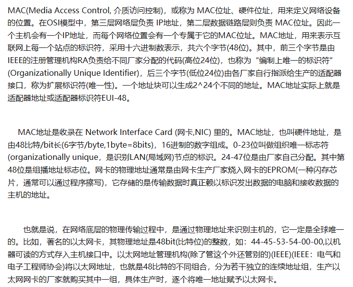

<!-- 2023年09月04日 -->

## 网络编程

### 学习大纲

- 计算机网络体系结构模型
- 网络编程专业术语(socket/IP/端口号)
- 通信时序图
- 传输协议:TCP协议/UDP协议
- 多进程/多线程 并发服务器
- 网络编程IO模型:阻塞IO/非阻塞IO/多路复用/信号驱动
- 超时接收数据方法

### 系统内进程/线程通信方式

<table>
  <tbody>
    <tr>
      <th>大类</th>
      <th>分类</th>
      <th>描述</th>
      <th>使用方式</th>
    </tr>
    <tr>
      <th rowspan="2">管道</th>
      <th>无名管道</th>
      <td>只能亲缘关系</td>
      <td>pipe()</td>
    </tr>
    <tr>
      <th>有名管道</th>
      <td>任意两个进程</td>
      <td>mkfifo()</td>
    </tr>
    <tr>
      <th rowspan="2">信号</th>
      <th>发送信号</th>
      <td></td>
      <td>kill()</td>
    </tr>
    <tr>
      <th>捕捉信号</th>
      <td></td>
      <td>signal()</td>
    </tr>
    <tr>
      <th rowspan="3">IPC对象</th>
      <th>消息队列</th>
      <td>接收特征类型的数据</td>
      <td>ftok()获取key值, 
          msgget创建队列获取ID, 
          msgsnd()发送消息, 
          msgrcv()接收消息, 
          msgctl()删除消息队列</td>
    </tr>
    <tr>
      <th>共享内存</th>
      <td>双方进程可以对同一片内存进行读写</td>
      <td>shmget()创建共享内存获取ID, 
          shmat()映射共享内存, 
          shmdt()解除映射, 
          shmctl()删除共享内存</td>
    </tr>
    <tr>
      <th>信号量</th>
      <td>不属于通信方式,属于一种互斥的量</td>
      <td>semget()获取信号量ID, 
          semop()PV操作, 
          semctl()删除信号量</td>
    </tr>
  </tbody>
</table>

*只能再同一台主机上内部通信,不能跨平台*

### 网络编程

#### 特点

既可以在同一台主机上内部通信,也可以在不同主机之间通信

网络通信的前提:需要在同一个局域网中

#### 协议

从应用的角度出发,在不同的主机张嘉倪通信,双方都必须要遵守同一种协议,即遵守同一种"规则",是数据传输和数据解释的规则

假设:A,B双方想发送文件规定:

- 第一次传输文件名,接收方收到文件名,应答OK给传输方
- 第二次:发送文件的大小尺寸,接收方收到之后,应答一个OK给传输方
- 传输文件内容,接收方收到之后,应答一个OK给传输方

由此 无论AB使用何种方式传输文件,都是通过三次数据传输来实现.AB之间就形成了一个简单的数据传输规则.双方都可以根据这种跪着来进行收发数据.
这种互相遵守的规定,我们称为协议

仅在AB之间通信的成长为原始协议,当此协议被更多的人去使用,不断的去增加,改进,维护,完善.最终就形成了一个稳定的,完整的文件传输协议,被广泛的应用于各种文件的传输,该协议就成为一个标准协议.例如最早的FTP(File transfer protocol)协议就是这样衍生而来的

TCP协议注重数据的传输->传输传输控制协议(Transmission Control Protocol)
HTTP协议注重数据的解释->超文本传输协议(HyperText Transfer Protocol)

#### 常见协议

- 传输层:常见有TCP/UDP协议
- 应用层:常见有HTTP协议,FTP协议
- 网络层:常见有IP协议,ICMP协议,IGMP协议
- 网络接口层:常见有ARP协议,RARP协议

TCP传输协议(Transmission Control Protocol):一种面向连接的,可靠的,基于字节流的传输层控制协议
UDP传输协议(User Datagram Protocol):一种面向无连接的,提供和面向事务的简单的不可靠的信息传输服务
HTTP(HyperText Transfer Protocol):超文本传输协议,互联网常用协议
FTP(File transfer protocol):文件传输协议
IP协议(Intellectual Property):互联网协议
ICMP(Internet Control Messages Protocol):网间控制报文协议,属于TCP/IP协议族的一个子协议,用于主机,路由器之间传递控制消息
IGMP协议(Internet Group Management Protocol):因特网组管理协议,是因特网协议家族中的一个组播协议,该协议运行在主机和组播路由器之间
ARP协议(Address Resolution Protocol):地址解析协议,通过已知的IP地址,寻找对应的MAC地址
RARP协议(Reverse Address Resolution Protocol):反向地址转换协议,通过已知的MAC地址,寻找对应的IP地址

#### 网络应用程序设计模型

- C/S 模型传统的网络应用设计模式,客户机(client)/服务器(server)模式,需要在各自的通讯两端各自部署服务器与客户端来完成通信
- B/S 模型
  浏览器(browser)/服务器(server)模式,只需要在一段部署服务器,而另一段使用pc都配置默认的浏览器即可完成数据的传输

优缺点
对于C/S模式而言，其优点明显。客户端位于目标主机上，可以保证性能，将数据缓存至客户端的本地，从而提高数据的传输效率。一般服务器和客户端都是由一个团队开发出来的，他们之间采用的协议就相对灵活。可以在标准协议进行裁剪及定制。
例如，腾讯公司所采用的通信协议就是ftp协议的修改裁剪版
因此，传统的网络应用程序及较大的一些网络应用程序都是首选C/S模式进行开发，比如网络游戏魔兽世界。3D画面，数据比较庞大，使用C/S模式可以进行本地的数据缓存，从而提高游戏体验。

OSI七层模式、了解，三次握手，四次挥手

