<!-- 2023年09月05日 -->
## 计算机网络体系架构

指的是主机内部集成的结构和每一层协议的集合,每一台主机本身就存在一个相同的网络体系结构.

作用  
封装数据和解析数据

分类   
由于网络数据的传输过程比较复杂,因此需要将传输过程按照所完成的功能进行每一层的分层,每一层都是单一的明确的功能,就使得每一层实现的功能任意实现行业标准,代码易于维护    

OSI(Open System Interconnection Reference Model)开放式通信系统互联参考模型  
*口诀:物数网传会表应*

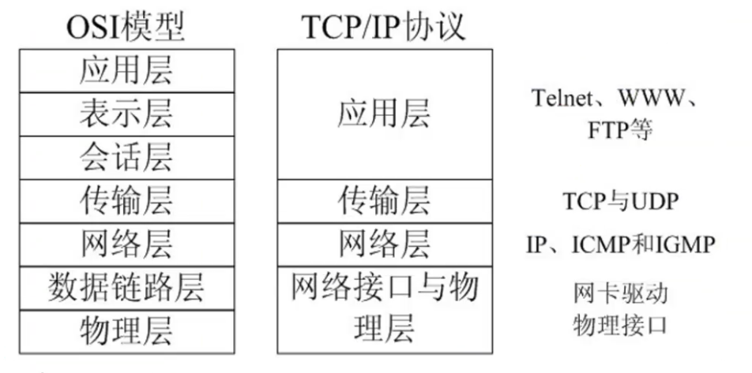

## OSI模型(七层)
七层模型概念清楚,理论完善,但是复杂又不实用
### 物理层
主要是定义物理设备标准,如网线的接口类型、光纤的接口类型、各种传输介质的传输速率.它的主要作用,传输
比特流(就是由1、0转换为电流强度来进行转换(数模转换),到达目的地,再转换为1,0(模数转换)).这一层的是数据叫比特
### 数据链路层
定义了如何让格式化数据以帧为单位进行传输,如何控制对物理介质的访问.还提供了错误检测和纠正,确保可靠传输.比如串口通信：115200(波特率)、8位数据位、无奇偶校验位、1位停止位等
### 网络层
在位于不同的地理位置的网络中的两个主机系统之间提供连接和路径选择(给不同地方的主机提供连接服务)  
internet的发展使得从世界各站点访问信息的用户增加,而网络层就是管理这种连接的层
### 传输层
定义了一些传输的协议和端口号(WWW 端口80等),如TCP协议(传输控制协议,传输效率低,可靠性强,用于传输可靠性要求高,数据量大的数据),UDP协议(用户数据报协议,与TCP特性相反,用于传输可靠性不高,数据量小的数据,如QQ聊天数据就是通过这种方式进行传输的).主要是将下层接收的数据进行分段和传输,到达目的再重组,通常把这一层的数据叫段
### 会话层
通过传输层(端口号：传输端口与接收端口)建立起数据传输的通路.主要在你的系统之间发起会话或者接受会话请求(设备之间需要互相认识可以是IP也可以是MAC地址或者主机名)
### 表示层
确保一个系统的应用层所发送的数据,能够被另一个系统的应用层读取.比如一台主机使用的是拓展二一十进制交换码(EBCDIC),另外一台电脑使用ASCII来表示相同的字符.表示层使用一种通用格式来实现多种数据格式之间的交换.
### 应用层
最靠近用户的OSI层.这一层为用户的应用程序(电子邮件,文件传输)提供网络服务
## TCP/IP协议模型(四层)

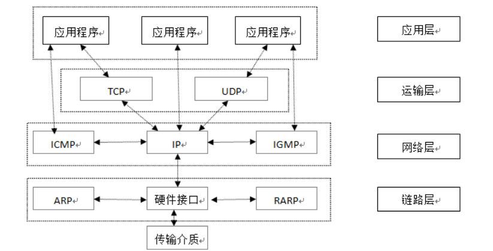

### 应用层
应用层是网络协议的最高层,主要任务通过进程间的交互完成特定网络应用.应用层协议定义的是应用程序(进程)间通信和交互的规则.  

对于不同的网络应用需要有不同的应用层协议,在互联网中的应用层协议很多,如域名系统DNS,支持万维网应用的HTTP协议,支持电子邮件的SMTP协议,等等.应用层交互的数据单元称为报文.
### 运输层
有时也译为传输层,它负责为两台主机中的进程提供通信服务.该层主要有以下两种协议：  
传输控制协议 (Transmission Control Protocol,TCP)：提供面向连接的、可靠的数据传输服务,数据传输的基本单位是报文段(segment)；  
用户数据报协议 (User Datagram Protocol,UDP)：提供无连接的、尽最大努力的数据传输服务,但不保证数据传输的可靠性,数据传输的基本单位是用户数据报.  

### 网络层
网络层负责为分组网络中的不同主机提供通信服务,并通过选择合适的路由将数据传递到目标主机.在发送数据时,网络层把运输层产生的报文段或用户数据封装成分组或 包进行传送.

在TCP/IP体系中,由于网络层使用IP协议,因此分组也叫IP数据报. 
### 数据链路层
数据链路层通常简称为链路层.数据链路层在两个相邻节点传输数据时,将网络层交下来的IP数据报组装成帧,在两个相邻节点之间的链路上传送帧.  
物理层：保数据可以在各种物理媒介上进行传输,为数据的传输提供可靠的环境.

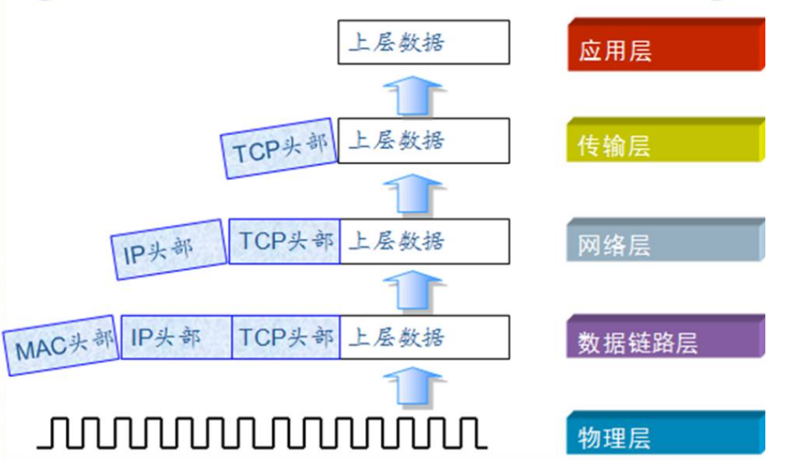
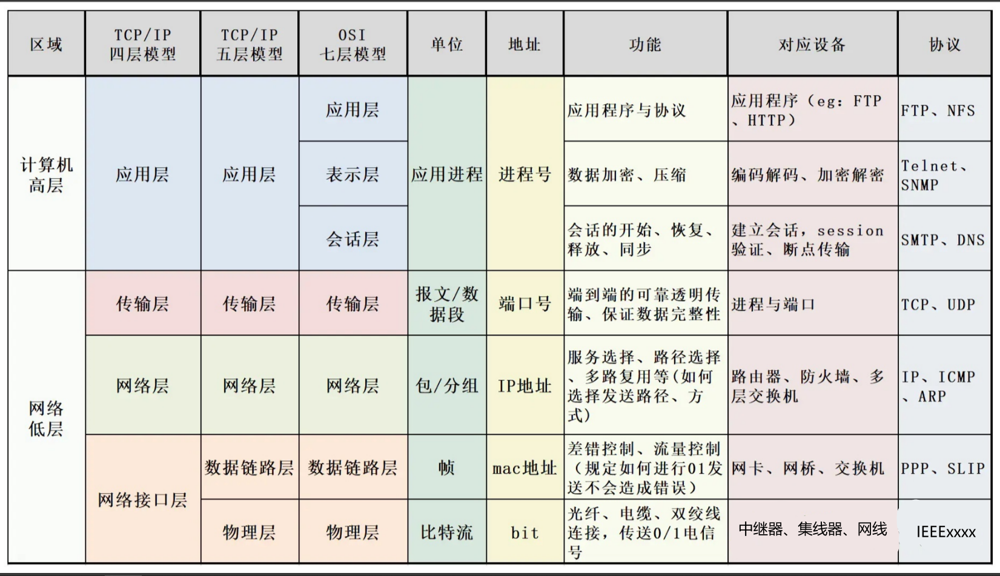

## TCP/IP通信过程
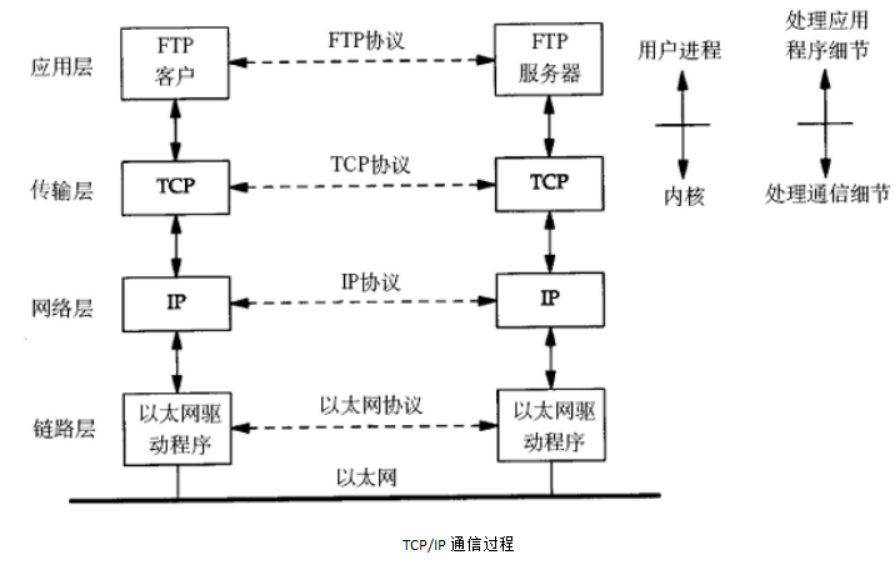

### 数据包的封装
传输层及以下的机制都是由内核提供,应用层由用户进程提供(后面会介绍如何使用socket API编写应用程序),应用
程序对通讯数据含义的解释,而传输层以下处理通讯的细节,将一台计算机通过一定的路径发送到另外一台计算机.应用层
数据通过协议栈发送到网络中,每一层协议都需要加数据首部(header),称之为封装.如下图所示：

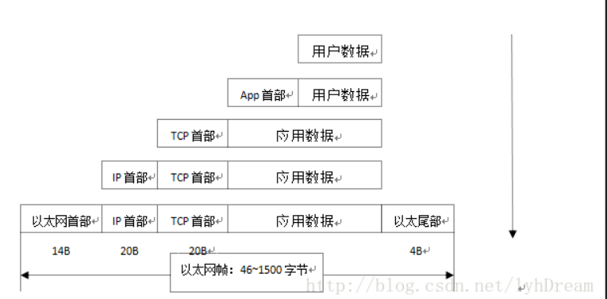
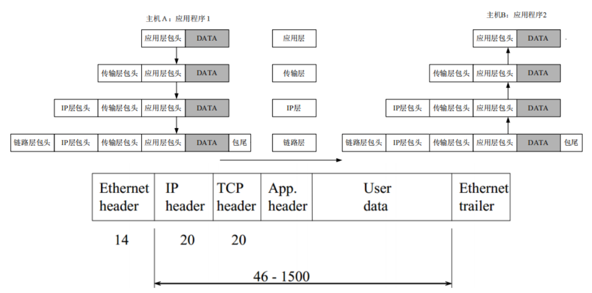

不同的协议层对数据包有不同的称谓,在传输层叫做段(segment),在网络层叫做数据报(datagram),在链路层叫做帧
(frame).数据封装成帧后发送传输介质上,到达目的主机,每层协议再剥离首部,最后将数据传给应用程序处.
### 以太网帧

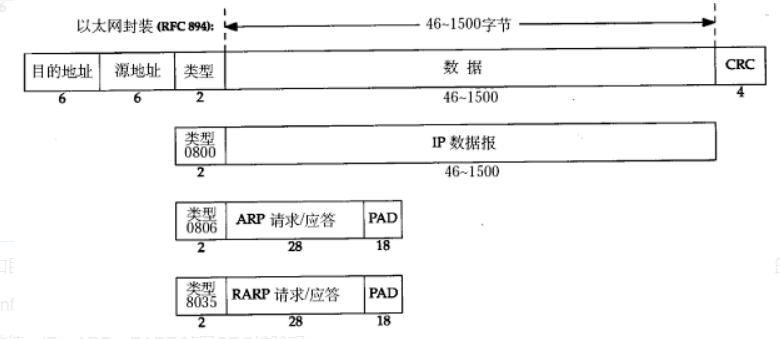

其中的源地址和目的地址是指网卡的硬件地址(也叫MAC地址),长度48位(6个字节),在网卡出厂时固化,确定的.   
可在shell中使用ifconfig命令查看---->HWaddr 00:0c:29:28:09:91(就是硬件地址).    
协议字段有三种值：IP、ARP、RARP.帧尾CRC校验码.    
以太网帧数据长度规定：最小46字节,最大是1500字节.ARP,RARP数据包没有46字节,在后面补充位数.    
最大值1500称为以太网的最大传输单元(MTU)maximum transmission unit    
不同的网络类型有不同的MTU,如果说一个数据包从以太路由到拨号链路上,数据包长度大于1500,则对数据包进行分片    
ifconfig命令的输出终端---MTU:1500.MTU概念指的是数据帧有效数据载荷为1500,不包括帧头长度.    
### ARP数据报格式
在网络通讯时,源主机的应用程序知道目的主机的IP地址和端口号,却不知道目的主机的硬件地址,而数据包首先是被网卡接收到,再去处理上层协议,如果收到的数据包的硬件地址与本机不符,则直接丢弃.因此在通讯前,必须要知道目的主机的硬件地址.ARP就是起这个作用的.    
源主机发出ARP请求,询问IP地址是192.168.1.6的硬件地址是多少？并将请求发广播到本网段.    
目的主机收到ARP请求,发现其中IP地址与本机一样,将自己的硬件地址填写到应答包中.   
每台主机都维护一个ARP缓存表,可以用arp -a命令查看.缓存表中表项有过期时间(一般是在20分钟),如果20分钟内都没有    
再次使用这个表项,则该表项失效,下一次还要发ARP请求,获取这个目的主机的地址  
ARP数据报的格式:  

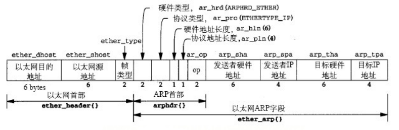

### IP数据报

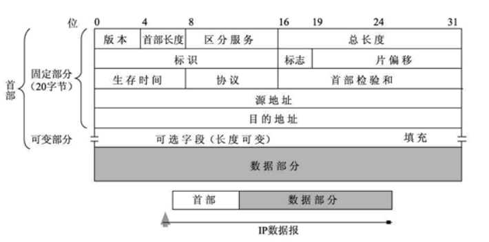

1) 版本(version)   
占 4 位,表示 IP 协议的版本.通信双方使用的 IP 协议版本必须一致.目前广泛使用的IP协议版本号为 4,即 IPv4.   
2) 首部长度(网际报头长度IHL)  
    占 4 位,可表示的最大十进制数值是 15.这个字段所表示数的单位是 32 位字长(1 个 32 位字长是 4 字节).因此,当 IP 的首部长度为 1111 时(即十进制的 15),首部长度就达到 60 字节.当 IP 分组的首部长度不是 4 字节的整数倍时,必须利用最后的填充字段加以填充.

    数据部分永远在 4 字节的整数倍开始,这样在实现 IP 协议时较为方便.首部长度限制为 60 字节的缺点是,长度有时可能不够用,之所以限制长度为 60 字节,是希望用户尽量减少开销.最常用的首部长度就是 20 字节(即首部长度为 0101),这时不使用任何选项.

3) 区分服务(tos)  
也被称为服务类型,占 8 位,用来获得更好的服务.这个字段在旧标准中叫做服务类型,但实际上一直没有被使用过.1998 年 IETF 把这个字段改名为区分服务(Differentiated Services,DS).只有在使用区分服务时,这个字段才起作用.

4) 总长度(totlen)  
首部和数据之和,单位为字节.总长度字段为 16 位,因此数据报的最大长度为 2^16-1=65535 字节.

5) 标识(identification)  
用来标识数据报,占 16 位.IP 协议在存储器中维持一个计数器.每产生一个数据报,计数器就加 1,并将此值赋给标识字段.当数据报的长度超过网络的 MTU,而必须分片时,这个标识字段的值就被复制到所有的数据报的标识字段中.具有相同的标识字段值的分片报文会被重组成原来的数据报.

6) 标志(flag)  
占 3 位.第一位未使用,其值为 0.第二位称为 DF(不分片),表示是否允许分片.取值为 0 时,表示允许分片；取值为 1 时,表示不允许分片.第三位称为 MF(更多分片),表示是否还有分片正在传输,设置为 0 时,表示没有更多分片需要发送,或数据报没有分片.

7) 片偏移(offsetfrag)  
占 13 位.当报文被分片后,该字段标记该分片在原报文中的相对位置.片偏移以 8 个字节为偏移单位.所以,除了最后一个分片,其他分片的偏移值都是 8 字节(64 位)的整数倍.

8) 生存时间(TTL)  
    表示数据报在网络中的寿命,占 8 位.该字段由发出数据报的源主机设置.其目的是防止无法交付的数据报无限制地在网络中传输,从而消耗网络资源.
    
    路由器在转发数据报之前,先把 TTL 值减 1.若 TTL 值减少到 0,则丢弃这个数据报,不再转发.因此,TTL 指明数据报在网络中最多可经过多少个路由器.TTL 的最大数值为 255.若把 TTL 的初始值设为 1,则表示这个数据报只能在本局域网中传送. 

9) 协议   
    表示该数据报文所携带的数据所使用的协议类型,占 8 位.该字段可以方便目的主机的 IP 层知道按照什么协议来处理数据部分.不同的协议有专门不同的协议号.
    
    例如,TCP 的协议号为 6,UDP 的协议号为 17,ICMP 的协议号为 1.

10) 首部检验和(checksum)  
用于校验数据报的首部,占 16 位.数据报每经过一个路由器,首部的字段都可能发生变化(如TTL),所以需要重新校验.而数据部分不发生变化,所以不用重新生成校验值.

11) 源地址  
表示数据报的源 IP 地址,占 32 位.

12) 目的地址  
表示数据报的目的 IP 地址,占 32 位.该字段用于校验发送是否正确.

13) 可选字段  
该字段用于一些可选的报头设置,主要用于测试、调试和安全的目的.这些选项包括严格源路由(数据报必须经过指定的路由)、网际时间戳(经过每个路由器时的时间戳记录)和安全限制.

14) 填充  
由于可选字段中的长度不是固定的,使用若干个 0 填充该字段,可以保证整个报头的长度是 32 位的整数倍.

15) 数据部分  
表示传输层的数据,如保存 TCP、UDP、ICMP 或 IGMP 的数据.数据部分的长度不固定.

TCP数据报的首部长度和数据长度都是可变长的,但总是4字节的整数倍.  
对于IPv4,4位版本字段是4.4位首部长度的数值是以4字节为单位的,最小值为5,也就是说首部长度最小是4x5=20字节,也就是不带任何选项的IP首部,4位能表示的最大值是15,也就是说首部长度最大是60字节.  
8位TOS字段有3个位用来指定IP数据报的优先级(目前已经废弃不用),还有4个位表示可选的服务类型(最小延迟、最大?吐量、最大可靠性、最小成本),还有一个位总是0.总长度是整个数据报(包括IP首部和IP层payload)的字节数.每传一个IP数据报,16位的标识加1,可用于分片和重新组装数据报.3位标志和13位片偏移用于分片.TTL(Time to live)是这样用的：源主机为数据包设定一个生存时间,比如64,每过一个路由器就把该值减1,如果减到0就表示路由已经太长了仍然找不到目的主机的网络,就丢弃该包,因此这个生存时间的单位不是秒,而是跳(hop).协议字段指示上层协议是TCP、UDP、ICMP还是IGMP.然后是校验和,只校验IP首部,数据的校验由更高层协议负责.IPv4的IP地址长度为32位.  
思考题：如果源主机和目的主机不在同一网络,ARP请求的广播无法穿过路由器,源主机如何与目的主机通信？  
https://blog.csdn.net/weixin_43166958/article/details/86503506

### TCP数据报

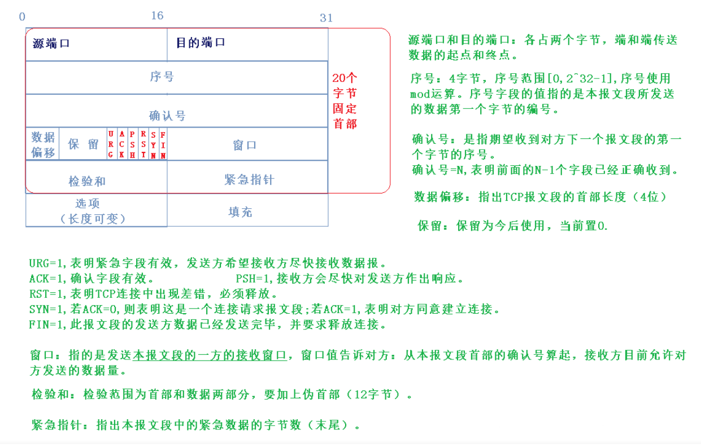

有源端口号和目的端口号,通讯的双方由IP地址和端口号标识.  
32位序号、32位确认序号、窗口大小.4位首部长度和IP协议头类似,表示TCP协议头的长度,以4字节为单位,因此TCP协议头最长可以是4x15=60字节,  
如果没有选项字段,TCP协议头最短20字节.  
URG、ACK、PSH、RST、SYN、FIN是六个控制位.16位检验和将TCP协议头和数据都计算在内.