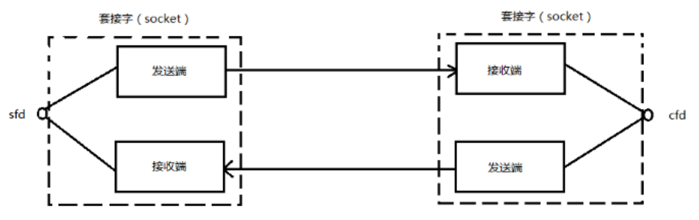
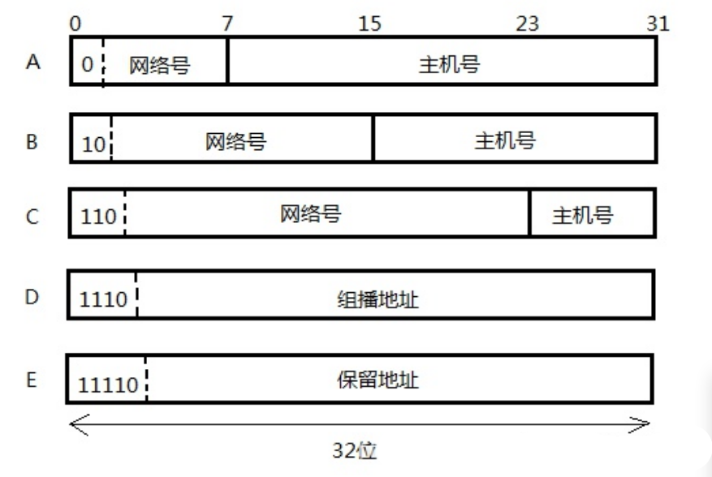

<!-- 2023年09月06日 -->
## 传输协议
### TCP
用来检测网络传输中差错的传输控制协议.是一种面向连接的传输层协议,它能提供可靠性通信(即数据无误、无丢失、数据无失序、数据无重复到达的通信)  

适用场合:  
- 对传输质量要求较高,以及传输大量数据的通信
- 在需要可靠传输的场合
- QQ登录账户等
### UDP
UDP数据报协议,是不可靠连接.在数据发送前是不需要进行连接,所以可以进行高效率的数据传输  

使用场合  
- 发送数据尺寸比较小的数据
- 适用于广播/z组播通信
-  QQ等即时通讯软件的点对点的文本通讯以及音视频通讯(短视频直播)常采用UDP协议
- 网络多媒体服务中心通常使用UDP进行实时数据传输

## 网络编程中的几个比较重要的概念

### socket
本身具有插座的含义,套接字 .插座种类繁多,就像多种协议一样,必须提前设置好协议
1. 概念:  
    socket在Linux环境中,用于表示进程间网络通信的特殊文件类型.本质为内核借助缓冲区形成的伪文件.既然是文件,那么可以用文件描述符引用套接字.与管道文件相类似,linux系统将其封装成文件目的是为了统一接口,使得读写套接字和读写文件的操作一致.区别是管道主要应用于本地进程之间通信,而套接字是网络进程之间数据传输.套接字内核比较复杂,不宜在初期深入学习.

    在TCP/IP协议中,”IP地址+TCP或者UDP端口号“唯一标识网络通信的一个进程.”IP地址+端口号“就对应一个socket.欲建立
    两个进程的通信,各自要对应一个socket套接字来标识,那么这两个套接字组成的socket pair 就是唯一标识的一个连接.因此
    socket来描述网路连接一对一的关系
2. 套接字通信原理如下图所示:
    
    

    在网路通信中,套接字一定是成对存在的,一端的发送缓冲区,对应一端的接收缓冲区.我们使用的同一个文件描述符指向发送缓冲区和接收缓冲区   
    TCP/IP协议最早在BSD UNIX上实现,为TCP/IP协议设计的应用层编程接口称为socket API


3. 特点  
    是一套编程的函数接口,目的是建立套接字
    无论是TCP协议还是UDP协议,都是使用的socket
    socket在网路模型中处于应用层与传输层之间

4. 例子  
    使用TCP协议,那么用socket创建出来的套接字就是TCP套接字  
    套接字: `int socket_fd=socket(TCP协议);`---->得到一个TCP协议的套接字  
    普通文件: `int file_fd=open(普通文件);`-------->file_fd就是文件描述符  

### IP地址
IP地址实质上等同于一台计算机的ID,用于在世界范围内更加方便的唯一标识某一台机器   
以IPV4为例,IP地址是32位(4个字节),通常它的形式是所谓点分式的字符串:  
> 192.168.1.1

IPV4的地址  
当初IPV4发明出来,人们觉得32位足以表达世上所有的计算机,后来科技发展迅速,目前世界上的计算机的数量(包括所有需要联网的设备,不仅仅是电脑)早已超出了人们的设想,IPV4不够用了,但是后续人们发明子网技术有效的缓解了IP地址的枯竭,因此就i目前而言IPV4将长期存在.  
一个IP地址从形式上可以分成前后两段,前半段叫网络号,后半段称为主机号.网络号用来作为该主机所在网络在全世界的唯一标识,主机号在所在的网络内部的唯一标识.  
由此根据网络号与主机号所占位数的不同,将IP地址分为以下的类别  

    A类地址:
    第一个字节为网络地址,其他三个字节为主机地址
    第一个字节的最高位固定为0
    1.0.0.1-127.255.255.255
    
    B类地址:
    第一个字节与第二字节为网络地址,其他二个字节为主机地址
    第一个字节的前两位固定为10
    128.0.0.1-191.255.255.255

    C类地址:
    前三个字节为网络地址,最后一个字节为主机地址
    第一个字节的前三位固定为110
    192.0.0.1-223.255.255.255

    D类地址:(组播地址)
    不分网路地址与主机地址
    第一个字节的前四位固定为1110
    224.0.0.1-239.255.255.255

    E类IP地址
    以11110开始的,为将来使用保留的.240.0.0.0-255.255.255.254
    255.255.255.255就是广播地址
    全0---->0.0.0.0对应当前的主机.
    


### 端口号(16位)
标识同一台主机内不同的应用程序


端口号:
- 系统占用端口号:1-1023(用户不能使用该端口号进行通信)
- 可用:1024-65535

当端口选择错误,那么连接错误
### 字节序(大小端)
当一个数据需要两个或者以上的字节来进行存储时,就会出现所谓字节序的概念,例如4个字节
```c
int a=0x12345678；
```


通常,将最低的有效位(78)放在低地址的存储方式称为小端序,反之为大端序.在单机编程中,字节序时系统内部的存储细节,与程序无关.但是在网络编程中,由于数据是两台主机在进行通信表达,如果字节序不一样出现牛头不对马嘴的问题.  
解决这个困境的唯一方法:将网络中的数据,统一为某种固定的字节序,比如说大端序,凡是主机往外发送,一律转成大端序,凡是从网络下载的数据也是大端序,网络字节序屏蔽双方通信的具体细节,从而使得双方通信.

1. Big-Endian(大端):高位字节排放在内存的低地址端，低位字节排放在内存的高地址端。

2. Little-Endian(小端):低位字节排放在内存的低地址端，高位字节排放在内存的高地址端。

总结:X86一般是小端序；ARM一般是大端序

### 虚拟机的网络配置(桥接和NAT网络)
#### 虚拟机的网络适配器的模式
桥接模式:使得虚拟机跟物理机一样,各自拥有独立IP  
NAT模式:使得虚拟机直接共享物理机的IP的地址,自己没有独立的IP地址

以上两种模式都可以使得虚拟机内的客户机(ubuntu系统)去连接网络,区别就是虚拟机是否拥有独立IP.对于桥接模式需要注意,必须要仔细选择桥接的物理网卡,否则会出现无法联网的情况

通过虚拟网络编辑器选择桥接对象
1. wifi(无线)
2. Realtek PCIe GbE Family Controller(有线)
3. usb(接网线)
#### 桥接模式
所谓桥接模式,是指虚拟网卡通过物理机的某一个网络接口,直接连接到路由去获取IP地址.如上图,假设物理机有WiFi、以太网多种接口,其中wifil连接到了互联网,桥接的时候是要选择桥接到哪一个网口

例如:通过桥接wifi来联网  
         桥接以太网来连接开发板  
   在虚拟网络编辑器中可以桥接到具体的网卡  


重置虚拟网卡  
有时,如果vmware的网络参数经过多次配置导致无法正确联网,点击上图的左下角有个还原默认设置,点击重置网络.
#### NAT模式  
如果虚拟机不要单独的IP地址,可以通过NAT模式进行连接网络.NAT模式下的IP地址是由虚拟网卡自动分配  
与主机地址不在同一个网段  

windows主机与ubuntu之间可以通过这两个IP地址进行通信,unbuntu也能联网.但是如果进行TCP与UDP通信,通过NAT模式能不能进行通信？不能进行两台主机之间的通信,因为不在同一个网段,也没有办法跳转路由,所以必须改为桥接模式  
#### 仅主机模式  
有时限于外部网络的局限性,在ubuntu无需连接外网而需要宿主机windos通信时,将vmware虚拟机网卡配置为仅主机模式.  
意味着只能和宿主机通信.(不能连外网)


## TCP通信及接口

### 客户端接口
#### 客户端建立套接字

```c
#include <sys/types.h>          /* See NOTES */
#include <sys/socket.h>

// 建立套接字,返回套接字文件描述符
int socket(int domain, int type, int protocol);
/* 
参数:
    domain    选择地址族
        PF_INET/AF_INET---->IPV4网络协议       
        PF_INET6/AF_INET6--->IPV6网络协议  
    type    哪一种协议
        SOCK_STREAM--TCP流式套接字
        SOCK_DGRAM--UDP数据报套接字
    protocol    
        表示默认协议 一般写0
返回值:
     成功返回 套接字文件描述符 socket_fd
     失败返回 -1 
 */
```
两者在windows下没有任何区别,在linux/unix有细微差别  
PF_INET---Protocol--->在创建套接字的使用  
AF_INET---Address--->结构体定义地址的时候    
但是,对于宏定义而言,他们值都是2

PF_INET 表示协议族（Protocol Family），它是 Protocol Family INET 的缩写。它主要用于套接字创建时选择协议族，用于指定网络层协议（例如IPv4、IPv6等）。在实践中，PF_INET 通常与 SOCK_STREAM 或 SOCK_DGRAM 一起使用，用于创建基于 TCP 或 UDP 的网络套接字。

AF_INET 表示地址族（Address Family），它是 Address Family INET 的缩写。它主要用于套接字地址结构中通过传递地址族参数来指定使用的地址族类型。在实践中，AF_INET 通常与 socket() 和 bind() 等函数一起使用，用于指定使用 IPv4 地址。

理论上建立socket时是指定协议，应该用PF_xxxx，设置地址时应该用AF_xxxx。当然AF_INET和PF_INET的值是相同的，混用也不会有太大的问题。

在函数socketpair与socket的domain参数中有AF_UNIX,AF_LOCAL,AF_INET,PF_UNIX,PF_LOCAL,PF_INET.    
这几个参数有AF_UNIX=AF_LOCAL, PF_UNIX=PF_LOCAL, AF_LOCAL=PF_LOCAL,AF_INET=PF_INET.  

**建议:对于socketpair与socket的domain参数,使用PF_LOCAL系列,
而在初始化套接口地址结构时,则使用AF_LOCAL.**  
例如:  
```c
int fd = socket(PF_LOCAL, SOCK_STREAM, 0);  
adr_unix.sin_family = AF_LOCAL; 
```
#### 客户端发起连接

```c
#include <sys/types.h>          /* See NOTES */
#include <sys/socket.h>

int connect(int sockfd, const struct sockaddr *addr,socklen_t addrlen);
/* 
参数
    sockfd
        套接字文件描述符
    addr
        一个结构体,包含对方的IP地址和端口号
    addrlen
        地址的长度-->sizeof(struct sockaddr_in)
返回值:
     成功返回 0
     失败返回 -1 
 */
```
使用`man 7 ip`可以查看
IPV4的结构体
```c

struct sockaddr_in
{
    sa_family_t    sin_family; /* address family: AF_INET 地址族*/
    in_port_t      sin_port;   /* port in network byte order 端口号*/
    struct in_addr sin_addr;   /* internet address IP地址*/
};
 /* Internet address. */
 
struct in_addr
{
    uint32_t   s_addr;   /* address in network byte order无符号整型数据采用大端序 */
};

```
初始化IPV4地址和端口号
```c
// 声明地址和端口的结构体
struct sockaddr_in serverAddr;
// 设置地址蔟
serverAddr.sin_family=AF_INET;
// 设置端口
serverAddr.sin_port=htons(5000);//htons--->将主机端口号变成网络端口号 
// 设置ip地址
serverAddr.sin_addr. s_addr=inet_addr("192.168.1.47");//将主机IP转换为网络IP
// 创建tcp连接
connect(sockfd,(struct sockaddr *)&serverAddr,sizeof( struct sockaddr_in));
```

#### 拓展的函数(地址和端口转换函数)

```c
#include <arpa/inet.h>

uint16_t htons(uint16_t hostshort);//将主机端口号 转成网络端口号
uint16_t ntohs(uint16_t netshort);//将网络端口号 转成主机端口号
```

```c
#include <sys/socket.h>
#include <netinet/in.h>
#include <arpa/inet.h>

in_addr_t inet_addr(const char *cp);//将主机转化成网络IP
char *inet_ntoa(struct in_addr in);//将网络IP转成主机IP
/* 
参数:
    cp---->主机IP
返回值:
    网络IP    
 */
```


#### 发送数据
```c
#include <sys/types.h>
#include <sys/socket.h>

// 用于网络发数据
ssize_t send(int sockfd, const void *buf, size_t len, int flags);
/* 
参数
    sockfd
        套接字文件描述符
    buf
        你要发送的数据
    len
        你要发送数据的大小,以字节为单位
    flags
        一般默认为0
返回值:
    成功返回    发送的字节数
    失败返回    -1
 */
```
#### 关闭文件
```c
close(fd)
```

### 服务器端API:
#### 绑定自己的IP和端口
```c
#include <sys/types.h>          /* See NOTES */
#include <sys/socket.h>

// 绑定自己的IP地址和端口号
int bind(int sockfd, const struct sockaddr *addr,socklen_t addrlen);
/* 
参数
    sockfd
        套接字文件描述符
    addr
        一个结构体,包含对方的IP地址和端口号
    addrlen
        地址的长度-->sizeof(struct sockaddr_in)
返回值:
     成功返回 0
     失败返回 -1 
 */
```
#### 设置铃声
```c
#include <sys/types.h>          /* See NOTES */
#include <sys/socket.h>

// 创建一个未连接的队列,同时最多连接数为backlog
int listen(int sockfd, int backlog);
/* 
参数
    sockfd
        套接字文件描述符
    backlog
        同时最多连接的客户端总数,通常最大为128
返回值:
     成功返回 0
     失败返回 -1 
 */  
```

说明:  
典型的服务器程序可以同时服务于多个客户端,当有客户端发起连接时,服务器调用`accept()`返回并接受这个连接,如果有大量的客户端发起连接而服务器来不及处理,尚未接受的客户端就处于连接等待状态,listen声明sockfd处于监听状态,并且只允许最多backlog个客户端处于连接状态,如果接收到更多的连接请求就忽略.  
查看系统默认的backlog
```bash
cat /proc/sys/net/ipv4/
gec@ubuntu:/proc/sys/net/ipv4$ cat /proc/sys/net/ipv4/tcp_max_syn_backlog 
128
```
#### 等待连接
```c
#include <sys/types.h>          /* See NOTES */
#include <sys/socket.h>
// 等待客户连接
int accept(int sockfd, struct sockaddr *addr, socklen_t *addrlen);
/* 
参数
    sockfd
        套接字文件描述符
    addr
        一个结构体,包含对方的IP地址和端口号
    addrlen
        地址的长度-->sizeof(struct sockaddr_in)
返回值:
     成功返回 成功返回已连接的套接字文件描述符
 */

 //如果客户端连接上来,可以获取客户端的IP地址与端口号
```

#### 接收数据
```c
#include <sys/types.h>
#include <sys/socket.h>

ssize_t recv(int sockfd, void *buf, size_t len, int flags);
/* 
参数
    sockfd
        套接字文件描述符
    buf
        接收到的数据存储位置
    len
        接收的数据长度
    flags
        一般为0
返回值:
    成功返回 接收到的字节数
    失败返回-1
    返回0 表示客户端断开连接
 */
```

## 练习

- TCP实现客户端向服务器发送消息


<details>
  <summary>sever.c</summary>

```c
#include <stdio.h>
#include <sys/types.h> /* See NOTES */
#include <sys/socket.h>
#include <netinet/in.h>
#include <netinet/ip.h>
#include <arpa/inet.h>
#include <string.h>
#include <unistd.h>
//服务器的都端口和IP地址
#define SEVERPORT 5113
// #define SEVERIP "192.168.1.128"
#define SEVERIP "127.0.0.1"

int main(int argc, char **argv, char **envp)
{
    // 客户端创建套接字
    int sever_id = socket(PF_INET, SOCK_STREAM, 0);
    if (-1 == sever_id)
    {
        perror("套接字建立失败");
        return 0;
    }
    // 设置服务器的IP地址和端口
    struct sockaddr_in sever_addr;
    sever_addr.sin_family = AF_INET;
    // 主机端口号转换为网络端口号存储起来
    sever_addr.sin_port = htons(SEVERPORT);
    // 主机ip转换为网络IP存储起来
    sever_addr.sin_addr.s_addr = inet_addr(SEVERIP);
    // 绑定连接属性
    bind(sever_id, (struct sockaddr *)&sever_addr, sizeof(struct sockaddr_in));
    // 创建连接队列
    int temp_error=listen(sever_id,10);
    if(-1==temp_error)
    {
        perror("创建连接错误");
        return 0;
    }
    //等待客户端主动连接
    // 设置服务器的IP地址和端口
    struct sockaddr_in client_sever;
    int client_size=sizeof(client_sever);
    int client_id=accept(sever_id,(struct sockaddr*)&client_sever,&client_size);
    printf("正在连接!\n");
    if(-1!=client_id)
    {
        printf("有客户端连接上,其ip=%s,port=%d\n",
        inet_ntoa(client_sever.sin_addr),
        ntohs(client_sever.sin_port)
        );
    }
    char buf[1024] = {0};
    while (1)
    {
        memset(buf,0,sizeof(buf));
        recv(client_id,buf,sizeof(buf),0);
        printf("client asy:%s\n",buf);
        if(!strncmp("exit",buf,4))
        {
            break;
        }
    }
    close(sever_id);
    close(client_id);
    return 0;
} 
```
</details>
<details>
  <summary>client.c</summary>

```c
#include <stdio.h>
#include <sys/types.h> /* See NOTES */
#include <sys/socket.h>
#include <netinet/in.h>
#include <netinet/ip.h>
#include <arpa/inet.h>
#include <string.h>
#include <unistd.h>
//自己的都端口和IP地址
#define OWNPORT 5112
// #define OWNIP "172.22.236.169"
#define OWNIP "127.0.0.1"
//服务器的都端口和IP地址
#define SEVERPORT 5113
// #define SEVERIP "172.22.236.169"
#define SEVERIP "127.0.0.1"
// #define SEVERIP "172.22.224.1"
// #define SEVERIP "192.168.1.128"

int main(int argc, char **argv, char **envp)
{
    // 客户端创建套接字
    int client_id = socket(PF_INET, SOCK_STREAM, 0);
    if (-1 == client_id)
    {
        perror("套接字建立失败");
        return 0;
    }
    // 创建连接请求的ip地址和端口
    struct sockaddr_in own_addr;
    own_addr.sin_family = AF_INET;
    // 主机端口号转换为网络端口号存储起来
    own_addr.sin_port = htons(OWNPORT);
    // 主机ip转换为网络IP存储起来
    own_addr.sin_addr.s_addr = inet_addr(OWNIP);
    // 绑定自己的ip 端口 协议
    bind(client_id, (struct sockaddr *)&own_addr, sizeof(struct sockaddr_in));
    // 设置服务器的IP地址和端口
    struct sockaddr_in sever_addr;
    sever_addr.sin_family = AF_INET;
    // 主机端口号转换为网络端口号存储起来
    sever_addr.sin_port = htons(SEVERPORT);
    // 主机ip转换为网络IP存储起来
    sever_addr.sin_addr.s_addr = inet_addr(SEVERIP);
    // 发起连接请求
    int temp_sever=connect(client_id, (struct sockaddr *)&sever_addr, sizeof(sever_addr));
    if(-1==temp_sever)
    {
        perror("服务器连接错误!");
        return 0;
    }
    char buf[1024] = {0};
    while (1)
    {
        memset(buf,0,sizeof(buf));
        printf("data:");
        scanf("%s", buf);
        // 发送数据
        send(client_id, buf, strlen(buf), 0);
        if(!strncmp("exit",buf,4))
        {
            break;
        }
    }
    close(client_id);
    return 0;
}
```
</details>