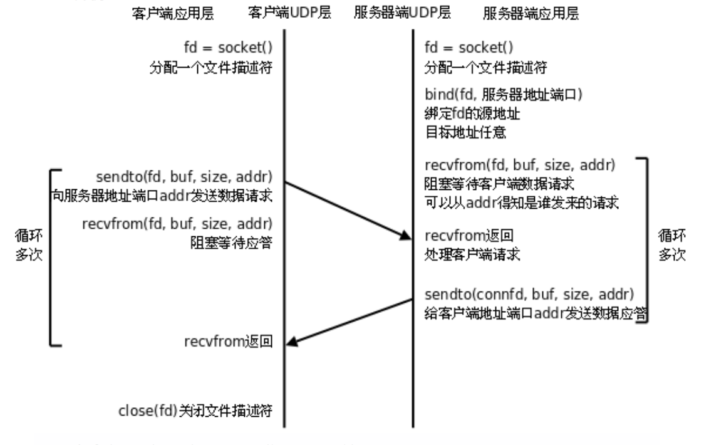

<!-- 2023年09月07日 -->
## UDP通信
传输层主要的应用协议模型有两种，一种TCP协议，一种UDP协议。TCP协议占主导地位，绝大多数网络都是借助  
TCP协议完成数据传输，但UDP也是不可或缺的重要通信手段  
相较于TCP,UDP通信形式像发短信。不需要建立连接，维护连接。只需要专心获取数据就可以。省去了三次握手，  
通信速度可以大大提高，伴随着通信的稳定性与正确得不到保障。因此就称之为无连接的不可靠的传输。  
UDP无需连接，开销小，数据传输块，实时性较强，多用于视频会议，电话会议，短视频直播。由于数据的准确率得不到  
保证，为了保证准确性，在应用层添加辅助的校验协议来弥补UDP的不足，以达到可靠传输的目的。



由于UDP不需要维护连接，程序逻辑简单明了很多，但是UDP是不可靠的，保证通讯可靠性需要在应用层实现
### 客户端函数
#### 建立套接字
```c
#include <sys/types.h>          /* See NOTES */
#include <sys/socket.h>

int socket(int domain, int type, int protocol);
/* 
参数:
    domain    选择地址族
        PF_INET/AF_INET---->IPV4网络协议       
        PF_INET6/AF_INET6--->IPV6网络协议  
    type    哪一种协议
        SOCK_STREAM--TCP流式套接字
        SOCK_DGRAM--UDP数据报套接字
    protocol    
        表示默认协议 一般写0
返回值:
     成功返回 套接字文件描述符 socket_fd
     失败返回 -1 
 */
```
#### 发送数据
```c
#include <sys/types.h>
#include <sys/socket.h>

// 用于UDP发送数据，注意是UDP
ssize_t sendto(int sockfd, const void *buf, size_t len, int flags,
                    const struct sockaddr *dest_addr, socklen_t addrlen);
/* 
参数:
    sockfd
        套接字文件描述符
    buf
        你要发送的数据
    len
        你要发送的数据大小，有多少发多少---->strlen
    flags
        一般设置为0
    dest_addr
        对方的IP地址和端口号
    addrlen
        结构体的大小
返回值:
     成功返回发送的字节数
     失败返回 -1 
 */
```

#### 关闭连接
```c
close(socketfd);
```
### 服务器端：
#### 绑定自己的IP和端口号
```c
#include <sys/types.h>          /* See NOTES */
#include <sys/socket.h>

// 绑定自己的IP地址和端口号
int bind(int sockfd, const struct sockaddr *addr,socklen_t addrlen);
/* 
参数
    sockfd
        套接字文件描述符
    addr
        一个结构体,包含对方的IP地址和端口号
    addrlen
        地址的长度-->sizeof(struct sockaddr_in)
返回值:
     成功返回 0
     失败返回 -1 
 */
```
#### 接收数据
```c
#include <sys/types.h>
#include <sys/socket.h>

ssize_t recvfrom(   int sockfd, 
                    void *buf, 
                    size_t len, 
                    int flags,
                    struct sockaddr *src_addr, 
                    socklen_t*addrlen);
/* 
参数
    sockfd
        套接字文件描述符
    buf
        接收到的数组存储在这里
    len
        接收到的数据大小，以最大来接收---->sizeof
    flags
        一般设置为0
    src_addr
        存储客户端的IP地址和端口号，可以获取到是谁发给你的
    addrlen
        结构体的大小
返回值:
     成功返回 接收的字节数
     失败返回 -1 
 */
```
## 练习

- TCP实现客户端向服务器发送消息


<details>
  <summary>sever.c</summary>

```c
#include <stdio.h>
#include <sys/types.h> /* See NOTES */
#include <sys/socket.h>
#include <netinet/in.h>
#include <netinet/ip.h>
#include <arpa/inet.h>
#include <string.h>
#include <unistd.h>
//服务器的都端口和IP地址
#define SEVERPORT 5113
// #define SEVERIP "192.168.1.128"
#define SEVERIP "127.0.0.1"

int main(int argc, char **argv, char **envp)
{
    // 客户端创建套接字
    int sever_id = socket(PF_INET, SOCK_DGRAM, 0);
    if (-1 == sever_id)
    {
        perror("套接字建立失败");
        return 0;
    }
    // 设置服务器的IP地址和端口
    struct sockaddr_in sever_addr;
    sever_addr.sin_family = AF_INET;
    // 主机端口号转换为网络端口号存储起来
    sever_addr.sin_port = htons(SEVERPORT);
    // 主机ip转换为网络IP存储起来
    sever_addr.sin_addr.s_addr = inet_addr(SEVERIP);
    // 绑定连接属性
    bind(sever_id, (struct sockaddr *)&sever_addr, sizeof(struct sockaddr_in));
    // 设置服务器的IP地址和端口
    struct sockaddr_in client_sever;
    int client_size=sizeof(client_sever);

    char buf[1024] = {0};
    while (1)
    {
        memset(buf,0,sizeof(buf));
        // 接收数据
        recvfrom(sever_id,buf,sizeof(buf),0,(struct sockaddr*)&client_sever,&client_size);
        printf("client asy:%s\n",buf);
        if(!strncmp("exit",buf,4))
        {
            break;
        }
    }
    close(sever_id);
    // close(client_id);
    return 0;
} 
```
</details>
<details>
  <summary>client.c</summary>

```c
#include <stdio.h>
#include <sys/types.h> /* See NOTES */
#include <sys/socket.h>
#include <netinet/in.h>
#include <netinet/ip.h>
#include <arpa/inet.h>
#include <string.h>
#include <unistd.h>
//自己的都端口和IP地址
#define OWNPORT 5112
#define OWNIP "127.0.0.1"
//服务器的都端口和IP地址
#define SEVERPORT 5113
#define SEVERIP "127.0.0.1"

int main(int argc, char **argv, char **envp)
{
    // 客户端创建套接字
    int client_id = socket(PF_INET, SOCK_DGRAM, 0);
    if (-1 == client_id)
    {
        perror("套接字建立失败");
        return 0;
    }
    // 创建连接请求的ip地址和端口
    struct sockaddr_in own_addr;
    own_addr.sin_family = AF_INET;
    // 主机端口号转换为网络端口号存储起来
    own_addr.sin_port = htons(OWNPORT);
    // 主机ip转换为网络IP存储起来
    own_addr.sin_addr.s_addr = inet_addr(OWNIP);
    // 绑定自己的ip 端口 协议
    bind(client_id, (struct sockaddr *)&own_addr, sizeof(struct sockaddr_in));
    // 设置服务器的IP地址和端口
    struct sockaddr_in sever_addr;
    sever_addr.sin_family = AF_INET;
    // 主机端口号转换为网络端口号存储起来
    sever_addr.sin_port = htons(SEVERPORT);
    // 主机ip转换为网络IP存储起来
    sever_addr.sin_addr.s_addr = inet_addr(SEVERIP);

    char buf[1024] = {0};
    while (1)
    {
        memset(buf,0,sizeof(buf));
        printf("data:");
        scanf("%s", buf);
        // 发送数据
        sendto(client_id,buf,strlen(buf),0,(struct sockaddr *)&sever_addr, sizeof(sever_addr));
        if(!strncmp("exit",buf,4))
        {
            break;
        }
    }
    close(client_id);
    return 0;
}
```
</details>